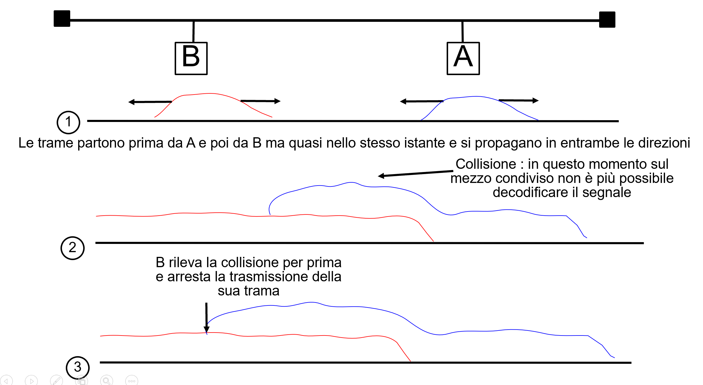
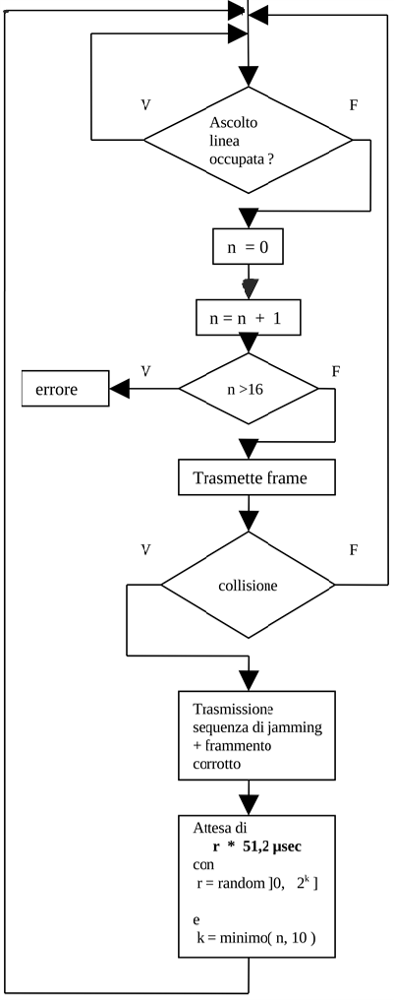
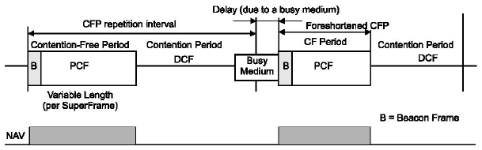
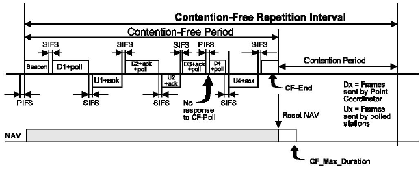

>[Torna a multiplazione TDM](mezzoradio.md#Multiplazione-TDM)

### Mezzi a BUS


Un **mezzo trasmissivo** si dice a **BUS** (o brodcast) quando più periferiche **condividono** lo stesso collegamento. Si può realizzare sia con un un **unico filo** in rame che collega tutti i dispositivi, che con un mezzo radio su cui tutti i dispositivi condividono lo **stessa frequenza** (canale) di trasmissione.

I mezzi a BUS posseggono la **proprietà** che se un interlocutore parla **tutti** gli altri ascoltano perchè un messaggio inviato da uno **passa** comunque **per tutti** gli altri.

### Collisioni

I mezzi a BUS sono afflitti dal **fenomeno** delle **collisioni**.

Una **collisione** è l'evento di **sovrapposizione distruttiva** di due o più messaggi su un canale. E' un evento **irreversibile** perchè non permette il recupero dell'informazione trasportata originariamente dai singoli messaggi.

Una collisione su un mezzo a BUS **accade** quando due o più interlocutori **parlano contemporaneamente**. 

Nascono adesso due **problemi**: 
- rilevare una collisione
- evitare una collisione. 

Per **rilevare** le collisioni ci sono tecniche dirette come l'**ascolto** del canale e indirette come la **mancata ricezione** di un messaggio di conferma.

Per **evitare** le collisioni servono i **protocolli di arbitraggio** che sostanzialmente cercano di far parlare gli interlocutori sempre **uno alla volta**. I protocolli di arbitraggio si dividono in **master/slave** (o centralizzati) e in **peer to peer** (o distribuiti). 

I mezzi a BUS sono **bidirezionali**, nel senso che la comunicazione può avvenire nelle due direzioni possibili tra coppie di stazioni, ma solo in modalità **half duplex**, cioè si trasmette sempre una stazione alla volta, anche quando a parlare sono solo in due. Stazioni **diverse** parlano sempre in **momenti** differenti, **regolati** dal protocollo di arbitraggio.

### Protocolli di arbitraggio

Nei protocolli di arbitraggio  **master slave** esiste una **stazione centrale** di livello gerarchico superiore detta master che, per conto delle stazioni slave, decide **chi** deve parlare e **quando** deve parlare evitando sovrapposizioni nel tempo dei messaggi. Questo tipo di politica è adatta alle trasmissioni **sincrone** da parte di **sorgenti regolari** di dati, quali i **sensori**.

Nei protocolli di arbitraggio  **peer to peer**, o distribuiti, le stazioni sono tutte di pari livello e sono programmate per interpretare continuamente la situazione del canale in modo da parlare sempre una alla volta. Qesto tipo di politica è adatta alle trasmissioni **asincrone** da parte di **sorgenti intermittenti** di dati, quali **comandi**, allarmi, ecc.


I protocolli di arbitraggio distribuiti si dividono ulteriormente in **deterministici** e in **a contesa**. 

Quelli **deterministici** eliminano alla radice la possibilità di collisioni realizzando un meccanismo di **cooperazione** tra le stazioni tramite messaggi di controllo con cui esse comunicano sia l'**intenzione** di trasmettere che il **diritto** di accesso al canale. Il **diritto** si acquisisce o si cede mediante il trasferimento di una informazione particolare detta **token**. Il token può essere **posseduto** quando si ha la necessità di trasmettere, ma solo da una stazione alla volta, e deve essere immediatamente **ceduto** ad un'altra stazione quando la stazione che lo deteneva ha finito di trasmettere. 

Quelli **statistici** o **a contesa** realizzano una **competizione** per l'accesso al mezzo che deve essere regolata dalle singole stazioni semplicemente osservando il canale in **maniera indipendente (autonoma)** l'una dall'altra, senza coordinamento alcuno. Questa categoria di protocolli **limitano statisticamente** il problema delle collisioni ma **non lo annullano** completamente, per cui le collisioni necessitano ancora di **essere rilevate** dalle singole stazioni.

### Come rilevare una collisione

Si ricorre **di base** ad un meccanismo di rilevazione **indiretta** di una collisione **sul canale** mediante l’utilizzo di un **protocollo** di trasmissione **confermato**.

I **protocolli confermati** sono protocolli in cui **il mittente** possiede un timer, detto **timer di ritrasmissione**, impostato ad un valore massimo di conteggio detto **timeout**:
- Il timer viene **avviato** al momento esatto dell'invio di un messaggio e viene **resettato** al momento della ricezione di un messaggio di conferma di corretto arrivo a destinazione.
- Il messaggio di conferma viene detto **ack** (acknowledgement) ed è un messaggio di **controllo** (non dati) che viene inviato **dal ricevente** in direzione del mittente. Un ack è sempre inviato dal ricevente di un precedente messaggio, mai dal mittente di quel messaggio.
- Se il timer di trasmissione è resettato **prima dello scadere** del timeout la trasmissione è considerata avvenuta con **successo**. Se invece allo scadere del timeout ancora non si ricevono ack allora il messaggio viene dato per perso ed è, dal mittente, **ritrasmesso**.

Questo è lo scenario che daremo per scontato nel seguito ma spesso accade che le collisioni non vengano affatto rilevate perchè ritenuto poco vantaggioso. 

- Una situazione comune è l'**interrogazione periodica dei sensori** con dispositivi a basso costo che utilizzano un mezzo radio molto affollato. In questo caso l'utilizzo di un ack appesantisce dispositivi che devono rimanere semplici e incrementa inutilmente il traffico in rete dato che al polling successivo il dato verrà comunque ritrasmesso.
- nel caso dei dispositivi sensori con funzioni di **comando** o **configurazione**, ad esempio pulsanti, rilevatori di transito, allarmi in cui l'invio del messaggiò avviene una tantum in maniera del tutto asincrona (cioè non prevedibile dal ricevitore) potrebbe essere auspicabile un feedback del protocollo mediante un meccanismo di conferma basato sui messaggi di ack.


### Come reagire a fronte di una collisione?

Se tutte le stazioni ritrasmettono nello stesso istante collidono immediatamente e il messaggio viene perso.

Soluzione: **Backoff**
- È un tempo di ritardo **casuale** che una stazione deve **attendere** dal momento che ha preso la decisione di trasmettere
- È calcolato in maniera indipendente, l’una dall’altra, da tutte le stazioni
- Serve a determinare la stazione che deve trasmettere **per prima** minimizzando il rischio di trasmissioni contemporanee
- È calcolato all’interno di un intervallo detto **finestra di contesa**

## **ALOHA**
E' il protocollo peer to peer per certi versi **peggiore**, infatti è quello con la **probabilità** di collisione **più alta** ma è anche quello con l'**implementazione più semplice**. E' adatto per la trasmissione di **messaggi brevi** ed è appropriato per dispostivi con **ridotta capacità di calcolo** e con esigenze di **basso consumo** energetico.

### **Fasi ALOHA**
Una **stazione trasmittente**:
- al momento che ha una trama pronta, la invia **sul canale** senza aspettare.
- Dopo l’invio aspetta per un certo tempo (detto **timeout**) lo scadere di un timer (detto **timer di trasmissione**).
- Se essa riceve il messaggio di **ack** allora la trasmissione è avvenuta con successo.
- Altrimenti la stazione usa una strategia di **backoff** e invia nuovamente il pachetto dopo avere atteso un tempo casuale.
- Dopo molte volte che **non** si ricevono conferme (acknowledgement) allora la stazione **abbandona** l’dea di trasmettere.

**Le collisioni graficamente:**


Fig 1

**Protocollo ALOHA in trasmissione pseudocodice:**

```C++

N=1;
while(N <= max){
	send(data_frame);
	waitUntil(ackOrTimeout());
	if(ack_received){
		exit while;
	}else{
		/* timeout scaduto: ritrasmissione*/
		t=random();
		wait(t);
		N=N+1;
}
/* troppi tentativi: rinuncio a trasmette

```
**Protocollo ALOHA in ricezione pseudocodice:**

```C++
While(true){
	WaitUntil(dataFrameArrived());
	if(!duplicate()){ 
		deliver(frame) 
	}
	send(ack_frame);
}

```

Fig 2

> [Simulatore aloha](simalohaasync.md)

> [Torna a multiplazione TDM](mezzoradio.md#Multiplazione-TDM)

## **CSMA**

### **Fasi CSMA**

Significa Carrier Sensing Multiple Access cioè protocollo di Accesso Multiplo con Ascolto della Portante (prima della trasmissione). E' una **miglioria** sostanziale dell'Aloha perchè implementa l'**ascolto del canale** prima della trasmissione detto anche **LBT** (Listen before Talk) o accesso **polite**, che **riduce** drasticamente la **probabilità** di collisione del messaggio appena trasmesso sul canale, a prezzo di una implementazione **più complessa**. E' adatto per la trasmissione di **messaggi più lunghi** ed è appropriato per dispostivi con migliore **capacità di calcolo** e quando si è in assenza di problemi di **consumo energetico**.

**Ascolto della Portante** può essere considerato il **misurare** una quantità di energia **sul canale** significativamente maggiore di quella che c'è normalmente su un canale **a riposo** (idle). Ciò può essere rilevato mediante un dispositivo a **soglia** che scatti oltre un certo valore di **riferimento**. Si tratta di una rilevazione **diretta** di **canale occupato**.

Una **stazione trasmittente**: 
- al momento che ha una trama pronta, **aspetta** finchè non “sente” il **canale libero** (cioè nessuno trasmette).
- Appena essa rileva il canale libero **invia immediatamente** la trama.
- Dopo l’invio **aspetta** per un certo tempo, quello impostato sul timer di trasmissione.
- Se essa riceve il messaggio di **ack** allora la trasmissione è avvenuta con successo.
- Altrimenti la stazione usa una strategia di **backoff** e invia nuovamente il pachetto dopo aver **aspettato** un tempo casuale.
- Dopo molte volte che non si ricevono conferme (acknowledgement) allora la stazione abbandona l’dea di trasmettere.

### **Protocollo CSMA basico in pseudocodice**

```C++
N=1;
while(N <= max){
	waitUntil(channelFree()); 
	send(data_frame); 	
	waitUntil(ackOrTimeout()); 
	if(ack_received){ 
		exit while;
	}else{
		/* timeout scaduto: ritrasmissione*/
		/* timeout scaduto: ritrasmissione*/ 	
		t=random()*WNDW*2^n;
		wait(t);
		N=N+1;
	}
}
/* troppi tentativi: rinuncio a trasmettere*/	
```

### **Ritardo di propagazione**

Una stazione **non può** rilevare l’occupazione del BUS da parte di una stazione remota **semplicemente ascoltando prima** di trasmettere a causa di un fenomeno fisico detto **ritardo di propagazione** del segnale.
Il **ritardo di propagazione** di un segnale è il **tempo finito** con cui esso viaggia da una parte all’altra di un mezzo trasmissivo ed è dovuto al fatto che esso si propaga nello spazio con una **velocità finita**:
- Nel **vuoto** essa è pari alla **velocità della luce** cioè **300.000Km/sec**
- In un **conduttore metallico** ha un valore **inferiore** pari a circa **200.000Km/sec**

La **collisione** accade nonostante che due sorgenti, che trasmettono **quasi simultaneamente**, sentano entrambe il canale libero. Chiaramente una delle sorgenti ha cominciato **per prima** la trasmissione ma, nonostante ciò, **la seconda** sente ugualmente il canale libero perchè il messaggio della prima non è **ancora arrivato** quando questa decide di trasmettere.

In altre parole, se **due stazioni** A e B trasmettono una di seguito all'altra separate di un tempo Δt e il tempo di propagazione tra A a B è maggiore di Δt allora, ascoltando la portante:
- B sente il canale libero e inizia a trasmettere il suo messaggio mentre c’è quello di A che sta per arrivare.
- ciascuna stazione riterrà di essere l’unica a trasmettere sul canale fino a che la trama di A, che ha trasmesso prima, non arriverrà all’altra stazione B dopo il tempo di propagazione Δt corrispondente alla distanza tra A e B.

La **rilevazione reale**, da parte di una stazione, di **una collisione** può avvenire solo **dopo l’inizio** della trasmissione (o **durante** o **alla fine**).
Maggiore è la distanza tra due stazioni maggiore sarà il tempo con cui il segnale si propaga dall’una all’altra:   td = d/vP

**BUS senza collisioni:**


Fig 3


**BUS con collisioni:**

Una stazione non può rilevare istantaneamente l’occupazione del BUS da parte di una stazione remota a causa di un fenomeno fisico detto ritardo di propagazione. Per questo motivo l'**ascolto del canale** prima della trasmissione, benchè **riduca drasticamente** la probabilità di collisioni, **non è sufficiente** ad **azzerarla**.


Fig 4

### **Riassumendo ALOHA e CSMA**

**Similitudini:**
- Sia ALOHA che CSMA devono implementare un meccanismo di rilevazione della collisione basato su ack
- Sia ALOHA che CSMA rilevano la collisione a seguito dell’evento mancata ricezione del messaggio di ack (allo scadere di un timeout). 
- entrambi soffrono del fenomeno delle collisioni

**Differenze:**
- ALOHA **trasmette senza verificare** se il canale è **occupato** o meno, ciò determina **maggiore** probabiltà di collisione rispetto al CSMA.
- CSMA **trasmette solo se “sente”** il canale **libero**, ciò determina **minore** probabiltà di collisione rispetto ad Aloha.
- CSMA deve implementare un meccanismo di **ascolto** del canale **prima** della **trasmissione** (**CCA: Clear Channel Assesment**).

Come detto prima nel caso dll'Aloha spesso accade che le collisioni non vengano affatto rilevate perchè ritenuto poco vantaggioso. Le situazioni sono le stesse di prima cioè l'**interrogazione periodica dei sensori** con dispositivi a basso costo che utilizzano un mezzo radio molto affollato. Si usa ancora il CSMA ma senza ack che, in questo contesto, viene chiamato semplicemente LBT (Listen Before Talk)


> [Simulatore csma](simcsmaasync.md)

> [Torna a multiplazione TDM](mezzoradio.md#Multiplazione-TDM)

## **CSMA/CD**

### **Fasi CSMA/CD basico**

E' una **variante** del **CSMA/CA** in cui si esegue un **doppio ascolto** del canale: **prima di trasmettere** per stabilire se è **libero** (accesso LBT), **durante la trasmissione** per **rilevare direttamente** eventuali **collisioni**. Infatti, l'acronimo significa **Carrier Sensing Multiple Access Collision Detection** cioè protocollo di Accesso Multiplo con **Ascolto della Portante** (**prima** della trasmissione) e **rilevazione della Collisione** (**durante** la trasmissione). La rilevazione **indiretta** delle collisioni mediante l'**ack** del ricevitore adesso non è più necessaria.

E' una **miglioria** del CSMA standard che permette un **rapido recupero** della trasmissione a fronte di una collisione rispetto al meccanismo degli ack che è sicuramente **più lento**. Un **rapido recupero** porta ad una **diminuizione del ritardo** di trasmissione e quindi ad un **aumento** della **velocità media** dei messaggi. 

Una stazione **trasmittente**:
- al momento che ha una trama pronta, **ascolta il canale prima** di trasmettere per stabilire se esso è libero o meno.
- Appena essa rileva il **canale libero** invia immediatamente la trama (messaggio) ma continua ad **ascoltare il canale** anche **durante** la trasmissione.
- L’**ascolto durante la trasmissione** serve a stabilire se sul canale è avvenuta o meno una collisione. 
- Se non vengono rilevati **segnali di collisione** allora la trasmissione è avvenuta con successo.
- un **segnale di collisione** può essere considerato il **misurare** sul canale più energia di quanta la stazione stessa non se ne aspetti a causa della sua trasmissione. Ciò può essere rilevato mediante un dispositivo a soglia che scatti oltre un certo **valore di riferimento**. Si tratta di una rilevazione **diretta** di una collisione sul canale.
- Altrimenti la stazione arresta la trasmissione corrente e ricomincia da zero la trasmissione della trama dopo un **tempo casuale**.
- Dopo molte volte che non si ricevono conferme (acknowledgement) allora la stazione abbandona l’dea di trasmettere.

### **Protocollo CSMA/CD basico in pseudocodice**

Soluzione **di base** per il **TX**

```C++
N=1;
while(N <= max){
	waitUntil(channelFree());
	sendAndListen(frame);
	waitUntil(endOfFrame() or collision());
	if(collision()){
		stopTransmitting();
		send(jamming);
	}else{
		/* no collision detected */
		wait(interframe_delay);
		exit while;
	}
	N=N+1;
}
/* troppi tentativi: rinuncio!*/
```


Fig 5

### **Possiamo determinare tutte le collisioni?**

- Se non si ascolta il canale evidentemente no.
- Ma nel CSMA/CD si ascolta solo **finchè si trasmette**….


Fig 6

In altre parole, se la **trasmissione** di un messaggio da parte di una stazione non **dura abbastanza a lungo** potrebbe succedere che una eventuale collisione si propaghi fino ad essa solo **dopo** che la trasmissione si è **conclusa**. Ma se non **si trasmette** neppure **si ascolta** il canale, per cui, scaduta la possibilità di rilevare la collisione, la stazione trasmittente deduce, **erroneamente**, di aver completato la trasmissione del messaggio **con successo**.

### **Soluzione: trasmissione abbastanza lunga**

- **Caso peggiore**: il tramittente A è ad un capo e la collisione avviene **all’altro capo** quando trasmette pure B.
- Per ricevere l’eco della collisione A deve continuare ad ascoltare (cioè a trasmettere) finchè la trama corrotta non **si propaga** da B fino a lei.


Fig 7

### **Come rilevare tutte le collisioni?**

Il tempo di propagazione da A a B per 10Mb/sec è 25.6 µsec
Il tempo **di andata** da A a B e poi **di ritorno** ad A è detto **RTT (Round Trip Time)** e alla velocità di 10Mb/sec è 51.2 µsec

**Prerequisito per rilevare tutte le collisioni**: 
- ogni stazione deve **ascoltare** il canale **durante** la **trasmissione** per un **tempo minimo** pari a **un RTT** cioè **51.2** µsec
- Se la velocità di trasmissione è fissa, la **condizione sul tempo** si traduce in una **condizione sulla lunghezza minima** della trama (nel caso di Ethernet 64 byte).
- Cioè ogni stazione deve trasmettere **trame lunghe almeno 64 byte**

### **Come reagire a fronte di una collisione?**

Se tutte le stazioni ritrasmettono nello stesso istante collidono immediatamente

**Soluzione**: **Backoff esponenziale**
- È un **tempo casuale** di **attesa** prima di iniziare una nuova trasmissione
- È calcolato in **maniera indipendente** l’una dall’altra da tutte le stazioni
- Serve a determinare la stazione che deve **trasmettere per prima** minimizzando il rischio di **trasmissioni contemporanee**
- È calcolato all’interno di un **intervallo (finestra) di contesa**

Il **tempo di Backoff** si calcola in **multipli interi** di uno **slot** che è uguale ad un **RTT** ```(slot = 1 RTT)``` secondo la formula:
```C++
r = random(0, 2^k – 1)*RTT
```
- 1-ma collisione : aspetta da 0 a 1 slot
- 2-da collisione : aspetta 0, 1,2 o 3 slots 
- i-esima collisione : aspetta 0..2i-1 slots 

### **Finestra di contesa**

La finestra di collisione o di contesa (contention Window o CW) è l’**intervallo di valori** all’interno del quale viene calcolato il tempo casuale di backoff

La finestra di collisione è **deterministica** (cioè ha un valore non casuale) e può essere **fissa** o **variabile**, ad es:``` [0,  (2k – 1)]``` è variabile e dipende dal **numero k di tentativi andati a vuoto**.

Una finestra di collisione **grande** minimizza la **probabilità** di una collisione ma aumenta il **ritardo medio** prima della trasmissione che, a sua volta, diminuisce la **velocità media** di trasmissione.

Una finestra di collisione **variabile** realizza un buon compromesso tecnico: quando **non ci sono collisioni** è piccola e il ritardo è minimo, in presenza di collisioni essa si **allarga gradatamente** per diminuirne la probabilità ad ogni successivo tentativo.

Il **tempo di backoff** è un numero **casuale** calcolato tra un valore **minimo** ed un valore **massimo** che  rappresentano la **finestra di collisione**.
Nel caso del CSMA/CD:
```C++
	        k = min(10, N); //numero di tentativi
		r = random(0, 2^k – 1)*RTT; //tempo di backoff
```
### **Procollo CSMA/CD completo in pseudocodice**

```C++
N=1;
while(N<= max){
	waitUntil(channelFree());
	sendAndListen(frame);
	waitUntil(endOfFrame() or collision()); 	
	if(collision()){
		stopTransmitting();
		send(jamming);
		k = min (10, N);
		r = random(0, 2^k – 1);
		wait(r*RTT);
	}else{
		/* no collision detected */
		wait(interframe_delay);
		exit while;
	}
	N=N+1;
}
/* troppi tentativi: rinuncio!*/
```

### **Fasi CSMA/CD completo**

La stazione **trasmittente**:
- al momento che ha una trama pronta, **ascolta il canale prima** di trasmettere per stabilire se esso è libero o meno.
- Appena essa rileva il canale libero invia immediatamente la trama ma ascolta anche durante la trasmissione.
- L’**ascolto durante la trasmissione** serve a stabilire se sul canale è avvenuta o meno una collisione. 
- **Se** non vengono rilevati **segnali di collisione** allora la trasmissione è avvenuta con successo. Un **segnale di collisione** può essere considerato il **misurare** sul canale più energia di quanta la stazione stessa non se ne aspetti a causa della sua trasmissione. Ciò può essere rilevato mediante un dispositivo a soglia che scatti oltre un certo **valore di riferimento**.
- **Altrimenti** la stazione **arresta** la trasmissione corrente e **trasmette** invece una particolare sequenza di **32 byte** (corrispondente a metà di un RTT), detta **sequenza di jamming**, che **avvisa** della collisione chi ancora **non trasmette** cioè i ricevitori. Per le stazioni che **stanno già trasmettendo** invece genera una **nuova collisione** più lunga che ha una **durata** tale da rendere **sempre possibile** la sua rilevazione anche da parte delle stazioni poste a grande distanza dal punto in cui essa è avvenuta. Infatti, nel caso in cui la collisione avvenga tra due stazioni **molto vicine**, questa potrebbe essere da una di loro rilevata (e quindi interrotta) troppo presto per consentirne la rilevazione anche da parte delle altre stazioni più lontane. Ciò **perchè** potrebbe succedere che due **messaggi collidenti brevi**, quindi sovrapposti e viaggianti in direzioni opposte, dopo un tempo altrettanto breve, **si separino** facendo così **svanire** la collisione per le stazioni che vengono da essi, successivamente alla separazione, attraversate (vedi Fig.6).
- Calcola un numero intero random che moltiplica per RTT ottenendo un tempo casuale di attesa (multiplo di RTT) prima di una successiva ritrasmissione della trama interrotta.
- Altrimenti la stazione arresta la trasmissione corrente e ricomincia da zero la trasmissione della trama dopo un **tempo casuale**.
- Dopo molte volte che non si ricevono conferme (acknowledgement) allora la stazione abbandona l’dea di trasmettere.

Le altre stazioni, quando ricevono la **sequenza di jamming**, sono **avvisate** della avvenuta collisione e:
- Se **ricevevano**, **scaricano dal buffer** di ricezione quanto ricevuto fino a quell momento
- Se **trasmettevano**, **arrestano immediatamente la trasmissione** e fanno partire l’**algoritmo di backoff** che stabilisce il **ritardo casuale** prima della ritrasmissione del messaggio interrotto.


Fig 8

### **Riassumendo CSMA e CSMA/CD**

Similitudini:
- CSMA e CSMA/CD devono implementare un meccanismo di **ascolto del canale** prima della trasmissione per stabilire se esso è libero o meno. 

Differenze:
- il CSMA **rileva la collisione indirettamente** (più lentamente) dopo la trasmissione **in fase di ricezione**, a seguito del **mancato arrivo del messaggio di ack** (allo scadere di un timeout), Si tratta di una tecnica SW. Trasmissione e ricezione non devono essere contemporanee.
- Il CSMA/CD durante la trasmissione mantiene attiva anche la funzione di  ricezione che può rilevare **direttamente** (istantaneamente quando avviene) una collisione perchè:
    - Il segnale “ascoltato” durante la trasmissione ha una potenza più elevata di quello effettivamente trasmesso. É una **tecnica HW**.
    - Il segnale “ascoltato” e decodificato durante la trasmissione ha un valore in bit diverso da quello trasmesso. É una **tecnica SW**.

>[Torna a multiplazione TDM](mezzoradio.md#Multiplazione-TDM)

## **CSMA/CA**

Non è sempre possibile rilevare le collisioni **durante la trasmissione** perchè l'ascolto diretto del canale sarebbe impossibile o inefficace (mezzo radio). In queste situazione la **rilevazione della collisione** può essere soltanto indiretta osservando la **mancata ricezione** di un ack. Per **velocizzare** il processo di recupero della trasmissione a fronte di una collisione, nel CSMA/CA i messaggi di ack vengono posti ad un **livello di priorità più elevato** rispetto agli altri messaggi mettendoli **al riparo** dalle collisioni. Le collisioni **non** possono intaccare i messaggi di ack.  
Anche in questo caso un **rapido recupero** della trasmissione migliora la **velocità media** del dispositivo (ritardi più bassi).

E' adatto per la trasmissione di **messaggi lunghi** ed è appropriato per dispostivi con migliore capacità di calcolo quando si è in assenza di problemi di consumo energetico.

Miglioramento del CSMA grazie all’introduzione degli **IFS (interframe space)**:
- Ritardo iniziale di trasmissione (**EIFS**) 
- Short Inter Frame Space (**SIFS**): ritardo tra una trama e l’invio del suo ack. È il tempo minimo per consentire ai dispositivi HW di commutare dallo stato di ricezione a qello di trasmissione.
- Distributed Inter Frame Space (**DIFS**): **ritardo minimo tra due trame successive** in trasmissione. ```DIFS =  SIFS  + (2 * Slot time)```. Serve a proteggere la trasmissione di un ack da eventuali  collisioni
- ```SlotTime = CCATime + RxTxTurnaroundTime + AirPropagationTime+ MACProcessingDelay``` 
 è il tempo per percorrere il tragitto tra due stazioni poste agli estremi più remoti della cella radio.

Vale la disuguaglianza:   
```C++
SIFS < DIFS < EIFS
```

### **Protocollo CSMA/CA sul ricevitore in psudocodice**
```C++
While (true)
{
 WaitUntil(dataFrameArrived());
	if(!duplicate())
		{ deliver(frame) }
 wait(SIFS);
 send(ack_frame);
}
```
La funzione deliver() consegna la trama al livello superiore (ad un protocollo di livello superiore o alla applicazione)

### **Fasi CSMA/CA al ricevitore**

Una **stazione ricevente**:
1. Aspetta l’arrivo di una nuova trama
2. Controlla se è una trama duplicate, cioè gia ricevuta
3. Controlla il **CRC della trama** per verificare se è stata **ricevuta correttamente**
se non lo è la consegna al livello superiore e **non esegue** i passi successivi
4. Aspetta un SIFS
5. Invia una trama di ack

### **Protocollo CSMA/CA sul trasmettitore in pseudocodice**
```C++
N=1;
while(N <= max){
    waitUntil(channelFree());
	if(receivedCorruped())
	{ 
	 wait(EIFS);
	}else
	{ 
	 wait(DIFS);
	}
	send(data_frame);
	  waitUntil(ackOrTimeout());
	if(ack_received){
		exit while;
	}else{
		/* timeout scaduto: si ritrasmette*/
		N=N+1;
	}
}
/* troppi tentativi: rinuncio!*/	
```
### **Fasi CSMA/CA al trasmettitore senza backoff**

Una **stazione trasmittente**:
- Se la trama precedentemente ricevuta era corrotta prima di trasmettere, aspetta un tempo EIFS 
- Altrimenti se la stazione sente il canale occupato aspetta **finchè è libero**, da quel momento in poi, **aspetta un tempo DIFS** 
- Trascorso il DIFS invia immediatamente la trama
- Aspetta l’**arrivo di un ack**, se non arriva in tempo, allo s**cadere di un timeout**, avvia la **ritrasmissione** della stessa trama.

Anche se C, sfortunatamente, valutasse il canale libero ascoltandolo durante il SIFS di B poichè DIFS>SIFS accadrebbe che C ritroverebbe il canale occupato durante la seguente trasmissione dell’ack di B e quindi si **fermerebbe**:


Fig 9

### **Significato di DIFS**

È il **tempo di attesa** che aspettano tutte le stazioni per trasmettere a partire dalla fine dell’ultima trasmissione valida (**invio ack** messaggio precedente).

Serve a **proteggere** la **trasmissione di un ack** da eventuali  **collisioni**, è sempre:       
```C++
DIFS =  SIFS  + (2 * Slot time) 
```

- **SIFS** dovrebbe essere più breve di DIFS in modo che sia possibile inviare un frame di ACK **prima** che le altre stazioni riprendano il loro backoff
- Il **DIFS** dura quanto basta affinchè una qualunque stazione si possa accorgere che il canale **è occupato** a seguito della trasmissione di un ack. Per fare in modo di essere sicuri che dopo di esso un ack non posssa più arrivare, il DIFS viene calcolato nel caso peggiore  ```(2 * Slot time )```, cioè ipotizzando che le stazioni interessate siano poste agli **estremi opposti** della cella radio, quelli che sono **reciprocamente più distanti**.

Nel grafico, DATA e ACK sono **tempi di trasmissione** (non di propagazione)

Durante il **tempo di attesa DIFS** l’ack ha il tempo di propagarsi fino alla stazione più remota senza **essere disturbato** da altre trasmissioni.

Il **tempo di attesa DIFS** non elimina in assoluto la possibilità di una **eventuale collisione** perchè può sempre accadere che qualcuno inizi a trasmettere un **messaggio** un **attimo dopo** dello scadere del DIFS senza che la stazione in attesa possa rendersene conto a causa del fenomeno del **ritardo di propagazione**. Ma la collisione può riguardare solo un **nuovo messaggio** non la trasmissione dell'ack di quello appena inviato.

Il tempo di attesa DIFS è **uguale** per tutte le stazioni e **dopo** di esso inizia una finestra di **trasmissione**, detta **finestra di contesa** (CW), in cui tutte le stazioni **competono** per l'accesso al canale avendo solo l'accortezza di **ascoltare prima di tramettere**, cautela che **limita ma non annulla** le probabilità di collisioni (per via del ritardo di propagazione).


Fig 10

### **Significato di EIFS**
```C++
EIFS  = SIFS + DIFS + ACK_Tx_Time
```
- usato al posto di DIFS dalle stazioni che hanno ricevuto un frame incomprensibile
- Anche se una stazione non è stata in grado di decodificare il frame, potrebbe essere che invece il destinatario legittimo sia ancora in grado di farlo. 
- Se ciò accade, il destinatario dovrebbe avere l'opportunità di restituire un frame di ack; il ritardo EIFS garantisce che la trasmissione del frame di Ack possa procedere senza l'introduzione di eventuali interferenze da parte di chi non è stato in grado di decodificare il frame.


Fig 11

### **Backoff**

Se **due stazioni**, dopo averlo **ascoltato**, trovano il **canale libero** potrebbero comunque **collidere** perchè, a causa del **ritardo di propagazione**, potrebbero non rendersi conto che un'altra stazione **ha già cominciato** a trasmettere occupando il canale.
Una eventuale **collisione** dei messaggi determina la ricezione di **trame corrotte** da parte delle stazioni destinatarie che, a sua volta, causa il **mancato invio** di un ack alle stazioni trasmittenti che, allo scadere del timout di trasmissione, pianificheranno la **ritrasmissione** del messaggio non ancora confermato.

Se la **ritrasmissione** avvenisse per tutte le stazioni dopo un ugual **ritardo DIFS** dal momento in cui entrambe le stazioni sentono il **canale libero**, ciò determinerebbe presumibilmente una **trasmissione simultanea** delle due stazioni e quindi una nuova collisione.


Fig 12


La **soluzione** è ritrasmettere sempre dopo un **tempo casuale (backoff)** all’interno di una **finestra di contesa**


Fig 13


Il **backoff** casuale di una stazione inizia sempre dopo un tempo di attesa fisso **DIFS**. La stazione **ascolta** sempre il canale prima di tramettere e lo fa anche **durante il backoff**. Ci sono quindi due possibilità:
- il backoff **scade** e quindi subito dopo la stazione comincia a trasmettere
- il backoff viene **interrotto** dall'ascolto del canale occupato (da una stazione con backoff più corto) e **riprende** una volta che il canale ritorna libero.

La trasmissione di un'altra stazione potrebbe anche essere destinata alla stazione stessa per cui il backoff potrebbe anche essere interrotto dalla **ricezione** di un messaggio.

Nel caso del WiFi in figura, è illustrato un backoff **con prenotazione** che ha la proprietà di non azzerare, sprecandolo, il tempo di attesa **già trascorso** da una stazione sul proprio backoff:
- Una stazione fa partire il backoff quando sente il **canale libero**
- nel frattempo, la stazione in attesa del backoff continua a **sentire** il canale (CCA)
- se il canale **diventa occupato** prima che il backoff scada allora la stazione lo "**congela**" interrompendolo sul valore di tempo già trascorso, senza azzerarlo.
- Nel momento in cui il canale **ritorna libero** la stazione che era doppiamente in attesa, per il canale libero e per il  backoff, adesso **rimane in attesa** solo per il backoff, ricominciando il **conteggio iniziale** dal tempo in cui questo era stato interrotto, senza ricalcolarlo daccapo. 

E' una maniera per non perdere la **priorità acquisita** ricalcolando il backoff da zero. E' una **ottimizzazione** per garantire una maggiore **equità (fairness)** nell'accesso alla risorsa canale che non sempre è implementata in protocolli CSMA/CA diversi dal WiFi.

**Pseudocodice protocollo CSMA/CA sul trasmettitore con backoff:**

```C++
N=1;
while(N <= max){
	waitUntil(channelFree());
	if(receivedCorruped())
	{ 
	 	wait(EIFS);
	}else
	{ 
	 	wait(DIFS);
	}
	backoff_time = int(random[0,min(255,7*2^(N-1))])*T;
        waitUntil(channelFreeDuringBackoff());
	send(data_frame);
        waitUntil(ackOrTimeout());
	if(ack_received){
		 exit while;
	}else{ 
		 /* timeout scaduto: si ritrasmette*/
		 N=N+1; 
	}
}
/* troppi tentativi: rinuncio!*/ 

```

### **Finestra di contesa variabile**

Se accade una collisione durante il backoff spesso ciò significa che due stazioni hanno scelto lo stesso slot nella finestra di backoff.
Ad ogni collisione, prima di ritentare la trasmissione, la stazione **raddoppia la dimensione** della finestra di backoff CW (Content Window o finestra di contesa).
Lo scopo di tale raddoppio è quello di **adattare** la dimensione della finestra al **numero di contendenti**, in considerazione del fatto che le **collisioni** sono un **indice di “affollamento”** del mezzo broadcast (BUS o radio).


Fig 14

> [Simulatore csma/ca](simcsmacaasync.md)

> [Torna a multiplazione TDM](mezzoradio.md#Multiplazione-TDM)

## **Ottimizzazioni**

## **Accesso immediato e differito**

In alcune implementazioni (802.11) il DIFS può creare un accesso senza contesa: 
- Se il canale è libero dopo questo tempo si può trasmettere con un accesso immediato, cioè senza attendere alcun backoff.
- Se il canale è occupato, prima o dopo questo tempo, si esegue un accesso differito, cioè un DIFS dopo la fine della trasmissione corrente, scegliendo uno slot casuale all’interno di una finestra di contesa (tramite backoff).

Un accesso senza contesa non vuol dire un accesso senza collisioni, queste sono sempre possibili se, dopo un DIFS, due stazioni iniziano a parlare contemporaneamente.


Fig 15

## **Problema della stazione nascosta**

**Problema:**
- Le stazioni A e C non sono visibili una all’altra per cui l’ascolto del canale non è in grado di rilevare se una di loro ha occupato il canale prima dell’altra. 
- Se entrambe devono trasmettere a B, sia A che C sentiranno il canale libero e inizieranno la trasmissione delle rispettive trame. 
- B riceverà i messaggi provenienti da entrambe le stazioni che, a seguito della collisione, saranno inintelleggibili.


Fig 16


**Soluzione:**
- Il **trasmettitore** prenota dei **time slot** tramite ll messaggio di controllo **RTS** (Request To Send) avente per **argomento** il tempo di trasmissione richiesto, adatto alla lunghezza del messaggio dati.
- Il **ricevente** conferma la prenotazione tramite il messaggio di controllo **CTS** (Clear To Send) avente per **argomento** il tempo prenotato al trasmettitore
La stazione **ricevente** B è **visibile da tutti** per cui sia dalla stazione A che ha prenotato il canale sia dalle altre, come la C, che potenzialmente potrebbero trasmettere di li a poco
- Il **messagio CTS** dichiara l’avvenuta assegnazione del canale ad A per cui tutti gli altri, come B e C, si asterranno dal trasmettere per tutta la durata del tempo dichiarato nel CTS.
- normalmente la **stazione ricevente** che assume il ruolo di **"torre di controllo"** che gestisce le prenotazioni è l'Access Point (AP) perchè possiede il fondamentale requisito di essere in **posizione baricentrica** rispetto a tutte le stazioni.
- la gestione **con RTS e CTS** è ancora **distribuita** e la decisione in merito alla **trasmissione di un RTS** è presa dalla singola stazione, indipendentemente dalle altre, ossevando un intervallo DIFS, durante il quale nessun altro sta trasmettendo. Questa modo di procedere si chiama **modalità DCF** (Distributed Coordination Function) e **non** prevede l'esistenza di un **controllo centralizzato** delle trasmissioni di tipo master/slave.
- esiste una **seconda modalità**, detta **PCF** (Point Coordination Function), di tipo master/slave, in cui l'AP ha il ruolo di **master** che stabilisce **quale** stazione deve parlare, **quando** e **per quanto** tempo usando una politica di **turnazione** delle stazioni (**polling**).
 

Fig 17

### **CCA Reale e CCA Virtuale**

Insieme ad i messaggi di controllo **RTS** e **CTS**, viene introdotto un **contatore** di nome **NAV** che viene valutato per stabilire l'occupazione **logica** del canale, l'**osservazione** del suo valore viene detta anche **CCA virtuale**. 

**CCA Reale o fisico:** è il Clear Channel Assesment realizzato mediante l**ascolto** effettivo del **canale fisico**, avviene **prima** della trasmissione. Presuppone che la stazione sia in stato di ricezione e che un **dispositivo a soglia** sia pronto a rilevare eventuale energia trasmessa da altre stazioni. 

**CCA Virtuale: il Clear Channel Assesment virtuale** è invece realizzato mediante l’osservazione del **contatore** NAV. Il NAV è decrementato ad intervalli di tempo fissi e in ciascuno di essi può accadere:
- Il **NAV > 0** allora il canale virtuale è considerato **occupato**
- Il **NAV = 0** allora il canale virtuale è considerato **libero**

I due CCA sono del tutto **indipendenti** e possono portare a risultati diversi.  Lo **stato del canale** è stabilito dalla lettura di entrambi.
- Quando **entrambi** (AND logico) rilevano che il canale è **libero**, solo allora può accadere che il trasmettitore **inizi a trasmettere**, o subito dopo avere atteso un DIFS o dopo l'attesa di un backoff.
- Il **contatore NAV** viene **impostato** da tutte le stazioni al momento in cui queste ricevono un messaggio CTS con il **valore del tempo** in esso contenuto.

Il **valore contenuto** nel CTS rappresenta il **tempo prenotato** dalla stazione autorizzata a trasmettere ed è il tempo che essa ritiene necessario per trasmettere il suo messaggio alla velocità corrente del sistema.

### **Prenotazione del canale**

Il **trasmettitore** prenota, presso il **ricevitore**, dei **time slot** tramite un messaggio di controllo **RTS** (Request To Send) avente per **argomento** il tempo di trasmissione necessario per inviare i suoi dati . 

Il **ricevente** conferma la prenotazione tramite il messaggio di controllo **CTS** (Clear To Send) avente per **argomento** il tempo prenotato dal trasmettitore.
Il messaggio **CTS** è ricevuto da **tutte le stazioni** che, col tempo in esso riportato, **impostano** il proprio contantore di Carrier Sensing detto **NAV** con il quale tengono conto della prenotazione.

Il NAV viene **decrementato** periodicamente nel tempo, fino a 0; quando il NAV è **diverso da zero**, vuol dire che una trasmissione è in atto nelle vicinanze e quindi la stazione si astiene dal trasmettere.

La stazione che ha prenotato il canale durante il NAV può effettuare in sicurezza la **trasmissione** dei suoi **dati** perchè **il tempo di NAV** è, di fatto, **al riparo** dalle collisioni. 

Le collisioni in pratica **non possono** colpire i messaggi di **ack** e i **dati**, gli unici messaggi **soggetti a collisione** sono le trame di controllo **RTS** e **CTS** che però sono **molto corte**.


Fig 18

 ### **802.11 CSMA/CA: flowchart**
 
 
 Fig 19
 
 ### **802.11 CSMA/CA: fasi**
 
Il protocollo CSMA/CA (Carrier Sense Medium Access with Collision Avoidance) funziona nel seguente modo, per una trasmissione da A a B:
1. La stazione trasmittente A cerca di determinare lo stato del mezzo valutando il contenuto di NAV (CCA Virtuale) ed ascoltando il mezzo (CCA Reale). Il canale è considerato libero, quando sia il CCA Virtuale che il CCA Reale non rilevano attività (operazione di AND logico tra i due valori). I casi sono due:
    1. Se il canale rimane libero per un intervallo di tempo DIFS, salta al punto 3.
    2. Se invece il canale è occupato (o viene occupato durante l’intervallo DIFS), prosegue al punto 2.
2. A avvia la procedura di backoff che scade solo quando il canale è libero (CCA fisico e CCA logico soddisfatti entrambi).
3. A emette un RTS.
4. Se entro un intervallo di tempo ben definito, A non riceve il CTS da B, vuol dire, molto probabilmente, che l’RTS ha colliso con un altro frame; 
5. Quando B riceve l’RTS, risponde con un CTS.
6. Ricevuto il CTS, A può cominciare a trasmettere il frame contenente i dati veri e propri.
7. Se entro un intervallo di tempo ben definito, A non riceve un ACK da B, vuol dire che il frame dati non è stato ricevuto correttamente, e quindi A deve ritrasmetterlo ripetendo tutta la procedura.
8. Una volta che B ha ricevuto correttamente il frame Dati, risponde con un ACK concludendo il protocollo.

## **PCF e Contention Free Period**

Un AP può assumere un controllo ancor più rigoroso sull'andamento delle trasmissioni, se svolge un ruolo di **Point Coordinator** (PC), supportando la Point Coordination Function (PCF). In tal caso, in occasione delle trame Beacon può dare inizio ad un periodo libero da contesa (CFP, Contention Free Period), in cui annuncia un NAV tale da inibire la trasmissione di tutte le altre stazioni.

Il **beacon** è una particolare sequenza di bit che serve a **sincronizzare** gli orologi dell'AP con quello di tutte le stazioni e viene trasmessa **periodicamente** ad intervalli di tempo **regolari**. La trasmissione regolare del beacon, può però essere **posticipata** a causa della occupazione del mezzo trasmissivo, ed in tal caso ha luogo dopo che è trascorso un **PIFS** (PCF IFS) dal momento in cui il mezzo è libero. Un beacon serve anche di **indentificare** in maniera univoca i dispositivi che li emette grazi ad un id che viene in esso inserito. Per dei dettagli vedi [preambolo di sincronizzazione](protocolli.md#preambolo-di-sincronizzazione).

La trama dati compresa tra due beacon consecutivi viene detta **supertrama** (superframe) ed è generalmente divisa in due zone con **politiche di accesso** al canale diverse:  
- una **deterministica** al riparo dalle collisioni detta **CFP** (Contention Free Period) e regolata dalla multiplazione statica TDMA, che viene usata per trasmettere i dati delle comunicazioni **unicast**.
- una **probabilistica** a contesa, in cui i tentativi di accesso dei dispositivi sono soggetti al **rischio di collisione** perchè regolata da un protocollo di tipo **CSMA/CA**, che invece serve per trasmettere delle particolari informazioni **broadcast** dette **advertisement**.

Nel caso del WiFi, il **NAV CFP** (Contention Free Period) inibisce tutte le stazioni dal prendere l'**iniziativa di cominciare** una trasmissione. Finchè è valido le stazioni comunicheranno in modalità **master/slave**, cioè **risponderanno** solo **se interrogate**.


Fig 20

**Durante il CFP**, il PC invia messaggi di Polling a rotazione verso le stazioni, interrogandole a riguardo della **disponibilità** di dati da trasmettere. Questà modalità offre il vantaggio di adattarsi meglio alle **sorgenti** dati di tipo **real time** caratterizzate da trasmissioni di tipo **sincrono**. Sorgenti sincrone tipicamente sono: **sensori**, telefonia **VOIP**, **videoconferenza**, **streaming**, ecc.


Fig 21

**Riassumendo**, Normalmente i dispositivi AP lavorano in **modalità ibrida** DCF e PCF. Vengono trasmessi periodicamente dei beacon e l'intervallo temporale tra un beacon e l'altro viene suddiviso in **due zone**, una soggetta a trasmissioni di tipo **PCF** e quindi **intrinsecamente** al riparo dalle collisioni adatta a trasmissioni **sincrone** e un'altra di tipo **DCF**, soggetta a collisioni sugli RTS, dedicata alle trasmissioni **asincrone**.

**Sitografia**:
- https://teoriadeisegnali.it/story/802.11/on_desk/accesso.html
- http://ecomputernotes.com/computernetworkingnotes/communication-networks/what-is-aloha
- https://it.pinterest.com/pin/368943394449072984/
- http://www.mathcs.emory.edu/~cheung/Courses/558/Syllabus/00/CSMA/csmacd.html
- http://www.benve.org/Download/Wireless.pdf
- http://infocom.uniroma1.it/alef/802.11/on_desk/accesso.html#Distributed_Coordination_Function_
- https://www.saylor.org/site/wp-content/uploads/2011/10/SAYLOR.ORG-CS402-CSMACOLLISIONAVOIDANCE.pdf
- https://www.slideshare.net/obonaventure/5-sharingapp
- http://www.opentextbooks.org.hk/ditatopic/3611
- https://mrncciew.com/2014/10/12/cwap-802-11-medium-contention/
- https://en.wikipedia.org/wiki/Extended_interframe_space
- https://www.hamilton.ie/publications/Thesis_tianji.pdf
- https://networkengineering.stackexchange.com/questions/64340/whats-the-usage-of-jamming-signal-in-csma-cd

>[Torna a multiplazione TDM](mezzoradio.md#Multiplazione-TDM)
