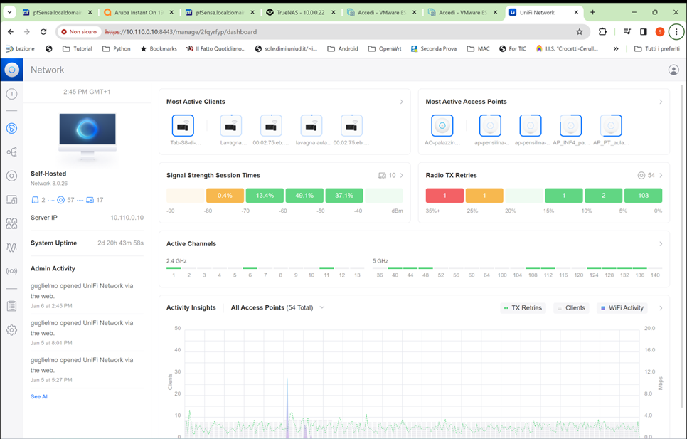
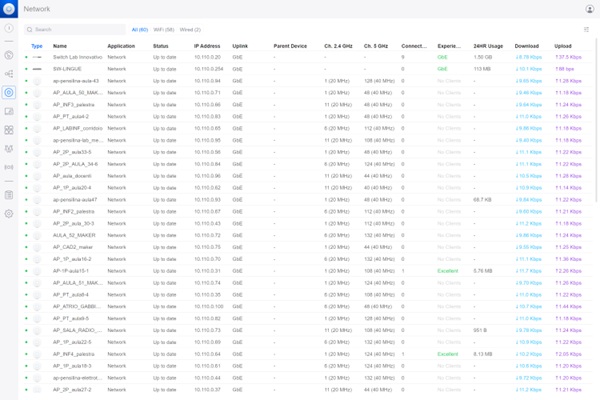

>[Torna a rete wifi infrastruttura](archwifi.md#autenticazione-utente-presso-un-ap)

- [Dettaglio architettura Ethernet](archeth.md)
- [Dettaglio architettura Zigbee](archzigbee.md)
- [Dettaglio architettura BLE](archble.md)
- [Dettaglio architettura WiFi mesh](archmesh.md) 
- [Dettaglio architettura LoraWAN](lorawanclasses.md) 

# **Autenticazione 802.1X** 

Come accennato, l’autenticazione dell’utente e degli AP (Access Point) avviene:
- A **Livello 2** della pila ISO/OSI con protocolli e dispositivi che non abbisognano di indirizzo IP, sfruttando l’incapsulamento (tunnelling) di **credenziali di autenticazione** in trame di **livello pari** o superiori. Il protocollo più comune per il wifi è l’**EAP** incapsulato su trame **L2 MAC** (EAPoL). E’ utilizzato per trasportare le **credenziali** (username e password) lungo una connessione ancora **priva di indirizzo IP** nella **tratta 1** che vs dal dispositivo utente ad un **dispositivo di accesso** (NAS, inteso stavolta come Network Access Server) alla **risorsa** WiFi.
- A **Livello 7** della pila ISO/OSI con il protocollo di livello applicativo **RADIUS**. Serve a trasportare le **credenziali utente** nella **tratta 2** dall’autenticatore (l’AP) al server RADIUS, dove verranno verificate inserendo l’username in un database centrale (di tipo LDAP o MySQL). **AP** e **server RADIUS** sono, questa volta, entrambi **dotati di indirizzo IP** essendo adesso dispositivi connessi alla rete LAN, per questo il pacchetto con le credenziali di autenticazione adesso viaggia dentro un pacchetto applicativo RADIUS.

Le **porte controllate** possono essere:
- **Porte fisiche** quali quelle ethernet di uno switch, sono sempre disponibili a livello fisico semplicemente collegando un plug ma possono risultare indisponibili a livello 2 della pila ISO/OSI se l’autenticazione 802.1 X non va a buon fine.
- **Porte virtuali** quali quelle SW di un AP. Se un utente Wi-Fi viene autenticato tramite 802.1 X per l'accesso alla rete, viene aperta una porta virtuale sul punto di accesso che consente la comunicazione. Se non è stato autorizzato correttamente, una porta virtuale non è disponibile e le comunicazioni sono bloccate.
Anche nel caso di un solo AP vengono attivate 2 porte virtuali a valle di quella fisica, una per gestire il protocollo di autenticazione e un’altra per controllare ed eventualmente bloccare il traffico dati.


Per realizzare l'autenticazione 802.1 X servono 3 dispositivi:
- **Supplicant**: un client Software in esecuzione sulla workstation Wi-Fi.
- **Autenticatore (detto anche NAS)**: Il punto di accesso Wi-Fi.
- **Server di autenticazione**: un database di autenticazione, in genere un **server RADIUS**, nel nostro caso **Freeradius** incluso nel server Univention.

## **Autenticazione di porta**

Autorizza o meno l’apertura di una connessione di livello 2 ISO/OSI. L’autenticazione di un client detto supplicant passa per il NAS (Network Access Server) a lui più vicino. Un NAS è autorizzato da un server di autenticazione centralizzato comune a tutti i NAS del sistema. Mentre i messaggi del protocollo viaggiano liberamente attraverso la uncontrolled port, quelli dati passano per la controlled port che permette il passaggio solo su autorizzazione del server RADIUS.


## **Sequenza di autenticazione utente**

La tecnica utilizzata è il **PEAP**: è uno standard aperto ideato da Cisco Systems, Microsoft e RSA Security, e fornisce un elevato livello di sicurezza. È molto simile a **EAPTTLS**, richiede solo il **certificato lato server** e crea un **tunnel** sicuro con TLS per proteggere l’**autenticazione dell’utente**, autenticazione effettuata utilizzando altri metodi come MS-CHAPv2 (PEAP/EAPMSCHAPv2) basati su **username e password**.

L'autenticaxione utente avviene **solamente dopo** l’autenticazione con successo del server. Un sottoprodotto di questa è lo scambio di una chiave crittografica OTP di sessione tra client e server con cui realizzare un canale cifrato sicuro. All’interno di questo tunnel cifrato è possibile procedere all’**autenticazione dell’utente**, solitamente con **autenticazioni deboli** (cmq realizzate dentro un canale cifrato inaccessibile) che normalmente prevedono:
- protocollo **PAP**. Scambio di password in chiaro, soggetta ad attacco replay
- protocollo **CHAP o MSCHAP** con scambio dell’hash di password + sfida, non soggetto ad attacco di tipo replay.

Un riassunto delle fasi dell’autenticazione CHAP potrebbe essere:
1. Il client invia attraversando in tunnelling il NAS la propria identità al server RADIUS
2. Il RADIUS server recupera la password dal DB, la associa alla sfida e fa un hash MD5 locale di sfida + psw e la mette da parte.
3. Il RADIUS server autentica il client inviando in chiaro una sfida casuale (detta sfida MD5) che attraversa in tunnelling, senza modifiche, il dispositivo di accesso fino ad arrivare al client
4. Il client esegue la propria versione dell’hash di sfida + psw e la invia al server sempre con un tunnel che fa attraversare al messaggio il dispositivo di accesso senza alcuna modifica.
5. Il server confronta l’hash ricevuto con quello messo da parte in precedenza e, se coincidono, autorizza il NAS a consentire l’accesso con un messaggio RADIUS Access-Accept.


## **Autenticazione AP**

L’AP si autentica presso il server RADIUS generalmente tramite una password che è conservata nel files clients.conf di freeradius. Il server Univention lo imposta lui automaticamente dopo che l’utente lo ha inserito come parametro della configurazione dell’AP.


### **Autenticazione del server**

Un riassunto delle fasi dell’**autenticazione asimmetrica forte** potrebbe essere:
1.	Il Client manda al server un messaggio contenente la sua identità è la sfida OTP che ha scelto lui, b.
2.	Il server risponde mandando la propria identità  A e la propria firma sulla sfida b. E’ la fase di scambio delle credenziali (Credenziali = sfida firmata) in cui il server, contestualmente, invia pure la propria chiave pubblica (contenuta in un certificato utente). In definitiva il server si presenta al client con la sua sfida firmata e un certificato utente ad essa allegato. 
3.	Il client autentica il server se:
    1.	riesce a verificare la firma posta sulla sfida, ovvero se  decifrando la firma con la chiave pubblica del server, ritrova la sfida originale del client (Fase di verifica delle credenziali).
    2.	Se riesce ad autenticare la chiave pubblica utilizzando il certificato CA dell’autorità che l’ha firmata. 

## **Autenticazione del certificato utente**

Un server si presenta con una credenziale firmata e con un certificato utente. Il controllo si basa sul presupposto che il client che controlla possegga un certificato CA che validi la firma il certificato da controllare. Il certificato di un server è valido se passa tutte le seguenti verifiche:
- La data corrente sia all’interno del periodo di validità del certificato
- La CA proprietaria del certificato sia fidata (trusted), cioè esista un suo certificato nella lista dei certificati attendibili nel PC
- sia valida la firma del proprietario del certificato (issuer), cioè si verifica che la chiave pubblica della CA in questione, prelevata da un certificato CA conservato sul PC client, effettivamente decifri la firma del certificato. È il controllo principale. 
- Che il nome di dominio (subject) dichiarato nel certificato del server da controllare coincida col nome di dominio dell’url del server
Se il certificato è valido, la chiave pubblica in esso contenuta può decifrare la credenziale del server autenticandolo

## **Gestione delle sottoreti**

Una volta autenticati, gli utenti prendono automaticamente un indirizzo IP da un server DHCP posto a bordo del core switch principale (CS1). Gli indirizzi IP assegnabili fanno capo ad un certo numero di subnet, ciascuna distribuita ovunque all’interno del perimetro fisico della scuola (raggiungibile da uno switch o dal wifi) mediante la tecnologia delle Virtual LAN o VLAN. In pratica ad una VLAN corrisponde una subnet IP. E viceversa, ad una subnet IP corrisponde la sua VLAN. 
Le VLAN sono caratterizzate da un lo VLAN ID.
Le Subnet sono caratterizzate dalla coppia indirizzo/subnet mask


Le VLAN di base sono separate e non esiste modo di interconnetterle se non collegandole ad una porta di un router. Il router che le collega è contenuto all’interno dello SW di core e possiede un indirizzo IP per ogni interfaccia che esso possiede su una vlan ad esso collegata.


Si noti che la VLAN 300 non è collegata al router, benchè sia gestita dallo switch. Questo vuol dire che non è connessa da lui alle altre subnet perché questa funzione è delegata al router/firewall della didattica che ha sulla sua subnet l’indirizzo 10.30.0.3 mentre l’indirizzo della subnet è 10.30.0.0/16. Il firewall sull’interfaccia DMZ ha impostate tutta una serie di filtraggi che limitano l’accesso alle risorse del sistema. In particolare l’accesso ad internet è di base inibito e la visione del resto della rete è parziale.

Su questa subnet è il firewall che ha la funzione di server dhcp che assegna gli indirizzi IP ai dispositivi, ed è l’unica subnet su cui ciò accade perché per le altre ci pensa in core switch CS1.
Le subnet sono divise in base alla funzione e tendono a separare il traffico per categorie di utenti. Il motivo è tenere l’isolamento per evitare lo spoofing MAC da parte dei dispositivi delle atre subnet ed eventuali tentativi di accesso indesiderato ai dispositivi, nonché per necessari motivi di prestazione poiché, a causa dell’elevato numero di utenti, è necessario partizionare il traffico broadcast IP.

Tramite la rete wifi non è possibile accedere alla rete della segreteria ma solamente a quella della didattica. Per accedere alla rete della segreteria si può utilizzare il gateway HTTPS-RDP (VPN) Guacamole per fornire un accesso alla postazione di lavoro di un impiegato.

## **Gestione statica degli SSID**

Ciascun AP è capace di creare e gestire un certo numero di interfacce virtuali, ciascuna caratterizzata da un proprio SSID. Gli SSID in uso e quindi le interfacce  in uso sono le seguenti:


Come si può notare, ogni interfaccia, di base, ha una associazione statica con una sua VLAN. Questo significa che, al momento dell’accesso, l’utente prende un indirizzo di quella VLAN, cioè, diventa, di diritto, cittadino di quella VLAN, con la raggiungibilità ai servizi di quella VLAN e con la banda eventualmente riservata per quella VLAN.
La maggior parte degli SSID è diffuso su tutti gli AP e quindi è visibile ovunque. 

Un altro, marconi-hotspot ha un accesso libero ma vincolato alla sottomissione di un voucher. Cioè si tratta di un Captive Portal dove si autenticano i visitatori occasionali o i docenti a contratto di breve durata. 

L’ssid marconiopen è una rete con una password nota a tutti i professori che viene attivata solam ente in caso di emergenza a seguito di una eventuale indisponibilità del servizio centralizzato di autenticazione.
L’accesso di gran lunga più sicuro rimane iismarconi perché autenticato su base utente e perché obbliga i PC ad autenticare pure gli AP.

## **Gestione dinamica degli SSID**

In realtà l’associazione statica degli ssid è solo di base (default) e può essere cambiata in qualsiasi momento impostando il campo Tunnel-Private-Group-Id nella risposta  verso l’autenticatore (RFC2868).
Le utenze si autenticano col le loro credenziali che, dall’autenticatore in poi, sono inviate (tramite protocollo RADIUS) verso un server che cerca l’username all’interno di un database LDAP verificando la password. Ad autenticazione avvenuta con successo, viene prelevato il profilo utente che è composto da una stringa che rappresenta un DN (Distinguished Name), cioè l’insieme completo degli attributi che lo riguardano. Il DN viene conservato nella variabile d’ambiente freeradius Ldap-Group dove può essere letto ed utilizzato per un eventuale confronto.
Nel file users di Freeradius vengono definiti eventuali criteri di assegnazione dinamica del campo Tunnel-Private-Group-Id della risposta del protocollo RADIUS in base al valore del DN prelevato dal profilo utente.

```
DEFAULT Ldap-Group == "cn=nointernet-sc1,cn=groups,ou=sc1,dc=univention,dc=marconicloud,dc=it"
        Tunnel-Type = VLAN,
        Tunnel-Medium-Type = IEEE-802,
        Tunnel-Private-Group-Id = "300"
        #Reply-Message = "You are Accepted as 300"
DEFAULT Ldap-Group == "cn=lehrer-sc1,cn=groups,ou=sc1,dc=univention,dc=marconicloud,dc=it"
        Tunnel-Type = VLAN,
        Tunnel-Medium-Type = IEEE-802,
        Tunnel-Private-Group-Id = "120"
        #Reply-Message = "You are Accepted as 120"
DEFAULT Ldap-Group == "cn=schueler-sc1,cn=groups,ou=sc1,dc=univention,dc=marconicloud,dc=it"
        Tunnel-Type = VLAN,
        Tunnel-Medium-Type = IEEE-802,
        Tunnel-Private-Group-Id = "130"
        #Reply-Message = "You are Accepted as 130"
DEFAULT Auth-Type := Reject
```

Le impostazioni correnti fanno in modo che:
- se l’utente appartiene al gruppo nointernet-sc1 allora questo viene associato alla VLAN 300 (quarantena o DMZ) che non è autorizzato ad andare in Internet ne ad accedere ai servizi scolastici.
- se l’utente appartiene al gruppo lehrer-sc1 allora questo viene associato alla VLAN 120 (wireless docenti) ed è autorizzato ad accedere ad Internet e ai servizi con il privilegio di docente (può premere il pulsante che abilita internet alla classe).
- se l’utente appartiene al gruppo schueler-sc1 allora questo viene associato alla VLAN 130 (wireless studenti) che accede ad internet solo se abilitato con il pulsante web da un docente e che può accedere ad alcuni servizi comuni con il privilegio di  studente (come partecipare ad una videoconferenza jitsi creata dal docente).

L’assegnazione al gruppo nointernet-sc1 avviene per i soli utenti appartenenti anche al gruppo schueler-sc1 (studenti), in maniera dinamica tramite la pressione di un pulsante web a disposizione dei docenti (previa autenticazione).


### **Controller degli AP**

E’ un server installato su una VM dedicata che si occupa di gestire, coordinare e controllare tutte le funzioni degli AP da un’unica postazione centralizzata configurabile da remoto tramite interfaccia web.
E’ un componente chiave in un ambiante scolastico in cui il servizio è basato su un approccio BYOD in cui i dispositivi personali si connettono alla rete proprio tramite il WIFi.
Gli ambienti sono molti, parecchio dispersi e realizzati con opere murarie costituite spesso di lamierino che non favorisce la propagazione radio, motivo per cui la flotta di AP è piuttosto nutrita (vicino ai 60 AP).  Si è scelto di utilizzare un criterio di acquisizione uniforme dal punto di vista del Vendor (Ubiquiti) per facilitare la gestione degli apparati.

Schermata iniziale del controller AP



Interfaccia di analisi dell’ambiente radio (survey):


Interfaccia di gestione degli AP:




Il controller degli access point ha le funzioni di:
- gestione, configurazione e controllo dello stato degli AP
- punto di scaricamento centralizzato dei pacchetti di aggiornamento degli AP e della loro distribuzione su ciascuno di essi.
- Sorveglianza e analisi dell’ambiente radio alla ricerca di fonti di interferenza o di sospetti attacchi MTM tramite rogue AP.
- Sorveglianza dello spoofing MAC tramite individuazione di indirizzi IP duplicati
- Monitoraggio continuo e allerta con segnalazione di anomalie tramite log o segnalazioni su app del servizio Ubiquiti
- Impostazione centralizzata di regole di filtraggio su singoli AP o gruppi di AP per venire incontro ad esigenze di sicurezza
- Impostazione centralizzata delle configurazioni di sistema su singoli AP o gruppi di AP
- Gestione centralizzata delle interfacce radio virtuali per gruppi di AP (anche tutti o uno solo)
- Captive portal con varie modalità di accesso quali ad esempio il meccanismo dei voucher 


>[Torna a rete wifi infrastruttura](archwifi.md#autenticazione-utente-presso-un-ap)

- [Dettaglio architettura Ethernet](archeth.md)
- [Dettaglio architettura Zigbee](archzigbee.md)
- [Dettaglio architettura BLE](archble.md)
- [Dettaglio architettura WiFi mesh](archmesh.md) 
- [Dettaglio architettura LoraWAN](lorawanclasses.md) 


