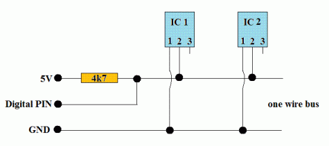

>[Torna a gateway LoRaWan con modem HW](lorarak811.md)

## **Gateway per BUS Dallas (OneWire)**

### **Schema di principio del BUS OneWire**

Notare i **collegamenti in parallelo** tra tutti i dispositivi attorno a 2 (parasite mode) o 3 fili (normal mode).



### **Il sensore di temperatura DS18B20**


### **Parasite mode**

Il bus onewire teoricamente possiede **2 soli fili** (uno senza la massa):
- una **massa comune** per il ritorno della corrente 
- un **filo dati** che è usato anche per l'alimentazione del dispositivo. Poichè il livello **L (basso)** è di solito codificato con 0V l'alimentazione risulta **intermittente**. Per ovviare a questi buchi (lack) di alimentazione si collega una **capacità** in parallelo a massa e linea dati che funge da **tampone locale** alla mancanza di alimentazione dovuta a sequenze consecutive di zeri. Questo modo di funzionamente si chiama **parasite mode**.


### **Normal mode**

In pratica è usuale anche un collegamento a **3 fili** (2 senza la massa):
- una **massa comune** per il ritorno della corrente 
- un **filo dati** che è **a se stante** cioè **non** viene usato anche per l'alimentazione del dispositivo.
- un **positivo di alimentazione** che alimenta tutti i dispositivi. Questa modalità si chiama **normal mode**.


### **Librerie del progetto**

Dal **punto di vista SW** sevono **due librerie** da scaricare e scompattare dentro la solita cartella **libraries** (disponibili su Git al link https://github.com/PaulStoffregen/OneWire e al link https://github.com/milesburton/Arduino-Temperature-Control-Library) :
- **OneWire-master.zip** da scompattare e rinominare semplicemente **OneWire**. Per installare il protocollo standard OneWire.
- **Arduino-Temperature-Control-Library-master** da scompattare e rinominare semplicemente **DallasTemperature** per installare il particolare protocollo applicativo di quella categoria di sensori di temperatura (**DS18B20**).

### **Gateway OneWire-LoRaWan con modem RN2483 per la lettura di un solo sensore**

La libreria MQTT è asincrona per cui non bloccante. E' adoperabile sia per **ESP8266** che per **ESP32**.

Anche in questo caso sono possibili entrambi i collegamenti, **normal mode** e **parasite mode**. Di seguito è illustrato il **normal mode**:


```C++

```

**Sitografia:**

https://randomnerdtutorials.com/esp32-mqtt-publish-ds18b20-temperature-arduino/
https://randomnerdtutorials.com/micropython-mqtt-publish-ds18b10-esp32-esp8266/
https://randomnerdtutorials.com/esp32-ds18b20-temperature-arduino-ide/
https://randomnerdtutorials.com/esp32-multiple-ds18b20-temperature-sensors/

>[Torna a gateway LoRaWan con modem HW](lorarak811.md)

