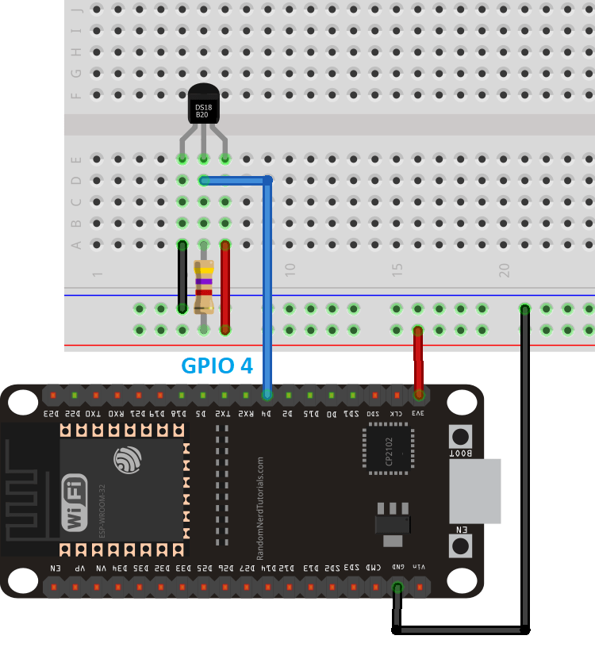

>[Torna a gateway LoRaWan con modem HW](lorarak811.md)

## **Gateway per BUS Dallas (OneWire)**

### **Schema di principio del BUS OneWire**

Notare i **collegamenti in parallelo** tra tutti i dispositivi attorno a 2 (parasite mode) o 3 fili (normal mode).


### **Il sensore di temperatura DS18B20**


### **Parasite mode**

Il bus onewire teoricamente possiede **2 soli fili** (uno senza la massa):
- una **massa comune** per il ritorno della corrente 
- un **filo dati** che è usato anche per l'alimentazione del dispositivo. Poichè il livello **L (basso)** è di solito codificato con 0V l'alimentazione risulta **intermittente**. Per ovviare a questi buchi (lack) di alimentazione si collega una **capacità** in parallelo a massa e linea dati che funge da **tampone locale** alla mancanza di alimentazione dovuta a sequenze consecutive di zeri. Questo modo di funzionamente si chiama **parasite mode**.


### **Normal mode**

In pratica è usuale anche un collegamento a **3 fili** (2 senza la massa):
- una **massa comune** per il ritorno della corrente 
- un **filo dati** che è **a se stante** cioè **non** viene usato anche per l'alimentazione del dispositivo.
- un **positivo di alimentazione** che alimenta tutti i dispositivi. Questa modalità si chiama **normal mode**.



### **Librerie del progetto**

Dal **punto di vista SW** sevono **due librerie** da scaricare e scompattare dentro la solita cartella **libraries** (disponibili su Git al link https://github.com/PaulStoffregen/OneWire e al link https://github.com/milesburton/Arduino-Temperature-Control-Library) :
- **OneWire-master.zip** da scompattare e rinominare semplicemente **OneWire**. Per installare il protocollo standard OneWire.
- **Arduino-Temperature-Control-Library-master** da scompattare e rinominare semplicemente **DallasTemperature** per installare il particolare protocollo applicativo di quella categoria di sensori di temperatura (**DS18B20**).

### **Gateway OneWire-LoRaWan con modem RN2483 per la lettura di un solo sensore**

La libreria MQTT è asincrona per cui non bloccante. E' adoperabile sia per **ESP8266** che per **ESP32**.

Anche in questo caso sono possibili entrambi i collegamenti, **normal mode** e **parasite mode**. Di seguito è illustrato il **normal mode**:


```C++
/********************************************************
 * This demo is only supported after RUI firmware version 3.0.0.13.X on RAK811
 * Master Board Uart Receive buffer size at least 128 bytes. 
 ********************************************************/

#include "RAK811.h"
#include "SoftwareSerial.h"
#include <OneWire.h>
#include <DallasTemperature.h>
#define WORK_MODE LoRaWAN   //  LoRaWAN or LoRaP2P
#define JOIN_MODE OTAA    //  OTAA or ABP
#if JOIN_MODE == OTAA
String DevEui = "8680000000000001";
String AppEui = "70B3D57ED00285A7";
String AppKey = "DDDFB1023885FBFF74D3A55202EDF2B1";
#else JOIN_MODE == ABP
String NwkSKey = "69AF20AEA26C01B243945A28C9172B42";
String AppSKey = "841986913ACD00BBC2BE2479D70F3228";
String DevAddr = "260125D7";
#endif
#define TXpin 11   // Set the virtual serial port pins
#define RXpin 10
//#define SensorPin A0  // used for Arduino and ESP8266
#define SensorPin 4     // used for ESP32
#define DebugSerial Serial
#define TX_INTERVAL ((uint32_t) 300)
#define RESET 15
//sensors defines
#define ONWIREPORT 10
SoftwareSerial ATSerial(RXpin,TXpin);    // Declare a virtual serial port
char buffer[]= "72616B776972656C657373";

bool InitLoRaWAN(void);
RAK811 RAKLoRa(ATSerial,DebugSerial);
// Setup the one wire connection on pin 10
OneWire oneWire(ONWIREPORT);
DallasTemperature sensors(&oneWire);
DeviceAddress thermometer;

void inline sensorsInit() {
	sensors.begin();
}

void setup() {
  DebugSerial.begin(115200);
  sensorsInit();
  while(DebugSerial.available())
  {
    DebugSerial.read(); 
  }
  
  ATSerial.begin(9600); //set ATSerial baudrate:This baud rate has to be consistent with  the baud rate of the WisNode device.
  while(ATSerial.available())
  {
    ATSerial.read(); 
  }

  if(!RAKLoRa.rk_setWorkingMode(0))  //set WisNode work_mode to LoRaWAN.
  {
    DebugSerial.println(F("set work_mode failed, please reset module."));
    while(1);
  }
  
  RAKLoRa.rk_getVersion();  //get RAK811 firmware version
  DebugSerial.println(RAKLoRa.rk_recvData());  //print version number

  DebugSerial.println(F("Start init RAK811 parameters..."));
 
  if (!InitLoRaWAN())  //init LoRaWAN
  {
    DebugSerial.println(F("Init error,please reset module.")); 
    while(1);
  }

  DebugSerial.println(F("Start to join LoRaWAN..."));
  while(!RAKLoRa.rk_joinLoRaNetwork(60))  //Joining LoRaNetwork timeout 60s
  {
    DebugSerial.println();
    DebugSerial.println(F("Rejoin again after 5s..."));
    delay(5000);
  }
  DebugSerial.println(F("Join LoRaWAN success"));

  if(!RAKLoRa.rk_isConfirm(0))  //set LoRa data send package type:0->unconfirm, 1->confirm
  {
    DebugSerial.println(F("LoRa data send package set error,please reset module.")); 
    while(1);    
  }
}

bool InitLoRaWAN(void)
{
  if(RAKLoRa.rk_setJoinMode(JOIN_MODE))  //set join_mode:OTAA
  {
    if(RAKLoRa.rk_setRegion(5))  //set region EU868
    {
      if (RAKLoRa.rk_initOTAA(DevEui, AppEui, AppKey))
      {
        DebugSerial.println(F("RAK811 init OK!"));  
        return true;    
      }
    }
  }
  return false;
}

bool readSensorsAndTx() {
// Split both words (16 bits) into 2 bytes of 8
	char payload[2];

	Serial.print("Requesting data...");
	// Get the temp
	sensors.getAddress(thermometer, 0);
	sensors.setResolution(thermometer, 12);
	sensors.requestTemperatures();
	uint16_t temperature = sensors.getTempC(thermometer);

	// Split both words (16 bits) into 2 bytes of 8
	payload[0] = highByte(temperature);
	payload[1] = lowByte(temperature);

	Serial.print("Temperature: ");
	Serial.println(temperature);

	
	Serial.println(F("Packet queued"));
  
	return RAKLoRa.rk_sendData(1, payload);
}

void loop() {
  DebugSerial.println(F("Start send data..."));
  if (readSensorsAndTx())
  {    
    for (unsigned long start = millis(); millis() - start < 90000L;)
    {
      String ret = RAKLoRa.rk_recvData();
      if(ret != NULL)
      { 
        DebugSerial.println(ret);
      }
      if((ret.indexOf("OK")>0)||(ret.indexOf("ERROR")>0))
      {
        DebugSerial.println(F("Go to Sleep."));
        RAKLoRa.rk_sleep(1);  //Set RAK811 enter sleep mode
        delay(TX_INTERVAL * 1000);  //delay 10s
        RAKLoRa.rk_sleep(0);  //Wakeup RAK811 from sleep mode
        break;
      }
    }
  }
}
```

**Sitografia:**

https://randomnerdtutorials.com/esp32-mqtt-publish-ds18b20-temperature-arduino/
https://randomnerdtutorials.com/micropython-mqtt-publish-ds18b10-esp32-esp8266/
https://randomnerdtutorials.com/esp32-ds18b20-temperature-arduino-ide/
https://randomnerdtutorials.com/esp32-multiple-ds18b20-temperature-sensors/

>[Torna a gateway LoRaWan con modem HW](lorarak811.md)

