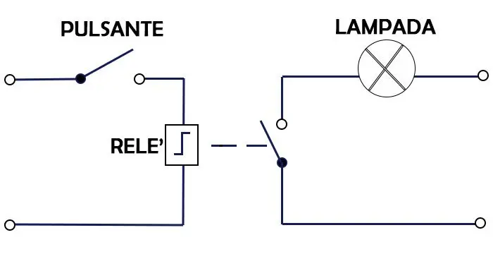
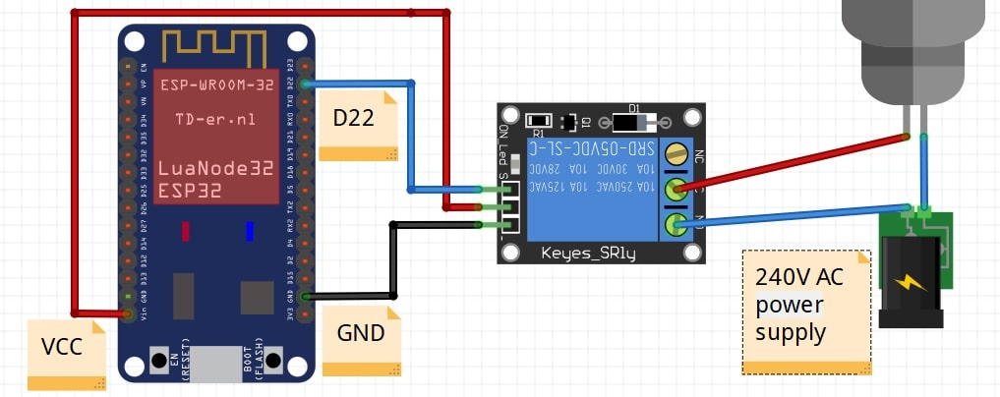

>[Torna a gateway digitale](ak811hwgatewaydigitale.md)

## **Gateway per scheda relè digitale**

### **Schema di principio del collegamento a stella**

Notare i **collegamenti punto-punto** tra tutti i dispositivi e il microcontrollore tramite linee esclusive.


### **La scheda relè**

Il relè è un dispositivo elettromeccanico utilizzato come interruttore e frapposto tra dispositivi ad alta corrente e dispositivi a bassa corrente. Le sue parti principali sono bobina e contatti. Generalmente applichiamo tensioni CC (5-12V) alla bobina e colleghiamo il carico (230V) attraverso i contatti normalmente aperti o chiusi. Quando forniamo tensione continua alla bobina, questa inizia a caricare, lungo il suo asse (traferro) un campo magnetico. Quando la bobina è completamente eccitata, il contatto passa dalla posizione normalmente aperta alla posizione normalmente chiusa sotto l'azione della forza esercitata dal campo magnetico sul materiale ferromagnetico del contatto.



Le lampadine o i motori di solito funzionano con alimentazione a 230 volt in caso di alimentazione in CA (corrente alternata). Non possiamo interfacciare questi carichi AC direttamente con la scheda di sviluppo ESP32. Dobbiamo usare un relè tra ESP32 e la lampada. 

Utilizzeremo un relè come interruttore per controllare lampade da 120-230 volt. Controlleremo il relè con ESP32. Potremmo usare qualsiasi modulo relè. Tuttavia, utilizzeremo il modulo relè SRD-05VDC-SL-C 5V. Funziona e può essere utilizzato per controllare carichi in uscita da 120-240 volt e una corrente massima di 10 A.

Bisogna fare attenzione a distinguere tra **carichi resistivi** e **carichi induttivi**. Una lampadina è un tipico carico resistivo, mentre un motore è un tipico carico induttivo. 

I **carichi induttivi** sono costituiti internamente da bobine più o meno grandi. I carichi induttivi soffrono del problema delle **sovratensioni** e delle **sovracorrenti** all'**accensione** e allo **spegnimento**. 

Una **sovracorrente** è una corrente che può essere **parecchie volte superiore** alla **massima corrente nominale** del **carico** (anche 10-15 volte), ha però la caratteristica di essere presente per un periodo **transitorio molto breve**. La sua presenza è un **fattore di stress** per i relè che ne accorcia la vita operativa. Esistono relè **appositamente progettati** per l'azionamento dei **carichi induttivi** ma hanno normalmente dimensioni e costo maggiore di quelli per carichi resistivi.

E' da rimarcare che normalmente non è una buona idea **collegare direttamente** la bobina di un relè ad una porta digitale del microcontrollore perchè questa potrebbe non fornire tutta la **corrente necessaria** per **eccitare competamente** il relè. Normalmente tra, microcontrollore e relè vi sono dei **circuiti di pilotaggio** che forniscono la corrente necessaria realizzati con **transistor BJT o MOS**. Una **scheda relè** normalmente ha a bordo, oltre al relè, pure i circuiti di pilotaggio necessari.


Una **scheda relè** consiste di **6 pin**:
- Tre pin vengono utilizzati per il collegamento con il **lato ad alta tensione**, ad esempio carichi elettrici e alimentazione a 220 volt 
- altri tre pin vengono utilizzati per il **lato a bassa tensione**, vale a dire: vcc, massa e pin del segnale di controllo.


Ci sono due **pin di contatto** che sono **normalmente aperti** e **normalmente chiusi**. Si usa sempre un **pin comune** insieme ad un pin normalmente aperto o un pin normalmente chiuso alternativamente per collegare il carico. A seconda di NC o NO, si utilizza un segnale attivo alto o attivo basso per controllare il relè:
- **Normalmente aperto (NA)**. Si utilizza un pin normalmente aperto, il relè si attiverà quando il segnale alto è presente sul **pin di controllo** mentre il segnale basso sullo stesso pin spegnerà il relè come mostrato in figura.
- **Normalmente chiuso (NC)**.  Si utilizza un pin normalmente chiuso, il segnale basso sul **pin di controllo** attiva il relè mentre il segnale alto sul pin di controllo disattiva il relè.

Alcuni moduli relè hanno transistor che funzionano con logica invertita. Logica invertita significa che il segnale basso attivo attiverà il relè mentre il segnale alto attivo spegnerà il relè. È necessario controllare la funzionalità del modulo relè prima di utilizzarlo. SRD-05VDC-SL-C, il modulo relè a 5V utilizzato nel progetto, non funziona su logica invertita.

### **Schema cablaggio**

**Avvertenza:** prima di realizzare questo schema elettrico, assicurarsi di non aver collegato ESP32 e lampada con alimentazione ad alta tensione. Stai utilizzando l'ALTA tensione in questo progetto, prendi tutte le precauzioni prima di creare questo layout. 

**Prima di toccare** il circuito per **inserire o disinserire collegamenti** assicurarsi con **certezza assoluta** di aver **scollegato la tensione di rete a 230V**. **Ripetere** questo controllo **con scrupolo** ogni volta che si **maneggia il circuito**.



### **Librerie del progetto**

Dal **punto di vista SW** non servono librerie particolari tranne quelle per la pubblicazione dei valori tramite LoRaWan. 

### **Gateway GPIO-LORaWan con modem HW per il comando di una scheda relè**

Il codice seguente, alla ricezione del messaggio sotto forma di un singolo byte (uint8_t) scrive il bit basso o alto sulla **porta di controllo** del relè ivi collegato. **Subito dopo** la scrittura del comando viene effettuata una **lettura dello stato** della stessa porta (la cmdport) e viene inviato il suo valore al server applicativo lungo un **canale di feedback** in uplink. 

**Periodicamente**, grazie ad una **schedulazione** all'interno del loop(), il microcontrollore **invia spontaneamente** lo **stato della porta** del relè con una cadenza memorizzata su interval e impostata a **60 secondi**.

```C++
/********************************************************
 * This demo is only supported after RUI firmware version 3.0.0.13.X on RAK811
 * Master Board Uart Receive buffer size at least 128 bytes. 
 ********************************************************/

#include "RAK811.h"
#include "SoftwareSerial.h"
#define WORK_MODE LoRaWAN   //  LoRaWAN or LoRaP2P
#define JOIN_MODE OTAA    //  OTAA or ABP
#if JOIN_MODE == OTAA
String DevEui = "8680000000000001";
String AppEui = "70B3D57ED00285A7";
String AppKey = "DDDFB1023885FBFF74D3A55202EDF2B1";
#else JOIN_MODE == ABP
String NwkSKey = "69AF20AEA26C01B243945A28C9172B42";
String AppSKey = "841986913ACD00BBC2BE2479D70F3228";
String DevAddr = "260125D7";
#endif
#define TXpin 11   // Set the virtual serial port pins
#define RXpin 10
//#define SensorPin A0  // used for Arduino and ESP8266
#define SensorPin 4     // used for ESP32
#define DebugSerial Serial
#define TX_INTERVAL ((uint32_t) 300)
SoftwareSerial ATSerial(RXpin,TXpin);    // Declare a virtual serial port
char buffer[]= "72616B776972656C657373";

bool InitLoRaWAN(void);
RAK811 RAKLoRa(ATSerial,DebugSerial);

int8_t cmdport = 22;
int8_t ax;

void setup() {
  DebugSerial.begin(115200);
  while(DebugSerial.available())
  {
    DebugSerial.read(); 
  }
  
  ATSerial.begin(9600); //set ATSerial baudrate:This baud rate has to be consistent with  the baud rate of the WisNode device.
  while(ATSerial.available())
  {
    ATSerial.read(); 
  }

  if(!RAKLoRa.rk_setWorkingMode(0))  //set WisNode work_mode to LoRaWAN.
  {
    DebugSerial.println(F("set work_mode failed, please reset module."));
    while(1);
  }
  
  RAKLoRa.rk_getVersion();  //get RAK811 firmware version
  DebugSerial.println(RAKLoRa.rk_recvData());  //print version number

  DebugSerial.println(F("Start init RAK811 parameters..."));
 
  if (!InitLoRaWAN())  //init LoRaWAN
  {
    DebugSerial.println(F("Init error,please reset module.")); 
    while(1);
  }

  DebugSerial.println(F("Start to join LoRaWAN..."));
  while(!RAKLoRa.rk_joinLoRaNetwork(60))  //Joining LoRaNetwork timeout 60s
  {
    DebugSerial.println();
    DebugSerial.println(F("Rejoin again after 5s..."));
    delay(5000);
  }
  DebugSerial.println(F("Join LoRaWAN success"));

  if(!RAKLoRa.rk_isConfirm(0))  //set LoRa data send package type:0->unconfirm, 1->confirm
  {
    DebugSerial.println(F("LoRa data send package set error,please reset module.")); 
    while(1);    
  }
  if(!RAKLoRa.rk_setClass(1)){
	DebugSerial.println(F("LoRa class B not setted.")); 
	while(1); 
  }
}

bool InitLoRaWAN(void)
{
  if(RAKLoRa.rk_setJoinMode(JOIN_MODE))  //set join_mode:OTAA
  {
    if(RAKLoRa.rk_setRegion(5))  //set region EU868
    {
      if (RAKLoRa.rk_initOTAA(DevEui, AppEui, AppKey))
      {
        DebugSerial.println(F("RAK811 init OK!"));  
        return true;    
      }
    }
  }
  return false;
}

bool readSensorsAndTx() {
// Split both words (16 bits) into 2 bytes of 8
	char payload[1];

	Serial.print("Requesting data...");
	ax = digitalRead(cmdport);
	Serial.println("DONE");

	payload[0] = ax;
	
	Serial.println(F("Packet queued"));
  
	return RAKLoRa.rk_sendData(1, payload);
}

void loop() {
	if(ATSerial.available()){
		String ret = RAKLoRa.rk_recvData();
		if(ret != NULL)
		{ 
			DebugSerial.println(ret);
			digitalWrite(cmdport, ret.toInt());
			readSensorsAndTx();
		}
		DebugSerial.println(F("Go to Sleep."));
		RAKLoRa.rk_sleep(1);  //Set RAK811 enter sleep mode
		delay(TX_INTERVAL * 1000);  //delay 10s
		RAKLoRa.rk_sleep(0);  //Wakeup RAK811 from sleep mode
	}
}
```

**Sitografia:**

- https://microcontrollerslab.com/esp32-web-server-control-relay-220-volt-lamp/
- https://www.monicoimpianti.net/rele-passo-passo/

>[Torna a gateway digitale](ak811hwgatewaydigitale.md)
