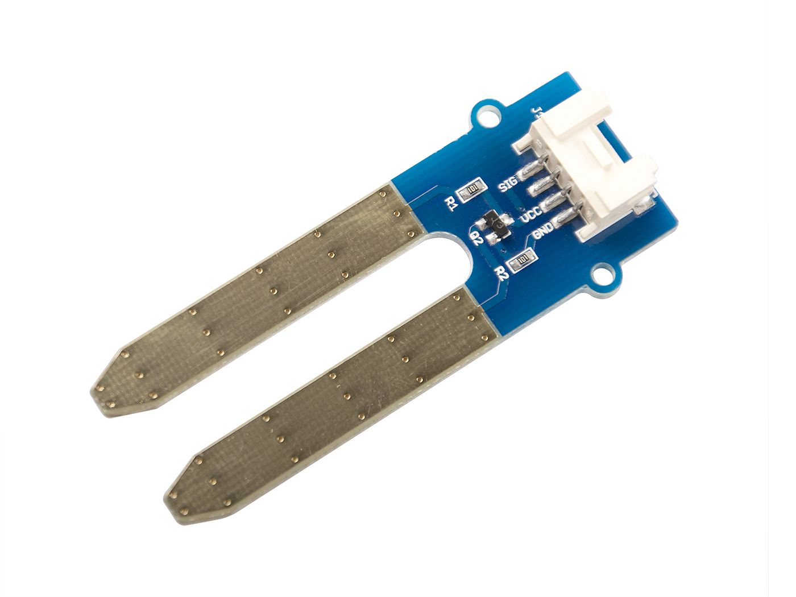
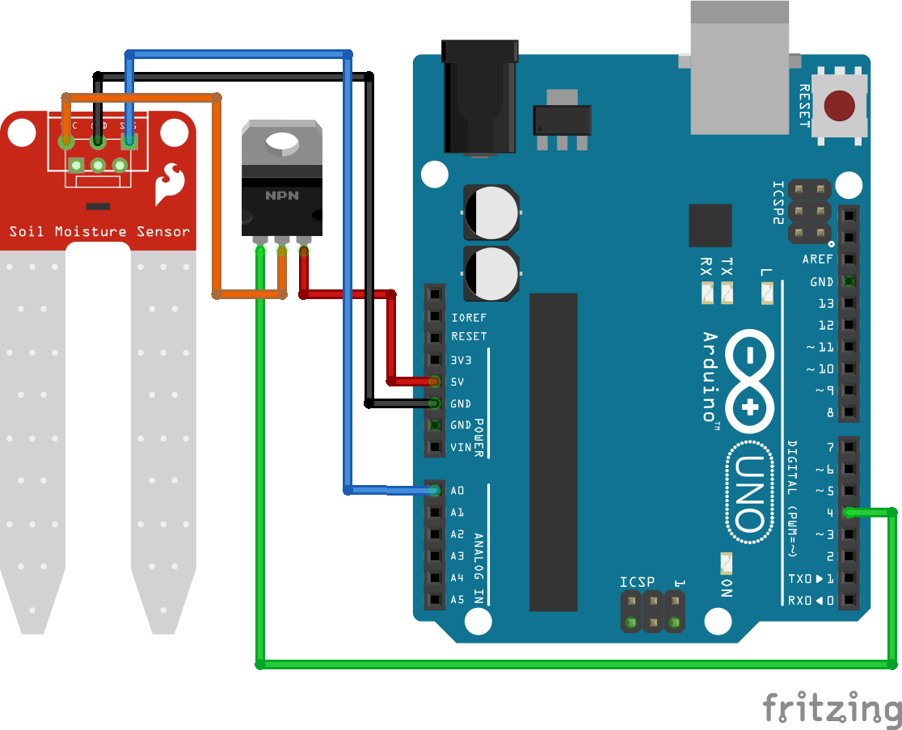

>[Torna a gateway analogico](ak811hwgatewayanalogico.md)


## **Gateway per sensore resistivo di umidità del suolo**

### **Schema di principio del collegamento a stella**

Notare i **collegamenti punto-punto** tra tutti i dispositivi e il microcontrollore tramite linee esclusive.


### **Il sensore di livello resistivo**



### **Schema cablaggio**



### **Condizionamento digitale**

    | Tensione di alimentazione               |        3.3V         |          5V           |
    |-----------------------------------------|---------|-----------|-----------|-----------|
    | Umido/Secco                             |  Umido  |   Secco   |   Umido   |   Secco   |
    | Sensore di umidità del suolo capacitivo |  2...8  |  14...21  | 821...824 | 490...549 |
    | Sensore di umidità del suolo resistivo  |   1024  | 483...505 |   1023    | 344...358 |
    
Teoricamente si può usare una qualsiasi di queste combinazioni, ma è necessario calibrare il  sensore prima di dichiarare che il terreno è bagnato o asciutto.

Per il sensore di umidità del suolo capacitivo si vede anche dalla tabella che la differenza nel valore del sensore per una tensione di esercizio di 3,3V è molto bassa. Pertanto per evitare probabili errori è consigliabile, per il sensore capacitivo, utilizzare una tensione operativa di 5V.

### **Sensore di umidità del suolo resistivo**

Il **sensore resistivo di umidità** del suolo è composto da 2 sonde con inserimento nel terreno. A seconda della direzione della corrente, una sonda funzionerà come catodo e l'altra come anodo. Generalmente quale sonda sia l'anodo o il catodo è irrilevante per la funzionalità del sensore, perché il sensore misura solo la resistenza ed è quindi indipendente dalla direzione del flusso di corrente.

Il circuito elettrico è chiuso sul **terreno** che funge da **resistenza** per il flusso di corrente. Questa resistenza viene misurata e dipende dalla **quantità di acqua** nel terreno perché l'acqua è un conduttore naturale per l'elettricità. Minore è la resistenza misurata, maggiore è la quantità di acqua nel terreno.

Il flusso di corrente attraverso l'anodo del sensore resistivo di umidità del suolo, che ha contatto con l'acqua, è un ambiente perfetto per l'**elettrolisi** e quindi la deposizione galvanica. Questa elettrolisi danneggia il sensore e rende il sensore impreciso. Quanto sarà forte l'elettrolisi dipende da quanto spesso e da quanta corrente viene fatta passare attraverso gli elettrodi.

Per evitare il flusso di corrente al sensore, utilizziamo un circuito MOSFET a canale N per scollegare il sensore dall'alimentazione. Inoltre leggiamo il valore del sensore solo una volta ogni tanto.

### **Librerie del progetto**

Dal **punto di vista SW** non servono librerie particolari tranne quelle per la pubblicazione dei valorri traite MQTT. Una parte del codice va comunque dedicata al condizionamento dei valori misurati dal sensore per tradurli ai valori di interesse di umidità.

### **Gateway MQTT per la lettura di un solo sensore di umidità del suolo**

Utilizziamo il pin digitale per abilitare il flusso di corrente sul gate del MOSFET. Questo chiude il circuito del sensore di umidità del suolo e leggiamo il valore del sensore analogico dopo un breve ritardo di 1 secondo. Dopo che il valore del sensore è stato stampato sul monitor seriale, aspettiamo 1 secondo e disabilitiamo il flusso di corrente attraverso il sensore tirando il Gate del MOSFET LOW.

Poiché ogni pin I/O digitale dell'ESP32, che non viene utilizzato per un'interfaccia di comunicazione, può essere un ingresso analogico, dobbiamo scegliere un pin qualsiasi come ingresso analogico.

```C++
/********************************************************
 * This demo is only supported after RUI firmware version 3.0.0.13.X on RAK811
 * Master Board Uart Receive buffer size at least 128 bytes. 
 ********************************************************/

#include "RAK811.h"
#include "SoftwareSerial.h"
#define WORK_MODE LoRaWAN   //  LoRaWAN or LoRaP2P
#define JOIN_MODE OTAA    //  OTAA or ABP
#if JOIN_MODE == OTAA
String DevEui = "8680000000000001";
String AppEui = "70B3D57ED00285A7";
String AppKey = "DDDFB1023885FBFF74D3A55202EDF2B1";
#else JOIN_MODE == ABP
String NwkSKey = "69AF20AEA26C01B243945A28C9172B42";
String AppSKey = "841986913ACD00BBC2BE2479D70F3228";
String DevAddr = "260125D7";
#endif
#define TXpin 11   // Set the virtual serial port pins
#define RXpin 10
//#define SensorPin A0  // used for Arduino and ESP8266
#define SensorPin 4     // used for ESP32
#define DebugSerial Serial
#define TX_INTERVAL ((uint32_t) 300)
#define SENSOR_VCC_PIN  5     // used for ESP32
SoftwareSerial ATSerial(RXpin,TXpin);    // Declare a virtual serial port
char buffer[]= "72616B776972656C657373";

bool InitLoRaWAN(void);
RAK811 RAKLoRa(ATSerial,DebugSerial);

int16_t h1;

void setup() {
  DebugSerial.begin(115200);
  while(DebugSerial.available())
  {
    DebugSerial.read(); 
  }
  
  ATSerial.begin(9600); //set ATSerial baudrate:This baud rate has to be consistent with  the baud rate of the WisNode device.
  while(ATSerial.available())
  {
    ATSerial.read(); 
  }

  if(!RAKLoRa.rk_setWorkingMode(0))  //set WisNode work_mode to LoRaWAN.
  {
    DebugSerial.println(F("set work_mode failed, please reset module."));
    while(1);
  }
  
  RAKLoRa.rk_getVersion();  //get RAK811 firmware version
  DebugSerial.println(RAKLoRa.rk_recvData());  //print version number

  DebugSerial.println(F("Start init RAK811 parameters..."));
 
  if (!InitLoRaWAN())  //init LoRaWAN
  {
    DebugSerial.println(F("Init error,please reset module.")); 
    while(1);
  }

  DebugSerial.println(F("Start to join LoRaWAN..."));
  while(!RAKLoRa.rk_joinLoRaNetwork(60))  //Joining LoRaNetwork timeout 60s
  {
    DebugSerial.println();
    DebugSerial.println(F("Rejoin again after 5s..."));
    delay(5000);
  }
  DebugSerial.println(F("Join LoRaWAN success"));

  if(!RAKLoRa.rk_isConfirm(0))  //set LoRa data send package type:0->unconfirm, 1->confirm
  {
    DebugSerial.println(F("LoRa data send package set error,please reset module.")); 
    while(1);    
  }
}

bool InitLoRaWAN(void)
{
  if(RAKLoRa.rk_setJoinMode(JOIN_MODE))  //set join_mode:OTAA
  {
    if(RAKLoRa.rk_setRegion(5))  //set region EU868
    {
      if (RAKLoRa.rk_initOTAA(DevEui, AppEui, AppKey))
      {
        DebugSerial.println(F("RAK811 init OK!"));  
        return true;    
      }
    }
  }
  return false;
}

bool readSensorsAndTx() {
// Split both words (16 bits) into 2 bytes of 8
	char payload[2];

	Serial.print("Requesting data...");
	digitalWrite(SENSOR_VCC_PIN, HIGH);
	h1 = analogRead(SensorPin);
	digitalWrite(SENSOR_VCC_PIN, LOW);
	Serial.println("DONE");

	payload[0] = highByte(h1);
	payload[1] = lowByte(h1);
	
	Serial.println(F("Packet queued"));
  
	return RAKLoRa.rk_sendData(1, payload);
}

void loop() {
  DebugSerial.println(F("Start send data..."));
  if (readSensorsAndTx())
  {    
    for (unsigned long start = millis(); millis() - start < 90000L;)
    {
      String ret = RAKLoRa.rk_recvData();
      if(ret != NULL)
      { 
        DebugSerial.println(ret);
      }
      if((ret.indexOf("OK")>0)||(ret.indexOf("ERROR")>0))
      {
        DebugSerial.println(F("Go to Sleep."));
        RAKLoRa.rk_sleep(1);  //Set RAK811 enter sleep mode
        delay(TX_INTERVAL * 1000);  //delay 10s
        RAKLoRa.rk_sleep(0);  //Wakeup RAK811 from sleep mode
        break;
      }
    }
  }
}
```

### **Gateway MQTT per la lettura periodica di un sensore di umidità del suolo alimentato a batteria**

Il codice seguente utilizza la modalità di sleep profondo del microcontrollore ESP32 che consiste nello spegnimento dei due core della CPU e di tutte le periferiche fatta eccezione per un timer HW che viene impostato ad un timeout allo scadere del quale avviene il risveglio della CPU. Lo sleep profondo consente un drastico risparmio di energia nei periodi di inattività che allunga la durata di una eventuale alimentazione a batterie.

L'istruzione ``` esp_deep_sleep_start(); ``` avvia la fase di sleep e viene eseguita una volta sola all'interno del setup(). Il loop() è praticamente inutile e viene lasciato vuoto dato che non è possibile arrivare alla sua esecuzione.

Il risveglio fa ripartire ogni volta il sistema dal setup() per cui tutte le elaborazioni e le eventuali comunicazioni devono avvenire la dentro.

L'istruzione ``` esp_sleep_enable_timer_wakeup(TIME_TO_SLEEP * uS_TO_S_FACTOR) ``` imposta il timeout del timer.

La funzione ``` print_wakeup_reason() ``` stampa sulla seriale il motivo del wakeup.

I motivi possono essere:
- l'evento di timer HW, che sveglia il sistema in periodi di tempo prestabiliti;
- l'evento di tocco tattile di un certo pin;
- un evento di riattivazione esterna: è possibile utilizzare una riattivazione esterna o più risvegli esterni diversi;
- un evento generato dal coprocessore ULP ma questo non sarà trattato nella presente guida.

Nel codice seguente vengono effettuati alcuni tentativi di riconnessione in caso di mancato collegamento del WiFi o di mancata connessione MQTT. Fallito il numero massimo di tentativi si va in sleep profondo e si riprova al prossimo risveglio.

```C++
/********************************************************
 * This demo is only supported after RUI firmware version 3.0.0.13.X on RAK811
 * Master Board Uart Receive buffer size at least 128 bytes. 
 ********************************************************/

#include "RAK811.h"
#include "SoftwareSerial.h"
#define WORK_MODE LoRaWAN   //  LoRaWAN or LoRaP2P
#define JOIN_MODE OTAA    //  OTAA or ABP
#if JOIN_MODE == OTAA
String DevEui = "8680000000000001";
String AppEui = "70B3D57ED00285A7";
String AppKey = "DDDFB1023885FBFF74D3A55202EDF2B1";
#else JOIN_MODE == ABP
String NwkSKey = "69AF20AEA26C01B243945A28C9172B42";
String AppSKey = "841986913ACD00BBC2BE2479D70F3228";
String DevAddr = "260125D7";
#endif
//#define SensorPin A0  // used for Arduino and ESP8266
#define SensorPin 4     // used for ESP32
#define TXpin 11   // Set the virtual serial port pins
#define RXpin 10
#define TX_INTERVAL ((uint32_t) 300)
#define SENSOR_VCC_PIN  5     // used for ESP32
SoftwareSerial ATSerial(RXpin,TXpin);    // Declare a virtual serial port
char buffer[]= "72616B776972656C657373";

bool InitLoRaWAN(void);
RAK811 RAKLoRa(ATSerial,Serial);

// Saves the LMIC structure during DeepSleep
RTC_DATA_ATTR bool joined = false;

int16_t h1;

void inline sensorsInit() {

}

bool readSensorsAndTx() {
// Split both words (16 bits) into 2 bytes of 8
	char payload[2];

	Serial.print("Requesting data...");
	digitalWrite(SENSOR_VCC_PIN, HIGH);
	h1 = analogRead(SensorPin);
	digitalWrite(SENSOR_VCC_PIN, LOW);
	Serial.println("DONE");

	payload[0] = highByte(h1);
	payload[1] = lowByte(h1);
	
	Serial.println(F("Packet queued"));
  
	return RAKLoRa.rk_sendData(1, payload);
}

void goDeepSleep()
{
    Serial.println(F("Go DeepSleep"));
    Serial.flush();
    esp_sleep_enable_timer_wakeup(TX_INTERVAL * 1000000);
    esp_deep_sleep_start();
}

void setup() {
  RAKLoRa.rk_sleep(0);  //Wakeup RAK811 from sleep mode
  sensorsInit();
  delay(1000); //wait for the arduino ide's serial console to open
  
  Serial.begin(115200);
  while(Serial.available())
  {
    Serial.read(); 
  }
  
  ATSerial.begin(9600); //set ATSerial baudrate:This baud rate has to be consistent with  the baud rate of the WisNode device.
  while(ATSerial.available())
  {
    ATSerial.read(); 
  }

  if(!RAKLoRa.rk_setWorkingMode(0))  //set WisNode work_mode to LoRaWAN.
  {
    Serial.println(F("set work_mode failed, please reset module."));
    while(1);
  }
  
  RAKLoRa.rk_getVersion();  //get RAK811 firmware version
  Serial.println(RAKLoRa.rk_recvData());  //print version number

  Serial.println(F("Start init RAK811 parameters..."));
 
  if(!joined){
	  if (!InitLoRaWAN())  //init LoRaWAN
	  {
		Serial.println(F("Init error,please reset module.")); 
		while(1);
	  }
  }

  Serial.println(F("Start to join LoRaWAN..."));
  while(!RAKLoRa.rk_joinLoRaNetwork(60))  //Joining LoRaNetwork timeout 60s
  {
    Serial.println();
    Serial.println(F("Rejoin again after 5s..."));
    delay(5000);
  }
  
  if(!joined){
	  joined = true;
  }
  Serial.println(F("Join LoRaWAN success"));

  if(!RAKLoRa.rk_isConfirm(0))  //set LoRa data send package type:0->unconfirm, 1->confirm
  {
    Serial.println(F("LoRa data send package set error,please reset module.")); 
    while(1);    
  }
}

bool InitLoRaWAN(void)
{
  if(RAKLoRa.rk_setJoinMode(JOIN_MODE))  //set join_mode:OTAA
  {
    if(RAKLoRa.rk_setRegion(5))  //set region EU868
    {
      if (RAKLoRa.rk_initOTAA(DevEui, AppEui, AppKey))
      {
        Serial.println(F("RAK811 init OK!"));  
        return true;    
      }
    }
  }
  return false;
}

void loop() {
  Serial.println(F("Start send data..."));
  if (readSensorsAndTx())
  {    
    for (unsigned long start = millis(); millis() - start < 90000L;)
    {
      String ret = RAKLoRa.rk_recvData();
      if(ret != NULL)
      { 
        Serial.println(ret);
      }
      if((ret.indexOf("OK")>0)||(ret.indexOf("ERROR")>0))
      {
        Serial.println(F("Go to Sleep."));
        RAKLoRa.rk_sleep(1);  //Set RAK811 enter sleep mode
	goDeepSleep();
	RAKLoRa.rk_sleep(0);  //Wakeup RAK811 from sleep mode
        break;
      }
    }
  }
}
```


**Sitografia:**

- https://diyi0t.com/soil-moisture-sensor-tutorial-for-arduino-and-esp8266
- https://randomnerdtutorials.com/esp32-deep-sleep-arduino-ide-wake-up-sources/
- https://randomnerdtutorials.com/esp32-timer-wake-up-deep-sleep/

>[Torna a gateway analogico](ak811hwgatewayanalogico.md)
