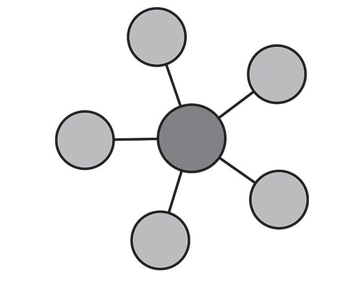

>[Torna a gateway analogico](ak811hwgatewayanalogico.md)

## **Gateway per sensore capacitivo di umidità del suolo**

### **Schema di principio del collegamento a stella**

Notare i **collegamenti punto-punto** tra tutti i dispositivi e il microcontrollore tramite linee esclusive.



### **Il sensore di livello capacitivo**


### **Schema cablaggio**


### **Condizionamento digitale**

    | Tensione di alimentazione               |        3.3V         |          5V           |
    |-----------------------------------------|---------|-----------|-----------|-----------|
    | Umido/Secco                             |  Umido  |   Secco   |   Umido   |   Secco   |
    | Sensore di umidità del suolo capacitivo |  2...8  |  14...21  | 821...824 | 490...549 |
    | Sensore di umidità del suolo resistivo  |   1024  | 483...505 |   1023    | 344...358 |
    
Teoricamente si può usare una qualsiasi di queste combinazioni, ma è necessario calibrare il  sensore prima di dichiarare che il terreno è bagnato o asciutto.

Per il sensore di umidità del suolo capacitivo si vede anche dalla tabella che la differenza nel valore del sensore per una tensione di esercizio di 3,3V è molto bassa. Pertanto per evitare probabili errori è consigliabile, per il sensore capacitivo, utilizzare una tensione operativa di 5V.

### **Librerie del progetto**

Dal **punto di vista SW** non servono librerie particolari tranne quelle per la pubblicazione dei valorri traite MQTT. Una parte del codice va comunque dedicata al condizionamento dei valori misurati dal sensore per tradurli ai valori di interesse di umidità.

### **Gateway LoRaWan HW per la lettura di un solo sensore di umidità del suolo**

Poiché ogni pin I/O digitale dell'ESP32, che non viene utilizzato per un'interfaccia di comunicazione, può essere un ingresso analogico, dobbiamo scegliere un pin qualsiasi come ingresso analogico.

```C++
/*
 * Author: JP Meijers
 * Date: 2016-10-20
 *
 * Transmit a one byte packet via TTN. This happens as fast as possible, while still keeping to
 * the 1% duty cycle rules enforced by the RN2483's built in LoRaWAN stack. Even though this is
 * allowed by the radio regulations of the 868MHz band, the fair use policy of TTN may prohibit this.
 *
 * CHECK THE RULES BEFORE USING THIS PROGRAM!
 *
 * CHANGE ADDRESS!
 * Change the device address, network (session) key, and app (session) key to the values
 * that are registered via the TTN dashboard.
 * The appropriate line is "myLora.initABP(XXX);" or "myLora.initOTAA(XXX);"
 * When using ABP, it is advised to enable "relax frame count".
 *
 * Connect the RN2xx3 as follows:
 * RN2xx3 -- ESP8266
 * Uart TX -- GPIO4
 * Uart RX -- GPIO5
 * Reset -- GPIO15
 * Vcc -- 3.3V
 * Gnd -- Gnd
 *
 */
#include <rn2xx3.h>
#include <SoftwareSerial.h>
#include <DHT.h>

#define RESET 15
//sensors defines
//#define SensorPin A0  // used for Arduino and ESP8266
#define SensorPin 4     // used for ESP32

SoftwareSerial mySerial(4, 5); // RX, TX !! labels on relay board is swapped !!

//create an instance of the rn2xx3 library,
//giving the software UART as stream to use,
//and using LoRa WAN
rn2xx3 myLora(mySerial);

int16_t h1;

void inline sensorsInit() {

}

void inline readSensorsAndTx() {
// Split both words (16 bits) into 2 bytes of 8
	byte payload[2];

	Serial.print("Requesting data...");
	h1 = analogRead(SensorPin);
	Serial.println("DONE");

	payload[0] = highByte(h1);
	payload[1] = lowByte(h1);
	
	Serial.println(F("Packet queued"));
  
	//myLora.tx("!"); //send String, blocking function
	myLora.txBytes(payload, sizeof(payload)); // blocking function
}

// the setup routine runs once when you press reset:
void setup() {
  // LED pin is GPIO2 which is the ESP8266's built in LED
  pinMode(2, OUTPUT);
  led_on();

  // Open serial communications and wait for port to open:
  Serial.begin(57600);
  mySerial.begin(57600);
  
  sensorsInit();
  
  delay(1000); //wait for the arduino ide's serial console to open

  Serial.println("Startup");

  initialize_radio();

  //transmit a startup message
  myLora.tx("TTN Mapper on ESP8266 node");

  led_off();

  delay(2000);
}

void initialize_radio()
{
  //reset RN2xx3
  pinMode(RESET, OUTPUT);
  digitalWrite(RESET, LOW);
  delay(100);
  digitalWrite(RESET, HIGH);

  delay(100); //wait for the RN2xx3's startup message
  mySerial.flush();

  //check communication with radio
  String hweui = myLora.hweui();
  while(hweui.length() != 16)
  {
    Serial.println("Communication with RN2xx3 unsuccessful. Power cycle the board.");
    Serial.println(hweui);
    delay(10000);
    hweui = myLora.hweui();
  }

  //print out the HWEUI so that we can register it via ttnctl
  Serial.println("When using OTAA, register this DevEUI: ");
  Serial.println(hweui);
  Serial.println("RN2xx3 firmware version:");
  Serial.println(myLora.sysver());

  //configure your keys and join the network
  Serial.println("Trying to join TTN");
  bool join_result = false;

  //ABP: initABP(String addr, String AppSKey, String NwkSKey);
  join_result = myLora.initABP("02017201", "8D7FFEF938589D95AAD928C2E2E7E48F", "AE17E567AECC8787F749A62F5541D522");

  //OTAA: initOTAA(String AppEUI, String AppKey);
  //join_result = myLora.initOTAA("70B3D57ED00001A6", "A23C96EE13804963F8C2BD6285448198");

  while(!join_result)
  {
    Serial.println("Unable to join. Are your keys correct, and do you have TTN coverage?");
    delay(60000); //delay a minute before retry
    join_result = myLora.init();
  }
  Serial.println("Successfully joined TTN");

}

// the loop routine runs over and over again forever:
void loop() {
    led_on();
    
    readSensorsAndTx();
	
    led_off();
    delay(200);
}

void led_on()
{
  digitalWrite(2, 1);
}

void led_off()
{
  digitalWrite(2, 0);
}

```
### **Gateway LoraWan per la lettura periodica di un sensore di umidità del suolo alimentato a batteria**

Il codice seguente utilizza la modalità di sleep profondo del microcontrollore ESP32 che consiste nello spegnimento dei due core della CPU e di tutte le periferiche fatta eccezione per un timer HW che viene impostato ad un timeout allo scadere del quale avviene il risveglio della CPU. Lo sleep profondo consente un drastico risparmio di energia nei periodi di inattività che allunga la durata di una eventuale alimentazione a batterie.

L'istruzione ``` esp_deep_sleep_start(); ``` avvia la fase di sleep e viene eseguita una volta sola all'interno del setup(). Il loop() è praticamente inutile e viene lasciato vuoto dato che non è possibile arrivare alla sua esecuzione.

Il risveglio fa ripartire ogni volta il sistema dal setup() per cui tutte le elaborazioni e le eventuali comunicazioni devono avvenire la dentro.

L'istruzione ``` esp_sleep_enable_timer_wakeup(TIME_TO_SLEEP * uS_TO_S_FACTOR) ``` imposta il timeout del timer.

La funzione ``` print_wakeup_reason() ``` stampa sulla seriale il motivo del wakeup.

I motivi possono essere:
- l'evento di timer HW, che sveglia il sistema in periodi di tempo prestabiliti;
- l'evento di tocco tattile di un certo pin;
- un evento di riattivazione esterna: è possibile utilizzare una riattivazione esterna o più risvegli esterni diversi;
- un evento generato dal coprocessore ULP ma questo non sarà trattato nella presente guida.

```C++
/*
 * Author: JP Meijers
 * Date: 2016-10-20
 *
 * Transmit a one byte packet via TTN. This happens as fast as possible, while still keeping to
 * the 1% duty cycle rules enforced by the RN2483's built in LoRaWAN stack. Even though this is
 * allowed by the radio regulations of the 868MHz band, the fair use policy of TTN may prohibit this.
 *
 * CHECK THE RULES BEFORE USING THIS PROGRAM!
 *
 * CHANGE ADDRESS!
 * Change the device address, network (session) key, and app (session) key to the values
 * that are registered via the TTN dashboard.
 * The appropriate line is "myLora.initABP(XXX);" or "myLora.initOTAA(XXX);"
 * When using ABP, it is advised to enable "relax frame count".
 *
 * Connect the RN2xx3 as follows:
 * RN2xx3 -- ESP8266
 * Uart TX -- GPIO4
 * Uart RX -- GPIO5
 * Reset -- GPIO15
 * Vcc -- 3.3V
 * Gnd -- Gnd
 *
 */
#include <rn2xx3.h>
#include <SoftwareSerial.h>
#include <DHT.h>

#define RESET 15
// Interval between send in seconds, so 300s = 5min
#define TX_INTERVAL ((uint32_t) 300)
//sensors defines
//#define SensorPin A0  // used for Arduino and ESP8266
#define SensorPin 4     // used for ESP32

SoftwareSerial mySerial(4, 5); // RX, TX !! labels on relay board is swapped !!

//create an instance of the rn2xx3 library,
//giving the software UART as stream to use,
//and using LoRa WAN
rn2xx3 myLora(mySerial);

// Saves the LMIC structure during DeepSleep
RTC_DATA_ATTR bool joined = false;

int16_t h1;

void inline sensorsInit() {

}

void inline readSensorsAndTx() {
// Split both words (16 bits) into 2 bytes of 8
	byte payload[2];

	Serial.print("Requesting data...");
	h1 = analogRead(SensorPin);
	Serial.println("DONE");

	payload[0] = highByte(h1);
	payload[1] = lowByte(h1);
	
	Serial.println(F("Packet queued"));
  
	//myLora.tx("!"); //send String, blocking function
	myLora.txBytes(payload, sizeof(payload)); // blocking function
}

void goDeepSleep()
{
    Serial.println(F("Go DeepSleep"));
    Serial.flush();
    esp_sleep_enable_timer_wakeup(TX_INTERVAL * 1000000);
    esp_deep_sleep_start();
}

// the setup routine runs once when you press reset:
void setup() {
  // LED pin is GPIO2 which is the ESP8266's built in LED
  pinMode(2, OUTPUT);
  led_on();

  // Open serial communications and wait for port to open:
  Serial.begin(57600);
  mySerial.begin(57600);
  myLora.autobaud();
  
  sensorsInit();
  
  delay(1000); //wait for the arduino ide's serial console to open

  Serial.println("Startup");

  initialize_radio();

  //transmit a startup message
  myLora.tx("I'm on again!");

  led_off();
  loop_once();
  goDeepSleep();
}

void loop_once() {
    led_on();
    readSensorsAndTx();
    led_off();
	// mando il modem in deep sleep
	myLora.sleep(TX_INTERVAL * 1000);
}

void initialize_radio()
{
  //reset RN2xx3
  pinMode(RESET, OUTPUT);
  digitalWrite(RESET, LOW);
  delay(100);
  digitalWrite(RESET, HIGH);

  delay(100); //wait for the RN2xx3's startup message
  mySerial.flush();

  //check communication with radio
  String hweui = myLora.hweui();
  while(hweui.length() != 16)
  {
    Serial.println("Communication with RN2xx3 unsuccessful. Power cycle the board.");
    Serial.println(hweui);
    delay(10000);
    hweui = myLora.hweui();
  }

  //print out the HWEUI so that we can register it via ttnctl
  Serial.println("When using OTAA, register this DevEUI: ");
  Serial.println(hweui);
  Serial.println("RN2xx3 firmware version:");
  Serial.println(myLora.sysver());
  bool join_result = false;
  
  if(!joined){
	  //configure your keys and join the network
	  Serial.println("Trying to join TTN");
	  
	  //ABP: initABP(String addr, String AppSKey, String NwkSKey);
	  join_result = myLora.initABP("02017201", "8D7FFEF938589D95AAD928C2E2E7E48F", "AE17E567AECC8787F749A62F5541D522");

	  //OTAA: initOTAA(String AppEUI, String AppKey);
	  //join_result = myLora.initOTAA("70B3D57ED00001A6", "A23C96EE13804963F8C2BD6285448198");
  }

  while(!join_result)
  {
    Serial.println("Unable to join. Are your keys correct, and do you have TTN coverage?");
    delay(60000); //delay a minute before retry
    join_result = myLora.init();
  }
  if(!joined){
	  joined = true;
  }
  Serial.println("Successfully joined TTN");
}

// the loop routine runs over and over again forever:
void loop() {}

void led_on()
{
  digitalWrite(2, 1);
}

void led_off()
{
  digitalWrite(2, 0);
}

```


**Sitografia:**

- https://diyi0t.com/soil-moisture-sensor-tutorial-for-arduino-and-esp8266
- https://randomnerdtutorials.com/esp32-deep-sleep-arduino-ide-wake-up-sources/
- https://randomnerdtutorials.com/esp32-timer-wake-up-deep-sleep/

>[Torna a gateway analogico](ak811hwgatewayanalogico.md)
