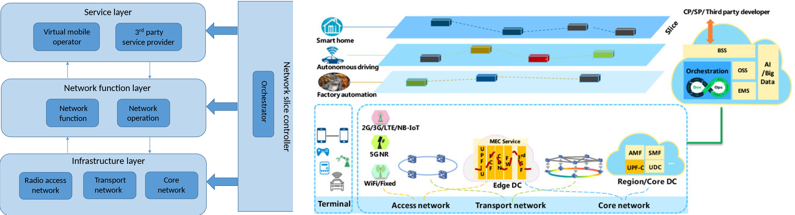
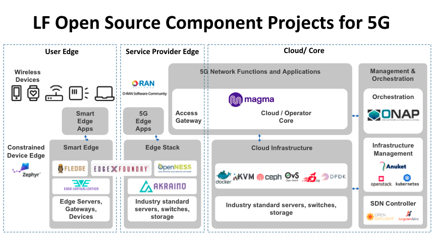

>[Torna a reti di sensori](sensornetworkshort.md#stack-wireless-specifici-per-IOT)

## **RETI CELLULARI PRIVATE**

### **Bande di frequenza**

Il 5G, per sua natura, ha una conformazione dei suoi servizi parecchio **scalabile** sia in termini di **banda allocabile** ai singoli dispositivi sia in termini di **ritardi** per andare incontro alle applicazioni **Real Time**. Inoltre 5G ha **inglobato** nelle sue specifiche anche le teclologie del 4G **NB-IoT** che offrono **servizi a bassisimo bit rat**e utili per realizzare **WSN di grandi dimensioni**, in concorrenza diretta con tecnologie come **Sigfox** e **LoraWan**.

Il **5G fa uso** delle seguenti **frequenze di trasmissione**:
- **Banda bassa** (inferiore a 1 GHz): 694-790 MHz
- **Banda media** (inferiore a 6 GHz): 3,6-3,8 GHz
- **Banda elevata** (a onde millimetriche): 26,6-27,5 GHz  (5G NR Band n258 in banda K)
propriamente dette partono dal valore minimo di 30 GHz. La banda 26,6-27,5 GHz viene
tuttavia assimilata alle onde millimetriche in quanto sufficientemente vicina a questo
valore minimo.)

Ricordando che nel 5G, a **parità di potenza** trasmessa, se si **aumenta la frequenza** di
trasmissione si **riduce la distanza** a cui il segnale è utilizzabile, ma si **aumenta la banda**
disponibile, si può dire che:
- la **banda bassa** è utile per garantire una copertura maggiore del territorio anche **nelle
aree rurali**;
- la **banda media** è utile per offrire un **misto** di **copertura e di capacità** (quello che
tecnicamente si chiama throughput);
- la **banda elevata** è utile in quelle applicazioni che richiedano **alta capacità**, ma
localizzata in **aree molto limitate** per estensione (a queste alte frequenze il segnale si
indebolisce velocemente con il propagarsi dall’antenna), con elevata direttività del
segnale.
 
### **NB-IoT**

La **rete NB-IoT** è composta da **5 segmenti** che sono aanloghi a qualli di altre reti WSN a **single-hop** per lunghe distanze (Sigfox e LoraWan):
- **Terminali**: terminali IoT con interfaccia NB-IoT (e scheda SIM installata)
- **Stazioni base**: stazioni appartenenti all’infrastruttura della rete cellulare e quindi già dispiegate dai operatori
- **Rete di core**: connette le stazioni base alla piattaforma cloud (può essere Internet)
- **Piattaforma cloud**: **server di rete** che raccoglie i dati provenienti dalle stazioni base e generati dai terminali al fine di processarli (se necessario) e inviarli agli utenti finali
- **Utente finale**: ricevono i dati, li memorizzano e  (se previsto) inviano comandi ai terminal

Per quanto riguarda la **banda bassa (sub GHz)** e la **banda media (sub 6 GHz)**, **non** si prevede un aumento significativo del numero di stazioni radio base, in quanto queste frequenze sono analoghe a quelle attualmente in uso per le generazioni precedenti e quin di già coperte dalle **antenne esistenti**. Per quanto riguarda la banda a onde millimetriche, l’elevata attenuazione subita dal  segnale, unita alla necessità di supportare capacità dell’ordine dei Gigabit per secondo, renderà necessaria la **capillare installazione** di stazioni radio base in **prossimità degli utenti**. Tuttavia, tali stazioni radio base non saranno dislocate su tutto il territorio, ma verranno impiegate soltanto laddove saranno **strettamente necessarie**, per esempio in **centri commerciali**, **stadi**, **stazioni** e **aeroporti**, ovvero in luoghi dove la **richiesta di capacità**, unita al **numero di dispositivi** connessi, sarà **elevata**.

Il **canale NB-IoT** (la cui larghezza di banda è 180 kHz) può essere **allocato** con **tre modalità**:
- Independent deployment (**stand-alone mode**): banda frequenziale indipendente che non si sovrappone con quella dei canali LTE
- Guard-band deployment (**guard-band mode**): banda frequenziale localizzata nelle bande di guardia dei canali LTE
- In-band deployment (**in-band mode**): utilizza la banda frequenziale e le risorse allocate per un canale LTE

Per quanto riguarda l'**allocazione di banda dell'NB-IoT** si possono prevedere due tipi di allocazione:
- su **banda licenziata sub GHz (700 MHz)** adatta per servizi **LPWA a grande distanza** data la capacità di queste frequanze di percorrere grandi distanze con bassa attenuazione
- su **banda non licenziata a 6Hz** più adatta a supportare l'**IoT locale** in ambito **domestico** o **industriale**.
### **Servizi 5G**

Si è calcolato che per poter soddisfare servizi ad **alta bit rate**, la qualità del segnale ricevuto deve essere estremamente buona e questo si traduce in una **distanza** fra trasmettitore e ricevitore molto corta (nell’ordine delle decine di metri). Al contrario, altri servizi del 5G utilizzano delle capacità estremamente ridotte (nell’ordine del kilobit per secondo), e possono essere soddisfatti anche se la distanza fra trasmettitore e ricevitore è elevata (nell’ordine dei chilometri).

### **Reti 5G privata**

Una novità dei prossimi anni sarà l'introduzione delle **reti 5G private**, cioè di **proprietà dell'utente**, che permetteranno l'**accesso alla rete LAN** con gli **stessi dispositivi** in uso per la **rete cellulare**. La **rete 5G privata** potrà essere **installata** e **gestita** da un **operatore telefonico**, oppure installata e gestita **da terzi**, oppure **installata** da **terzi** e **gestita** direttamente **dall'utente**, al limite, se ne ha le capacità tecniche, fa **tutto in house** l'utente. Le reti 5G private, per ragioni di costi, dovranno essere composte da **dispositivi di rete** necessariamente **multivendor**, cioè produttori diversi dovranno fabbricare dispositivi tra loro **interoperabili** (cosa che non è accaduta finora in ambito operatore di telefonia).

Il **processo di standardizzazione** è ancora in atto sotto il nome **Open RAN (O-RAN)** e include la standardizzazione di **protocolli** e di **interfacce** tra i vari dispositivi (potenzialmente di marca diversa). La **scalabilità dei servizi** e l'**esigenza di semplificazione** hanno suggerito di includere in questo processo anche la **virtualizzazione della rete** con l'introduzione dei **network slice**, piani di servizio e gestione paralleli, resi disponibili da **tecnologie di automazione** e virtualizzazione basate su **SDN** (Software Defined Network).

La **rete 5G privata** può essere implementata in **due modi**:
- Il **primo** è implementare una **rete 5G privata** fisicamente isolata (isola 5G) indipendente dalla rete 5G pubblica dell'operatore di telefonia mobile (come se si costruisse una LAN cablata o una WLAN Wi-Fi nell'azienda). In questo caso, la rete 5G privata può essere realizzata da **imprese specializzate** o **operatori mobili**.
- Il **secondo** è costruire reti 5G private **condividendo** le risorse di **rete 5G pubbliche** dell'operatore mobile. In questo caso, il **gestore costruirà** reti 5G private per le imprese.

### **RAN aperte**

La RAN gestisce lo spettro radio, assicurandosi che sia utilizzato in modo efficiente e soddisfi i requisiti di qualità del servizio di ogni utente. Corrisponde a un insieme distribuito di stazioni base.

La **RAN** è il collegamento finale tra la rete e il telefono. È il pezzo visibile e include le antenne che vediamo sulle torri, in cima agli edifici o negli stadi, più le stazioni base. Quando effettuiamo una chiamata o ci connettiamo a un server remoto, ad es. per guardare un video di YouTube, l'antenna trasmette e riceve segnali da e verso i nostri telefoni o altri dispositivi portatili. Il segnale viene quindi digitalizzato nella stazione base RAN e connesso alla rete.

Man mano che i produttori di apparecchiature miglioravano le capacità, l'industria si consolidava attorno a quelli con l'offerta più forte e spesso con funzionalità proprietarie. Ma oggi gli operatori vogliono un ecosistema di fornitori più diversificato e stanno ridefinendo i loro requisiti per l'architettura di rete, specialmente nella RAN.

In un **ambiente RAN aperto**, la RAN è **disaggregata** in **tre elementi** costitutivi principali:

- **l'Unità Radio (UR)**
- **l'Unità Distribuita (DU)**
- **l'Unità Centralizzata (CU)**

L'**RU** è il luogo in cui vengono **trasmessi**, **ricevuti**, **amplificati** e **digitalizzati** i segnali in radiofrequenza. L'RU si trova vicino o integrato nell'antenna. La DU e la CU sono le parti di calcolo della stazione base, che inviano il segnale radio digitalizzato nella rete. Il **DU** si trova fisicamente **presso** o **vicino** all'**RU** mentre il **CU** può essere posizionato **più vicino** al**Core**.

Il concetto chiave di **Open RAN** è "**aprire**" i **protocolli** e le **interfacce** tra questi vari elementi costitutivi (radio, hardware e software) nella RAN. L'**O-RAN ALLIANCE** ha definito **3** diverse **interfacce** all'**interno** della **RAN**, incluse quelle per:

- **Fronthaul** tra l'**unità radio** e l'**unità distribuita**
- **Midhaul** tra l'**Unità Distribuita** e l'**Unità Centralizzata**
- **Backhaul** che collega la **RAN** al **Core**

Al momento la **complessità** e il **costo** del **livello fisico** della RAN ha portato alla proposta di un'architettura mista che suddivide, sia in downlink che in uplink, la **gestione fisica dei mezzo** su **due apparati** distinti, uno **abbinato all'antenna**, un'altro a parte **comune a più antenne**. Di seguito è illustrato il dettaglio del livello fisico di **downlink** e **uplink**:

O-RAN **Fronthaul** definisce i seguenti **piani operativi**:

- **C-Plane** (Piano di controllo): i messaggi del piano di controllo definiscono la pianificazione, il coordinamento richiesto per il trasferimento dei dati, la formazione del fascio delle antenne, ecc.
- **U-Plane (User Plane)**: i messaggi del piano utente per un trasferimento dati efficiente entro i rigorosi limiti di tempo delle numerologie 5G.
 - **S-Plane (Piano di sincronizzazione)**: il piano di sincronizzazione è responsabile degli aspetti di temporizzazione e sincronizzazione tra O-DU e O-RU. Nelle implementazioni Cloud RAN, per svolgere tutta una serie di processi, è necessaria una sincronizzazione molto accurata tra O-DU e O-RU ottenuta sincronizzandosi con l'orologio ad alte prestazioni disponibile sul lato O-DU.
- **Piano M (piano di gestione)**: i messaggi del piano di gestione vengono utilizzati per **gestire l'unità radio**. **M-Plane** fornisce una varietà di funzioni di gestione per impostare i parametri sul lato O-RU come richiesto da C/U-Plane e S-Plane. Ad es. gestire il software O-RU, eseguire la gestione dei guasti, ecc. La specifica del fronthaul O-RAN per quanto riguarda l'M-Plane fornisce tra le varie cose modelli di dati che eliminino la dipendenza dall'implementazione di ciascun fornitore e rende possibile una vera Open RAN multi-vendor
    - Supporta il modello gerarchico/ibrido
    - C/U Plane IP e gestione dei ritardi
    - FCAPS inclusa la configurazione e lo stato della sincronizzazione
    
**FCAPS** è l'acronimo di **fault**, **configuration**, **accounting**, **performance**, **security**, le categorie di gestione in cui il modello ISO definisce le **attività di gestione** della rete. Nelle organizzazioni **senza fatturazione** la **contabilità** viene talvolta sostituita con l'**amministrazione**.

Un'altra **caratteristica** di **Open RAN** è il RAN Intelligent Controller (**RIC**) che aggiunge programmabilità alla RAN.

Un ambiente aperto espande l'ecosistema e, con più fornitori che forniscono gli elementi costitutivi, c'è più innovazione e più opzioni per gli operatori. Possono anche aggiungere nuovi servizi. Ad esempio, l'**Intelligenza Artificiale** può essere introdotta tramite il **RIC** per **ottimizzare** la rete in prossimità di uno stadio di calcio **il giorno** di una partita.

Il **Mobile Core** è un insieme di funzionalità (al contrario di un dispositivo) che serve a diversi scopi.
- Fornisce **connettività Internet (IP)** sia per i dati che per i servizi vocali.
- Assicura che questa connettività soddisfi i **requisiti di QoS** promessi.
- **Tiene traccia della mobilità** degli utenti per garantire un servizio ininterrotto.
- **Tiene traccia dell'utilizzo** dell'abbonato per la fatturazione e l'addebito.

Il **Mobile Core** in **4G** è chiamato Evolved Packet Core (**EPC**) e in **5G** è chiamato Next Generation Core (**NG-Core**).

La **figura sottostante** mostra un possibile uso delle **reti mobili private**. Un uso **indipendente dal gestore** con la **rete di telefonia aziendale** collegata alla LAN e **suddivisa** in **classi di servizio fisse** (realizzate magari con reti **fisicamente separate**), solo quelle necessarie ai processi aziendali. Un uso **dipendente dalla rete pubblica** dell'operatore telefonico che ritaglia servizi su misura per quell'azienda utilizzando per questo scopo le proprie **funzioni dinamiche** di **network slicing**.

Per comprendere l'impatto delle tecnologie e delle pratiche cloud applicate alla rete di accesso (RAN), è utile prima capire cosa è importante per il cloud. **Il cloud** ha cambiato radicalmente il modo in cui elaboriamo e, soprattutto, il ritmo dell'innovazione. Lo ha fatto attraverso una **combinazione** di quanto segue.

- **Disaggregazione**: scomposizione di sistemi integrati verticalmente in componenti indipendenti con interfacce aperte.

- **Virtualizzazione**: essere in grado di eseguire più copie indipendenti di tali componenti su una piattaforma hardware comune.

- **Commoditizzazione**: essere in grado di scalare in modo elastico quei componenti virtuali attraverso i **mattoncini hardware** di base in base al **carico di lavoro**.

### **Network slicing**

Lo **slicing della rete 5G** è l'uso della **virtualizzazione della rete** per dividere le **singole connessioni** di rete in **più connessioni virtuali** distinte che forniscono **diverse quantità di risorse** a **diversi tipi** di traffico.

**Per realizzare** quantitativamente tale concetto, vengono impiegate **diverse tecniche**:
- **Funzioni di rete**: esprimono funzionalità di rete elementari che vengono utilizzate come "mattoni" per creare ogni fetta di rete.
- **Virtualizzazione**: fornisce una rappresentazione astratta delle risorse fisiche secondo uno schema unificato ed omogeneo. Inoltre, consente una distribuzione scalabile delle sezioni basata su NFV che consente il disaccoppiamento di ogni istanza della funzione di rete dall'hardware di rete su cui viene eseguita.
- **Orchestrazione**: è un processo che consente il coordinamento di tutte le diverse componenti di rete che sono coinvolte nel ciclo di vita di ciascuna fetta di rete. In questo contesto, SDN viene impiegato per consentire una configurazione delle sezioni dinamica e flessibile.

Elenco di **prodotti opensource** utilizzabili per la gestione di una **RAN 5G**:

>[Torna a reti di sensori](sensornetworkshort.md#stack-wireless-specifici-per-IOT)
