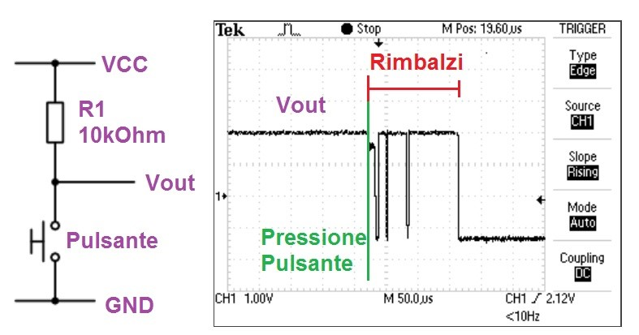

>[Torna all'indice](indexpulsanti.md)

## **IL PROBLEMA DEI RIMBALZI MECCANICI**

Un **pulsante reale** (non semplicemente simulato) non si comporta come ci aspetteremmo, cioè ad una pressione non si limita semplicemente a chiudere il circuito dei contatti in esso contenuti. Di seguito è riportato graficamente **l’andamento nel tempo** del suo **comportamento**:

Il fenomeno inatteso è la sequenza di **rimbalzi** meccanici che seguono la **pressione** del pulsante che si estingue dopo un certo tempo dipendente dalla qualità e dall’usura del contatto.

I rimbalzi sono molto veloci ma comunque sufficientemente lenti da essere **campionati** dalle frequenti letture delle porte condotte alla **massima velocità** della CPU. Il campionamento dei rimbalzi genera una **sequenza di stati logici** opposti il cui **numero** non è prevedibile che, dopo un intervallo transitorio, si **stabilizza** sul valore finale della lettura a tasto premuto (HIGH in pulldown, LOW in pullup).

In misura minore esiste lo stesso fenomeno **al rilascio** del pulsante, cioè la fase di rilascio avviene con oscillazioni che conducono al valore finale rilasciato (LOW in pulldown, HIGH in pullup).

**E’ sempre dannoso** questo fenomeno? La risposta giusta è **dipende**. Nel caso dell’ultimo esempio di un semplice pulsante in pratica no. Questo perché le incertezze sono così veloci e cosi limitate del tempo che non si è in grado di apprezzarle percettivamente con i nostri sensi. Alla vista il fenomeno della persistenza delle immagini sulla retina (inerzia del nostro sensore naturale) ci impedirà di apprezzare la rapida variazione di luminosità conseguente alla corrispondente catena di accensioni e spegnimenti. Ma anche se non le **apprezziamo percettivamente**, queste esistono e potrebbero essere **apprezzate strumentalmente**.

La CPU è in grado di **campionarle**, rilevarle e **includerle** nella normale elaborazione degli input. Se questa elaborazione è ad esempio, sensibile al **numero dei cambiamenti** di stato dell’ingresso, essendo questo oscillante in maniera non prevedibile, può generare **risultati altrettanto imprevedibili.**

**In sostanza**, in tutte quelle situazioni in cui è importante elaborare **il numero delle transizioni** da acceso a spento e viceversa il fenomeno dei rimbalzi **è sicuramente dannoso.**

**Come si può risolvere il problema dei rimbalzi?** Esistono due tipologie di soluzioni:

- HW con dei circuiti detti debouncer realizzabili sia con elettronica analogica che digitale

- SW con un algoritmo che ottiene lo stesso scopo del circuito HW **filtrando** opportunamente i campionamenti.

Noi tratteremo solo i **debouncer di tipo SW**. Questi realizzano un filtraggio digitale degli ingressi sostanzialmente ottenibile:

- con operazioni di **media** dei valori misurati nel tempo.

- Con il **filtraggio dei campionamenti**, ottenuto facendo in modo che la distanza temporale tra l’uno e l’altro sia così grande da estinguere al suo interno i transitori delle oscillazioni, ciò garantisce che **due misure consecutive** non possono essere entrambe la misura di una oscillazione. Il **filtraggio** può essere:

  - **Periodico** schedulando ad **intervalli regolari** i campionamenti. Ciò si ottiene utilizzando un generico **algoritmo di schedulazione** (schedulatore SW) dei task tarato per il debouncing.

  - **Aperiodico** registrando in una variabile il **momento** in cui si verificano **i cambiamenti di stato degli ingressi**, e ignorando tutti quelli successivi che stanno all’interno di un **tempo limite** che marca la **zona di inaffidabilità** che è sensibile ai rimbalzi. Ciò si ottiene impostando un **timer** che si attiva ad ogni transizione.

I **timer** si possono realizzare in due maniere:

- **Polling della funzione millis().** Viene campionato l’istante di attivazione del timer e da questo momento viene misurato, ad ogni loop(), il valore corrente della funzione millis() se la differenza tra l’ultimo istante campionato è minore del timeout non accade nulla, se invece lo è si esegue il codice previsto per lo scadere del timer.

- **Interrupt generato da un timer HW.** Si imposta il timer, questo è un circuito HW che procede parallelamente alla funzione loop() e in maniera indipendente da essa. Allo scadere del timer viene inviato un segnale di interrupt che può essere raccolto da una ISR (Interrupt Service Routine) che esegue al suo interno il codice previsto allo scadere del timer.

Nel seguito introdurremo due tecniche basate su **un filtraggio periodico** dei valori, uno basato sui delay() e uno basato sulla millis().
>[Torna all'indice](indexpulsanti.md)
<!--stackedit_data:
eyJoaXN0b3J5IjpbNTU1ODc1Njk1XX0=
-->
