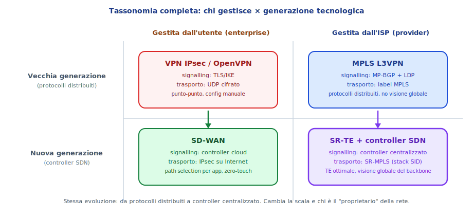
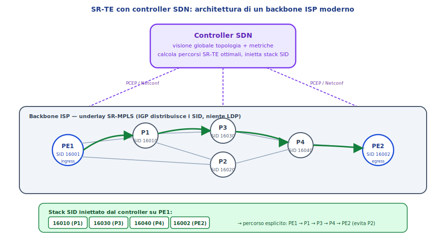
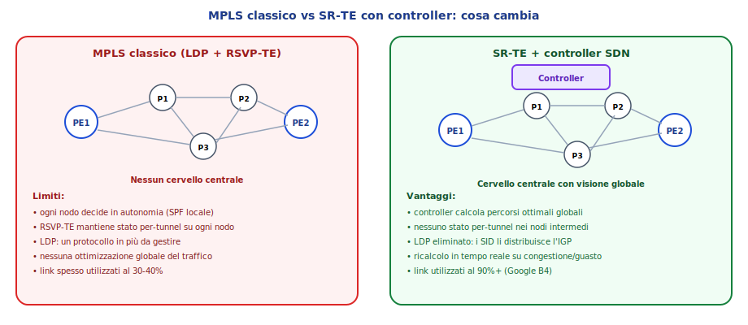

# SDN per ISP: Segment Routing e controller centralizzato

> **Target**: 5ª ITI Informatico
> **Prerequisiti**: dispense MPLS L3VPN, VXLAN+EVPN, SD-WAN. Concetti di IGP, BGP, label MPLS, overlay/underlay.

---

## 1. Il pezzo mancante nella tassonomia

Nelle dispense precedenti abbiamo visto l'evoluzione delle reti overlay su due assi: il **livello** (L2/L3) e la **scala** (LAN, datacenter, WAN). Ma c'era un'asimmetria nella casella "nuova generazione":

- Lato **enterprise**, l'evoluzione è chiara: dalla VPN IPsec manuale a **SD-WAN** con controller centralizzato.
- Lato **ISP**? MPLS L3VPN resta la tecnologia dominante, ma sta evolvendo con la stessa logica SDN. La domanda legittima è: **esiste un "SD-WAN dell'ISP"?**

La risposta è sì, e si chiama **Segment Routing Traffic Engineering con controller SDN** (SR-TE + SDN controller).

La matrice si legge così:

| | **Gestita dall'enterprise** | **Gestita dall'ISP** |
|---|---|---|
| **Vecchia generazione** (distribuita) | VPN IPsec punto-punto | MPLS L3VPN (LDP + RSVP-TE + MP-BGP) |
| **Nuova generazione** (SDN) | SD-WAN | SR-TE + controller SDN |

In entrambe le colonne, l'evoluzione è **la stessa**: si passa da protocolli distribuiti che convergono autonomamente a un **controller centralizzato** che ha visione globale della rete e calcola i percorsi ottimali. Cambia solo chi è il "proprietario": l'enterprise per SD-WAN, l'ISP per SR-TE.

> 💡 **L'analogia che chiude il cerchio**: SD-WAN sta alla VPN IPsec come SR-TE sta a MPLS L3VPN. In entrambi i casi, un cervello centrale sostituisce (o affianca) decisioni distribuite.

---

## 2. Cosa non funzionava: i limiti del control plane MPLS classico

Per capire il valore di SR-TE, serve ricordare come funziona il control plane nel backbone di un ISP con MPLS classico.

### 2.1 Tre protocolli in tandem

Come visto nella dispensa MPLS:

- **OSPF/IS-IS** (IGP): distribuisce la topologia interna, ogni router conosce i link e i costi e calcola lo shortest path (SPF).
- **LDP**: si appoggia all'IGP e distribuisce le label transport hop-by-hop.
- **MP-BGP VPNv4**: distribuisce le rotte cliente e le label VPN tra PE.

Funziona, ma **ogni nodo decide il percorso in modo autonomo e locale**: ciascun router esegue il proprio calcolo SPF (Shortest Path First), sceglie il next-hop e la label di conseguenza. Nessuno ha la visione globale di come il traffico si distribuisce sull'intera rete.

### 2.2 Traffic Engineering con RSVP-TE: l'evoluzione intermedia

Per fare traffic engineering (TE), cioè per dire "questo flusso deve passare per questa sequenza di nodi, non per lo shortest path", si aggiungeva **RSVP-TE**: un protocollo che stabilisce **tunnel espliciti** (LSP con percorso vincolato) riservando risorse su ogni nodo attraversato.

RSVP-TE funziona, ma ha un costo operativo alto:

- **Ogni tunnel richiede stato su tutti i nodi intermedi**: se ho 1000 tunnel TE, ogni P router deve mantenere 1000 voci di stato. Scarsa scalabilità.
- **Tre protocolli sovrapposti** (IGP + LDP + RSVP-TE): complessità operativa, interazioni non banali, debug difficile.
- **Decisioni ancora locali**: anche con RSVP-TE, il percorso è scelto dall'head-end del tunnel (il PE di ingresso) sulla base del suo calcolo locale. Non c'è un'entità che vede tutti i flussi contemporaneamente e ottimizza l'insieme.
- **Utilizzo dei link tipicamente basso**: senza una visione d'insieme, i router tendono a concentrare il traffico sugli shortest path, lasciando inutilizzati i link alternativi. Tipicamente i backbone MPLS tradizionali operano al **30-40% di utilizzo medio** — il resto è capacità sprecata.

---

## 3. La soluzione: Segment Routing + controller SDN

L'architettura moderna che sta sostituendo MPLS classico nei nuovi backbone ISP si basa su due componenti.

### 3.1 Segment Routing (SR): il data plane semplificato

Segment Routing, già introdotto nell'appendice della dispensa MPLS, cambia radicalmente il data plane:

- **Elimina LDP**: le label (chiamate **SID**, Segment Identifier) sono distribuite direttamente dall'**IGP esteso** (OSPF-SR o IS-IS-SR). Ogni router annuncia il proprio Node SID insieme alle normali informazioni di topologia. Un protocollo in meno.
- **Elimina lo stato nei nodi intermedi**: il PE di ingresso impila nello stack del pacchetto una **lista ordinata di SID** (un "programma" di istruzioni). Ogni nodo intermedio legge il SID in cima, esegue l'istruzione (tipicamente: forwarding verso quel nodo), lo rimuove dallo stack e passa al successivo. **Non deve mantenere alcuno stato per-tunnel**: tutto è codificato nel pacchetto stesso.
- **Source routing**: la sorgente (il PE di ingresso) decide l'intero percorso. I nodi intermedi non decidono nulla: eseguono.

Esempio di stack SID: `[16010, 16030, 16040, 16002]` significa "vai a P1 (SID 16010), poi a P3 (16030), poi a P4 (16040), poi a PE2 (16002)". Il pacchetto porta con sé il suo itinerario.

### 3.2 Controller SDN: il cervello centralizzato

Sopra il data plane SR gira un **controller SDN** che ha:

- **Visione globale della topologia**: riceve da tutti i nodi (via BGP-LS, LLDP, telemetria) la mappa completa dei link, dei costi, delle metriche (latenza, banda, utilizzazione).
- **Conoscenza di tutti i flussi attivi**: sa quanto traffico c'è su ogni tunnel, su ogni link.
- **Capacità di calcolare percorsi ottimali globali**: non shortest path locale, ma distribuzione ottimale del traffico sull'intera rete, bilanciando i link e rispettando vincoli (latenza massima, banda minima, diversità di percorso).

Quando serve un tunnel TE, il controller calcola il percorso migliore, lo traduce in uno **stack di SID**, e lo **inietta nel PE di ingresso** tramite protocolli come **PCEP** (Path Computation Element Protocol) o **Netconf/YANG**.

Il PE riceve l'istruzione "per questo servizio, impila questi SID" e la esegue. I nodi intermedi non sanno nemmeno che c'è un controller: vedono arrivare pacchetti con SID e li eseguono.

### 3.3 Cosa cambia concretamente rispetto a MPLS classico

| Aspetto | MPLS classico | SR-TE + controller |
|---|---|---|
| **Protocolli nel control plane** | IGP + LDP + RSVP-TE + MP-BGP | IGP-SR + MP-BGP + controller |
| **Numero di protocolli** | 4 | 2 + controller |
| **Stato nei nodi intermedi** | Per-tunnel (RSVP-TE) | Zero (source routing) |
| **Decisione del percorso** | Locale (SPF su ogni nodo) | Globale (controller) |
| **Traffic engineering** | RSVP-TE, complesso | Stack SID, semplice |
| **Utilizzazione dei link** | 30-40% tipico | 90%+ possibile |
| **Reazione a congestione/guasto** | Riconvergenza distribuita | Ricalcolo centralizzato + fast reroute SR |

> 🔑 **La sintesi**: SR semplifica il data plane (meno protocolli, zero stato intermedio). Il controller centralizzato ottimizza il control plane (visione globale, decisioni migliori). Insieme, danno all'ISP la stessa agilità e visibilità che SD-WAN dà all'enterprise.

---

## 4. Caso di studio: Google B4

L'esempio più noto e influente di backbone SDN è **B4**, la rete WAN privata di Google, pubblicata nel 2013 in un paper che ha fatto storia nel networking.

### 4.1 Cos'è B4

B4 è la rete che collega i datacenter Google tra loro (non è la rete che serve gli utenti, quella si chiama G-Cache/GGC e usa BGP tradizionale verso gli ISP). B4 porta traffico interno: replicazione dati, backup, sincronizzazione tra datacenter.

### 4.2 Il problema di Google

I datacenter Google generano traffico **prevedibile e classificabile**: sanno in anticipo quali flussi hanno priorità (replicazione dello storage critico vs backup notturno vs aggiornamenti batch). Con un backbone tradizionale, i link più corti erano saturi e quelli lunghi sottoutilizzati. Google stava comprando capacità extra per gestire picchi su path inefficienti.

### 4.3 L'architettura

Google ha costruito B4 con un approccio radicale:

- **Data plane**: switch custom con hardware semplificato (chip merchant silicon, non ASIC proprietari), controllati via **OpenFlow**. Gli switch non eseguono protocolli di routing tradizionali: ricevono le forwarding table direttamente dal controller.
- **Control plane**: un **controller centralizzato** (basato su Onix, un framework SDN di Google) che ha la visione completa della topologia e di tutto il traffico. Calcola la distribuzione ottimale dei flussi e programma le tabelle degli switch.
- **Al bordo**: dove B4 si affaccia verso Internet e verso gli ISP, Google usa **BGP tradizionale**. Il confine SDN/BGP sta sugli edge router.

### 4.4 I risultati

I risultati pubblicati da Google sono stati impressionanti:

- **Utilizzazione media dei link: 90-95%**, contro il 30-40% tipico dei backbone tradizionali. A parità di capacità fisica, Google trasporta il **doppio o triplo** del traffico.
- **Costi hardware ridotti**: gli switch OpenFlow custom costano una frazione degli chassis MPLS tradizionali (Cisco, Juniper).
- **Reazione ai guasti**: il controller ricalcola i percorsi in pochi secondi e riprogramma gli switch. Non deve aspettare la riconvergenza di IGP + LDP + RSVP-TE.

### 4.5 L'impatto sull'industria

B4 ha dimostrato che il modello SDN funziona a scala planetaria. L'industria non ha copiato OpenFlow alla lettera (troppo radicale per la maggior parte degli ISP, che hanno investimenti enormi in hardware MPLS), ma ha adottato il principio del **controller centralizzato sopra Segment Routing**, che è un compromesso pragmatico: data plane MPLS (hardware esistente), control plane SDN (software nuovo).

Oggi i maggiori vendor propongono soluzioni che seguono questo modello: Cisco Crosswork con SR-TE, Nokia NSP, Juniper Paragon Pathfinder, Huawei NCE. Tutti implementano controller che calcolano percorsi SR ottimali e li iniettano nei PE.

> 💡 **Google B4 sta a SR-TE come il primo iPhone sta agli smartphone**: non è l'unica implementazione possibile, ma è il caso che ha dimostrato al mondo che il modello funziona e ha accelerato l'adozione.

---

## 5. Riepilogo: la convergenza verso il controller

Se guardiamo il panorama completo, la tendenza è univoca in tutti i domini:

| Dominio | Vecchio control plane | Nuovo control plane | Cosa resta uguale |
|---|---|---|---|
| **LAN** | STP distribuito | controller SDN (es. Cisco DNA) | Ethernet |
| **Datacenter** | Flood-and-learn | MP-BGP EVPN (o controller) | VXLAN |
| **WAN enterprise** | Config manuale VPN | Controller SD-WAN | IPsec |
| **WAN ISP** | LDP + RSVP-TE distribuiti | Controller SDN + SR | MPLS / SR-MPLS |

In tutti i casi il **data plane** (chi trasporta i bit) cambia poco o nulla: Ethernet resta Ethernet, MPLS resta MPLS, IPsec resta IPsec. Quello che cambia è **il cervello che decide i percorsi**: da distribuito e autonomo a centralizzato e globale.

> 🎯 **Take-away finale**: l'evoluzione del networking moderno non è tanto nel "come trasportiamo i bit" (quello è relativamente stabile), ma nel **"chi decide dove vanno i bit"**. La risposta, ovunque, sta convergendo verso: un controller con visione globale.

---

## 6. Glossario rapido

- **SR (Segment Routing)** — architettura di forwarding in cui la sorgente specifica il percorso come lista di segmenti (SID).
- **SID (Segment Identifier)** — etichetta che rappresenta un'istruzione (vai al nodo X, usa il link Y, applica la policy Z).
- **Node SID** — SID che identifica un nodo specifico (es. un PE o un P). Distribuito dall'IGP.
- **SR-TE** — Segment Routing Traffic Engineering: uso di stack SID per forzare percorsi specifici.
- **SR-MPLS** — Segment Routing con data plane MPLS (i SID sono codificati come label MPLS).
- **SRv6** — Segment Routing con data plane IPv6 (i SID sono indirizzi IPv6). Alternativa emergente.
- **PCEP** — Path Computation Element Protocol. Protocollo con cui il controller inietta percorsi nei PE.
- **BGP-LS** — BGP Link-State. Estensione BGP per esportare la topologia IGP verso il controller.
- **OpenFlow** — protocollo SDN radicale: il controller programma direttamente le tabelle di forwarding degli switch.
- **B4** — WAN privata di Google, primo esempio su scala globale di backbone SDN.
- **Merchant silicon** — chip di rete standard (Broadcom, Intel), non custom, usati nei white-box switch.
- **SASE** — Secure Access Service Edge (lato enterprise, non ISP).

---

*Riferimenti: RFC 8402 (Segment Routing Architecture), RFC 5440 (PCEP), Jain et al. "B4: Experience with a Globally-Deployed Software Defined WAN" (SIGCOMM 2013).*
