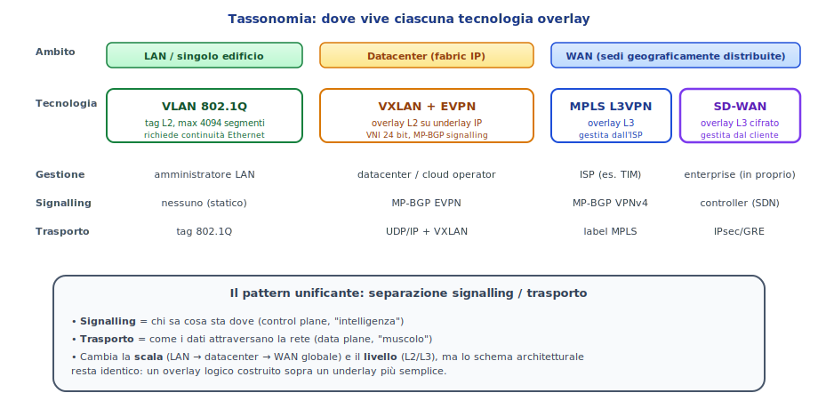
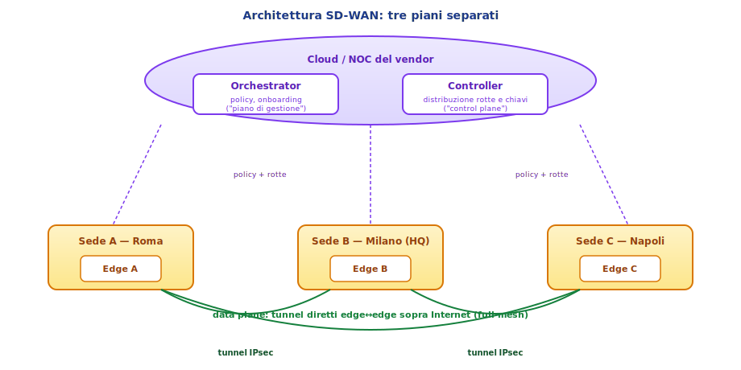
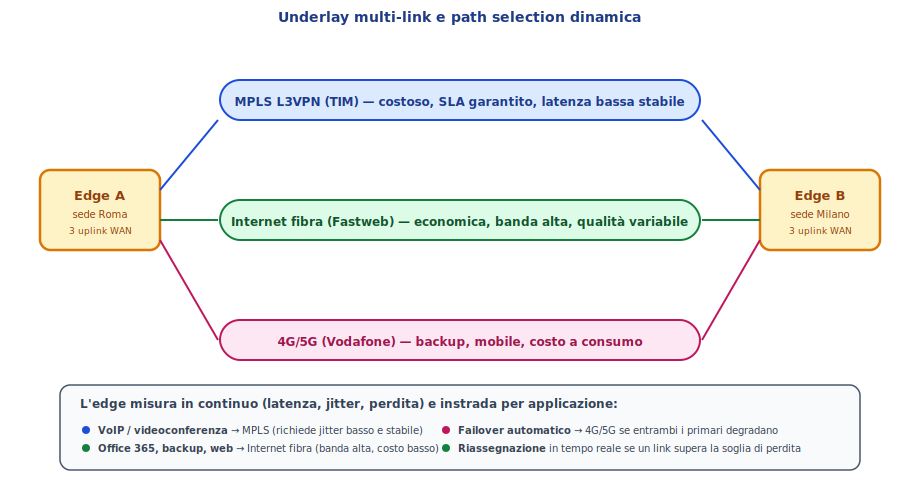

# SD-WAN: dispensa di approfondimento

> **Target**: 5ª ITI Informatico
> **Prerequisiti**: VPN IPsec, MPLS L3VPN, BGP, concetto di overlay/underlay, dispense MPLS L3VPN e VXLAN+EVPN.

---

## 1. Tassonomia: dove vive ciascuna tecnologia

Prima di entrare in SD-WAN è utile collocarla nel quadro complessivo, perché è facile confonderla con tecnologie vicine. Tutte le soluzioni che stiamo studiando (VLAN, MPLS L3VPN, VXLAN+EVPN, SD-WAN) seguono lo stesso **pattern architetturale**: un **overlay logico** costruito sopra un **underlay più semplice**, con una qualche forma di **signalling** che distribuisce le informazioni necessarie. Quello che cambia è **la scala**, **il livello** (L2 o L3) e **chi gestisce il servizio**.

Le quattro tecnologie viste finora si possono leggere così:

- **VLAN 802.1Q** — overlay L2 minimale, tag dentro il frame Ethernet, dominio LAN, gestita dall'amministratore di rete locale. Nessun signalling vero (è statica).
- **VXLAN + EVPN** — overlay L2 sopra IP, dominio datacenter, gestita dal datacenter operator. Signalling con MP-BGP EVPN.
- **MPLS L3VPN** — overlay L3, dominio WAN su backbone dell'ISP, gestita dall'ISP. Signalling con MP-BGP VPNv4.
- **SD-WAN** — overlay L3 cifrato, dominio WAN su Internet pubblica (più eventuali altri link), **gestita dall'enterprise stessa**. Signalling con un controller centralizzato.

> 💡 **Punto chiave**: SD-WAN **non è alternativa a VXLAN** (operano su scale completamente diverse: WAN vs datacenter), ed è **alternativa parziale a MPLS L3VPN** (operano sulla stessa scala WAN, ma con filosofie diverse — provider-managed vs customer-managed).

Nei datacenter VXLAN+EVPN; tra le sedi aziendali SD-WAN o MPLS L3VPN o entrambi. Spesso un'azienda usa tutte e tre le tecnologie insieme, ciascuna nel suo dominio.

---

## 2. Il problema da risolvere: la WAN aziendale tradizionale

Per capire perché SD-WAN esiste, serve capire com'era la WAN aziendale prima.

### 2.1 Il modello classico hub-and-spoke con MPLS

Storicamente, un'azienda con più sedi comprava un servizio **MPLS L3VPN** dall'ISP per interconnetterle. Tipicamente:

- **HQ** (sede centrale) e **datacenter** erano lo "hub".
- Le **filiali** (spoke) si connettevano all'HQ via MPLS.
- **Tutto il traffico Internet delle filiali passava per l'HQ** (per essere ispezionato dal firewall centrale prima di uscire).

Funzionava bene quando le applicazioni erano **on-premise**: le filiali parlavano coi server in HQ via MPLS, latenza prevedibile, qualità garantita. Però c'erano costi e rigidità importanti:

- **MPLS è costoso**: tipicamente €100-500/mese per una sede a banda modesta, fino a migliaia per banda alta. Si paga al megabit.
- **Provisioning lento**: aggiungere una sede richiede settimane (ordine al carrier, posa, configurazione).
- **Banda limitata**: per contenere i costi si comprano pochi Mbps. Sufficienti negli anni 2000, insufficienti oggi.
- **Lock-in**: cambiare ISP significa rifare tutto.

### 2.2 Cosa è cambiato: il cloud rompe lo schema

Con l'esplosione del **cloud** (Office 365, Salesforce, Dropbox, AWS...) il modello hub-and-spoke è entrato in crisi:

- Le applicazioni non stanno più in HQ, stanno **su Internet**.
- Far passare il traffico Office 365 da una filiale di Roma all'HQ di Milano e **poi** uscire su Internet aggiunge **latenza inutile** (tromboning).
- La banda MPLS è insufficiente per video, backup cloud, sincronizzazioni.
- Microsoft stessa raccomanda di mandare Office 365 **direttamente su Internet** dalla filiale, non attraverso l'HQ.

Servirebbe quindi: **uscita Internet diretta da ciascuna sede**, **backup robusto se un link cade**, **tunnel cifrati tra le sedi quando serve adiacenza privata**, **gestione semplice** anche con centinaia di sedi, **costi bassi**. È esattamente quello che SD-WAN propone.

---

## 3. SD-WAN: l'idea centrale

**SD-WAN** (Software-Defined WAN) è un overlay enterprise di tunnel cifrati tra dispositivi di edge nelle sedi, gestito da un **controller centralizzato** in stile SDN. L'idea si articola in tre punti.

**Primo**: in ogni sede c'è un **edge device** (router/appliance specializzato, fisico o virtuale) che fa da gateway. Ha **più uplink WAN contemporaneamente**: tipicamente Internet fibra, eventualmente MPLS legacy, eventualmente 4G/5G come backup.

**Secondo**: tra gli edge si stabiliscono **tunnel cifrati** (IPsec, o varianti proprietarie) **direttamente sopra Internet** — niente più passaggio obbligato dall'HQ, le sedi si parlano tra loro in full-mesh logico.

**Terzo, e qui sta la novità**: l'edge **non sceglie un solo path una volta per tutte**. Misura in continuo la qualità di ogni uplink (latenza, jitter, perdita di pacchetti) e **instrada ciascun flusso applicativo sul path migliore in quel momento**, secondo policy decise centralmente. Se un link degrada, il traffico viene spostato automaticamente.

> 🔑 **In una frase**: SD-WAN = overlay IPsec multi-link, gestito da un controller, con scelta del path **per applicazione e in tempo reale** in base alla qualità misurata.

---

## 4. Architettura: i tre piani

L'architettura SD-WAN segue il modello **SDN** classico, con tre piani logici ben separati. Questa separazione è una delle ragioni per cui il modello scala bene anche con centinaia di sedi.

### 4.1 Management plane — Orchestrator

L'**orchestrator** è il portale di gestione (tipicamente in cloud, gestito dal vendor) dove l'amministratore configura **policy**, **template di sede**, **regole applicative**, e da cui fa l'**onboarding** (zero-touch provisioning) di nuovi edge. È quello con cui interagisce l'umano: una console web.

### 4.2 Control plane — Controller

Il **controller** distribuisce agli edge le **rotte**, le **identità crittografiche**, le **chiavi** per stabilire i tunnel, e le **policy operative**. Funzionalmente è l'analogo del **Route Reflector** in MP-BGP, ma con un protocollo proprietario (o BGP esteso, a seconda del vendor) e con l'aggiunta della distribuzione di chiavi crittografiche.

Importante: il controller **non sta sul percorso dei dati**. È solo cervello, non muscolo. Se il controller cade temporaneamente, gli edge continuano a funzionare con l'ultima configurazione ricevuta.

### 4.3 Data plane — Edge device

Gli **edge** sono i dispositivi nelle sedi. Sono loro che:

- Stabiliscono i **tunnel IPsec** verso gli altri edge.
- **Misurano** la qualità degli uplink in tempo reale.
- Applicano le **policy applicative**: classificano il traffico (DPI, deep packet inspection) e lo instradano sul path giusto.
- Eseguono funzioni di sicurezza locali (firewall, IDS/IPS, talvolta anti-malware).

> 💡 **Parallelo con quanto già visto**: orchestrator e controller insieme svolgono il ruolo che in MPLS L3VPN è svolto da MP-BGP + Route Reflector. Gli edge sono l'analogo dei PE: stanno al confine tra rete cliente e rete di trasporto. La grande differenza è che qui **il trasporto è Internet pubblica**, non un backbone MPLS dedicato.

---

## 5. Underlay multi-link e path selection dinamica

Questa è la parte più caratteristica di SD-WAN, quella che lo distingue da una "semplice VPN IPsec full-mesh".

### 5.1 L'underlay è un insieme di link eterogenei

Ogni edge SD-WAN ha tipicamente **più uplink contemporaneamente**, di natura diversa:

- **Fibra Internet** (es. Fastweb business, FTTH consumer, ecc.) — banda alta, costo basso, qualità variabile.
- **MPLS L3VPN legacy** (es. TIM business) — costoso ma con SLA garantito, latenza bassa stabile.
- **4G/5G** (es. Vodafone) — backup, mobile, costo a consumo.

Tutti i link sono attivi simultaneamente: SD-WAN non li vede come "primario + backup", li vede come un **pool di path disponibili**, ciascuno con caratteristiche misurate momento per momento.

### 5.2 Misurazione continua

Su ogni tunnel attivo, l'edge invia **probe periodici** (BFD, ICMP, o probe proprietari) verso l'edge remoto e misura tre grandezze chiave:

- **Latenza** (RTT).
- **Jitter** (variazione della latenza).
- **Loss** (percentuale di pacchetti persi).

Queste misure popolano una tabella interna che dice, per ciascun path verso ciascuna destinazione, qual è la qualità attuale. Tipicamente le misure si aggiornano ogni pochi secondi.

### 5.3 Policy applicative

Sul controller l'amministratore definisce regole del tipo:

- **VoIP / videoconferenza** → richiede jitter < 30ms e loss < 1% → preferisci MPLS, fallback su fibra se MPLS si degrada.
- **Office 365 / Microsoft Teams** → preferisci fibra (banda alta), accettabile MPLS se fibra è satura.
- **Backup notturno** → usa solo fibra, mai MPLS (per non sprecare banda costosa).
- **Tutto il resto** → fibra primario, MPLS secondario, LTE ultima risorsa.

L'edge classifica ogni flusso in tempo reale (riconoscimento applicativo via DPI: distingue Teams da YouTube anche se entrambi sono HTTPS) e applica la policy corrispondente, scegliendo il path che soddisfa i requisiti.

### 5.4 Cambio di path in corsa

Se durante una conversazione VoIP il link MPLS comincia a perdere pacchetti, l'edge **sposta automaticamente** la sessione sul path alternativo che soddisfa ancora i requisiti, senza intervento umano e idealmente senza che l'utente se ne accorga. Alcuni vendor usano tecniche di **packet duplication** (manda lo stesso pacchetto su due path simultaneamente, scarta il duplicato all'arrivo) per applicazioni critiche.

> 🎯 **Take-away**: in MPLS L3VPN il path è determinato dall'IGP/BGP del provider e l'utente subisce le sue scelte. In SD-WAN il path è scelto **dall'edge del cliente in tempo reale**, in base alla qualità misurata e alle regole di business. Questa è l'innovazione vera, più ancora dell'overlay IPsec.

---

## 6. SD-WAN vs MPLS L3VPN: quando uno, quando l'altro

Visto il sovrapporsi parziale di ambito, vale la pena un confronto rapido.

| Aspetto | MPLS L3VPN | SD-WAN |
|---|---|---|
| **Costo** | Alto (€/Mbps × sedi) | Basso (Internet commodity) |
| **Banda disponibile** | Limitata da contratto | Tutta quella di Internet |
| **SLA** | Garantito dall'ISP | Best-effort + path selection |
| **Provisioning nuova sede** | Settimane | Ore (zero-touch) |
| **Gestione policy** | CLI sui PE / supporto ISP | Centralizzata via orchestrator |
| **Lock-in** | Forte (un singolo ISP) | Basso (Internet generica) |
| **Sicurezza tunnel** | Isolamento amministrativo | Cifratura IPsec end-to-end |
| **Adatto a cloud-first** | No (tromboning) | Sì (uscita locale) |

In molte aziende oggi la scelta è **SD-WAN come default + MPLS L3VPN come uplink premium nei luoghi dove serve SLA stretto**. Lo SD-WAN sfrutta entrambi i link e instrada il traffico critico sul MPLS, il resto su Internet. È un approccio ibrido che combina i vantaggi di entrambi.

---

## 7. Panoramica dei vendor principali

Il mercato SD-WAN è dominato da pochi vendor, ciascuno con una propria filosofia. Vale la pena conoscerli almeno di nome.

- **Cisco SD-WAN (ex Viptela)** — soluzione storica, controller cloud, molto diffusa nelle grandi enterprise. Cisco ha acquisito Viptela nel 2017. Tunnel su DTLS/IPsec, control plane proprietario (OMP, simile a BGP).
- **Cisco Meraki SD-WAN** — alternativa di Cisco rivolta al mid-market, gestione semplificata via cloud Meraki, tipicamente preferita da aziende più piccole.
- **VMware VeloCloud** (oggi parte di Broadcom dopo l'acquisizione VMware) — storicamente molto forte sul cloud-first, gateway cloud globali per uscita ottimizzata verso SaaS.
- **Fortinet Secure SD-WAN** — integra SD-WAN e firewall in un unico appliance (FortiGate). Filosofia: la sicurezza è parte integrante, non un add-on. Molto popolare per il rapporto prezzo/funzionalità.
- **Palo Alto Prisma SD-WAN (ex CloudGenix)** — orientato al concetto di "app-defined WAN", forte integrazione con la suite di sicurezza Prisma.
- **Versa Networks** — vendor indipendente, spesso scelto da operatori per offrire SD-WAN come servizio gestito.
- **HPE Aruba EdgeConnect (ex Silver Peak)** — particolarmente noto per le tecniche di ottimizzazione WAN (deduplicazione, compression).

Tutti i vendor moderni convergono verso il modello **SASE** (Secure Access Service Edge), che è SD-WAN + un insieme di funzioni di sicurezza erogate dal cloud (Secure Web Gateway, CASB, Zero Trust Network Access, firewall as-a-service). L'idea SASE è che l'edge dell'azienda non finisce più nella sede fisica, ma in **punti di presenza cloud distribuiti globalmente** del vendor, attraverso cui passa tutto il traffico ed è ispezionato. È la direzione in cui sta andando il settore.

---

## 8. Il pattern unificante: ricapitolazione

Chiudiamo tornando alla tassonomia iniziale, ora con tutti gli strumenti per leggerla a fondo.

| Tecnologia | Signalling | Trasporto | Scala | Chi gestisce |
|---|---|---|---|---|
| **OpenVPN punto-punto** | TLS handshake | UDP cifrato | 2 nodi | Utente/admin |
| **VLAN 802.1Q** | (statico) | Tag Ethernet | LAN | Admin LAN |
| **VXLAN + EVPN** | MP-BGP EVPN | UDP/IP + VXLAN | Datacenter | DC operator |
| **MPLS L3VPN** | MP-BGP VPNv4 | Label MPLS | WAN ISP | ISP |
| **SD-WAN** | Controller (SDN) | IPsec/GRE su Internet | WAN enterprise | Enterprise |

Tutte rispondono allo stesso bisogno fondamentale: **far convivere più reti logiche su una stessa infrastruttura fisica**, con isolamento e scalabilità. Cambiano la scala (da una stanza a un continente), il livello (L2 o L3), il proprietario (utente, datacenter, ISP, enterprise), ma lo schema architetturale resta lo stesso. È uno dei modelli di design più riusciti del networking moderno.

> 💡 Quando incontrerai una nuova tecnologia di rete in futuro, prova ad applicare la stessa griglia: **chi è l'overlay? chi è l'underlay? chi fa signalling? chi fa trasporto? a che scala?** Probabilmente la riconoscerai come una variante di un pattern che già conosci.

---

## 9. Glossario rapido

- **SD-WAN** — Software-Defined WAN. Overlay enterprise di tunnel cifrati gestito da controller.
- **Edge / CPE SD-WAN** — dispositivo nella sede che termina i tunnel e applica le policy.
- **Orchestrator** — portale di gestione (management plane).
- **Controller** — distribuisce rotte e chiavi (control plane).
- **Underlay** — l'insieme dei link WAN fisici (Internet, MPLS, LTE...).
- **Overlay** — i tunnel cifrati tra edge.
- **Path selection** — scelta dinamica del link migliore per flusso applicativo.
- **DPI** — Deep Packet Inspection, riconoscimento applicativo.
- **Zero-touch provisioning** — onboarding di un edge senza configurazione manuale on-site.
- **Tromboning** — passaggio inutile di traffico cloud attraverso l'HQ aziendale.
- **SASE** — Secure Access Service Edge: SD-WAN + sicurezza erogata dal cloud.

---

*Riferimenti: RFC 4301 (IPsec), RFC 8192 (Service Function Chaining), MEF 70 (SD-WAN Service Attributes).*
