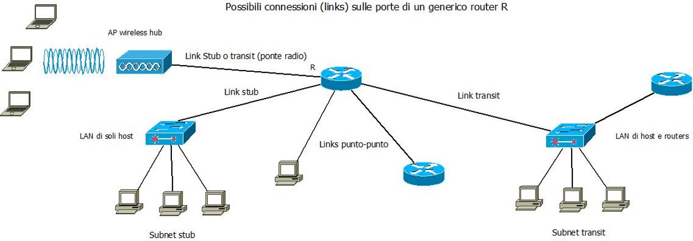

>[Torna a albero apparati attivi](albapparatiattivi.md)

- [Dettaglio architettura Zigbee](archzigbee.md)
- [Dettaglio architettura BLE](archble.md)
- [Dettaglio architettura WiFi infrastruttura](archwifi.md)
- [Dettaglio architettura WiFi mesh](archmesh.md) 
- [Dettaglio architettura LoraWAN](lorawanclasses.md) 


### **Link che generano subnet**

- Il centro stella è sempre un router da cui si dirama una subnet a partire da ogni suo link fisico
- La possibilità di realizzare subnet mappate su LAN (stub o transit) può essere estesa anche alle VLAN
- La novità è che adesso da un router si può diramare una subnet anche a partire da un link virtuale
- Poiché più link virtuali possono condividere uno stesso collegamento fisico, esiste la possibilità di dislocare le subnet a «macchia di leopardo», cioè in modo che i loro dispositivi siano sparsi potenzialmente ovunque all’interno dell’infrastruttura fisica della rete (cade il vincolo di vicinanza fisica dei dispositivi di una subnet).



### **Modalità di segmentazione**

La **segmentazione** di una rete LAN parte sempre da un **router** che, essendo un **dispositivo L3**, è in grado di **bloccare** le trame MAC provenienti da dispositivi di livello inferiore come gli SW e i Bridge ad L2 oppure gli Hub ad L1.

Un router **reimbusta** le trame MAC su nuovi pacchetti IP ogni volta che effettua un **inoltro** su una porta di uscita. L'operazione di **inoltro** è **vincolata** ad alcune limitazioni che possono essere utili per la sicurezza:
- la **presenza di una rotta** nella routing table del router per l'indirizzo di destinazione del pacchetto. In **caso contrario**, il pacchetto viene **scartato**.
- la **presenza di una o più ACL** (Access Control List) che filtrino l'accesso da e verso alcune porte in base ad alcuni **criteri**. Ad ogni **porta** corrisponde un **link** e ad ogni link corrisponde univocamente una **subnet**. Le **ACL** sono pertanto **liste di regole** che permettono o bloccano il **passaggio** di un pacchetto IP da una **subnet ad un'altra**. Poichè le subnet tipicamente raggruppano utenti, si può dedurre che, le ACL basate sugli indirizzi IP, sono un metodo efficace per **limitare**, **permettere** o **bloccare** del tutto il traffico tra gruppi di utenti.
- 


- Una **VLAN** è una infrastruttura LAN speciale in grado di dividere una stessa LAN fisica in gruppi di host **separati logicamente** ma non fisicamente 
- Le LAN tradizionali, per dividere gli utenti in gruppi, devono utilizzare **LAN fisiche differenti**, cioè disposte in **luoghi diversi**
- Raggruppare logicamente significa scegliere un criterio di raggruppamento. Nelle LAN normali il **criterio di raggruppamento** è la **vicinanza fisica** degli host.
- Le VLAN invece organizzano i raggruppamenti solo in base alla **funzione** o al tipo di **servizio** (e non in base alla posizione nello spazio):
     - persone dello stesso dipartimento che sono dislocate su più sedi fisicamente separate (collegare logicamente host fisicamente separati)
     - Persone nello stesso luogo che devono essere selezionate per confluire in dipartimenti separati (separare logicamente host fisicamente collegati)

### **Segmentazione fisica**

- Le subnet sono generate sul router da due link fisici collegati a interfacce IP fisicamente distinte 
- Sui link fisici si diramano LAN fisicamente separate
- Subnet mappate su LAN con infrastruttura fisica distinta e quindi allocabili solo in ambienti diversi
- Subnets spazialmente allocate che comprendono gruppi di host separati in base alla dislocazione fisica degli apparati di rete


- Porte di uno stesso switch appartengono sempre allo stesso gruppo di macchine (quello della funzione F1 o F2)
- E’ necessaria la separazione fisica degli ambienti per dividere i gruppi F1 e F2
- Sul router ogni link fisico genera una subnet che si mappa 1:1 su una sottostante LAN fisica

#### **Esigenza di filtraggio: negare ad un PC della subnet officina di entrare nella subnet ufficio**

<table>
<tr><td> Router: soluzione senza le VLAN </td><td> Router: soluzione con le VLAN </td></tr>
<tr><td> 
    
```C++                   
  !Definizione lista di regole (blacklist)
  (config)# access-list 101 deny 10.0.2.0 0.0.0.255
  (config)# access-list 101 permit any
  ! Selezione interfaccia eth2
  (config)# interface eth2
  !Applicazione in ingress su eth2
  (config-if)# ip access-group 101 in
  (config-if)# exit
  ``` 
    
</td>
<td>

```C++     
! Definizione lista di regole (blacklist)
(config)# access-list 101 deny 10.0.2.0 0.0.0.255
(config)# access-list 101 permit any 
! Selezione interfaccia vlan 20
(config)# GigabitEthernet0/0.20 
! Applicazione in ingress su vlan 20
(config-if)# ip access-group 101 in
(config-if)# exit
```
    
</td>
</tr>
</table>

### **Segmentazione logica**

- Le subnet sono generate sul router da due link virtuali collegati a interfacce IP logicamente distinte
- Sui link virtuali si diramano LAN logicamente separate (VLAN)
- Le VLAN condividono la stessa infrastruttura fisica e quindi sono allocabili in qualunque ambiente
- Subnet mappate su LAN logiche
- Subnets delocalizzate che comprendono gruppi di host separati in base alla funzione o al servizio


- Porte di uno stesso switch possono appartenere a gruppi di macchine diverse, sia F1 che F2
- è necessaria la colorazione delle porte per distinguere i gruppi
- Sul router ogni link virtuale genera una subnet che si mappa 1:1 su una sottostante LAN logica (VLAN)

#### **Esigenza di filtraggio:**
- Si vuole consentire agli host in Marketing di avviare e stabilire una sessione TCP per gli host in Produzione.
- solo ai pacchetti TCP di risposta e a quelli di dialogo è consentito entrare nell'interfaccia vlan 20 da Produzione verso Marketing 
- Pertanto, gli host in Marketing possono aprire connessioni verso gli host in Produzione, ma gli host in Produzione non possono aprire alcuna connessione diretta verso la subnet Marketing

#### **Soluzione**
<table>
<tr><td> Router: Marketing --> Produzione </td></tr>
<tr><td> 
    
```C++                   
! Definizione lista di regole
(config)# access-list 102 permit tcp any any gt 1023 established
! Selezione interfaccia vlan20
(config)# GigabitEthernet0/0.20
! Applicazione in ingress su vlan20
(config-if)# ip access-group 102 in
``` 
    
</td>
</tr>
</table>

- Nota: established seleziona solo i pacchetti di risposta (solo flag ACK o flag RST settati)
- Nota: 1023 seleziona solo porte di destinazione di client (numerazione più alta di 1000)
- Nota: è una tecnica stateless dalla sicurezza relativa (possibile falsificazione dei flags)


### **Segmentazione fisica + logica**

- Le subnet sono generate sul router da due link virtuali collegati a interfacce IP logicamente distinte
- Sui link virtuali si diramano LAN logicamente separate (VLAN)
- Le VLAN 10 e 20 condividono la stessa infrastruttura fisica e quindi sono allocabili in qualunque ambiente
- La VLAN 30 si dirama CS con una sola dorsale fisica verso AS1 dove sono confinati tutti i suoi dispositivi
- nessun’altra dorsale logica può propagare la VLAN 30 perché nessun trunk 802.1q la possiede tra le VLAN ammesse (allowed), oltre quello verso il CS.
- Subnets delocalizzate che comprendono gruppi di host separati in base alla posizione e al servizio

#### **Esigenza di filtraggio:**
- consentire alla vlan 30 l'accesso ad Internet
- consentire alla vlan 30 l'accesso alla server farm
- non permettere l'accesso reciproco tra le vlan 30 e le vlan 10, 20
  


- Porte di uno stesso switch possono appartenere a gruppi di macchine diverse, sia F1 che F2
- è necessaria la colorazione delle porte per distinguere i gruppi
- Sul router ogni link virtuale genera una subnet che si mappa 1:1 su una sottostante LAN logica (VLAN)
- il **filtraggio** è realizzato direttamente a **sullo switch** a livello di linea L2 dall'impostazione ```allowed vlan 10, 20``` sulla porta di trunk che filtra le trame della vlan 30. Ma può anche essere realizzato sul router con una **ACL estesa**:

<table>
<tr><td> Router: negare il traffico reciproco tra ufficio produzione e ufficio marketing </td></tr>
<tr><td> 
    
```C++                   
! Creare l'ACL per bloccare il traffico tra VLAN 30 e VLAN 10
ip access-list extended BLOCK_VLAN_10_20_30
 deny ip 10.0.10.0 0.0.0.255 10.0.30.0 0.0.0.255
 deny ip 10.0.20.0 0.0.0.255 10.0.30.0 0.0.0.255
 deny ip 10.0.30.0 0.0.0.255 10.0.10.0 0.0.0.255
 deny ip 10.0.30.0 0.0.0.255 10.0.20.0 0.0.0.255
 permit ip any any

! Applicare le ACL alle interfacce VLAN
interface GigabitEthernet0/0.10
 ip access-group BLOCK_VLAN_10_20_30 in
 exit
interface GigabitEthernet0/0.20
 ip access-group BLOCK_VLAN_10_20_30 in
 exit
interface GigabitEthernet0/0.30
 ip access-group BLOCK_VLAN_10_20_30 in
 exit
``` 
    
</td>
</tr>
</table>
 
### **Esempio**

Nel contesto di un istituto scolastico che si vuole servire con una rete WiFi, si vogliono separare i **servizi di segreteria** scolastica con i suoi **server** e i suoi **impiegati** localizzati in una subnet fisicamente dislocata in una **certa area**, dai **servizi di mobilità**, dispersi a **macchia di leopardo** in tutto il comprensorio, ai docenti dotati di supporti di loro proprietà (politica Byod) con i quali eseguono le loro attività giornaliere sul registro scolastico. Si vuole consentire anche una gestione separata al traffico dei **servizi di videosorveglianza** con propri **server**, a disposizione all'interno di una subnet separata. 


La **separazione** dei gruppi di utenti **solamente** in base alla **dislocazione fisica** sarebbe evidentemente impossibile, mentre sarebbe **effettiva** la separazione mediante **VLAN** dislocate su una infrastruttura **switched**.

### **Definizione dei gruppi mediante VLAN**

La **definizione** dei gruppi si può fare con una dislocazione a **macchia di leopardo** delle **interfacce** di accesso alla diverse VLAN, aventi **ssid statici** diversi o uno unico ma **dinamico** (autenticazione 802.1X). Gli **host** possono collegarsi all'**ssid** di una certa VLAN su **ogni AP**. La loro **separazione** avviene **dopo**, su un **router** di confine collegato al core switch con un link capace di creare il **trunking** dei flussi (**intervlan routing** in modo **router on a stick**). Le **dorsali** tra i vari bridge devono essere configurate come dorsali di **trunk** (802.1Q) in modo tale che portino il traffico aggregato di **tutte le VLAN**.

Si sarebbe potuto isolare in maniera ancora **più affidabile** la rete della segreteria servendola con uno SW dedicato collegato direttamente ad una porta del router, realizzando così una separazione fisica piuttosto che una logica, sfruttando il fatto che la dislocazione fisica dei suoi utenti è confinata in un'area esclusiva. Però, poichè il controller degli AP deve risiedere nella stessa subnet degli AP da controllare, sarebbe poi nata l'esigenza di doverne installare due, uno per la segreteria ed uno per la scuola. 

L'**inconveniente** viene superato adoperando le **VLAN** e la sicurezza viene mantenuta ugualmente alta (**like wire** in pratica) grazie ai **comandi**: ```allowed vlan 1, 20, 30``` e ```allowed vlan 1, 10``` che **confinano** il traffico delle **trame MAC** relative alla LAN della **segreteria** sul solo SW dove sono collegati i suoi dispositivi. Tutte le altre dorsali non possono essere interessate da questo traffico, mentre sono tutte interessate dal traffico della **subnet amministrativa** degli AP che possono così essere gestiti da un **unico controller**.

>[Torna a albero apparati attivi](albapparatiattivi.md)

- [Dettaglio architettura Zigbee](archzigbee.md)
- [Dettaglio architettura BLE](archble.md)
- [Dettaglio architettura WiFi infrastruttura](archwifi.md)
- [Dettaglio architettura WiFi mesh](archmesh.md) 
- [Dettaglio architettura LoraWAN](lorawanclasses.md) 
