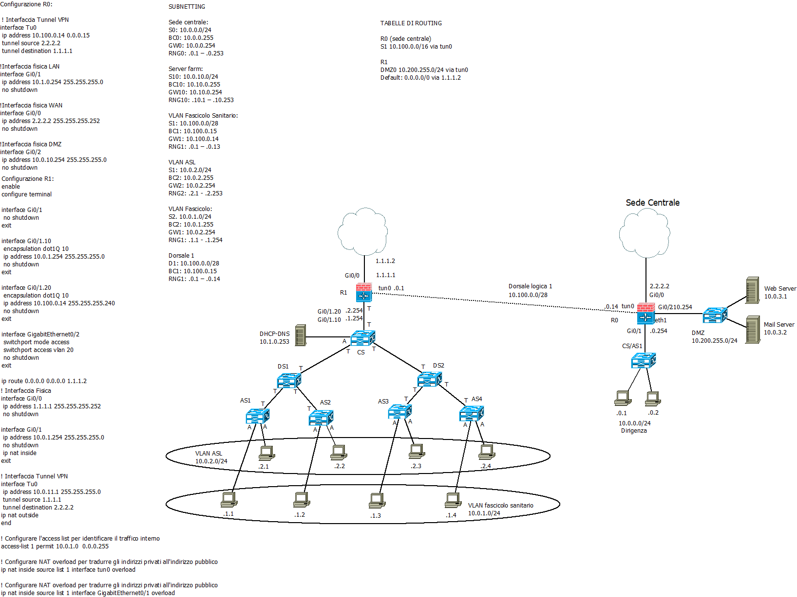
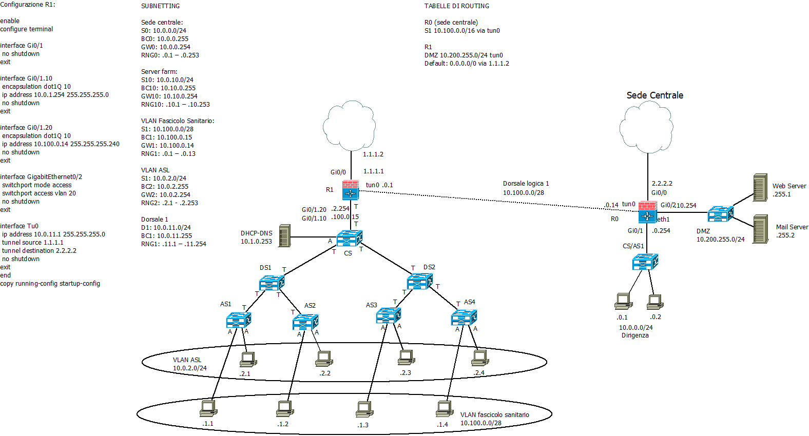

>[Torna a albero apparati attivi](albapparatiattivi.md)

- [Dettaglio architettura Zigbee](archzigbee.md)
- [Dettaglio architettura BLE](archble.md)
- [Dettaglio architettura WiFi infrastruttura](archwifi.md)
- [Dettaglio architettura WiFi mesh](archmesh.md) 
- [Dettaglio architettura LoraWAN](lorawanclasses.md) 


### **Link che generano subnet**

- Il centro stella è sempre un router da cui si dirama una subnet a partire da ogni suo link fisico
- La possibilità di realizzare subnet mappate su LAN (stub o transit) può essere estesa anche alle VLAN
- La novità è che adesso da un router si può diramare una subnet anche a partire da un link virtuale
- Poiché più link virtuali possono condividere uno stesso collegamento fisico, esiste la possibilità di dislocare le subnet a «macchia di leopardo», cioè in modo che i loro dispositivi siano sparsi potenzialmente ovunque all’interno dell’infrastruttura fisica della rete (cade il vincolo di vicinanza fisica dei dispositivi di una subnet).


### **Modalità di segmentazione**

La **segmentazione** di una rete LAN parte sempre da un **router** che, essendo un **dispositivo L3**, è in grado di **bloccare** le trame MAC provenienti da dispositivi di livello inferiore come gli SW e i Bridge ad L2 oppure gli Hub ad L1.

Un router **reimbusta** le trame MAC su nuovi pacchetti IP ogni volta che effettua un **inoltro** su una porta di uscita. L'operazione di **inoltro** è **vincolata** ad alcune limitazioni che possono essere utili per la sicurezza:
- l'**assenza di una rotta** verso la zona proibita nella routing table del router. Se l'indirizzo di destinazione del pacchetto non trova una corrispondenza (matching), il pacchetto viene **scartato**.
- la **presenza di una o più ACL** (Access Control List) che filtrino l'accesso da e verso alcune porte in base ad alcuni **criteri**. Ad ogni **porta** corrisponde un **link** e ad ogni link corrisponde univocamente una **subnet**. Le **ACL** sono pertanto **liste di regole** che permettono o bloccano il **passaggio** di un pacchetto IP da una **subnet ad un'altra**. Poichè le subnet tipicamente raggruppano utenti, si può dedurre che, le ACL basate sugli indirizzi IP, sono un metodo efficace per **limitare**, **permettere** o **bloccare** del tutto il traffico tra gruppi di utenti.
- 


- Una **VLAN** è una infrastruttura LAN speciale in grado di dividere una stessa LAN fisica in gruppi di host **separati logicamente** ma non fisicamente 
- Le LAN tradizionali, per dividere gli utenti in gruppi, devono utilizzare **LAN fisiche differenti**, cioè disposte in **luoghi diversi**
- Raggruppare logicamente significa scegliere un criterio di raggruppamento. Nelle LAN normali il **criterio di raggruppamento** è la **vicinanza fisica** degli host.
- Le VLAN invece organizzano i raggruppamenti solo in base alla **funzione** o al tipo di **servizio** (e non in base alla posizione nello spazio):
     - persone dello stesso dipartimento che sono dislocate su più sedi fisicamente separate (collegare logicamente host fisicamente separati)
     - Persone nello stesso luogo che devono essere selezionate per confluire in dipartimenti separati (separare logicamente host fisicamente collegati)

### **Segmentazione fisica**

- Le subnet sono generate sul router da due link fisici collegati a interfacce IP fisicamente distinte 
- Sui link fisici si diramano LAN fisicamente separate
- Subnet mappate su LAN con infrastruttura fisica distinta e quindi allocabili solo in ambienti diversi
- Subnets spazialmente allocate che comprendono gruppi di host separati in base alla dislocazione fisica degli apparati di rete


- Porte di uno stesso switch appartengono sempre allo stesso gruppo di macchine (quello della funzione F1 o F2)
- E’ necessaria la separazione fisica degli ambienti per dividere i gruppi F1 e F2
- Sul router ogni link fisico genera una subnet che si mappa 1:1 su una sottostante LAN fisica

#### **Esigenza di filtraggio: negare ad un PC della subnet officina di entrare nella subnet ufficio**

<table>
<tr><td> Router: soluzione senza le VLAN </td><td> Router: soluzione con le VLAN </td></tr>
<tr><td> 
    
```C++                   
  !Definizione lista di regole (blacklist)
  (config)# access-list 101 deny 10.0.2.0 0.0.0.255
  (config)# access-list 101 permit any
  ! Selezione interfaccia eth2
  (config)# interface eth2
  !Applicazione in ingress su eth2
  (config-if)# ip access-group 101 in
  (config-if)# exit
  ``` 
    
</td>
<td>

```C++     
! Definizione lista di regole (blacklist)
(config)# access-list 101 deny 10.0.2.0 0.0.0.255
(config)# access-list 101 permit any 
! Selezione interfaccia vlan 20
(config)# GigabitEthernet0/0.20 
! Applicazione in ingress su vlan 20
(config-if)# ip access-group 101 in
(config-if)# exit
```
    
</td>
</tr>
</table>

### **Segmentazione logica**

- Le subnet sono generate sul router da due link virtuali collegati a interfacce IP logicamente distinte
- Sui link virtuali si diramano LAN logicamente separate (VLAN)
- Le VLAN condividono la stessa infrastruttura fisica e quindi sono allocabili in qualunque ambiente
- Subnet mappate su LAN logiche
- Subnets delocalizzate che comprendono gruppi di host separati in base alla funzione o al servizio


- Porte di uno stesso switch possono appartenere a gruppi di macchine diverse, sia F1 che F2
- è necessaria la colorazione delle porte per distinguere i gruppi
- Sul router ogni link virtuale genera una subnet che si mappa 1:1 su una sottostante LAN logica (VLAN)

#### **Esigenza di filtraggio:**
- Si vuole consentire agli host in Marketing di avviare e stabilire una sessione TCP per gli host in Produzione.
- solo ai pacchetti TCP di risposta e a quelli di dialogo è consentito entrare nell'interfaccia vlan 20 da Produzione verso Marketing 
- Pertanto, gli host in Marketing possono aprire connessioni verso gli host in Produzione, ma gli host in Produzione non possono aprire alcuna connessione diretta verso la subnet Marketing

#### **Soluzione**
<table>
<tr><td> Router: Marketing --> Produzione </td></tr>
<tr><td> 
    
```C++                   
! Definizione lista di regole
(config)# access-list 102 permit tcp any any gt 1023 established
! Selezione interfaccia vlan20
(config)# GigabitEthernet0/0.20
! Applicazione in ingress su vlan20
(config-if)# ip access-group 102 in
``` 
    
</td>
</tr>
</table>

- Nota: established seleziona solo i pacchetti di risposta (solo flag ACK o flag RST settati)
- Nota: 1023 seleziona solo porte di destinazione di client (numerazione più alta di 1000)
- Nota: è una tecnica stateless dalla sicurezza relativa (possibile falsificazione dei flags)


### **Segmentazione fisica + logica**

- Le subnet sono generate sul router da due link virtuali collegati a interfacce IP logicamente distinte
- Sui link virtuali si diramano LAN logicamente separate (VLAN)
- Le VLAN 10 e 20 condividono la stessa infrastruttura fisica e quindi sono allocabili in qualunque ambiente
- La VLAN 30 si dirama CS con una sola dorsale fisica verso AS1 dove sono confinati tutti i suoi dispositivi
- nessun’altra dorsale logica può propagare la VLAN 30 perché nessun trunk 802.1q la possiede tra le VLAN ammesse (allowed), oltre quello verso il CS.
- Subnets delocalizzate che comprendono gruppi di host separati in base alla posizione e al servizio

#### **Esigenza di filtraggio:**
- consentire alla vlan 30 l'accesso ad Internet
- consentire alla vlan 30 l'accesso alla server farm
- non permettere l'accesso reciproco tra le vlan 30 e le vlan 10, 20
  


- Porte di uno stesso switch possono appartenere a gruppi di macchine diverse, sia F1 che F2
- è necessaria la colorazione delle porte per distinguere i gruppi
- Sul router ogni link virtuale genera una subnet che si mappa 1:1 su una sottostante LAN logica (VLAN)
- il **filtraggio** è realizzato direttamente **sullo switch** a livello di linea L2 dall'impostazione ```allowed vlan 10, 20``` sulla porta di trunk che filtra le trame della vlan 30. Ciò è stato reso possibile perchè per alcune vlan è stato possibile dividere lo spazio in zone di competenza esclusiva servite da dorsali diverse. In sostanza, quando le vlan da isolare sono anche isolate fisicamente allora, in questo caso, basta **filtrare** sul **trunk** di una zona le **vlan dell'altra** e **viceversa** con il comando **allowed**. 
- più **in generale**, sopratutto quando non è possibile isolare nello spazio le vlan da isolare con il traffico, allora l'isolamento può essere realizzato sul router con una **ACL estesa**:

<table>
<tr><td> Router: negare il traffico reciproco tra ufficio produzione e ufficio marketing </td></tr>
<tr><td> 
    
```C++                   
! Creare l'ACL per bloccare il traffico tra VLAN 30 e VLAN 10
ip access-list extended BLOCK_VLAN_10_20_30
 deny ip 10.0.10.0 0.0.0.255 10.0.30.0 0.0.0.255
 deny ip 10.0.20.0 0.0.0.255 10.0.30.0 0.0.0.255
 deny ip 10.0.30.0 0.0.0.255 10.0.10.0 0.0.0.255
 deny ip 10.0.30.0 0.0.0.255 10.0.20.0 0.0.0.255
 permit ip any any

! Applicare le ACL alle interfacce VLAN
interface GigabitEthernet0/0.10
 ip access-group BLOCK_VLAN_10_20_30 in
 exit
interface GigabitEthernet0/0.20
 ip access-group BLOCK_VLAN_10_20_30 in
 exit
interface GigabitEthernet0/0.30
 ip access-group BLOCK_VLAN_10_20_30 in
 exit
``` 
    
</td>
</tr>
</table>
 
### **Esempio**

Nel contesto di un istituto scolastico che si vuole servire con una rete WiFi, si vogliono separare i **servizi di segreteria** scolastica con i suoi **server** e i suoi **impiegati** localizzati in una subnet fisicamente dislocata in una **certa area**, dai **servizi di mobilità**, dispersi a **macchia di leopardo** in tutto il comprensorio, ai docenti dotati di supporti di loro proprietà (politica Byod) con i quali eseguono le loro attività giornaliere sul registro scolastico. Si vuole consentire anche una gestione separata al traffico dei **servizi di videosorveglianza** con propri **server**, a disposizione all'interno di una subnet separata. 


La **separazione** dei gruppi di utenti **solamente** in base alla **dislocazione fisica** sarebbe evidentemente impossibile, mentre sarebbe **effettiva** la separazione mediante **VLAN** dislocate su una infrastruttura **switched**.

### **Definizione dei gruppi mediante VLAN**

La **definizione** dei gruppi si può fare con una dislocazione a **macchia di leopardo** delle **interfacce** di accesso alla diverse VLAN, aventi **ssid statici** diversi o uno unico ma **dinamico** (autenticazione 802.1X). Gli **host** possono collegarsi all'**ssid** di una certa VLAN su **ogni AP**. La loro **separazione** avviene **dopo**, su un **router** di confine collegato al core switch con un link capace di creare il **trunking** dei flussi (**intervlan routing** in modo **router on a stick**). Le **dorsali** tra i vari bridge devono essere configurate come dorsali di **trunk** (802.1Q) in modo tale che portino il traffico aggregato di **tutte le VLAN**.

Si sarebbe potuto isolare in maniera ancora **più affidabile** la rete della segreteria servendola con uno SW dedicato collegato direttamente ad una porta del router, realizzando così una separazione fisica piuttosto che una logica, sfruttando il fatto che la dislocazione fisica dei suoi utenti è confinata in un'area esclusiva. Però, poichè il controller degli AP deve risiedere nella stessa subnet degli AP da controllare, sarebbe poi nata l'esigenza di doverne installare due, uno per la segreteria ed uno per la scuola. 

L'**inconveniente** viene superato adoperando le **VLAN** e la sicurezza viene mantenuta ugualmente alta (**like wire** in pratica) grazie ai **comandi**: ```allowed vlan 1, 20, 30``` e ```allowed vlan 1, 10``` che **confinano** il traffico delle **trame MAC** relative alla LAN della **segreteria** sul solo SW dove sono collegati i suoi dispositivi. Tutte le altre dorsali non possono essere interessate da questo traffico, mentre sono tutte interessate dal traffico della **subnet amministrativa** degli AP che possono così essere gestiti da un **unico controller**.

## **Rete regionale fascicolo sanitario**

Si vuole realizzare un ISP che connetta tra loro aziende sanitarie pubbliche e private per consentire loro di accedere al fascicolo sanitario personale dei cittadini di una regione italiana. 

Le aziende sanitarie pubbliche sono clienti di due servizi: l'accesso al fascicolo e l'accesso ad Internet.

Le aziende sanitarie private sono clienti di un solo servizio: l'accesso al fascicolo. Per ottenere l'accesso ad Internet devono rivolgersi ad un altro provider.

Gli indirizzi per connettersi alla infrastruttura di distribuzione, cioè quelli da utilizzare per accedere al router più vicino dell'infrastruttura, sono privati nel range 10.0.0.0/8. 
Una sottorete del range di partenza, la 10.100.0.0/16 è assegnata alla infrastrutture private. Dimensionare le subnete per consentire l'accesso ad almeno 2000 sedi sanitarie private, lasciando dei margini adeguati per eventuali espansioni future.

Per contare 2000 subnet di accesso ai router dello ISP servono almeno 11 bit che possono contare fino a 2048 indirizzi, per incontrare l'esigenza di espansioni future aggiungiamo un ulteriore bit arrivando a 12 bit di subnet, portando la potenzialità di conteggio fino a 4096 indirizzi.

Il taglio tra la parte di subnet e quella di host dell'indirizzo si porta così a /28 (16+12), posizione che lascia appena 4 bit nella parte di host portando il numero dei corrispondenti indirizzi allocabili a 16. Sono 16 indirizzi che possono essere ripartititi così:
- 2 per indirizzo di subnet e di brosdcast
- 2 per i due router collegati da un link fisico (il router dell'azienda sanitaria e il router dello ISP)
- 12 indirizzi per allocare eventuali servizi pubblicati dalla ASL

### **Subnetting azienda sanitaria privata**
Le aziende sanitarie private hanno a disposizione un solo prefisso, il prefisso 100, con estensione di 12 bit che quindi è utile a contare 4096 subnet, lasciando 4 bit per la parte di host che rimane utile a contare 16 indirizzi.

<table>
<tr><td></td><td> Ind. subnet </td><td> Broadcast </td><td> Ind. gateway </td><td> Range host </td><td> Range dhcp </td></tr>
<tr>
<td> 
  S1
</td>
<td>
10.100.0.0/28 
</td>
<td>
10.100.0.15
</td>
<td>
10.100.0.14
</td>
<td> 
.0.1 - .0.13
</td>
<td> 
.0.9 - .0.13
</td>
</tr>
     
<tr>
<td> 
  S2
</td>
<td>
10.100.0.16/28  
</td>
<td>
10.100.0.31
</td>
<td>
10.100.0.30
</td>
<td> 
.0.17 - .0.29
</td>
<td> 
.0.25 - .0.29
</td>
</tr>

<tr>
<td> 
  S3
</td>
<td>
10.100.0.32/28     
</td>
<td>
10.100.0.47
</td>
<td>
10.100.0.46
</td>
<td> 
.0.33 - .0.45
</td>
<td> 
.2.41 - .0.45
</td>
</tr>

<tr>
<td> 
  ...................
</td>
<td>
.....................     
</td>
<td>
.....................
</td>
<td>
.....................
</td>
<td> 
.....................
</td>
<td> 
.....................
</td>
</tr>

<tr>
<td> 
  S4096
</td>
<td>
10.100.255.240/28     
</td>
<td>
10.100.255.255
</td>
<td>
10.100.255.254
</td>
<td> 
.255.241 - .255.253
</td>
<td> 
.255.249 - .255.253
</td>
</tr>
</table>

### **Subnetting azienda sanitaria pubblica**
Ipotizziamo che il piano di indirizzamento per le aziende private ricalchi quello preesistente già utilizzato per gli altri enti, per cui le aziende sanitarie private hanno a disposizione un prefisso con estensione di 12 bit che quindi è utile a contare 4096 subnet, lasciando 4 bit per la parte di host che rimane utile a contare 16 indirizzi. Sono ammissibili tutti i prefissi tranne il 100 e, data la loro estensione, sono tutti spalmati su due ottetti (il secondo e parte del terzo).

<table>
<tr><td></td><td> Ind. subnet </td><td> Broadcast </td><td> Ind. gateway </td><td> Range host </td><td> Range dhcp </td></tr>
<tr>
<td> 
  S1
</td>
<td>
10.101.0.0/28 
</td>
<td>
10.101.0.15
</td>
<td>
10.101.0.14
</td>
<td> 
.0.1 - .0.13
</td>
<td> 
.0.9 - .0.13
</td>
</tr>
     
<tr>
<td> 
  S2
</td>
<td>
10.101.0.16/28  
</td>
<td>
10.101.0.31
</td>
<td>
10.101.0.30
</td>
<td> 
.0.17 - .0.29
</td>
<td> 
.0.25 - .0.29
</td>
</tr>

<tr>
<td> 
  S3
</td>
<td>
10.101.0.32/28     
</td>
<td>
10.101.0.47
</td>
<td>
10.101.0.46
</td>
<td> 
.0.33 - .0.45
</td>
<td> 
.2.41 - .0.45
</td>
</tr>

<tr>
<td> 
  ...................
</td>
<td>
.....................     
</td>
<td>
.....................
</td>
<td>
.....................
</td>
<td> 
.....................
</td>
<td> 
.....................
</td>
</tr>

<tr>
<td> 
  S4096
</td>
<td>
10.101.255.240/28     
</td>
<td>
10.101.255.255
</td>
<td>
10.101.255.254
</td>
<td> 
.255.241 - .255.253
</td>
<td> 
.255.249 - .255.253
</td>
</tr>
</table>

### **Tipi di collegamento verso un ISP**

Spesso accade che gli ISP regionali affittino l'infrastruttura di rete dei un ISP nazionale al quale possono collegare i loro router in una o più centrali. I link **interni alla rete**, cioè quelli tra i router dell'ISP regionale potrebbero essere **logici** e sono ottenuti attraverso varie tecniche didatticamente assimilabili ad un **tunnelling** (tunnel GRE, tunnel PPoE, VPN Trusted, VPN Untrusted MPLS).

Il **link esterni** alla rete ISP regionale, cioè quelli verso il router/firewall utente che **non** sono di **transito** verso altri router dello ISP, potrebbero essere:
- **fisici** se il router/modem si collega direttamente alla rete dell'ISP regionale con un link fisico. In questo caso il router di confine della LAN si collega direttamente al router dell'ISP regionale.
- **logici** se il router/modem si collega direttamente alla rete dell'ISP regionale con un link logico normalmente realizzato con:
    - un **tunnnel L3** (tunnel PPoE, VPN Untrusted MPLS, VPN Trusted, ecc) sul collegamento fisico. Il tunnel permette un collegamento **diretto virtuale** tra il router installato nella sede del cliente e il router dell'ISP regionale posto in centrale ottenuto tramite una cascata di collegamenti fisici lungo i router dell'ISP nazionale.
    - un **tunnnel L2**, ottenuto generalmente mediante la tecnica delle VLAN, che collega gli switch in centrale con il modem dal cliente in cui vengono realizzati **due bridge**:
        - quello della **vlan 835** con una o più porte fisiche verso un router dedicato per i dati
        - quello della **vlan 836** con una o più porte fisiche verso un router dedicato per il voip (ad es. centralino FreePBX).

### **Flusso del Traffico su interfacce VLAN**

I **router dedicati**, per tipologie di traffico diverse, sono allocati su **porte di accesso** delle due VLAN ad entrambi i capi della connessione (quella locale utente e quella in centrale). Le connessioni in **fibra** avvengono tra due componenti passive:
- L'**ONT** (Optical Network Terminal) è il dispositivo (borchia ottica) che riceve il segnale ottico dalla fibra ottica e lo converte in un segnale elettrico utilizzabile dai dispositivi dell'utente finale.
- **OLT** (Optical Line Terminal) è il dispositivo di terminazione che collega la rete di accesso ottico alla rete di core del provider. Si occupa di aggregare il traffico proveniente da molte ONT e trasmetterlo verso la rete centrale dell'ISP.

Le **VLAN** sono usate per realizzare la **multiplazione TDM** (a divisione di tempo)  dei due flussi di traffico dati e voce su un'**unica connessione fisica** in fibra. Le VLAN sono configurate sui dispositivi di rete come l'OLT (Optical Line Terminal) e l'ONT, permettendo di mantenere separati i flussi di dati e voce e di applicare politiche di QoS (Quality of Service) specifiche.


In **centrale**, il traffico viene splittato in traffico dati e traffico voce in base alle vlan:
- **Traffico dati**: Il **BNG** (Broadband Network Gateway) autentica gli utenti e instrada il traffico dati verso Internet. In sintesi: OLT -> Aggregation Switch -> BNG -> Internet.
- **Traffico voip**: Il **VoIP Gateway** gestisce la segnalazione e la commutazione delle chiamate VoIP lungo il percorso. Le chiamate possono essere dal gateway inoltrate verso la rete PSTN telefonica tradizionale che quindi esegue la trnascodifica, cioè la trasformazione della voce da pacchetto a circuito, oppure può inoltrare i pacchetti voip verso una rete di distribuzione completamente voip, magari basata su Internet. In sintesi: OLT -> Aggregation Switch -> VoIP Gateway -> PSTN/Internet.

### **Ibridazioni**

Sono possibili ibridazioni tra le tecniche precedenti, per cui usuale vedere un tunnel PPPoE all'interno della LAN di centrale realizzata dalla VLAN 835. Normalmente il modem è in realtà anche uno switch da cui si possono isolare due interfacce sulla VLAN 835 e 836. Se queste **sono fisiche** si connettono direttamente al router di confine per i dati e al gateway voip per la voce. Se sono logiche, si realizza un tunnel PPoE tra il router dell'ISP regionale in centrale e il router nella sede utente. Nel router utente deve chiaramente essere installato un client PPoE.

### **Sede sanitaria locale privata con link logico verso ISP**

In questo caso si può utilizzare lo stesso firewall perimetrale dell'utente purchè esso sia capace delle forme di tunnelling richieste dallo ISP regionale. Nello specifico si potrebbe ipotizzare un tunnel generico (GRE) o un tunnel PPoE. Nel client PPoE vengono inserite le credenziali di autenticazione dell'utente con le quali può esssere riconosciuto e la connessione approvata, magari attraverso un server di autenticazione quali RADIUS o DIAMETER.

In questo caso l'ISP regionale non fornisce un apparecchio ma la possibilità di utilizzare una terminazione logica del tunnel PPoE sul firewall perimetrale dell'utente.


### **Sede sanitaria locale privata con link fisico verso ISP**

In questo caso la connessione verso il router di confine dell'ISP regionale potrebbe essere sia fisica che logica (nel disegno si è immaginata fisica), in ogni caso, il router perimetrale dell'utente non si accorge della differenza dato che lui si limita ad inoltrare il traffico verso la subnet del fascicolo elettronico verso il router fornito dall'ISP regionale.

L'ISP regionale potrebbe usare lo stesso piano di indirizzamento dell'ISP nazionale e utilizzare appieno le capacità di routing della sua infrastruttura, oppure potrebbe utilizzare varie forme di incapsulamento (tunnelling). Una molto comune perchè garantisce la **QoS** (Quality of Service) è la tecnologia **MPLS**:
- In una configurazione L3VPN, i pacchetti vengono **incapsulati** con **etichette MPLS** all'ingresso nella rete del provider e **decapsulati** all'uscita. Questo crea un **tunnel logico** attraverso la rete MPLS (dello ISP nazionale).
- Il **tunneling MPLS** avviene instradando i pacchetti lungo **percorsi fissi** basati sulle etichette, senza dover analizzare gli indirizzi IP di destinazione detti Label Switching Path (**LSP**). Gli LSP sono **percorsi predefiniti** attraverso la rete MPLS. Ogni pacchetto che attraversa la rete MPLS viene etichettato con un'identificatore che indica il suo LSP, questo migliora l'efficienza e la velocità di instradamento.


Se non si desidera far percorrere due volte il traffico in andata e ritorno allo stesso link si potrebbe, in alternativa, collegare il router R2 direttamente ad un porta del router R1, ad esempio a quella della DMZ, direttamente o tramite uno switch di transito che aggreghi altri servizi. Il link, chiaramente, diventa un'altra subnet che deve essere allocata con indirizzi privati.

### **Sede sanitaria locale privata con tunnel + vlan**

In questo scenario si immagina che sia direttamente l'ISP regionale a fornire il router perimetrale della LAN dell'azienda sanitaria privata. Il firewall fornito dal provider potrebbe realizzare direttamente lui internamente il routing tra le subnet aziendali e la subnet di connessione al router di confine dell'ISP. Il link di questa connessione può essere, al solito, sia fisico che logico.

Le subnet sulle due vlan possono essere gestite con **autorizzazioni diverse** impostate sul router che realizza l'intervaln routing, ad esempio la subnet del fascicolo potrebbe essere autorizzata a accedere ai servizi del fascicolo sanitario mentre le altre della struttura no. Tutte possono accedere ad internet mediante la rotta di default. Le autorizzazzioni si possono impostare con delle acl associate ad una o più interfacce del router firewall perimetrale.



### **Sede sanitaria locale privata con tunnel + bridge**

In questo scenario si immagina che sia direttamente l'ISP regionale a fornire il router perimetrale della LAN dell'azienda sanitaria privata. Il firewall fornito dal provider potrebbe realizzare direttamente lui internamente il routing tra le subnet aziendali e la subnet di connessione al router di confine dell'ISP. Il link di questa connessione può essere, al solito, sia fisico che logico.

Uno scenario, insolito ma possibile, consentito da questa architettura potrebbe essere quello di fare il **bridging** tra la porta WAN e una o più  porte del router esponendo così la subnet verso il router di confine. Potrebbe essere usata per collegare questa subnet su una **VLAN separata** su cui collegare dei **server** che pubblichino qualcosa di utile per la ASL centrale oppure per collegare al fascicolo elettronico solo **pochi PC**, separati logicamente dal resto dell'infrastruttura, per **massimizzare la privacy**.



Sitografia:
- https://www.fibermall.com/blog/epon-gpon-10g-epon-10g-gpon-olt-how-to-work.htm
- https://xxxamin1314.medium.com/an%C3%A1lisis-de-pon-qu%C3%A9-es-olt-onu-ont-y-odn-8e78eb25e4bb

>[Torna a albero apparati attivi](albapparatiattivi.md)

- [Dettaglio architettura Zigbee](archzigbee.md)
- [Dettaglio architettura BLE](archble.md)
- [Dettaglio architettura WiFi infrastruttura](archwifi.md)
- [Dettaglio architettura WiFi mesh](archmesh.md) 
- [Dettaglio architettura LoraWAN](lorawanclasses.md) 
