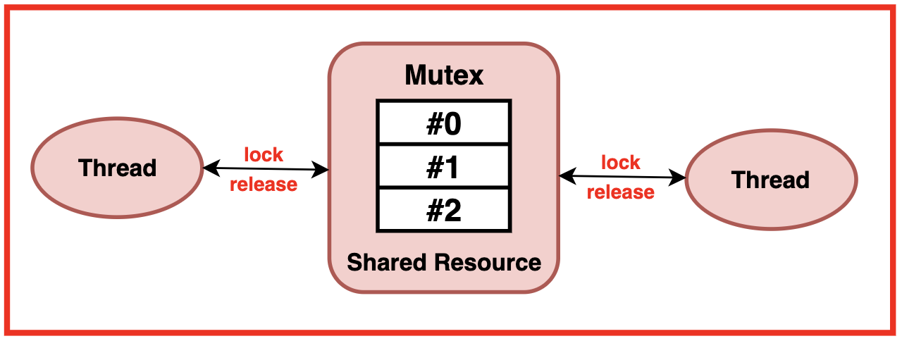
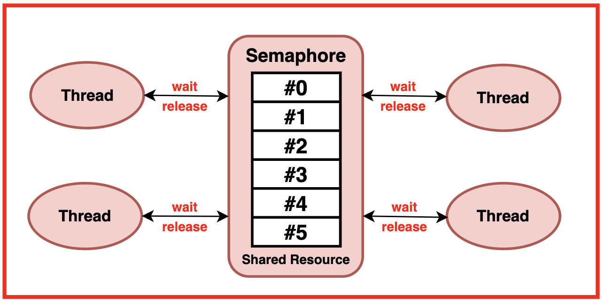
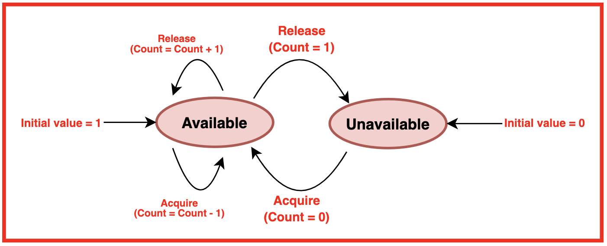
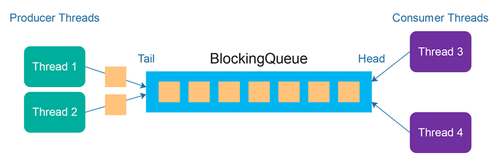
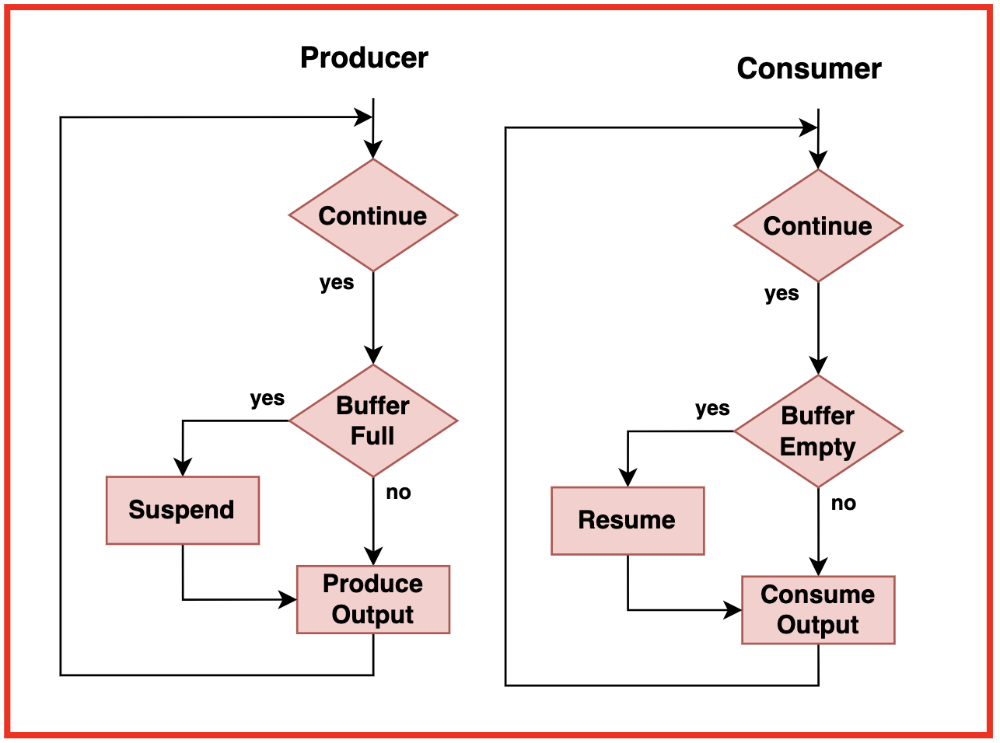

>[Torna a thread](threadsched.md)  >[Versione in Python](threadschedpy.md)


# Mutex e Semafori: Meccanismi di Sincronizzazione nei Sistemi Concorrenti

## Indice
1. [Introduzione](#introduzione)
2. [Mutex (Mutual Exclusion)](#mutex-mutual-exclusion)
   - [Definizione e Funzionamento](#definizione-e-funzionamento-del-mutex)
   - [Operazioni sui Mutex](#operazioni-sui-mutex)
   - [Implementazione dei Mutex](#implementazione-dei-mutex)
   - [Esempi Pratici di Mutex](#esempi-pratici-di-mutex)
3. [Semafori](#semafori)
   - [Definizione e Funzionamento](#definizione-e-funzionamento-dei-semafori)
   - [Operazioni sui Semafori](#operazioni-sui-semafori)
   - [Tipi di Semafori](#tipi-di-semafori)
   - [Il Conteggio nei Semafori](#il-conteggio-nei-semafori)
   - [Esempi Pratici di Semafori](#esempi-pratici-di-semafori)
4. [Confronto tra Mutex e Semafori](#confronto-tra-mutex-e-semafori)
5. [Problemi Comuni e Soluzioni](#problemi-comuni-e-soluzioni)
6. [Esercizi](#esercizi)

---

## Introduzione

Nei sistemi operativi moderni, la concorrenza è un aspetto fondamentale: più processi o thread eseguono simultaneamente, condividendo risorse del sistema. Questa condivisione introduce sfide significative, in particolare la gestione dell'accesso concorrente a risorse condivise e la coordinazione tra thread.

I due meccanismi principali per affrontare queste sfide sono i **mutex** e i **semafori**. Sebbene servano entrambi a gestire la concorrenza, hanno differenze importanti nelle loro funzionalità e nei casi d'uso.

---

## Mutex (Mutual Exclusion)

### Definizione e Funzionamento del Mutex

Un **mutex** (contrazione di *mutual exclusion*) è un meccanismo di sincronizzazione che garantisce accesso esclusivo a una risorsa condivisa. È come una chiave: solo chi possiede la chiave può accedere alla stanza (la risorsa).

Caratteristiche principali:
- Un mutex può essere in stato bloccato (locked) o sbloccato (unlocked)
- Solo un thread alla volta può possedere un mutex
- Solo il thread che ha acquisito il mutex può rilasciarlo
- I mutex vengono utilizzati per proteggere le **sezioni critiche** del codice

### Operazioni sui Mutex

I mutex supportano due operazioni fondamentali:

1. **lock** (o acquire): Un thread tenta di acquisire il mutex
   - Se il mutex è sbloccato, il thread lo acquisisce e continua
   - Se il mutex è già bloccato, il thread viene sospeso fino a quando il mutex non diventa disponibile

2. **unlock** (o release): Il thread proprietario rilascia il mutex
   - Il mutex torna nello stato sbloccato
   - Se ci sono thread in attesa, uno di essi viene svegliato e acquisisce il mutex



```c
// Pseudocodice delle operazioni di mutex
function lock(mutex) {
    // Attendi finché il mutex non è disponibile
    while (mutex.stato == bloccato) {
        wait();  // Sospendi il thread
    }
    // Acquisisce il mutex
    mutex.stato = bloccato;
    mutex.proprietario = thread_corrente;
}

function unlock(mutex) {
    // Verifica che il thread corrente sia il proprietario
    if (mutex.proprietario != thread_corrente) {
        error("Solo il proprietario può sbloccare il mutex");
    }
    // Rilascia il mutex
    mutex.stato = sbloccato;
    mutex.proprietario = null;
    // Sveglia un thread in attesa, se presente
    wakeup_one();
}
```

### Implementazione dei Mutex

I mutex possono essere implementati in diversi modi:

#### 1. Attesa Attiva (Spinlock)

Nei spinlock, il thread che tenta di acquisire un mutex bloccato continua a controllare ripetutamente se è disponibile, senza cedere la CPU:

```c
// Implementazione semplificata di uno spinlock
void spinlock_lock(spinlock_t *lock) {
    while (atomic_test_and_set(lock) == 1) {
        // Continua a iterare (spinnare)
    }
}

void spinlock_unlock(spinlock_t *lock) {
    atomic_clear(lock);
}
```

I spinlock sono utili quando si prevede che il tempo di attesa sia breve, specialmente in sistemi multiprocessore.

#### 2. Attesa Passiva (Blocking Mutex)

Nei mutex bloccanti, il thread che non può acquisire il mutex viene effettivamente sospeso dal sistema operativo e inserito in una coda di attesa:

```c
// Implementazione semplificata di un blocking mutex
void mutex_lock(mutex_t *mutex) {
    disable_interrupts();
    if (mutex->locked) {
        // Aggiungi il thread alla coda di attesa
        enqueue(mutex->wait_queue, current_thread);
        // Passa a un altro thread
        schedule();
    } else {
        mutex->locked = true;
        mutex->owner = current_thread;
    }
    enable_interrupts();
}

void mutex_unlock(mutex_t *mutex) {
    disable_interrupts();
    mutex->locked = false;
    mutex->owner = NULL;
    if (!is_empty(mutex->wait_queue)) {
        // Sveglia un thread in attesa
        thread_t *t = dequeue(mutex->wait_queue);
        wakeup(t);
    }
    enable_interrupts();
}
```

Questa implementazione è più efficiente quando i tempi di attesa possono essere lunghi.

### Esempi Pratici di Mutex

#### Esempio 1: Protezione di un Contatore

```c
#include <pthread.h>
#include <stdio.h>

int contatore = 0;
pthread_mutex_t mutex;

void* incrementa(void* arg) {
    for (int i = 0; i < 1000000; i++) {
        pthread_mutex_lock(&mutex);
        contatore++;  // Sezione critica
        pthread_mutex_unlock(&mutex);
    }
    return NULL;
}

int main() {
    pthread_t t1, t2;
    pthread_mutex_init(&mutex, NULL);
    
    pthread_create(&t1, NULL, incrementa, NULL);
    pthread_create(&t2, NULL, incrementa, NULL);
    
    pthread_join(t1, NULL);
    pthread_join(t2, NULL);
    
    printf("Valore finale: %d\n", contatore);  // Sempre 2000000
    
    pthread_mutex_destroy(&mutex);
    return 0;
}
```

Senza il mutex, il valore finale potrebbe essere meno di 2.000.000 a causa di race condition.

#### Esempio 2: Protezione di un'Operazione di I/O

```c
#include <pthread.h>
#include <stdio.h>

pthread_mutex_t mutex_file;

void* scrivi_su_file(void* arg) {
    FILE* file;
    
    pthread_mutex_lock(&mutex_file);
    // Inizio sezione critica
    file = fopen("dati.txt", "a");
    if (file != NULL) {
        fprintf(file, "Thread %ld sta scrivendo\n", (long)arg);
        fclose(file);
    }
    // Fine sezione critica
    pthread_mutex_unlock(&mutex_file);
    
    return NULL;
}

int main() {
    pthread_t threads[5];
    pthread_mutex_init(&mutex_file, NULL);
    
    for (long i = 0; i < 5; i++) {
        pthread_create(&threads[i], NULL, scrivi_su_file, (void*)i);
    }
    
    for (int i = 0; i < 5; i++) {
        pthread_join(threads[i], NULL);
    }
    
    pthread_mutex_destroy(&mutex_file);
    return 0;
}
```

Questo esempio impedisce che più thread scrivano simultaneamente sul file, evitando dati corrotti.

---

## Semafori

### Definizione e Funzionamento dei Semafori

Un **semaforo** è un meccanismo di sincronizzazione più generale rispetto al mutex. Mentre un mutex permette solo accesso esclusivo (come una singola chiave), un semaforo può essere visto come un insieme di chiavi: stabilisce quanti thread possono accedere contemporaneamente a una risorsa.

Caratteristiche principali:
- Mantiene un contatore interno che può essere positivo, zero o negativo
- Il valore del contatore indica la disponibilità della risorsa
- Può essere utilizzato sia per **mutua esclusione** che per **sincronizzazione di eventi**

### Operazioni sui Semafori

I semafori supportano due operazioni fondamentali:

1. **wait** (o P, o decremento): Decrementa il contatore del semaforo
   - Se il contatore risultante è negativo, il thread viene sospeso
   - Se il contatore risultante è non-negativo, il thread può continuare

2. **signal** (o V, o incremento): Incrementa il contatore del semaforo
   - Se il contatore era negativo, indica che ci sono thread in attesa
   - Uno dei thread in attesa viene svegliato

```c
// Pseudocodice delle operazioni sui semafori
function wait(semaforo) {
    semaforo.valore--;
    if (semaforo.valore < 0) {
        // Aggiungi il thread alla coda di attesa
        enqueue(semaforo.wait_queue, thread_corrente);
        // Blocca il thread
        block();
    }
}

function signal(semaforo) {
    semaforo.valore++;
    if (semaforo.valore <= 0) {
        // C'è almeno un thread in attesa
        thread = dequeue(semaforo.wait_queue);
        // Sblocca il thread
        wakeup(thread);
    }
}
```

### Tipi di Semafori

#### 1. Semafori Binari
- Possono assumere solo i valori 0 o 1
- Simili ai mutex, ma con differenze importanti (ad es., un semaforo può essere segnalato da qualsiasi thread)



#### 2. Semafori Contatori (o Generali)
- Possono assumere qualsiasi valore intero non negativo
- Utili per gestire pool di risorse

Sono utili per:
- la realizzazione della **mutua esclusione**
  
### Il Conteggio nei Semafori

Il valore del semaforo ha un significato importante:

- **Valore positivo (N > 0)**: Indica che ci sono N risorse disponibili
- **Valore zero (N = 0)**: Nessuna risorsa disponibile, ma nessun thread in attesa
- **Valore negativo (N < 0)**: |N| thread sono in attesa della risorsa



Questo doppio significato del contatore (disponibilità delle risorse quando positivo, numero di thread in attesa quando negativo) è una caratteristica distintiva dei semafori.

Sono utili per:
- la realizzazione della **mutua esclusione**
- il monitoraggio dell'**utilizzo delle Risorse** per evitare:
     - **il sovraccarico della risorsa**: quando questa è satura, cioè ha raggiunto il limite massimo di accessi consentito, e non si possono aggiungere ulteriori accessi
     - **l'inutilizzo della risorsa**: quando questa è libera e non ci sta alcun utente che vi accede

### Esempi Pratici di Semafori

#### Esempio 1: Produttore-Consumatore con Buffer Limitato



```c
#include <pthread.h>
#include <semaphore.h>
#include <stdio.h>
#include <stdlib.h>

#define BUFFER_SIZE 5

int buffer[BUFFER_SIZE];
int add_index = 0;
int remove_index = 0;

sem_t empty_slots;  // Conta gli slot vuoti nel buffer
sem_t filled_slots; // Conta gli slot pieni nel buffer
sem_t mutex;        // Protegge l'accesso al buffer

void* producer(void* arg) {
    for (int i = 0; i < 20; i++) {
        int item = rand() % 100;
        
        // Attende uno slot vuoto
        sem_wait(&empty_slots);
        
        // Mutua esclusione per accedere al buffer
        sem_wait(&mutex);
        
        // Produce l'item
        buffer[add_index] = item;
        add_index = (add_index + 1) % BUFFER_SIZE;
        printf("Prodotto: %d\n", item);
        
        // Rilascia l'accesso al buffer
        sem_post(&mutex);
        
        // Segnala che uno slot è stato riempito
        sem_post(&filled_slots);
    }
    return NULL;
}

void* consumer(void* arg) {
    for (int i = 0; i < 20; i++) {
        // Attende uno slot pieno
        sem_wait(&filled_slots);
        
        // Mutua esclusione per accedere al buffer
        sem_wait(&mutex);
        
        // Consuma l'item
        int item = buffer[remove_index];
        remove_index = (remove_index + 1) % BUFFER_SIZE;
        printf("Consumato: %d\n", item);
        
        // Rilascia l'accesso al buffer
        sem_post(&mutex);
        
        // Segnala che uno slot è stato svuotato
        sem_post(&empty_slots);
    }
    return NULL;
}

int main() {
    pthread_t prod, cons;
    
    // Inizializza i semafori
    sem_init(&empty_slots, 0, BUFFER_SIZE); // Inizialmente, tutti gli slot sono vuoti
    sem_init(&filled_slots, 0, 0);          // Inizialmente, nessuno slot è pieno
    sem_init(&mutex, 0, 1);                 // Inizialmente, il mutex è disponibile
    
    pthread_create(&prod, NULL, producer, NULL);
    pthread_create(&cons, NULL, consumer, NULL);
    
    pthread_join(prod, NULL);
    pthread_join(cons, NULL);
    
    sem_destroy(&empty_slots);
    sem_destroy(&filled_slots);
    sem_destroy(&mutex);
    
    return 0;
}
```



In questo esempio:
- `empty_slots` è un semaforo contatore che tiene traccia degli slot vuoti nel buffer
- `filled_slots` è un semaforo contatore che tiene traccia degli slot pieni
- `mutex` è un semaforo binario (usato come mutex) per proteggere l'accesso al buffer

#### Esempio 2: Sincronizzazione tra Thread

```c
#include <pthread.h>
#include <semaphore.h>
#include <stdio.h>
#include <unistd.h>

sem_t sem_A;
sem_t sem_B;

void* thread_A(void* arg) {
    printf("Thread A: Inizio\n");
    sleep(1); // Simula elaborazione
    
    printf("Thread A: Ho completato la fase 1\n");
    
    // Segnala al thread B che può procedere
    sem_post(&sem_A);
    
    // Attende che il thread B completi
    sem_wait(&sem_B);
    
    printf("Thread A: Ho completato tutto\n");
    return NULL;
}

void* thread_B(void* arg) {
    // Attende che il thread A completi la fase 1
    sem_wait(&sem_A);
    
    printf("Thread B: Inizio dopo A\n");
    sleep(1); // Simula elaborazione
    
    printf("Thread B: Ho completato\n");
    
    // Segnala al thread A che può completare
    sem_post(&sem_B);
    
    return NULL;
}

int main() {
    pthread_t tA, tB;
    
    // Inizializza i semafori a 0 (bloccati)
    sem_init(&sem_A, 0, 0);
    sem_init(&sem_B, 0, 0);
    
    pthread_create(&tA, NULL, thread_A, NULL);
    pthread_create(&tB, NULL, thread_B, NULL);
    
    pthread_join(tA, NULL);
    pthread_join(tB, NULL);
    
    sem_destroy(&sem_A);
    sem_destroy(&sem_B);
    
    return 0;
}
```

Questo esempio mostra come i semafori possano essere utilizzati per sincronizzare l'ordine di esecuzione tra thread.

#### Esempio 3: Limitare l'Accesso Concorrente a una Risorsa

```c
#include <pthread.h>
#include <semaphore.h>
#include <stdio.h>
#include <unistd.h>

#define MAX_CONCURRENT_USERS 3

sem_t database_access;

void* database_user(void* arg) {
    long id = (long)arg;
    
    printf("Thread %ld: Richiede accesso al database\n", id);
    
    // Richiede accesso al database
    sem_wait(&database_access);
    
    printf("Thread %ld: Ha ottenuto accesso al database\n", id);
    sleep(2); // Simula operazioni sul database
    
    printf("Thread %ld: Rilascia il database\n", id);
    
    // Rilascia l'accesso al database
    sem_post(&database_access);
    
    return NULL;
}

int main() {
    pthread_t threads[10];
    
    // Inizializza il semaforo per consentire MAX_CONCURRENT_USERS thread simultanei
    sem_init(&database_access, 0, MAX_CONCURRENT_USERS);
    
    for (long i = 0; i < 10; i++) {
        pthread_create(&threads[i], NULL, database_user, (void*)i);
        usleep(100000); // Ritardo di 100ms tra le creazioni di thread
    }
    
    for (int i = 0; i < 10; i++) {
        pthread_join(threads[i], NULL);
    }
    
    sem_destroy(&database_access);
    
    return 0;
}
```

Questo esempio usa un semaforo contatore per limitare a un massimo di 3 thread l'accesso simultaneo a una risorsa (il database).

---

## Confronto tra Mutex e Semafori

| Caratteristica | Mutex | Semaforo |
|----------------|-------|----------|
| **Funzione principale** | Mutua esclusione | Sincronizzazione generale |
| **Proprietà** | Thread-specific (solo il proprietario può sbloccare) | Non ha concetto di proprietà (qualsiasi thread può segnalare) |
| **Valore** | Binario (bloccato/sbloccato) | Intero (può essere negativo) |
| **Conteggio delle risorse** | No | Sì |
| **Uso tipico** | Proteggere sezioni critiche | Coordinare l'accesso a risorse o sincronizzare eventi |
| **Analogia** | Una singola chiave | Un contatore di permessi |

### Quando usare Mutex
- Per proteggere sezioni critiche dove è importante che lo stesso thread che ha acquisito il lock lo rilasci
- Quando è necessaria la mutua esclusione semplice
- Quando è importante la semantica di proprietà

### Quando usare Semafori
- Per limitare l'accesso a un insieme di risorse identiche
- Per sincronizzare l'ordine di esecuzione tra thread
- Per implementare problemi di sincronizzazione come produttore-consumatore, lettori-scrittori, ecc.
- Per notificare a un thread che un evento è avvenuto

---

## Problemi Comuni e Soluzioni

### 1. Deadlock

**Problema**: Due o più thread si bloccano a vicenda in attesa di risorse che l'altro possiede.

**Esempio**: 
Thread 1: lock(A) → lock(B) → unlock(B) → unlock(A)
Thread 2: lock(B) → lock(A) → unlock(A) → unlock(B)

**Soluzioni**:
- Imporre un ordine globale di acquisizione dei lock
- Utilizzare tecniche di timeout o retry
- Utilizzare algoritmi di rilevamento e risoluzione di deadlock

### 2. Starvation

**Problema**: Un thread non ottiene mai l'accesso alla risorsa necessaria.

**Soluzioni**:
- Implementare politiche di fairness
- Utilizzare code con priorità

### 3. Priority Inversion

**Problema**: Un thread a bassa priorità detiene una risorsa necessaria a un thread ad alta priorità.

**Soluzioni**:
- Ereditarietà di priorità: il thread a bassa priorità eredita temporaneamente la priorità del thread in attesa
- Ceiling di priorità: a tutti i thread che accedono a una determinata risorsa viene assegnata la stessa alta priorità

---

## Esercizi

### Esercizio 1: Implementazione di un Contatore Thread-Safe
Implementa un contatore che possa essere incrementato e decrementato in modo sicuro da più thread.

### Esercizio 2: Problema dei Lettori-Scrittori
Implementa una soluzione al problema dei lettori-scrittori utilizzando mutex e semafori. I lettori possono leggere contemporaneamente, ma gli scrittori necessitano di accesso esclusivo.

### Esercizio 3: Sincronizzazione di N Thread
Implementa una barriera che faccia sì che N thread attendano tutti di raggiungere un certo punto prima di procedere.

### Esercizio 4: Limitazione delle Risorse
Implementa un sistema che limiti l'uso concorrente di una risorsa a un massimo di M thread contemporaneamente.

---

## Bibliografia e Risorse Aggiuntive

- Silberschatz, A., Galvin, P. B., & Gagne, G. (2018). *Operating System Concepts*. Wiley.
- Tanenbaum, A. S. (2014). *Modern Operating Systems*. Pearson.
- Stevens, W. R., & Rago, S. A. (2013). *Advanced Programming in the UNIX Environment*. Addison-Wesley.
- Downey, A. B. (2016). *The Little Book of Semaphores*. Green Tea Press.
- https://takeuforward.org/operating-system/semaphore-and-its-types
- https://takeuforward.org/operating-system/producer-consumer

>[Torna a thread](threadsched.md)  >[Versione in Python](threadschedpy.md)

