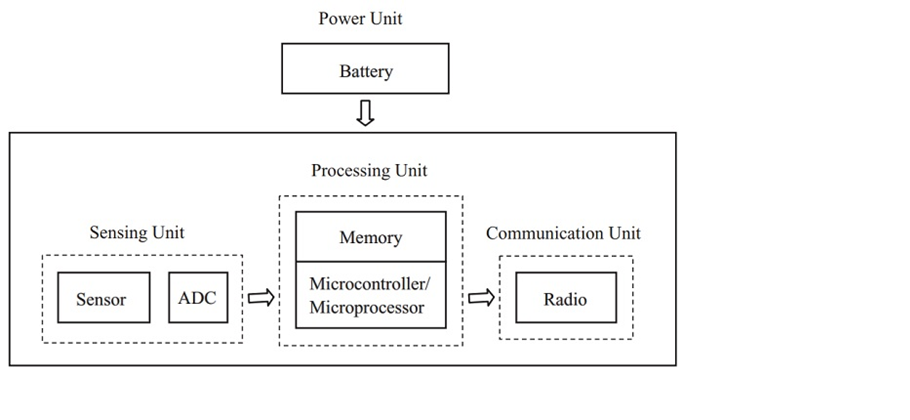

**Reti di ufficio**

Le reti di ufficio sono realizzate con tecnologie ethernet a topologia fisica a stella o a stella gerachica (albero). Lo switch ha la funzione dI:
- **concentratore di dispositivi**. Un collegamento punto punto è dedicato ad ogni dispositivo che occupa esattamente una porta sul concentratore. Servono tante porte quanti sono i dispositiviin prossimità del concentratore.
- **commutazione** cioè smistamento dei dati lungo le dorsali della rete fino ai router di confine della stessa (gateway).

Lo switch è generalmente regolato dal protocollo STP che, secondo lo standard, limita i collegamenti a cascate a poche unità (profondità nominale di 3 dispositivi secondo standard EIA/TIA).
Il cablaggio può risultare oneroso in presenza di un elevato numero di dispositivi, ad esempio, un cavo per ogni sensore. Mativo per cui dispositivi ed architettura sono generalmente ritenute poco adatte per le ampie reti di sensori comuni in ambito industriale.

**Reti industriali**

Le reti industriali o ferrotramviarie che utilizzano la tecnologia ethernet sono spesso realizzate con topologia fisica a BUS o ad anello.
Un anello è composto da lunghe cascate di switch equipaggiati con protocollo STP modificato o con altri protocolli proprietari.
Il cablaggio è più economico in presenza di un cluster numeroso di dispositivi dato che con un unico cavo si possono collegare più switch.
Possibilità di topologie ridondate a doppio anello (treni, industria)

Reti di sensori 
Rete principale ethernet con dorsali fisiche cablate (a stella o a bus) e collegamenti periferici cablati o wireless wifi.
Spesso i sensori non sono dotati di interfaccia ethernet e sono organizzati in sottoreti di sensori cablati o wireless con interfacce non ethernet spesso in topologia fisica a BUS:
- E' necessario un gateway con possibili funzioni di:
    - Traduzione di formato dei dati da rete a bus a rete ethernet
    - Interrogazione periodica (polling) dei dispositivi (master di una architettura master/slave)
    - Raccolta e memorizzazione delle informazioni per essere trasferite in un secondo momento al server di gestione

Se le sottoreti di sensori sono cablate o wireless con interfacce ethernet non è necessario alcun gateway di traduzione dato che i sensori si collegano direttamente ad una porta di uno switch oppure ad un AP WiFi

In ogni caso è necessario un server di gestione con funzioni di:
      - Processamento (elaborazione nuovo stato e comando attuatori)
      - Memorizzazione (storage) ed estrazione (mining) delle informazioni 
      - Analisi dei dati per estrarre reportistica di aiuto alle decisioni (risparmio energetico)
      - Pubblicazione in Internet delle informazioni su un un sito o su un WebService (opendata)
      - Segnalazione anomalie 
      - Backup dei dati e gestione disaster recovery di dati e servizi
     
     

