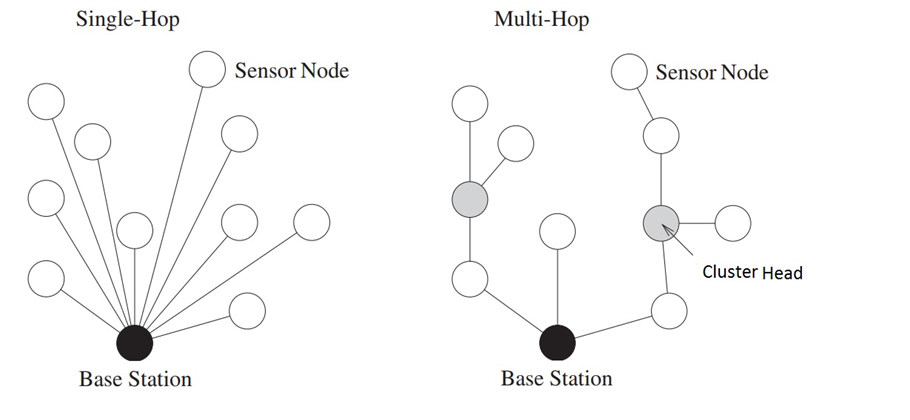

Reti di ufficio vs reti di sensori
Le reti di ufficio sono realizzate con tecnologie ethernet a topologia fisica a stella o a stella gerachica (albero). Lo switch ha la funzione dI:
- **concentratore di dispositivi**. Un collegamento punto punto è dedicato ad ogni dispositivo che occupa esattamente una porta sul concentratore. Servono tante porte quanti sono i dispositiviin prossimità del concentratore.
- **commutazione** cioè smistamento dei dati lungo le dorsali della rete fino ai router di confine della stessa (gateway).

Lo switch è generalmente regolato dal protocollo STP che, secondo lo standard, limita i collegamenti a cascate a poche unità (profondità nominale di 3 dispositivi secondo standard EIA/TIA).
Il cablaggio può risultare oneroso in presenza di un elevato numero di dispositivi (un cavo per dispositivo).
Reti industriali o ferrotramviarie ethernet spesso realizzate con topologia fisica a BUS o ad anello
uso di lunghe cascate di switch equipaggiati con protocollo STP modificato o con altri protocolli proprietari non standardizzati
Cablaggio più economico in presenza di un cluster numeroso di dispositivi (un unico cavo per più dispositivi)
Possibilità di topologie ridondate a doppio anello (treni, industria)

Reti di sensori 
Rete principale ethernet con dorsali fisiche a stella cablate e collegamenti periferici cablati o wireless WiFi

Sottoreti di sensori cablati o wireless con interfacce non ethernet spesso in topologia fisica a BUS:
Necessario un gateway con possibili funzioni di:
Traduzione di formato dei dati da rete a bus a rete ethernet
Interrogazione periodica (polling) dei dispositivi (master di una architettura master/slave)
Raccolta e memorizzazione delle informazioni per essere trasferite in un secondo momento al server di gestione
Sottoreti di sensori cablati o wireless con interfacce ethernet:
Non è necessario alcun gateway di traduzione dato che i sensori si collegano direttamente ad una porta di uno switch oppure ad un AP WiFi
Necessario un server di gestione con funzioni di:
Processamento (elaborazione nuovo stato e comando attuatori)
Memorizzazione (storage) ed estrazione (mining) delle informazioni 
Analisi dei dati per estrarre reportistica di aiuto alle decisioni (risparmio energetico)
Pubblicazione in Internet delle informazioni su un un sito o su un WebService (opendata)
Segnalazione anomalie 
Backup dei dati e gestione disaster recovery di dati e servizi

