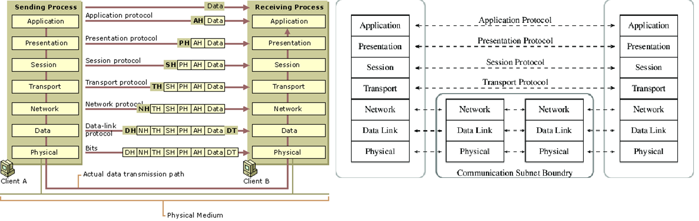
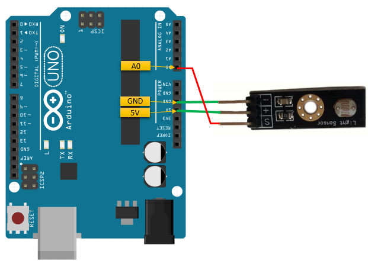
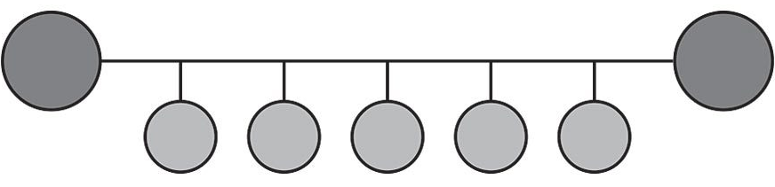
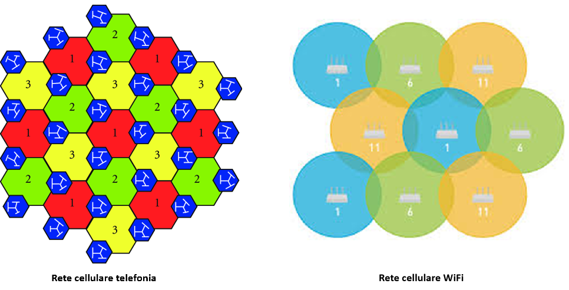

>[Torna all'indice generale](index.md)
## **Reti ethernet da ufficio**

Le **reti di ufficio** sono realizzate con tecnologie ethernet a topologia fisica a stella o a stella gerachica (albero). Lo **switch** ha la funzione dI:
- **concentratore di dispositivi**. Un **collegamento punto punto** è dedicato ad ogni dispositivo che occupa esattamente una porta sul concentratore. Servono tante porte (e tanti cavi) quanti sono i dispositivi **in prossimità** del concentratore. L'**uso esclusivo** di un cavo da parte di un dispositivo è detto **microsegmentazione** e di fatto azzera il problema delle collisioni. Se la porta è **condivisa da più dispositivi** tramite un **collegamento a BUS** o un **HUB** si dice che lo switch realizza una **macrosegmentazione**, situazione in cui le collisioni ci sono e sono **arbitrate** dal protocollo Ethernet (di tipo CSMA/CD) abilitato sulla porta.
- **commutazione** cioè lo **smistamento** di una **trama MAC** tra le **dorsali** della rete LAN che, comprendendo certi switch e non altri, realizza un **percorso** (path) fino ai router di confine della stessa (**gateway**).

**Più switch** collegati insieme **realizzano una rete LAN** che si estende fino al primo router che essi incontrano. I **router** sono i dispositivi che, di fatto, **delimitano** una LAN Ethernet.

Lo **switch** è generalmente regolato dal **protocollo STP** che, secondo lo standard, limita i collegamenti a cascate a poche unità (profondità nominale di 3 dispositivi secondo standard EIA/TIA).

Il **cablaggio** può risultare **oneroso** in presenza di un elevato numero di dispositivi poichè richiederebbe l'impiego di **un cavo a parte** per ogni sensore. Per questo motivo dispositivi di commutazione e architettura **tradizionali** sono generalmente ritenuti poco adatti per la realizzazione delle **ampie reti di sensori** diffuse in ambito industriale.

## **Reti ethernet industriali**

Le **reti industriali o ferrotramviarie** sono anch'esse a **tecnologia ethernet** ma, oltre la tradizionale **topologia a stella**, per connettere tra loro i dispositivi **terminali** e per connettere tra loto **più switch** spesso utilizzano **topologia fisica a BUS o ad anello**.
Un **anello** è composto da lunghe **cascate** di switch collegati in serie ed equipaggiati con protocollo STP modificato o con altri protocolli proprietari.
Il **cablaggio**, in presenza di un cluster numeroso di dispositivi **risulta più economico** dato che con **un unico cavo** si possono collegare più switch.
Possibilità di topologie **ridondate a doppio anello** (treni, industria)

## **Reti di sensori e attuatori**

Spesso sono **reti miste** cioè composte da **sottoreti eterogenee**.

 

La **rete principale**, **è di tipo ethernet** con dorsali fisiche a stella cablate e collegamenti periferici cablati o wireless WiFi. Ha principalmente la funzione di **distribuzione** dei dati **dai nodi gateway** con le reti secondarie **fino al server di gestione** dei dati. Va attentamente progettata perchè sia in grado di smaltire il traffico complessivo di **tutti i sensori**. Può diventare **critica** se, oltre ai sensori, sono presenti **sorgenti multimediali** quali **microfoni** o **telecamere** di videosorvelianza.

I **protocolli in uso** su una rete di sensori sono **molto eterogenei**. Tutti hanno un loro modo di **accedere al mezzo trasmissivo** stabilito dai rispettici protocolli di **livello fisico**. Allo stesso modo, tutti hanno un loro modo di **fornire un servizio all'utente** in maniera più o meno astratta, più o meno espressiva, più o meno varia dal punto di vista della QoS cioè della qualità del servizio, stabilito dal protocollo di **livello applicativo**. 

Il **gap** tra il livello **fisico** e quello **applicativo** in genere è colmato da tutta una serie di **protocolli** il cui scopo è essenzialmente risolvere determinati **problemi di rete** (indirizzamento, controllo di errore, routing, cifratura, ecc.), ottenere la **QoS richiesta dall'applicazione** (prestazioni in termini di velocità, BER, tipo di interazione, ecc...). **Entrambi gli obiettivi** precedenti devono essere raggiunti **organizzando**, tra livello fisico e livello applicativo, una serie di protocolli che permettono di ottenerli rispettando i **vincoli** posti dall'**ambito di utilizzo** pratico dei sistemi (consumi, dimensioni, distanze, facilità d'uso, ecc...).

L'**ISO/OSI** ha catalogato e organizzato in una **architettura a 7 strati** tutti i **protocolli** concepiti nel tempo organizzandoli in base alle **categorie di problemi** di rete che essi risolvono. L'architettura, normalmente rappresentata sotto forma si **stack** (pila), per ogni elemento dello stack identifica una **categoria di protocolli** che deve risolvere **un insieme di problemi** della comunicazione in rete. L'architettutura è **modulare** nel senso che uno strato può essere sostituito senza che quelli sopra di lui se ne accorgano permettendo una grande **flessibilità**. Questà flessibilità può essere utilizzata per **adattare** un protocollo di livello superiore a **vari mezzi fisici** o per ottenere su un certo mezzo fisico una determinata **qualità del servizio**. **Obiettivo finale** è garantire l'**interoperabilità tra i dispositivi** da collegare a dispetto di qualunque differenza reciproca riguardo a marca, modello e tecnologie. 

I canali virtuali si dividono in link **end to end**, chiamati così perchè collegano livelli che sono presenti **soltanto** negli **host** cioè i **dispositivi terminali**, quelli su cui si **interfaccia l'utente**. Più in basso (i **primi 3** livelli). stanno i **link IS-IS** (collegamento tra  Intemediate systems), chiamati così perchè collegano i **dispositivi di rete**, cioè quelli che creano la rete. Anche gli host posseggono questi livelli e pertanto sono, a tutti gli effetti, anch'essi dispositivi di rete.

Un **vincolo dell'architettura** è che uno strato può dialogare solo con quelli adiacenti, o sopra o sotto di lui. Un tecnica, detta **imbustamento multiplo**, con la quale si **incapsulano** i messaggi di un livello, le **PDU** (Protol Data Unit),  nel campo dati, le **SDU** (Service Data Unit), del livello **immediatamente inferiore**, permette la creazione dei cosidetti **canali virtuali** cioè dei collegamenti **apparenti** e **diretti** tra **strati corrispondenti** di dispositivi **remoti**. La particolarità di questi collegamenti è quella di realizzare una **virtualizzazione della rete** e dei suoi dispositivi che, man mano che si sale dal livello fisico a quello applicativo, si fa sempre più spinta, **nascondendo** i dispositivi degli strati inferiori e rendendo **impercettibili** le loro **differenze** ai livelli sopra di essi. Nel caso della rete di sensori, un livello TCP di trasporto già non **"vede** più le differenze tecnologiche tra una rete modbus e un collegamento I2C, essendo stati questi entrambi **"astratti"** in due collegamenti **uniformi** di tipo TCP.

Il **canale reale** è il **mezzo trasmissivo** che unisce il **livello fisico** dei due interlocutori. Si sviluppa in **orizzontale** lungo il mezzo trasmissivo ma anche in **verticale** lungo le interfacce tra i vari strati, **a scendere** in trasmissione, **a salire** in ricezione.
I messaggi dei vari livelli, **incapsulati** uno dentro l'altro, vengono trasmessi in un **blocco unico** lungo il **canale reale**. Ma per comodità, all'**interno dei dispositivi**, sono stati **destrutturati** evidenziando, nei 7 **canali virtuali** dei singoli livelli, l'**abbinamento** tra il messaggio trasmesso da quel livello e il messaggio ricevuto, nello stesso livello, dalla controparte. **In sostanza**, i messaggi **generati** e **trasmessi** dai 7 livelli **separatamente** lungo i 7 **canali virtuali**, diventano un **unico messaggio matrioska** di 7 messaggi, **annidati** uno dentro l'altro, quando vengono trasmessi lungo il **canale reale**. 

I **canali virtuali non esistono fisicamente** ma sono **ugualmente reali** perchè, dal punto di vista dei **messaggi scambiati**, le **entità** pari (peer entity), cioè gli interlocutori corrispondenti nei vari livelli, si comportano come se essi ci fossero davvero e attraverso questi **effettivamente dialogassero**. Sono una **visione semplificata** con cui, ad un **livello superiore**, si possono **osservare** le funzioni svolte e i messaggi scambiati dai livelli inferiori. Semplificata, ma comunque reale.

In figura la lettera H sta per **header** cioè intestazione (ad es. AH=Application header).

Lo **stack di protocolli OSI** è un **modello architetturale** di riferimento. Per **ogni strato** sono stati studiati nel tempo un gran numero di protocolli, ciascuno con i propri **pregi e difetti**. Un'**architettura reale**, quella che poi verrà standardizzata ed implementata in un dispositivo commerciale, per ogni strato della propria pila, sceglierà, tra i tanti disponibili in letteratura tecnica, un certo **tipo di protocollo** del quale realizzerà e standardizzerà la propria **particolare versione**. Attualmente, per **accedere ad Internet** e all'interno della maggior parte delle **reti locali LAN**, si adopera la cosidetta suite **TCP/IP**. Ma molte **reti di sensori**, per funzionare localmente al loro ambiente di lavoro, **non sempre usano** la suite TCP/IP. Inoltre, anche le reti di sensori che l'adoperano, ai livelli inferiori come **collegamento e fisico**, spesso utilizzano protocolli **diversi** da quelli che sono stati standardizzati per le LAN. 

Il **gateway** ha tante **schede di interfaccia** quanti sono i **tipi diversi di BUS** a cui si collega. Il **gateway** deve possedere anche **una interffaccia** capace di traffico ethernet (cablata o wifi) che lo collega alla **rete di distribuzione** (in genere cablata).

Il **gateway** ha anche la funzione di adattare il **formato dei servizi** offerti dalle varie **sottoreti di sensori** nel **formato di servizio unificato** (ad esempio un particolare messaggio JSON) con cui i sensori sono interrogati nella rete di distribuzione IP. I **protocolli di livello applicativo** utilizzati a questo scopo in genere sono **HTTPS** o **COAP** per il paradigma di interazione **Request/response** oppure **MQTT** o **Telegram** per il paradigma di interazione **Publish/Subscribe**, oppure **Websocket**, **Webhooks** e **WebRTC** per richieste asincrone, l'ultimo anche per quelle multimediali.

Ad essa si collegano una o più **reti secondarie** che servono da **rete di accesso** per i dispositivi sensori o attuatori con **interfacce** di tipo:
- **Non ethernet** (cablate o wireless) spesso in topologia fisica a BUS:
    - Necessitano di un **gateway** di confine avente almeno una **interfaccia ethernet nella rete principale** con possibili funzioni di:
        - **Traduzione di formato** dei dati da rete a bus a rete ethernet
        - Interrogazione periodica (polling) dei dispositivi (master di una architettura master/slave)
        - Raccolta e memorizzazione delle informazioni per essere trasferite in un secondo momento al server di gestione

- **Ethernet**. Non è necessario alcun gateway di traduzione dato che uno o più sensori si collegano direttamente ad una porta di uno switch di accesso oppure ad un AP WiFi. 
    
## **Server di gestione**

In genere è localizzato all'intermo della **rete principale** con una collocazione **on-premise** all'interno del sistema.

Tendenze sempre più diffuse portano al **trasferimento crescente di funzioni** anche sul **cloud**. Una **soluzione estrema** è quella di spostare **tutte le funzioni** sul cloud tenendo ben presente che un **guasto della connessione ad internet** causerebbe una cessazione delle **funzioni** di regolazione e controllo che sono state progettate per essere eseguite **centralizzate sul server**. Le funzioni gestite in maniera autonoma e peer to peer **completamente a bordo** dei dispositivi non dovrebero risentire di particolari problemi.

In ogni caso è necessario un **server di gestione** con funzioni di:
- Processamento (elaborazione nuovo stato e comando attuatori)
- Memorizzazione (storage) ed estrazione (mining) delle informazioni
- Analisi dei dati per estrarre reportistica di aiuto alle decisioni (risparmio energetico)
- Pubblicazione in Internet delle informazioni su un un sito o su un WebService (opendata)
- Segnalazione anomalie
- Backup dei dati e gestione disaster recovery di dati e servizi
- Aggiornamento via cavo o via etere (OTA) del firmware ai nodi
- Gestione della sicurezza

##  **Topologia delle reti di sensori cablata** 

Nelle reti industriali sono molto comuni topologie complesse a più livelli. Per le applicazioni di nostro interesse le topologie più adoperate sono quelle classiche ad stella e a bus.

### **Esempi di collegamenti con topologia a stella**:

  
  
  Accesso in scrittura e in lettura su due porte digitali di un sensore ad ultrasuoni:
  
  
  
  Accesso in in lettura su una porta analogica di un sensore di luminosità:
  
  

### **Esempi di collegamenti con topologia a bus:**

 
Esempio di bus **Dallas** detto anche a 1 filo (one-wire):

 

Esempio di bus **I2C** detto anche a 2 fili (two-wire):
 
 
 
Esempio di bus **SPI** detto anche a 3-4 fili (four-wire):

 
 
 Esempio di bus **RS485** arbitrato dal protocollo Modbus:

 
 
  Esempio di attuatori collegati con BUS **RS485** arbitrato dal protocollo Modbus:

 
 
##  **Topologia delle reti di sensori wireless**     
 
Le reti di **sensori wireless** hanno una estensione nello spazio variabile e la loro **topologia** preferita è **a stella** o **a maglia**.

La **rete principale ethernet** può **estendersi nello spazio** secondo un'architettura (ad albero o ad anello) che può comprendere molti switch. Lo **smistamento completo** di una trama dati lungo la rete può prevedere una catena di **smistamenti successivi** lungo gli switch (hops) più o meno lunga. Nel caso di una rete ethernet questo non è generalmente un problema eccessivo nè dal punto di vista dei ritardi nè rispetto a quello dei consumi (gli switch sono alimentati attraverso la rete elettrica).

La situazione potrebbe essere molto diversa nel caso delle **reti di sensori**. Queste sono spesso **wireless** e realizzate con dispositivi **alimentati a batteria** che si vorrebbe fosse sostituita idealmente  **non prima di un paio di anni**.

A seconda dello schema adoperato, dal **punto di vista energetico** non è indifferente considerare se **un comando** o **l'accesso in lettura ad un sensore** avvengono connettendosi direttamente **all'unico** dispositivo hub centrale (magari distante) o se avvengono connettendosi **al più vicino** di una cascata di nodi:
- **Hop singolo**: ciascun nodo del sensore è collegato all'**unico gateway centrale** posto generalmente in **posizione baricentrica** rispetto a tutti i dispositivi. Sebbene sia possibile la trasmissione a lunga distanza, il consumo di energia sarà significativamente superiore a quello speso per la misura del valore del sensore e per la sua elaborazione. Tecnica molto utilizzata per le **grandi distanze** dai dispositivi **LoraWan** e **Sigfox**, mentre per le **medio-piccole** è adoperata dagli AP **WiFi** e **Bluetooth BLE** in **modalità infrastruttura** (non ad-hoc).
- **Hop multiplo**: esiste un percorso verso i nodi terminali passando attraverso dei nodi intermedi. L’energia che un **singolo dispositivo** impiega per raggiungere **un nodo remoto** (ad esempio per accenderlo) si limita a quella per raggiungere il **nodo più prossimo**. Su reti mesh (magliate) di **grandi dimensioni** anche questa energia può essere non trascurabile. Su **reti indoor** è invece la soluzione decisamente **più conveniente** dato che spesso **il primo** dispositivo di smistamento raggiungibile (router o switch) non è a più di un metro di distanza mentre quello in **posizione baricentrica** può essere anche a 10-50m di distanza.

Le reti di sensori wireless (WSN) ad **hop multiplo** in realtà sono di **due tipi** di base più una loro **ibridazione**:
- a **stella gerarchica** In questa categoria, molto popolare è il protocollo Low Energy Adaptive Clustering Hierarchy **(LEACH)**. In LEACH i nodi dei sensori sono divisi in diversi **cluster**. In ogni cluster, il nodo con il livello di energia **più alto** è generalmente scelto come la **testa del cluster** o CH. I CH cono **centro stella** delle comunicazioni con funzione di **aggregazione** e **compressione** dei dati provenienti dai diversi sensori per **ridurre** il numero di **messaggi trasmessi** alla destinazione. Il **ruolo del CH** viene **ruotato** allo scopo di distribuire il carico energetico tra i sensori. Benchè abbia una **grande efficienza energetica** ha delle limitazioni dovute ad alcune ipotesi di progetto. Una di queste queste, il vincolo che i nodi abbiano una potenza di trasmissione tale da poter sempre raggiungere la BS, lo rende **inadatto a reti estese**. Ritenuto attualmente particolarmente adatto ai **requisiti di una WSN** è invece il protocollo **IETF RPL**. Progettato per le reti **6LoWPAN** è un protocollo di tipo **distance vector** che genera, attraverzo lo scambio di messaggi DV con i nodi vicini, un albero di instradamento ottimo **unico** per tutti i nodi avente per **radice** la BS (gateway). E' il protocollo di routing adottato da molti framework per IoT come **TinyoS** o **RIOT**. Anche le **piconet** nelle reti di dispositivi **Buetooth** (IEEE 802.15.1) utilizzano una loro implementazione di routing gerarchico.
- a **maglia** anche detti **flat** o **peer to peer**. Rete **omogenea** di dispositivi in cui tutti i nodi di smistamento (router) **sono simili** in termini di **energia**, **risorse di calcolo** e **memoria**. In questo caso  **ogni nodo** si calcola **il proprio** albero di instradamento ottimo per raggiungere gli altri nodi e la base station. Gli alberi, avendo, di volta in volta, per **radice un nodo** differente sono generalmente anch'essi diversi. Il protocollo di instradamento è spesso distribuito e dinamico e, rispetto all'altra soluzione, garantisce **percorsi ottimali** per **tutti i nodi**, **non solo** per la base station. Un protocollo per reti flat molto usato è **AODV** ed è un derivato per reti ad-hoc del protocollo **distance vector**. Generalmente i protocolli flat mostrano **migliori prestazioni complessive** in termini di **banda** e **ritardo** ma il loro **consumo energetico** **molto elevato** riduce la durata di attività di ciascun **nodo router** a meno che esso non sia **perennemente alimentato**. Tecnica adoperata dai dispositivi **Zigbee** (IEEE 802.15.4).
- **mista** delle precedenti, ovvero **albero di cluster** dove un **cluster** è formato da una **rete a maglia** di piccole dimensioni. Viene così realizzata una rete peer-to-peer con un **minimo overhead** di routing, proprietà che induce un **più basso consumo** dei dispositivi router. Il **routing interno** tra i nodi interni al cluster è con con alberi di istradamento **individuali** per ogni nodo. Il **routing esterno** tra i cluster è con un albero di instradamento **unico** per tutti cluster (spanning tree ottimo). Anche questa tecnica è adoperata dai dispositivi **Zigbee** (IEEE 802.15.4).

Un'altra funzione **potenzialmente energivora** è il **polling dei sensori** ovvvero la loro lettura periodica con annessa **trasmissione in remoto** dei dati. In questo caso se il **primo nodo** di smistamento della catena è parecchio distante (è il caso di tenologie outdoor come LoraWan o Sigfox) o sebbene indoor si adopera una **trasmissione** in una **tecnologia  energivora** (come è in modalità standard il WiFi) allora sono possibili almeno due **soluzioni operative** per abbattere i consumi:
- **allungare l'intervallo di polling** facendolo passare dall'ordine dei secondi a quello dei minuti o delle ore.
- **memorizzare le misure in locale** sul dispositivo e, ad intervalli regolari adeguatamente lunghi, inviare dei **dati aggregati nel tempo** come **medie e varianze** o statistiche in genere.

Quasi **tutte le tecnologie wireless** poi permettono di mettere, nell'intervallo di tempo tra una misura e l'altra, il dispositivo in modalità di **sleep** o **standby** profondo che **rallenta** di molto il clock della CPU permettendo un grande **risparmo di energia**.

Il **consumo di energia** è generalmente proporzionale alla **velocità di trasmissione** e alla lunghezza dei messaggi. Tecnologie **general purpose** che sono **ottimizzate** per la trasmissione di **file o stream** più che di **brevi messaggi** in genere sono più complesse e esibiscono consumi **più elevati**.

Il **grafico sotto** mostra **il posizionamento** delle varie tecnologie wireless che lavorano in **banda ISM** in base alla **bitrate** e alla **distanza** e potrebbe essere usato come **tassonomia di riferimento** (classificazione) delle varie teconologie proprio in base a **queste proprieta**. Al netto di qualche sovrapposizione, sono abbastanza distinguibili **tre zone**: 
- **corto raggio**. A distanze previssime ci stanno i sensori **RFID**, **NFC** e anche **BLE** utili per le **BAN** (Body Area Network) il tag degli oggetti, il tracciamento di persone ed oggetti e il riconoscimento. **Bluetooth** si differenzia per il tipo di servizio, cioè la **connessione  punto** punto diretta tra dispositivi, che per le distanze (da 10m a 100m) tipiche di una **PAN** (Perosnal Area Network). **BLE**, **6LowPan** e **Zigbee** sono le tecnologie principali con cui entro i 100m si realizzano **WSN a basso consumo**. **BLE** in particolare, fornisce anche servizi di tracciamento e posizionamento indoor. Possono essere tutti usati sia indoor che outdoor ma indoor forniscono servizi che altra tecnologie hanno difficolta a fornire con uguale semplicità. 
- **medio raggio**. E' il dominio del WiFi e della telefonia cellulare intesa come **modem dati a pacchetto**. Sono tipici in quest'ambito servizi **M2M** (Machine to Machine) forniti dai modem GPRS GSM. Adesso questi servizi dovrebbero essere sostituiti ed ampliati dal **5G** con altri a bassa latenza fondamentali per le applicazioni di **robotica**, **guida autonoma**, **telecontrollo remoto** e **accesso ad Internet wireless** ad elevata velocità.  Il **WiFi** può realizzare reti di **notevoli dimensioni** (città intere o grandi aree rurali) ma ogni dispositivo ha range di copertura limitato (tipicamente 25m). E' possibile realizzare anche con il wifi una copertura di **tipo cellulare** che supporti il **roaming** cioè la **mobilità dei dispositivi**. Tutte queste tecnologie richiedono una infrastruttura (cablata o wireless) **complessa** e al momento dai **consumi elevati** soprattutto per i dispositivi con i sensori. 
- **lungo raggio**. **LPWAN** (Low Power Wide Area Network) garantiscono una trasmissione a **lungo raggio** (da qualche chilometro a qualche decina di chilometri), un **consumo energetico contenuto** per la trasmissione/ricezione dati e un **basso costo** di realizzazione dei dispositivi al prezzo di una **ridotta velocità** di trasferimento dati (poche decine di kilobit al secondo). Forniscono anche **servizi outdoor** di **posizionamento** e **tracciamento** di oggetti. Sono adatti sia per applicazioni indoor che autdoor ma **outdoor** forniscono servizi che altra tecnologie hanno difficolta a fornire con uguale semplicità. L'infrastruttura è leggera dato che anche migliaia di dispositivi possono essere serviti da un'unica BS (Stazione Base) chiamata Gateway. Il resto dell'infrastruttura può essere realizzato semplicemente in house e utilizzato ancora più semplicemente se realizzato in cloud. Le principali **tecnologie LPWA** attualmente disponibili sono **LoraWan**, **Sigfox** e, recentemente, **RIIoT**.  **VSAT** è una tecnologia satellitare piuttosto datata ma a basso costo e disponibile ovunque nel globo, è utilizzata in regioni rurali e con alimentazione solare.

## **Interfaccia radio**

Il **mezzo trasmissivo radio** è partizionabile in **frequenza**, **tempo**, **spazio** e **potenza**. Delle grandezze precedenti quella in assoluto **più limitata** è la **frequenza** essendo **proprietà dello Stato** e ceduta in **concessione** sotto ben precise condizioni (**licenze**). Questo è il motivo per cui, nel realizzare qualsiasi tipo di comunicazione radio, per prima cosa, bisogna cominciare col **riservare** una porzione del campo delle **frequenze radio** (spettro) **allocando** degli intervalli di frequenze detti **canali**. 

I **canali** sono allocabili all'interno di intervalli di frequenze dette **bande**. Le bande si dividono in **licenziate** cioè quelle per le quali bisogna acquistare dallo stato la **concessione** per trasmmetterci e in quelle **non licenziate** per le quali, sotto ben precise **condizioni tecniche** (modulazione, potenza, duty cicle, ecc.), o **vincoli burocratici** (possesso di autorizzazioni o patenti presso autorità regolatorie) la trasmissione è **libera**. Una di queste ultime è la banda **ISM** (Industrial Scientific Medical). L'**ampiezza del canale** dipende dalla **tecnologia adoperata**. Nelle bande ISM è inoltre possibile trasmettere **senza particolari restrizioni** burocratiche (acquisto di licenze o patentini), in particolare, **senza avvisare** nessuna autorità ma semplicemente utilizzando **dispositivi certificati** cioè che rispondono ai regolamenti tecnici in vigore **nella nazione** in cui sono adoperati. La libertà di accesso alla banda ISM è il motivo per cui essa è **mediamente affollata** e le sue trasmissioni **soggette ad interferenze** più o meno intense. Le **interferenze** sono **gestite** utilizzando **modulazioni robuste alle interferenze** e adoperando **segnali** a bassa densità spettrale, basso duty cicle e, soprattutto, **potenza limitata**. 

Il **mezzo radio** possiede la **proprietà** di essere intrinsecamente **multipunto (mezzo broadcast)** cioè, se un interlocutore trasmette **tutti ascoltano**. Inoltre, essendo in pratica un BUS, è soggetto al fenomeno delle **collisioni** (in quest'ambito sono fisicamente delle interferenze distruttive) che si possono risolvere come sempre, cioè facendo in modo che in **certo canale**, in un **dato posto** e in un **dato tempo** si parli **uno alla volta**. Il **canale radio** cioè, è intrinsecamente **half duplex**. 

Una trasmissione radio **full duplex** può essere realizzata o utilizzando **due canali diversi** nelle **due direzioni** di trasmissione (tecnica FDM) o **partizionando** ulteriormente il canale nelle grandezze residue **ancora non partizionate** in **due sottocanali** (TDM o CDM). Normalmente si usa allo scopo il **tempo** con tecniche TDM, cioè **due interlocutori** diversi parlano nello stesso canale in **istanti diversi**. Ma il meccanismo dell'**alternanza nel tempo** può anche essere esteso ad un **numero arbitrario** di interlocutori che parlano **a turno** secondo un criterio di dialogo assimilabile a quello della **"tavola rotonda"**. Ciascun interlocutore **è numerato** ed è **abbinato** ad **uno o più** numeri di **altri** interlocutori. Un partecipante con **un certo numero**, per realizzare una comunicazione **punto punto** o **multipunto**, dovrebbe **ascoltare** soltanto i discorsi pronunciati **da un solo** interlocutore o **da tutti** gli interlocutori aventi però uno dei numeri a cui egli **è abbinato**.

La partizione **TDM** nel tempo del canale può essere statica o dinamica. Quella **statica** utilizza la tecnica di multiplazione **TDMA**. Quella **dinamica** utilizza un **protocollo di arbitraggio** che, con un meccanismo di **ack**, permette di realizzare **l'alternanza nel tempo** delle comunicazioni. Si basa essenzialmente sui protocolli **ALOHA** o **CSMA/CA**. 

La multiplazione TDM di **parecchie sorgenti** richiede però che **tutte** siano **sincronizzate** con precisione presso un **nodo router**, cioè non possono comunicare **direttamente tra loro**, in maniera peer to peer, senza la presenza di un **nodo master**.

Rappresentazione grafica del protocollo **ALOHA**. I riquadri indicano le trame. I **riquadri ombreggiati** indicano le trame che hanno **colliso** e che verranno scartate perchè arrivate corrotte. Le **trame corrotte** non saranno confermate dal ricevente e, allo **scadere di un timeout**, verranno ritrasmesse.
 

Spesso il **TDM** è preceduto da una ulteriore divisione del canale nel **dominio della potenza** detta divisione di codice o **CDMA** che è associata ad un certo **cluster di utenti** afferenti ad un **certo dispositivo** (ad esempio un AP WiFi). Gruppi diversi hanno codici (detti ortogonali) diversi. Ad es, il **BSSID** del wifi è associato ad un **codice ortogonale** diverso da quello degli altri BSSID che fa in modo che una sua comunicazione sia **distinguibile** da quella degli altri, pur interferndo completamente con quelle. In sostanza si possono **annidare** le multiplazioni una dentro l'altra differenziando per **caratteristiche fisiche** diverse le **singole comunicazioni** dei **singoli gruppi**.

Normalmente le **multiplazioni** sono gestite a **livello fisico** in HW utilizzando delle **schede radio dedicate** su cui si impostano i **registri** per la **configurazione** e da cui provengono le **notifiche** dei vari **eventi** legati alla **trasmissione** o alla **ricezione**.

A seconda della tecnologia adoperata si possono realizare comunicazioni **punto-punto** o **multipunto**, al limite anche **broadcast**. 

L'**isolamento punto punto** nei mezzi a BUS con **arbitraggio a contesa** (ALOHA e CSMA/CA) è in genere **logico** e si ottiene, a livello di scheda facendo in modo che una stazione radio che non riconosca il **proprio indirizzo** nella destinazione dei messaggi **ignori** le comunicazioni non proprie. Diventa più effettivo con la **cifratura** delle informazioni.

In ogi caso con il **TDMA** o con il **CSMA** è possibile pure **condividere** lo stesso canale per **più** comunicazioni **punto-punto**. Il mezzo radio è quindi anche assimilabile ad un **BUS condiviso** o mediante un **protocollo di arbitraggio** (ALOHA, CSMA/CA) o mediante una **tecnica di multiplazione statica** (FDMA, TDMA, CDMA, SDMA).

La **multiplazione SDM** (divisione di spazio) del mezzo radio è sempre in qualche misura possibile **controllando accuratamente le potenze** di trasmissione dato che la **propagazione** delle onde radio, anche **nel vuoto**, è soggetta ad un **intenso fenomeno di attenuazione** che cresce con il **quadrato della frequenza** e con il **quadrato della distanza**. Un esempio di SDM radio è la **divisione in celle** dell'area di **copertura del servizio** radio avente la proprietà che **celle vicine** usano frequenze molto diverse mentre **celle distanti** riutilizzano la stessa frequenza.

unico 
## **Servizi di accesso radio**

Abbiamo visto che l'**interfaccia radio** si accede **allocando per primo** un **unico canale radio** di una multiplazione **FDM**. L'allocazione può essere sia **statica** (eseguita dal sistemista) che dinamica cioè variabile nel tempo ed **automatica**.

**Successivamente** il canale FDM **potrebbe** essere ulteriormente **partizionato in gruppi di utenti** tutti collegati ad uno **stesso dispositivo**. I dispositivi (ad es. gli AP wifi di uno stesso palazzo) interferiscono tra loro ma le comunicazioni sono rese distinguibili e private mediante multiplazione a spettro espanso **CDM** (Code Division Multiplexing) che associa un SSID diverso ad ogni dispositivo. Ciò è dovuto al fatto che usiamo uno dei canali della banda ISM su cui non esistono coordinamento e controllo alcuno. 

Alcune **tecnologie radio** realizzano un **accesso multiplo** al canale radio, **apparentemente** allocando **molti canali** nello **stesso istante**. In realtà la tecnica  alloca un canale alla volta ma **saltando** da uno all'altro con una **velocità** che **alla sorgente** appare **istantanea**. Questo fenomeno ha l'effetto di sparpagliare (spreading) l'energia di un canale su tutta la banda disponibile. Si tratta di una **variante di CDM** ottenuta per altra via. Infatti, la **sequenza di saltellamento** è diversa per ogni comunicazione ed è associata ad un **SSID**. Le **sequenze** sono **ortogonali** e quindi permettono la ricostruzione in ricezione della **comunicazione originale**. Anche una eventuale **multiplazione TDM** effettuata dentro il canale FDM non si accorgerebbe del saltellamento e procederebbe come al solito, assegnando **diversi slot** temporali a **comunicazioni diverse**. Un messaggio potrebbe **partire** in un canale, passare ad altri 7 e completarsi solo nell' ottavo canale, ovvero l'ultimo visitato. La tecnica si chiama **Frequency hopping** o anche detta **FHSS**.

Un'altra tecnologia radio realizza **accesso al canale singolo**, nel senso che l sorgente invia **per intero** un messaggio **in un canale** per un tempo stabilito da una **schedulazione TDM** costante e preordinata ma, alla **trama successiva** quello **slot** temporale sarà assegnato ad **un'altra frequenza** per tutta la sua durata e così accade per tutti gli altri slot di quella trama. In caso di trasmissione non riuscita a causa di interferenze esterne o dissolvenza multi-percorso, la sua ritrasmissione avviene su una frequenza diversa, spesso con una migliore probabilità di successo rispetto all'utilizzo della stessa frequenza di prima. Si noti che, identificando una comunicazione con i suoi dispositivi endpoint, allora accade che tutti questi dispositivi, per ogni trama devono condividere lo stesso slot e lo stesso canale.  La tecnica si chiama **Time Slotted Channel Hopping** o anche detta **TSCH**. E' usata dal protocollo IEEE 802.15.4g/e, livello fisico degli stack **RIIoT** e **OpenWSN**.

Qualunque sia la modalità di accesso, alla fine, su **questo canale risultante**, privato ed eventualmente associato ad un certo **SSID**, a seconda del **servizio richiesto**, **possono parlare**:

- **due interlocutori**, allora si vuole realizzare un collegamento punto-punto tra i due che deve essere reso full duplex. La bidirezionalità, di solito, si ottiene con una multiplazione statica TDM. Cioè il periodo di trasmissione è diviso temporalmente a metà, nella prima parla un interlocutore, nella seconda l'altro.
- **molti interlocutori**, allora siamo in presenza di un mezzo condiviso tra più comunicazioni che viene, anhe in questo caso, partizionato con tecnica TDM, c'è da decidere però se statica TDMA o dinamica (ALOHA o CSMA/CA). Molti dispositivi li supportano entrambi, insieme o separatamente:
    - se si eseguono **operazioni periodiche** come il **polling** di un grappolo di sensori potrebbe essere conveniente utilizzare la multiplazione **TDM statica**. 
    - se si eseguono **operazioni una tantum**, **asincrone**, cioè di cui non si riesce a sapere **in anticipo** l'accadere (ad esempio il comando di accensione di una lampadina), allora riservare uno slot temporale ad una sorgente che per la maggior parte del tempo non lo utilizzerebbe è certamente **uno spreco**. Di conseguenza, in questo caso, si preferisce utilizzare la tecnica di accesso TDM **a contesa** con accesso al canale arbitrato dai protocolli **ALOHA** O **CSMA/CA**.  
    
Molti sistemi (wifi, zigbee, bluetooth BLE, LoRaWan, Sigfox) permettono di impostare **contemporaneamente**, sulla **stessa interfaccia** radio, un **servizio sincrono** mediante **TDMA** per le sorgenti che eseguono il **polling** di sensori e un servizio **asincrono** con **ALOHA** o **CSMA/CA** per le sorgenti che devono inoltrare il **comando** di un pulsante di accensione di un attuatore. Ciò è ottenuto **attivando** sul canale la funzionalità **beacon** con le cosidette **superframe**.

Un **beacon** contiene informazioni che **identificano** la rete e i suoi servizi nonchè una sequenza di **bit di sincronizzazione**. Vengono trasmessi **periodicamente**, servono ad **annunciare** la presenza di una LAN wireless e a **sincronizzare** i membri sui suoi servizi (sincroni e asincroni).

In una **supertrama** due **beacon** fungono da **limiti** (iniziale e finale) e forniscono la **sincronizzazione** con altri dispositivi e informazioni di configurazione. Un superframe è costituito da un certo numero di **slot** temporali divisi in **due gruppi**. Il **primo** è riservato per le sorgenti **asincrone** che accedono in **modalità a contesa** con i protocolli di arbitraggio ALOHA o CSMA, **il secondo** è dedicato alle sorgenti **sincrone** che, in quella porzione della trama, hanno uno **slot** esclusivamente **dedicato** a loro per tutto il tempo in cui esse **risultano attive**.

##  **Stack specifici per IOT**

Ci si potrebbe chiedere se è proprio necessario sapere i **dettagli sui protocolli** adoperati da questo o quel dispositivo. La risposta è legata al **livello di astrazione** con cui la nostra applicazione **vede** la **risorsa rete**. 

Con alcuni protocolli essa ha della rete e dei suoi protocolli una visione che si può ridurre all'**elenco di servizi** di livello applicativo che lo **stack espone**, per cui, quando l'applicazione utilizza un servizio, sullo stack viene scelto, strato per strato, il **protocollo più adatto** per realizzarlo. Addirittura in Blutooth BLE e in Zigbee i **servizi applicativi**, cioè la definizione dei cai d'uso come accendere una lampadina o aprire una tapparella, sono dettagliatamente **catalogati** e **definiti** nello stack.

Normalmente solo la **parte fisica** dello stack è implementata in **HW** mentre tutto il resto dello stack è realizzato in **SW**. Molte volte, per progettare una rete industriale di sensori, si mantiene **solo il chip** con il suo livello fisico, mentre per i **livelli superiori** si preferisce utilizare uno stack di protocollo alternativo, **diverso da quello originale**, realizzando, in pratica, una vera e propria **ibridazione**. In questo caso si possono ancora utilizare stack standardizzati da organizzazioni trasnazionali come IETF o IEEE ma questi possono essere molto articolati per cui, all'interno dello stack, si sceglie la classe di protocolli che si ritiene più adatta alle **proprie esigenze**. Una **proprietà**, spesso non garantita dalle grandi suite come Zigbee o LoraWan, potrebbe essere l'utilizzo del **livello di rete IPV6**, proprietà che potrebbe permettere la connessione diretta del dispositivo **in Internet** trasmettendo, senza modifiche, i suoi messaggi su reti LAN o WiFi. **Un'altra motivazione** potrebbe essere l'interesse a non adoperare la parte, di per se complessa, dello stack che gestisce la rete di molti dispositivi ma soltanto realizzare una **connessione punto punto**, cioè un **ponte radio numerico** tra due dispositivi e per far ciò un semplice supporto di rete IPV6 (senza funzioni di routing) potrebbe essere sufficiente. 

La **parte logica** dei due stack sotto (LoraWan a sinistra e Zigbee a destra) potrebbe essere sostituita con IPV6 inserendo il rpotocollo 6LowPAN. La **parte fisica** di entrambi verrebe mantenuta perchè realizzata **in HW**. Nel caso di LoraWan l'implementazione HW è **propietaria** è costruita da una sola azienda (Semtech) e non è standardizzata industrialmente. Nel caso dello Zigbee la **parte fisica** è **standardizzata** con le sigla **802.15.4**.

Molti **framework per IoT** come **TinyOS**, **Contiki** e **RIOT** posseggono una **struttura modulare** che permette loro di includere, senza particolare sforzo, **stack personalizzati** di protocolli  in maniera tale da adattarli alle esigenze più particolari svicolandosi dagli stack protocollari completi certificati dall'industria (Zigbee, LoraWan). 

Esistono anche **stack opensource** rilasciati da alleanze di sviluppatori pensati per sostituire il **livello applicativo** dei chip IoT attualmente più diffusi per orientarli verso ambiti di utilizzo più **specializzato**. Un esempio è **OpenThread** che si pone sopra i chip **802.15.4** realizzando una implementazione dello stack **Thread** una alternativa a Zigbee per l'**industria**, oppure **OpenWSN** che utilizza l'implementazione di TSCH IEEE 802.15.4g/e come protocollo di accesso al mezzo e protocolli standard IETF come protocolli di livello superiore (6LowPan, REPL e UDP), o anche **OSS-7** che implementa la pila di protocolli **DASH7**. **DASH7** ha la particolarità di avere un **livello fisico** praticamente **agnostico**, cioè supporta la maggior parte dei protocolli di accesso disponibili come, ad esempio, LoRa, inoltra possiede la **particolarità insolita** di mapparsi perfettamente sullo stack ISO/OSI, cioè definisce un **protocollo per ogni livello OSI**.

Gli **stack commerciali**, essendo completi fino al **livello di applicazione**, hanno il vantaggio di garantire una grande **interoperabilità** con i dispositivi comunemente in commercio e prodotti da **vari marchi**. Gli **stack personalizzati** o **opensource** sono utili per realizzare **soluzioni ad hoc** calate in un ben preciso **contesto aziendale**. 

##  **Canali di comunicazione principali in una rete di sensori**

**Riassumendo**, sono necessari almeno due canali di comunicazione che, insieme, complessivamente, realizzano la **comunicazione tra sensori e gestore** delle informazioni:
- **tra sensori e gateway** verso la LAN realizzato dalle sottoreti dei sensori:
    - **A filo** con accesso:,
        - **singolo dedicato**: un filo o un canale per sensore in tecnologia SDM o TDM (multiplexer, UART, porta analogica, porta digitale)
        - **multiplo condiviso** cioè tramite mezzo broadcast (BUS) con **arbitraggio** di tipo **master slave** (Modubus, Dallas, I2C, SPI) o **peer to peer** (CanBUS, KNX, ecc) o misto (ProfiBUS). 
        - Spesso **bidirezionale** specie se in presenza di attuatori
        
    - **Senza filo** cioè wireless con accesso:
        - **singolo dedicato**: link punto-punto analogico digitalizzato con AX25 oppure digitale con un radio modem (Yarm ACME Systems, 6LoWPAN, LoRa) resi full duplex con l'uso di multiplazioni FDM o TDM.
        - **Multiplo e condiviso** (BUS) di tipo half duplex reso bidirezionale (full duplex) tramite tecniche asincrone CSMA/CA (Zigbee, wifi, LoRa) o sincrone TDMA (Zigbee, Bluetooth).
- **Tra gateway e gestore** delle informazioni realizzato dalla rete principale:
     - Tipicamente tramite **LAN ethernet** e architettura **Client/Server**
     - Interazioni di tipo PUSH o PULL
     - Paradigma Request/Response (HTTPS, COAP), Publish/Subscriber (MQTT) oppure canale persistente bidirezionale (BSD socket o WebSocket)

**Sitografia:**

- https://www.u-blox.com/en/publication/white-paper/short-range-low-power-wireless-devices-and-internet-things-iot
- https://www.digikey.it/it/articles/how-to-quickly-start-low-power-wireless-iot-sensing
- https://www.researchgate.net/publication/333226782_Proposal_for_the_Design_of_Monitoring_and_Operating_Irrigation_Networks_Based_on_IoT_Cloud_Computing_and_Free_Hardware_Technologies
- https://www.electronicshub.org/wireless-sensor-networks-wsn/
- http://www.iosrjournals.org/iosr-jece/papers/Vol.%2011%20Issue%206/Version-1/H1106014856.pdf
- https://it.wikipedia.org/wiki/Low_Energy_Adaptive_Clustering_Hierarchy
- https://repository.vtc.edu.hk/cgi/viewcontent.cgi?article=1043&context=ive-eng-sp
- https://it.wikipedia.org/wiki/Ad-hoc_On-demand_Distance_Vector
- http://tesi.cab.unipd.it/28281/1/Tesi.pdf
- https://citeseerx.ist.psu.edu/viewdoc/download?doi=10.1.1.736.8723&rep=rep1&type=pdf
- https://www.researchgate.net/publication/316563960_Comparative_study_and_simulation_of_flat_and_hierarchical_routing_protocols_for_wireless_sensor_network
- https://dpmrassociation.org/dPMR-Spectrum-Efficiency.html
- https://en.wikipedia.org/wiki/ALOHAnet
- https://research-information.bris.ac.uk/ws/portalfiles/portal/110218284/duquennoy17tsch.pdf
- https://hal.inria.fr/hal-01282597/file/iwipcps.pdf
- https://it.scribd.com/document/462861362/Dash7Surveyfinalreport-pdf
- https://openwsn.atlassian.net/wiki/spaces/OW/overview

>[Torna all'indice generale](index.md)
    

