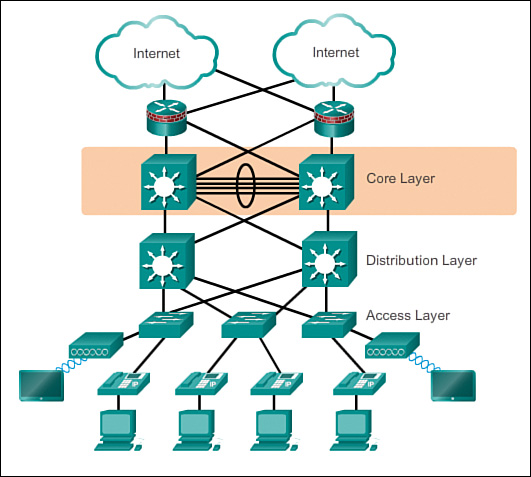
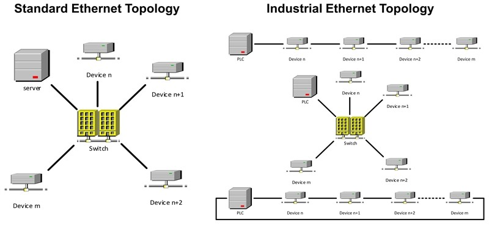

>[Torna all'indice generale](index.md)

## **Reti ethernet da ufficio**

Le **reti di ufficio** sono realizzate con tecnologie ethernet a topologia fisica a stella o a stella gerachica (albero). Lo **switch** ha la funzione dI:
- **concentratore di dispositivi**. Un **collegamento punto punto** è dedicato ad ogni dispositivo che occupa esattamente una porta sul concentratore. Servono tante porte (e tanti cavi) quanti sono i dispositivi **in prossimità** del concentratore. L'**uso esclusivo** di un cavo da parte di un dispositivo è detto **microsegmentazione** e di fatto azzera il problema delle collisioni. Se la porta è **condivisa da più dispositivi** tramite un **collegamento a BUS** o un **HUB** si dice che lo switch realizza una **macrosegmentazione**, situazione in cui le collisioni ci sono e sono **arbitrate** dal protocollo Ethernet (di tipo CSMA/CD) abilitato sulla porta.
- **commutazione** cioè lo **smistamento** di una **trama MAC** tra le **dorsali** della rete LAN che, comprendendo certi switch e non altri, realizza un **percorso** (path) fino ai router di confine della stessa (**gateway**).

**Più switch** collegati insieme **realizzano una rete LAN** che si estende fino al primo router che essi incontrano. I **router** sono i dispositivi che, di fatto, **delimitano** una LAN Ethernet.

Lo **switch** è generalmente regolato dal **protocollo STP** che, secondo lo standard, limita i collegamenti a cascate a poche unità (profondità nominale di 3 dispositivi secondo standard EIA/TIA).

Il **cablaggio** può risultare **oneroso** in presenza di un elevato numero di dispositivi poichè richiederebbe l'impiego di **un cavo a parte** per ogni sensore. Per questo motivo dispositivi di commutazione e architettura **tradizionali** sono generalmente ritenuti poco adatti per la realizzazione delle **ampie reti di sensori** diffuse in ambito industriale.

## **Reti ethernet industriali**

Le **reti industriali o ferrotramviarie** che utilizzano la tecnologia ethernet sono spesso realizzate con **topologia fisica a BUS o ad anello**.
Un **anello** è composto da lunghe **cascate** di switch collegati in serie ed equipaggiati con protocollo STP modificato o con altri protocolli proprietari.
Il **cablaggio**, in presenza di un cluster numeroso di dispositivi **risulta più economico** dato che con **un unico cavo** si possono collegare più switch.
Possibilità di topologie **ridondate a doppio anello** (treni, industria)

## **Reti di sensori e attuatori**

Spesso sono **reti miste** cioè composte da **sottoreti eterogenee**.

La **rete principale**, **è di tipo ethernet** con dorsali fisiche a stella cablate e collegamenti periferici cablati o wireless WiFi. Ha principalmente la funzione di **distribuzione** dei dati **dai nodi gateway** con le reti secondarie **fino al server di gestione** dei dati. Va attentamente progettata perchè sia in grado di smaltire il traffico complessivo di **tutti i sensori**. Può diventare **critica** se, oltre ai sensori, sono presenti **sorgenti multimediali** quali **microfoni** o **telecamere** di videosorvelianza.

Ad essa si collegano una o più **reti secondarie** che servono da **rete di accesso** per i dispositivi sensori o attuatori con **interfacce** di tipo:
- **Non ethernet** (cablate o wireless) spesso in topologia fisica a BUS:
    - Necessitano di un **gateway** di confine avente almeno una **interfaccia ethernet nella rete principale** con possibili funzioni di:
        - **Traduzione di formato** dei dati da rete a bus a rete ethernet
        - Interrogazione periodica (polling) dei dispositivi (master di una architettura master/slave)
        - Raccolta e memorizzazione delle informazioni per essere trasferite in un secondo momento al server di gestione

- **Ethernet**. Non è necessario alcun gateway di traduzione dato che uno o più sensori si collegano direttamente ad una porta di uno switch di accesso oppure ad un AP WiFi. 
    
## **Server di gestione**

In genere è localizzato all'intermo della **rete principale** con una collocazione **on-premise** all'interno del sistema.

Tendenze sempre più diffuse portano al **trasferimento crescente di funzioni** anche sul **cloud**. Una **soluzione estrema** è quella di spostare **tutte le funzioni** sul cloud tenendo ben presente che un **guasto della connessione ad internet** causerebbe una cessazione delle **funzioni** di regolazione e controllo che sono state progettate per essere eseguite **centralizzate sul server**. Le funzioni gestite in maniera autonoma e peer to peer **completamente a bordo** dei dispositivi non dovrebero risentire di particolari problemi.

In ogni caso è necessario un **server di gestione** con funzioni di:
- Processamento (elaborazione nuovo stato e comando attuatori)
- Memorizzazione (storage) ed estrazione (mining) delle informazioni
- Analisi dei dati per estrarre reportistica di aiuto alle decisioni (risparmio energetico)
- Pubblicazione in Internet delle informazioni su un un sito o su un WebService (opendata)
- Segnalazione anomalie
- Backup dei dati e gestione disaster recovery di dati e servizi
- Gestione dei FW dei vari dispositivi
- Gestione della sicurezza
     
##  **Topologia delle reti di sensori e consumi**     
 
Le reti di **sensori wireless** hanno una estensione nello spazio variabile e la loro **topologia** preferita è **a stella** o **a maglia**.

La **rete principale ethernet** può **estendersi nello spazio** secondo un'architettura (ad albero o ad anello) che può comprendere molti switch. Lo **smistamento completo** di una trama dati lungo la rete può prevedere una catena di **smistamenti successivi** lungo gli switch (hops) più o meno lunga. Nel caso di una rete ethernet questo non è generalmente un problema eccessivo nè dal punto di vista dei ritardi nè rispetto a quello dei consumi (gli switch sono alimentati attraverso la rete elettrica).

La situazione potrebbe essere molto diversa nel caso delle **reti di sensori**. Queste sono spesso **wireless** e realizzate con dispositivi **alimentati a batteria** che si vorrebbe fosse sostituita idealmente  **non prima di un paio di anni**.

A seconda dello schema adoperato, dal **punto di vista energetico** non è indifferente considerare se **un comando** o **l'accesso in lettura ad un sensore** avvengono connettendosi direttamente **all'unico** dispositivo hub centrale (magari distante) o se avvengono connettendosi **al più vicino** di una cascata di nodi:
- **Hop singolo**: ciascun nodo del sensore è collegato all'**unico gateway centrale** posto generalmente in **posizione baricentrica** rispetto a tutti i dispositivi. Sebbene sia possibile la trasmissione a lunga distanza, il consumo di energia sarà significativamente superiore a quello speso per la misura del valore del sensore e per la sua elaborazione. Tecnica molto utilizzata per le **grandi distanze** dai dispositivi **LoraWan** e **Sigfox**.
- **Hop multiplo**: esiste un percorso verso i nodi terminali passando attraverso dei nodi intermedi. L’energia che un **singolo dispositivo** impiega per raggiungere **un nodo remoto** (ad esempio per accenderlo) si limita a quella per raggiungere il **nodo più prossimo**. Su reti mesh (magliate) di **grandi dimensioni** anche questa energia può essere non trascurabile. Su **reti indoor** è invece la soluzione decisamente **più conveniente** dato che spesso **il primo** dispositivo di smistamento raggiungibile (router o switch) non è a più di un metro di distanza mentre quello in **posizione baricentrica** può essere anche a 10-50m di distanza.

Le reti di sensori wireless (WSN) ad **hop multiplo** in realtà sono di **due tipi** di base più una loro **ibridazione**:
- a **stella gerarchica** In questa categoria, molto popolare è il protocollo Low Energy Adaptive Clustering Hierarchy **(LEACH)**. In LEACH i nodi dei sensori sono divisi in diversi **cluster**. In ogni cluster, il nodo con il livello di energia **più alto** è generalmente scelto come la **testa del cluster** o CH. I CH cono **centro stella** delle comunicazioni con funzione di **aggregazione** e **compressione** dei dati provenienti dai diversi sensori per **ridurre** il numero di **messaggi trasmessi** alla destinazione. Il **ruolo del CH** viene **ruotato** allo scopo di distribuire il carico energetico tra i sensori. Benchè abbia una **grande efficienza energetica** ha delle limitazioni dovute ad alcune ipotesi di progetto. Una di queste queste, il vincolo che i nodi abbiano una potenza di trasmissione tale da poter sempre raggiungere la BS, lo rende **inadatto a reti estese**. Ritenuto attualmente particolarmente adatto ai **requisiti di una WSN** è invece il protocollo **IETF RPL**. Progettato per le reti **6LoWPAN** è un protocollo di tipo **distance vector** che genera, attraverzo lo scambio di messaggi DV con i nodi vicini, un albero di instradamento ottimo **unico** per tutti i nodi avente per **radice** la BS (gateway). E' il protocollo di routing adottato da molti framework per IoT come **TinyoS** o **RIOT**. Anche le **piconet** nelle reti di dispositivi **Buetooth** (IEEE 802.15.1) utilizzano una loro implementazione di routing gerarchico.
- a **maglia** anche detti **flat** o **peer to peer**. Rete **omogenea** di dispositivi in cui tutti i nodi di smistamento (router) **sono simili** in termini di **energia**, **risorse di calcolo** e **memoria**. In questo caso  **ogni nodo** si calcola **il proprio** albero di instradamento ottimo per raggiungere gli altri nodi e la base station. Gli alberi, avendo, di volta in volta, per **radice un nodo** differente sono generalmente anch'essi diversi. Il protocollo di instradamento è spesso distribuito e dinamico e, rispetto all'altra soluzione, garantisce **percorsi ottimali** per **tutti i nodi**, **non solo** per la base station. Un protocollo per reti flat molto usato è **AODV** ed è un derivato per reti ad-hoc del protocollo **distance vector**. Generalmente i protocolli flat mostrano **migliori prestazioni complessive** in termini di **banda** e **ritardo** ma il loro **consumo energetico** **molto elevato** riduce la durata di attività di ciascun **nodo router** a meno che esso non sia **perennemente alimentato**. Tecnica adoperata dai dispositivi **Zigbee** (IEEE 802.15.4).
- **mista** delle precedenti, ovvero **albero di cluster** dove un **cluster** è formato da una **rete a maglia** di piccole dimensioni. Viene così realizzata una rete peer-to-peer con un **minimo overhead** di routing, proprietà che induce un **più basso consumo** dei dispositivi router. Il **routing interno** tra i nodi interni al cluster è con con alberi di istradamento **individuali** per ogni nodo. Il **routing esterno** tra i cluster è con un albero di instradamento **unico** per tutti cluster (spanning tree ottimo). Anche questa tecnica è adoperata dai dispositivi **Zigbee** (IEEE 802.15.4).

Un'altra funzione **potenzialmente energivora** è il **polling dei sensori** ovvvero la loro lettura periodica con annessa **trasmissione in remoto** dei dati. In questo caso se il **primo nodo** di smistamento della catena è parecchio distante (è il caso di tenologie outdoor come LoraWan o Sigfox) o sebbene indoor si adopera una **trasmissione** in una **tecnologia  energivora** (come è in modalità standard il WiFi) allora sono possibili almeno due **soluzioni operative** per abbattere i consumi:
- **allungare l'intervallo di polling** facendolo passare dall'ordine dei secondi a quello dei minuti o delle ore.
- **memorizzare le misure in locale** sul dispositivo e, ad intervalli regolari adeguatamente lunghi, inviare dei **dati aggregati nel tempo** come **medie e varianze** o statistiche in genere.

Quasi **tutte le tecnologie wireless** poi permettono di mettere, nell'intervallo di tempo tra una misura e l'altra, il dispositivo in modalità di **sleep** o **standby** profondo che **rallenta** di molto il clock della CPU permettendo un grande **risparmo di energia**.

## **Interfaccia radio**

Il **mezzo trasmissivo radio** è partizionabile in **frequenza**, **tempo**, **spazio** e **potenza**. Delle grandezze precedenti quella in assolutp **più limitata** è la **frequenza** essendo proprietà dello Stato e ceduta in concessione sotto ben precise condizioni (licenze), motivo per cui nel realizzare qualsiasi tipo di comunicazione radio, per prima cosa, bisogna cominciare col **riservare** una porzione del campo delle frequenze radio (spettro) **allocando** degli intervalli di frequenze detti **canali**. 

I **canali** sono allocabili all'interno di intervalli di frequenze dette **bande**. Le bande si dividono in **licenziate** cioè quelle per le quali bisogna acquistare dallo stato la **concessione** per trasmmetterci e in quelle **non licenziate** per le quali, sotto ben precise condizioni è libera la trasmissione. Una di queste ultime è la banda **ISM** (Industrial Scientific Medical). L'**ampiezza del canale** dipende dalla **tecnologia adoperata**. 

Il mezzo radio possiede la proprietà di essere intrinsecamente **multipunto (mezzo broadcast)** cioè, se un interlocutore trasmette **tutti ascoltano**. Inoltre, essendo in pratica un BUS, è sogetto al fenomeno delle **collisioni** (in quest'ambito sono fisicamente delle interferenze distruttive) che si possono risolvere come sempre, cioè facendo in modo che in **certo canale**, in un **dato posto** e in un **dato tempo** si parli **uno alla volta**. Il canale cioè, è intrinsecamente **half duplex**. 

Una trasmissione radio **full duplex** può essere realizzata o utilizzando due canali diversi nelle due direzioni di trasmissione o **partizionando** ulteriormente il canale nelle grandezze residue. Normalmente si usa allo scopo il **tempo**, cioè interlocutori diversi prlano nello stesso canale in **istanti diversi** e ciò può essere fatto per un **numero arbitrario** di interlocutori. 
La partizione **TDM** nel tempo del canale può essere statica o dinamica. Quella **statica** utilizza la tecnica di multiplazione **TDMA** quella **dinamica** utilizza un **protocollo di arbitraggio** che, con un meccanismo di **ack**, che permette di reaalizzare **l'alternanza nel tempo** delle comunicazioni e si basa essenzialmente sui protocolli **ALOHA** o **CSMA/CA**.

Spesso il **TDM** è preceduto da una ulteriore divisione del canale nel **dominio della potenza** detta divisione di codice o **CDMA** che è associata ad un certo **cluster di utenti** afferenti ad un **certo dispositivo** (ad esempio un AP WiFi). In sostanza possono **annidare** le multiplazioni una dentrol'altra differenziando per **caratteristiche fisiche** diverse le **singole comunicazioni** dei **singoli gruppi**.

Normalmente le **multiplazioni** sono gestite a **livello fisico** in HW utilizzando delle **schede radio dedicate** su cui si impostano i **registri** per la **configuraxione** e da cui provengono le **notifiche** dei vari **eventi** legati alla **trasmissione** o alla **ricezione**.

A seconda della tecnologia adoperata si possono realizare comunicazioni **punto-punto** o **multipunto**, al limite anche **broadcast**. L'isolamento punto punto è in genere **logico** e si ottiene, come in tutti i mezzi a BUS, alivello di scheda ignorando le comunicazioni non proprie. Diventa più effettivo con la **cifratura** delle informazioni.

In ogi caso con il **TDMA** o con il **CSMA** è possibile pure **condividere** lo stesso canale per **più** comunicazioni **punto-punto**. Il mezzo radio è quindi anche assimilabile ad un **BUS condiviso** o mediante un **protocollo di arbitraggio** o mediante una **tecnica di multiplazione statica**.

##  **Canali di comunicazione principali**

**Riassumendo**, sono necessari almeno due canali di comunicazione che, insieme, complessivamente, realizzano la **comunicazione tra sensori e gestore** delle informazioni:
- **tra sensori e gateway** verso la LAN realizzato dalle sottoreti dei sensori:
    - **A filo** con accesso:,
        - **singolo dedicato**: un filo o un canale per sensore in tecnologia SDM o TDM (multiplexer, UART, porta analogica, porta digitale)
        - **multiplo condiviso** cioè tramite mezzo broadcast (BUS) con **arbitraggio** di tipo **master slave** (Modubus, Dallas, I2C, SPI) o **peer to peer** (CanBUS, KNX, ecc) o misto (ProfiBUS). 
        - Spesso **bidirezionale** specie se in presenza di attuatori
        
    - **Senza filo** cioè wireless con accesso:
        - **singolo dedicato**: link punto-punto analogico digitalizzato con AX25 oppure digitale con un radio modem (Yarm ACME Systems, 6LoWPAN, LoRa) resi full duplex con l'uso di multiplazioni FDM o TDM.
        - **Multiplo e condiviso** (BUS) di tipo half duplex reso bidirezionale (full duplex) tramite tecniche asincrone CSMA/CA (Zigbee, wifi, LoRa) o sincrone TDMA (Zigbee, Bluetooth).
- **Tra gateway e gestore** delle informazioni realizzato dalla rete principale:
     - Tipicamente tramite **LAN ethernet** e architettura **Client/Server**
     - Interazioni di tipo PUSH o PULL
     - Paradigma Request/Response (HTTPS, COAP), Publish/Subscriber (MQTT) oppure canale persistente bidirezionale (BSD socket o WebSocket)

**Sitografia:**

- https://www.electronicshub.org/wireless-sensor-networks-wsn/
- http://www.iosrjournals.org/iosr-jece/papers/Vol.%2011%20Issue%206/Version-1/H1106014856.pdf
- https://it.wikipedia.org/wiki/Low_Energy_Adaptive_Clustering_Hierarchy
- https://repository.vtc.edu.hk/cgi/viewcontent.cgi?article=1043&context=ive-eng-sp
- https://it.wikipedia.org/wiki/Ad-hoc_On-demand_Distance_Vector
- http://tesi.cab.unipd.it/28281/1/Tesi.pdf
- https://citeseerx.ist.psu.edu/viewdoc/download?doi=10.1.1.736.8723&rep=rep1&type=pdf
- https://www.researchgate.net/publication/316563960_Comparative_study_and_simulation_of_flat_and_hierarchical_routing_protocols_for_wireless_sensor_network

>[Torna all'indice generale](index.md)
    

