>[Torna all'indice generale](index.md)
## **Reti ethernet da ufficio**

Le **reti di ufficio** sono realizzate con tecnologie ethernet a topologia fisica a stella o a stella gerarchica (albero). Lo **switch** ha la funzione di:
- **concentratore di dispositivi**. Un **collegamento punto punto** è dedicato ad ogni dispositivo e occupa esattamente una porta sul concentratore. Servono tante porte (e tanti cavi) quanti sono i dispositivi **in prossimità** del concentratore. L'**uso esclusivo** di un cavo da parte di un dispositivo è detto **microsegmentazione** e di fatto azzera il problema delle collisioni. Se la porta è **condivisa da più dispositivi** tramite un **collegamento a BUS** o un **HUB** si dice che lo switch realizza una **macrosegmentazione**, situazione in cui le collisioni ci sono e sono **arbitrate** dal protocollo Ethernet (di tipo CSMA/CD) abilitato sulla porta.
- **commutazione** cioè lo **smistamento** di una **trama MAC** tra le **dorsali** della rete LAN che, comprendendo certi switch e non altri, realizza un **percorso** (path) fino ai router di confine della stessa (**gateway**).

**Più switch** collegati insieme **realizzano una rete LAN** che si estende fino al primo router che essi incontrano. I **router** sono i dispositivi che, di fatto, **delimitano** una LAN Ethernet.

Lo **switch** è generalmente regolato dal **protocollo STP** che, secondo lo standard, limita i collegamenti a cascata a poche unità (profondità nominale di 3 dispositivi secondo standard EIA/TIA).

Il **cablaggio** può risultare **oneroso** in presenza di un elevato numero di dispositivi poichè richiederebbe l'impiego di **un cavo a parte** per ogni sensore. Per questo motivo dispositivi di commutazione e architettura **tradizionali** sono generalmente ritenuti poco adatti per la realizzazione delle **ampie reti di sensori** diffuse in ambito industriale.

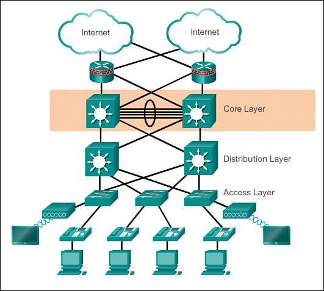

## **Reti ethernet industriali**

Le **reti industriali o ferrotramviarie** sono anch'esse a **tecnologia ethernet** ma, oltre la tradizionale **topologia a stella**, per connettere tra loro i dispositivi **terminali** e per collegare tra loto **più switch** spesso utilizzano **topologia fisica a BUS o ad anello**.
Un **anello** è composto da lunghe **cascate** di switch collegati in serie ed equipaggiati con protocollo STP modificato o con altri protocolli proprietari.
Il **cablaggio**, in presenza di un cluster numeroso di dispositivi **risulta più economico** dato che con **un unico cavo** si possono collegare più switch.
Possibilità di topologie **ridondate a doppio anello** (treni, industria)

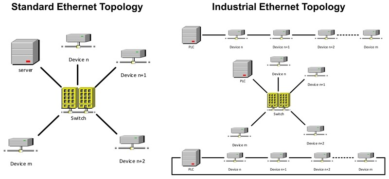

## **Reti di sensori e attuatori**

Spesso sono **reti miste** cioè composte da **sottoreti eterogenee**: 
- **più reti di sensori** costituite da dispositivi sensori e da nodi di smistamento. Sono spesso realizzate in tecnologie non IP proprietarie.
- **una rete centrale di distribuzione**. E' una rete IP e può essere una LAN, spesso interconessa ad Internet, oppure è Internet stessa.

 
 
Tra le due tipologie di reti ci sono dei **nodi di confine** aventi una interfaccia **nella rete di sensori** ed un'altra **nella rete principale IP**. Questi nodi **cerniera** sono detti **gateway** e devono trovare un modo di **rendere compatibili** i messaggi che circolano nelle due tipologie di reti, spesso realizzate con tecnologie **completamente diverse**.

La **rete principale**, **è di tipo ethernet** con dorsali fisiche a stella cablate e collegamenti periferici cablati o wireless WiFi. Ha principalmente la funzione di **distribuzione** dei dati **dai nodi gateway** con le reti secondarie **fino al server di gestione** dei dati. Va attentamente progettata perchè sia in grado di smaltire il traffico complessivo di **tutti i sensori**. Può diventare **critica** se, oltre ai sensori, sono presenti **sorgenti multimediali** quali **microfoni** o **telecamere** di videosorveglianza.

Le **reti di sensori** sono molto **eterogenee**. Tutte hanno un loro modo di **accedere al mezzo trasmissivo** stabilito dai rispettivi protocolli di **livello fisico**. Allo stesso modo, tutte hanno un loro modo di **fornire un servizio all'utente** in maniera più o meno astratta, più o meno espressiva, più o meno varia dal punto di vista della QoS cioè della qualità del servizio, stabilito dal protocollo di **livello applicativo**. 

Il **gap**, cioè il dislivello, tra il livello **fisico** e quello **applicativo** in genere è colmato da tutta una serie di **protocolli** il cui scopo è essenzialmente: risolvere determinati **problemi di rete** (indirizzamento, controllo di errore, routing, cifratura, ecc.), ottenere la **QoS richiesta dall'applicazione** (velocità, BER, tipo di interazione, ecc...). **Entrambi gli obiettivi** precedenti devono essere raggiunti **organizzando**, tra livello fisico e livello applicativo, una **pila (stack) di protocolli** che permette di raggiungerli rispettando i **vincoli** posti dall'**ambito di utilizzo** pratico della rete (consumi, dimensioni, distanze, facilità d'uso, ecc...).

[Dettaglio ES/IS](isvses.md)

[Dettaglio protocolli](protocolli.md)

[Dettaglio ISO/OSI](isoosi.md)

Lo **stack di protocolli OSI** è un **modello architetturale** di riferimento. Per **ogni strato** sono stati studiati nel tempo un gran numero di protocolli, ciascuno con i propri **pregi e difetti**. Un'**architettura reale**, quella che poi verrà standardizzata ed implementata in un dispositivo commerciale, per ogni strato della propria pila, sceglierà, tra i tanti disponibili in letteratura tecnica, un certo **tipo di protocollo** del quale realizzerà e standardizzerà la propria **particolare versione**. Attualmente, per **accedere ad Internet** e all'interno della maggior parte delle **reti locali LAN**, si adopera la cosiddetta suite **TCP/IP**. Ma molte **reti di sensori**, per funzionare localmente al loro ambiente di lavoro, **non sempre usano** la suite TCP/IP. Inoltre, anche le reti di sensori che eventualmente lo adoperano, ai livelli inferiori come **i livelli data link e il livello fisico**, spesso utilizzano protocolli **diversi** da quelli che sono stati standardizzati per le LAN. 

In ogni caso, un qualsiasi **ente di telecomunicazioni internazionale** (IEE, IETF, ITUT, ecc.) o **alleanza di case produttrici** di dispositivi di rete (Zigbee, Bluetooth) o anche **singole aziende** (LoraWan e Sigfox), per realizzare reti di dispositivi utilizzabili direttamente dall'utente, devono **progettare** una **propria versione** dello **stack ISO/OSI** che includa anche i livelli superiori. Talvolta ci si ferma al tradizionale livello 6 di **presentazione** (LoraWan e Sigfox), altre volte si arriva persino a dettagliare il livello di **applicazione** (zigbee, BLE) attraverso la definizione sia del significato che del formato delle **misure** e dei **comandi** che queste reti trasportano (semantica). 

Riguardo all'**interoperabilità** tra reti diverse, questa è evidentemente impossibile a livello fisico e di accesso, cioè ai primi due livelli della pila OSI (L1 e L2) dato che si tratta di tecnologie molto diverse tra loro. Ma potrebbe essere realizzata a **livello di routing**, come già accade nelle LAN e in Internet col protocollo IP e, in questo caso, potrebbero essere smistati gli stessi messaggi lungo reti eterogenee a livello fisico. Oppure, potrebbe essere realizzata solo a **livello applicativo** definendo per tutte le reti una semantica uniforme per misure e comandi (lo stesso oggetto tapparella con gli stessi comandi per tutte le reti, lo stesso oggetto lampada che si comanda con on e off ovunque, ecc...). 

Alla luce di quanto detto, l'**interoperabilità** tra reti diverse si può ottenere:
- **creando un'unica rete** utilizzando livelli di rete **compatibili** o **praticamente uguali** come sono **IPV6 e 6LowPan**. Lo stesso deve accadere per i protocolli di routing usando ad es. REPL. Lo stesso deve accadere per i **livelli superiori**. In particolare nell'ultimo, il **livello applicativo**, il **payload dell'applicazione**, cioè il messaggio utente, deve poter viaggiare **direttamente** dal **client** al **sensore**, dove poi verrà elaborato e utilizzato.
- utilizzando un **gateway** per **compattare** o **tradurre** i messaggi:
     - se il routing non è compatibile ma il livello di applicazione nella rete di accesso **è customizzabile**, si può pensare ancora di utilizzare lo stesso payload della rete di distribuzione in formato JSON richiamando le primitive di servizio di livello applicativo in uso nella rete dei sensori. Ma il formato potrebbe essere troppo prolisso per dispositivi di capacità ridotta e quindi va compresso.
     - se il livello di applicazione nella rete di accesso **non è customizzabile**, il gateway (detto talvolta **bridge**) ha funzione di traduzione dei messaggi tra il il formato in uso  nella rete di distribuzione IP e quello in uso nella rete di accesso ai sensori. 

Misure e comandi sono attualmente definiti sotto forma di **oggetti JSON** in formato ASCII. Questo dovrebbe garantire da un lato l'interoperabilità tra reti di sensori diverse, dall'altro l'interoperabilità con sistemi terzi che si occupano della pubblicazione dei dati o della loro eleborazione statistica. Il fatto che il formato scelto sia chiaro, testuale ed autoesplicativo è sicuramente un vantaggio nella rete di **distribuzione**, diventa poco pratico o del tutto inutilizzabile in reti di **accesso** ai sensori che possono trasmettere soltanto messaggi radi e molto brevi, quali quelle che operano in **banda ISM**. Gli oggetti JSON scambiati nella rete di distribuzione vanno **progettati** in modo tale da includere la **semantica** di tutti i dispositivi IoT coinvolti nelle reti di sensori collegate, che di volta in volta, poi andrà **tradotta**:
- nella **semantica applicativa standard** prevista nello stack della rete di accesso in uso (ad es. Zigbee o BLE)
- in una **semantica custom** che sia una versione **più compatta** di quella in uso nella rete di distribuzione in modo da adattarla alla capacità trasmissiva molto limitata (poche decine di byte al sec) della rete di accesso ai sensori.

**Unica rete con IPV6 e 6LowPan**:

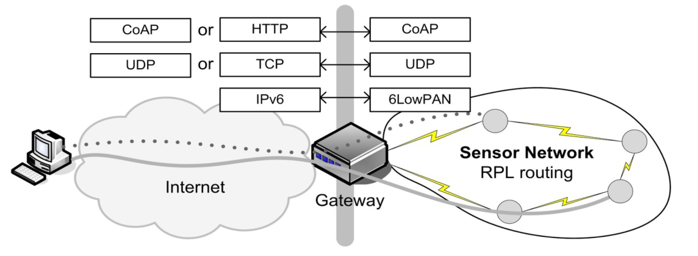

**Gateway applicativo**:

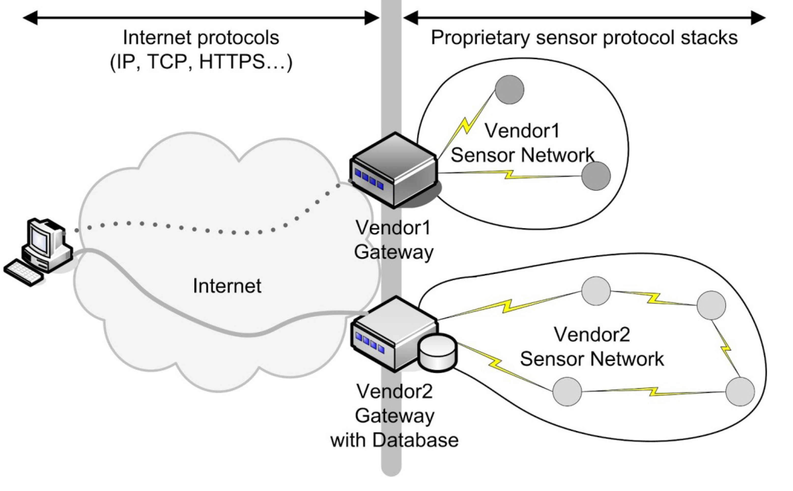

Il **gateway** ha tante **schede di interfaccia** quanti sono i **tipi diversi di BUS** a cui si collega. Il **gateway** deve possedere anche **una interfaccia** capace di traffico ethernet (cablata o wifi) che lo collega alla **rete di distribuzione** (in genere cablata).

Il **gateway** ha anche la funzione di adattare il **formato dei servizi** offerti dalle varie **sottoreti di sensori** nel **formato di servizio unificato** (ad esempio un particolare messaggio JSON) con cui i sensori sono interrogati nella rete di distribuzione IP. I **protocolli di livello applicativo** utilizzati a questo scopo in genere sono **HTTPS** o **COAP** per il paradigma di interazione **Request/response** oppure **MQTT** o **Telegram** per il paradigma di interazione **Publish/Subscribe**, oppure **Websocket**, **Webhooks** e **WebRTC** per richieste asincrone, l'ultimo anche per quelle multimediali.

Talvolta il livello applicativo dello stesso stack di protocolli, pur a parità di tecnologia, non è compatibile tra dispositivi di diversi fabbricanti (marca diversa). In più i **gateway** verso la rete di sensori IP, nonostante abbiano nella rete di distribuzione una **interfaccia MAC/IP** tradizionale, sono scatolotti **proprietari chiusi** che nascondono la traduzione delle API di servizio HTTP o COAP con i messaggi verso la rete di sensori che gestiscono. 

I fabbricanti spesso tendono a renderli **non bypassabili** perchè non rilasciano di pubblico dominio le API a basso livello per comunicare direttamente con i sensori. Questo significa che potrebbe essere necessario per loro un **ulteriore livello di traduzione**, cioè un altro gateway, per convertire il **formato** delle **API** e dei **protocolli** che espongono nella rete IP (ad es COAP) con quelle in uso nella rete di distribuzione comune per tutti i sensori (ad es. MQTT). 

Questa situazione, per i **protocolli più diffusi** come Zibgee e Bluetooth, **tende a scomparire** perchè quasi tutti i produttori si sono ormai accordati e **adottano** per le API dei servizi uno **standard comune** e pubblico, per cui non è insolito riuscire a comandare dispositivi di una marca X col gateway della marca Y. Inoltre, molti stack hanno reso pubblico il formato del payload applicativo dei loro sensori, oppure esistono bridge che eseguono la conversione di questo in corrispondenti messaggi MQTT in formato JSON.

**Riassumendo**, alla **rete di distribuzione IP** si collegano, quindi, una o più **reti secondarie** che servono da **rete di accesso** per i dispositivi sensori o attuatori con **interfacce** spesso di tipo **non ethernet** che necessitano di un **gateway** di confine con possibili funzioni di:        
  - **Traduzione di formato** dei messaggi da rete a bus a rete ethernet con eventuale realizzazione del **bridge** tra livello applicativo in uso nella rete di sensori e quello in uso nella rete di distribuzione.
  - **Interrogazione periodica** (polling) dei dispositivi (master di una architettura master/slave)
  - **Raccolta e memorizzazione** delle informazioni per essere trasferite in un secondo momento al server di gestione
    
## **Server applicativo**

In genere è localizzato all'interno della **rete principale** con una collocazione **on-premise** all'interno del sistema.

Tendenze sempre più diffuse portano al **trasferimento crescente di funzioni** anche sul **cloud**. Una **soluzione estrema** è quella di spostare **tutte le funzioni** sul cloud tenendo ben presente che un **guasto della connessione ad internet** causerebbe una cessazione delle **funzioni** di regolazione e controllo che sono state progettate per essere eseguite **centralizzate sul server**. Le funzioni gestite in maniera autonoma e peer to peer **completamente a bordo** dei dispositivi non dovrebbero risentire di particolari problemi.

In ogni caso è necessario un **server di gestione** con funzioni di:
- Processamento (elaborazione nuovo stato e comando attuatori)
- Memorizzazione (storage) ed estrazione (mining) delle informazioni
- Analisi dei dati per estrarre reportistica di aiuto alle decisioni (risparmio energetico)
- Pubblicazione in Internet delle informazioni su un un sito o su un Web Service (opendata)
- Segnalazione anomalie
- Backup dei dati e gestione disaster recovery di dati e servizi
- Aggiornamento via cavo o via etere (OTA) del firmware ai nodi
- Gestione della sicurezza

Queste prese in considerazione sono generalmente tutte funzioni di **livello applicativo** in quanto si limitano a gestire servizi.

## **Server di rete**

Il **network server** è comune in alcune tipologie di **reti wireless** LPWA ed è una componente di **back-end** responsabile dello **smistamento** verso gli utenti (routing applicativo) dei dati provenienti dai vari **gateway** configurandosi, quindi, come il **centro stella logico** di una  stella di gateway.

Il **network server** è anche responsabile dello svolgimento di alcuni **processi** di **controllo** e **gestione** della rete: 
- si connette a **più gateway** tramite una connessione TCP/IP protetta 
- decide **quale gateway** dovrebbe rispondere a un messaggio di un nodo terminale
- altra funzione fondamentale è il **filtraggio** ed eliminazione di eventuali **pacchetti duplicati**. 
- implementa la funzionalità di **controllo remoto** dei terminali remoti tra le quali fondamentale è la gestione della loro velocità mediante **adaptive data rate (ADR)**. Il network server assegna a ogni end node che si vuole connettere alla rete, un data rate e una potenza di uscita diversa a seconda della esigenza e della situazione:
    - un data rate maggiore e una potenza di uscita minore ai nodi terminali piu`vicini al  gateway  in  quanto meno suscettibili alle interferenze (trasmissione rapida e a bassa potenza). 
    - un data rate piu`basso (minore suscettibilità ai rumori) e una maggiore potenza di uscita solo ai nodi che si trovano a distanze notevoli dal gateway (trasmissione lunga e a alta potenza). 

Il **server di rete** è collegato ai **gateway dei sensori** mediante una normale **rete IP** mediante **protocollo di livello applicativo**. E' un **nodo di smistamento finale** e, in questo senso, può essere considerati come dei **router di livello applicativo**. In pratica è il **centro stella** di una **stella di gateway** (o base station) che a **loro volta** sono il **centro stella** di una **stella di sensori**. I gateway sono tutti dello stesso tipo e si collegano tramite lo stesso protocollo al network server realizzando con questo un collegamento virtuale diretto.

I dati ricevuti possono essere **inviati agli application server** per le elaborazioni successive oppure è possibile inviare eventuali notifiche agli end device per far attuare un’azione.
Non ci sono interfacce standard di trasmissione dei dati tra network server ed application server (webservice, websocket, webhook, MQTT sono variamente implementati).

Quindi sono macchine che partecipano attivamente alle **funzioni di rete** e pertanto fanno esse stesse parte della **infrastruttura di rete**. Spesso sono **virtualizzate** e le loro funzioni sono offerte come **servizio** su abbonamento. 

Sono presenti in quasi tutte le **infrastrutture LPWA** a lungo raggio come **LoraWan**, **Sigfox** e **NB-IoT**.

Lo **schema logico** di una rete di sensori LPWA basata su **network server** quindi appare:

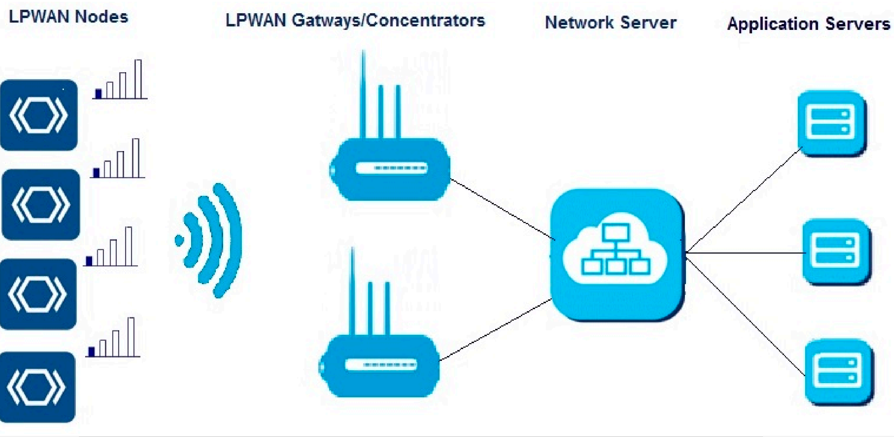

##  **Topologia delle reti di sensori cablata** 

Nelle **reti industriali** sono molto comuni topologie complesse a più livelli. Per le applicazioni di **nostro interesse** le **topologie** più adoperate sono quelle classiche a **stella** e a **bus**. **I collegamenti** dei sensori, in questo caso, si attestano sulle **porte** di **schede programmabili** che ospitano dispositivi a microcontrollore. Le stesse schede hanno, in genere, funzione di **gateway** verso la **rete di distribuzione** per cui posseggono almeno **due interfacce**: una **verso il BUS** ed un'altra, ethernet ed IP **verso la rete LAN**. Inoltre le schede ospitano le **librerie** SW di **gestione del BUS** e il codice per realizzare il **bridge** tra il **livello applicativo** in uso nella rete di sensori e quello in uso nella rete IP. Il **bridge** è generalmente realizzato o da librerie di **terze parti** oppure direttamente dal **programmatore** in C/C++ o, se la potenza di calcolo della scheda lo consente, mediante linguaggi di scripting come **Python** o **Node.js**. Si realizzano spesso anche in maniera **visuale** adoperando **framework** come **Nodered** e **Openhab**.

### **Esempi di collegamenti base con topologia a stella**:

  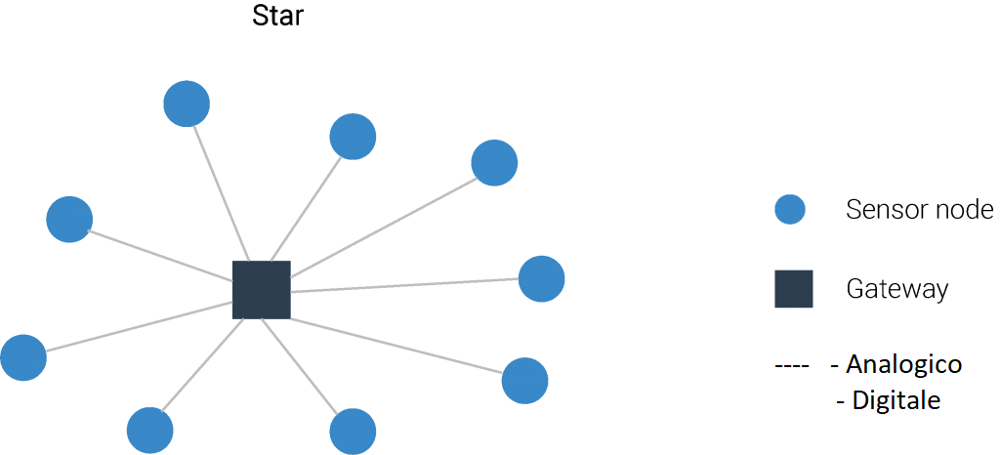
  
 
### **Esempi di collegamenti base con topologia a bus:**

 
 
[Dettaglio su collegamenti cablati a stella e a bus basici per domotica e sensoristica](cablatisemplici.md)

[Dettagli su stack cablati specifici per domotica e sensoristica](stackcablati.md)

[Dettaglio mezzi a BUS](protocollidiaccesso.md)
 
##  **Topologia delle reti di sensori wireless**     
 
Le reti di **sensori wireless** hanno una estensione nello spazio variabile e la loro **topologia** preferita è **a stella** o **a maglia**.

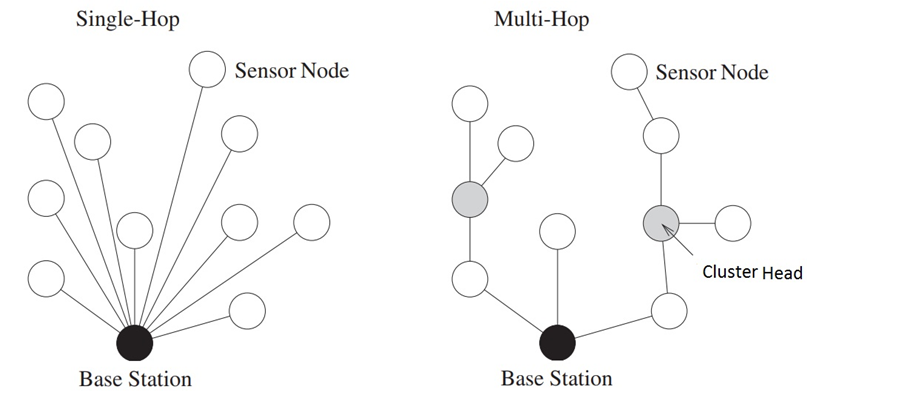

La **rete principale ethernet** può **estendersi nello spazio** secondo un'architettura (ad albero o ad anello) che può comprendere molti switch. Lo **smistamento completo** di una trama dati lungo la rete può prevedere una catena di **smistamenti successivi** lungo gli switch (hops) più o meno lunga. Nel caso di una rete ethernet questo non è generalmente un problema eccessivo nè dal punto di vista dei ritardi né rispetto a quello dei consumi (gli switch sono alimentati attraverso la rete elettrica).

La situazione potrebbe essere molto diversa nel caso delle **reti di sensori**. Queste sono spesso **wireless** e realizzate con dispositivi **alimentati a batteria** che si vorrebbe fosse sostituita idealmente  **non prima di un paio di anni**.

A seconda dello schema adoperato, dal **punto di vista energetico** non è indifferente considerare se **un comando** o **l'accesso in lettura ad un sensore** avvengono connettendosi direttamente **all'unico** dispositivo hub centrale (magari distante) o se avvengono connettendosi **al più vicino** di una cascata di nodi:
- **Hop singolo**: ciascun nodo del sensore è collegato all'**unico gateway centrale** posto generalmente in **posizione baricentrica** rispetto a tutti i dispositivi. Sebbene sia possibile la trasmissione a lunga distanza, il consumo di energia sarà significativamente superiore a quello speso per la misura del valore del sensore e per la sua elaborazione. Tecnica molto utilizzata per le **grandi distanze** dai gateway **LoraWan** e **Sigfox**, ma anche dalle BS (Base Station) **NB-IoT**  e **LTE-M** del 5G. Mentre per le **medio-piccole** è adoperata dagli AP **WiFi** e **Bluetooth BLE** in **modalità infrastruttura** (non ad-hoc).
- **Hop multiplo**: esiste un percorso verso i nodi terminali passando attraverso dei nodi intermedi. L’energia che un **singolo dispositivo** impiega per raggiungere **un nodo remoto** (ad esempio per accenderlo) si limita a quella per raggiungere il **nodo più prossimo**. Su reti mesh (magliate) di **grandi dimensioni** anche questa energia può essere non trascurabile. Su **reti indoor** è invece la soluzione decisamente **più conveniente** dato che spesso **il primo** dispositivo di smistamento raggiungibile (router o switch) non è a più di un metro di distanza mentre quello in **posizione baricentrica** può essere anche a 10-50m di distanza.

Le reti di sensori wireless (WSN) ad **hop multiplo** in realtà sono di **due tipi** di base più una loro **ibridazione**:
- a **stella gerarchica** In questa categoria, molto popolare è il protocollo Low Energy Adaptive Clustering Hierarchy **(LEACH)**. In LEACH i nodi dei sensori sono divisi in diversi **cluster**. In ogni cluster, il nodo con il livello di energia **più alto** è generalmente scelto come la **testa del cluster** o CH. I CH cono **centro stella** delle comunicazioni con funzione di **aggregazione** e **compressione** dei dati provenienti dai diversi sensori per **ridurre** il numero di **messaggi trasmessi** alla destinazione. Il **ruolo del CH** viene **ruotato** allo scopo di distribuire il carico energetico tra i sensori. Benché abbia una **grande efficienza energetica** ha delle limitazioni dovute ad alcune ipotesi di progetto. Una di queste queste, il vincolo che i nodi abbiano una potenza di trasmissione tale da poter sempre raggiungere la BS, lo rende **inadatto a reti estese**. Ritenuto attualmente particolarmente adatto ai **requisiti di una WSN** è invece il protocollo **IETF RPL**. Progettato per le reti **6LoWPAN** è un protocollo di tipo **distance vector** che genera, attraverso lo scambio di messaggi DV con i nodi vicini, un albero di instradamento ottimo **unico** per tutti i nodi avente per **radice** la BS (gateway). E' il protocollo di routing adottato da molti framework per IoT come **TinyoS** o **RIOT**. Anche le **piconet** nelle reti di dispositivi **Buetooth** (IEEE 802.15.1) utilizzano una loro implementazione di routing gerarchico.
- a **maglia** anche detti **flat** o **peer to peer**. Rete **omogenea** di dispositivi in cui tutti i nodi di smistamento (router) **sono simili** in termini di **energia**, **risorse di calcolo** e **memoria**. In questo caso  **ogni nodo** si calcola **il proprio** albero di instradamento ottimo per raggiungere gli altri nodi e la base station. Gli alberi, avendo, di volta in volta, per **radice un nodo** differente sono generalmente anch'essi diversi. Il protocollo di instradamento è spesso distribuito e dinamico e, rispetto all'altra soluzione, garantisce **percorsi ottimali** per **tutti i nodi**, **non solo** per la base station. Un protocollo per reti flat molto usato è **AODV** ed è un derivato per reti ad-hoc del protocollo **distance vector**. Generalmente i protocolli flat mostrano **migliori prestazioni complessive** in termini di **banda** e **ritardo** ma il loro **consumo energetico** **molto elevato** riduce la durata di attività di ciascun **nodo router** a meno che esso non sia **perennemente alimentato**. Tecnica adoperata dai dispositivi **Zigbee** (IEEE 802.15.4).
- **mista** delle precedenti, ovvero **albero di cluster** dove un **cluster** è formato da una **rete a maglia** di piccole dimensioni. Viene così realizzata una rete peer-to-peer con un **minimo overhead** di routing, proprietà che induce un **più basso consumo** dei dispositivi router. Il **routing interno** tra i nodi interni al cluster è con con alberi di instradamento **individuali** per ogni nodo. Il **routing esterno** tra i cluster è con un albero di instradamento **unico** per tutti cluster (spanning tree ottimo). Anche questa tecnica è adoperata dai dispositivi **Zigbee** (IEEE 802.15.4).

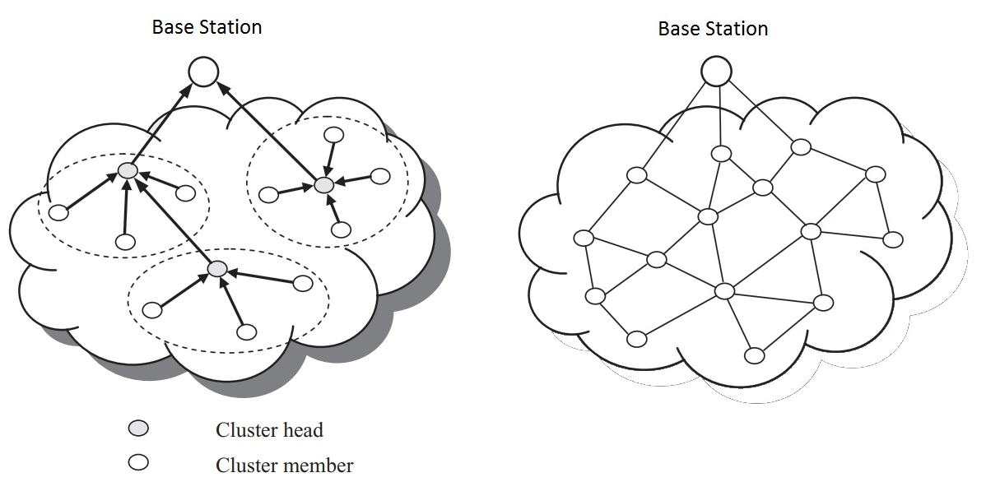

## **Consumi di una rete WSN**

Un'altra funzione **potenzialmente energivora**, dopo il **routing**, è il **polling dei sensori** ovvero la loro lettura periodica con annessa **trasmissione in remoto** dei dati. In questo caso se il **primo nodo** di smistamento della catena è parecchio distante (è il caso di tecnologie outdoor come LoraWan o Sigfox) o sebbene indoor si adopera una **trasmissione** in una **tecnologia  energivora** (come è in modalità standard il WiFi) allora sono possibili almeno due **soluzioni operative** per abbattere i consumi:
- **allungare l'intervallo di polling** facendolo passare dall'ordine dei secondi a quello dei minuti o delle ore.
- **memorizzare le misure in locale** sul dispositivo e, ad intervalli regolari adeguatamente lunghi, inviare dei **dati aggregati nel tempo** come **medie e varianze** o statistiche in genere.

Quasi **tutte le tecnologie wireless** poi permettono di mettere, nell'intervallo di tempo tra una misura e l'altra, il dispositivo in modalità di **sleep** o **standby** profondo che **rallenta** di molto il clock della CPU permettendo un grande **risparmio di energia**.

Il **consumo di energia** è generalmente proporzionale alla **velocità di trasmissione** e alla lunghezza dei messaggi. Tecnologie **general purpose** che sono **ottimizzate** per la trasmissione di **file o stream** più che di **brevi messaggi** in genere sono più complesse e esibiscono consumi **più elevati**.

##  **Classificazione delle tecnologie WSN in base a velocità e copertura**    

Il **grafico sotto** mostra **il posizionamento** delle varie tecnologie wireless che lavorano in **banda ISM** in base alla **bitrate** e alla **distanza** e potrebbe essere usato come **tassonomia di riferimento** (classificazione) delle varie teconologie proprio in base a **queste proprieta**. Al netto di qualche sovrapposizione, sono abbastanza distinguibili **tre zone**: 
- **corto raggio**. A distanze brevissime ci stanno i sensori **RFID**, **NFC** e anche **BLE** utili per le **BAN** (Body Area Network), il tag degli oggetti, il  **tracciamento** di persone ed oggetti e il riconoscimento. **Bluetooth** si differenzia per il tipo di servizio, cioè la **connessione  punto** punto diretta tra dispositivi, che per le distanze (da 10m a 100m) tipiche di una **PAN** (Perosnal Area Network). **BLE**, **6LowPan** e **Zigbee** sono le tecnologie principali con cui entro i 100m si realizzano **WSN a basso consumo**. **BLE** in particolare, fornisce anche servizi di  **tracciamento** e **posizionamento indoor**. Possono essere tutti usati sia indoor che outdoor ma indoor forniscono servizi che altre tecnologie hanno difficoltà a fornire con uguale semplicità. 
- **medio raggio**. E' il dominio del WiFi e della telefonia cellulare intesa come **modem dati a pacchetto**. Sono tipici in quest'ambito servizi **M2M** (Machine to Machine). Il 5G ha incorporato le tecnologie preesistenti **Cat-NB Narrowband IoT (NB-IoT)** and **Class M LTE (LTE-M)** che offrono servizi a **basso bit rate**, anche se a **consumi** significativamente **superiori** rispetto a LoraWan, però le **basse latenze** li rendono adatti ad **applicazioni mission critical** quali **robotica**, **guida autonoma** e **telecontrollo remoto**.  Una novità recente è l'introduzione delle **reti LTE private** (RAN private), cioè l'installazione di infrastrutture di telefonia cellulare private che possono essere **licensed** o **ulicensed**, cioè utilizzare o meno frequenze licenziate in concessione all'operatore o lavorare nella **banda comune NR-U** libera e simile concettualmente alla **banda ISM**.  Le **RAN private** possono essere anche **dipendent o indipendent** a seconda che siano gestite direttamente o meno dall'operatore telefonico. Il **WiFi** può realizzare reti di **notevoli dimensioni** (città intere o grandi aree rurali) ma ogni dispositivo ha range di copertura limitato (tipicamente 25m). E' possibile realizzare anche con il wifi una copertura di **tipo cellulare** che supporti il **roaming** cioè la **mobilità dei dispositivi**. Tutte queste tecnologie richiedono una **infrastruttura** (cablata o wireless) **complessa** e al momento dai **consumi elevati** soprattutto per dispositivi come i sensori. Se l'interesse preminente è il **basso consumo** e la **semplicità della rete** si rientra nella categoria delle soluzioni **LPWA** che, al momento, taglia fuori il wifi in favore di **LoraWan** e **NB-IoT**, per citare le tecnologie più conosciute ed adoperate. 
- **lungo raggio**. **LPWAN** (Low Power Wide Area Network) garantiscono una trasmissione a **lungo raggio** (da qualche chilometro a qualche decina di chilometri), un **consumo energetico contenuto** per la trasmissione/ricezione dati e un **basso costo** di realizzazione dei dispositivi al prezzo di una **ridotta velocità** di trasferimento dati (poche decine di kilobit al secondo). Forniscono anche **servizi outdoor** di **posizionamento** e **tracciamento** di oggetti. Sono adatti sia per applicazioni indoor che outdoor ma **outdoor** forniscono servizi che altre tecnologie hanno difficoltà a fornire con uguale semplicità. L'infrastruttura è leggera dato che anche migliaia di dispositivi possono essere serviti da un'unica BS (Stazione Base) chiamata Gateway. Il resto dell'infrastruttura può essere realizzato semplicemente in house e utilizzato ancora più semplicemente se realizzato in cloud. Le principali **tecnologie LPWA** attualmente disponibili sono **LoraWan**, **Sigfox** e, recentemente, **NB-IoT**.  **VSAT** è una tecnologia satellitare piuttosto datata ma a basso costo e disponibile ovunque nel globo, è utilizzata in regioni rurali, spesso con alimentazione solare.

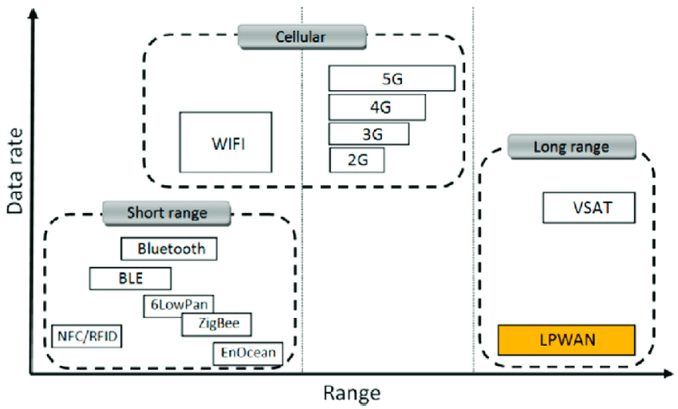

## **Interfaccia radio**

Il **mezzo trasmissivo radio** è partizionabile in **frequenza**, **tempo**, **spazio** e **potenza**. Delle grandezze precedenti quella in assoluto **più limitata** è la **frequenza** essendo **proprietà dello Stato** e ceduta in **concessione** sotto ben precise condizioni (**licenze**). Questo è il motivo per cui, nel realizzare qualsiasi tipo di comunicazione radio, per prima cosa, bisogna cominciare col **riservare** una porzione del campo delle **frequenze radio** (spettro) **allocando** degli intervalli di frequenze detti **canali**. 

I **canali** sono allocabili all'interno di intervalli di frequenze dette **bande**. Le bande si dividono in **licenziate** cioè quelle per le quali bisogna acquistare dallo stato la **concessione** per trasmetterci e in quelle **non licenziate** per le quali, sotto ben precise **condizioni tecniche** (modulazione, potenza, duty cicle, ecc.), o **vincoli burocratici** (possesso di autorizzazioni o patenti presso autorità regolatorie) la trasmissione è **libera**. Una di queste ultime è la banda **ISM** (Industrial Scientific Medical). L'**ampiezza del canale** dipende dalla **tecnologia adoperata**. Nelle bande ISM è inoltre possibile trasmettere **senza particolari restrizioni** burocratiche (acquisto di licenze o patentini), in particolare, **senza avvisare** nessuna autorità ma semplicemente utilizzando **dispositivi certificati** cioè che rispondono ai regolamenti tecnici in vigore **nella nazione** in cui sono adoperati. La libertà di accesso alla banda ISM è il motivo per cui essa è **mediamente affollata** e le sue trasmissioni **soggette ad interferenze** più o meno intense. Le **interferenze** sono **gestite** utilizzando **modulazioni robuste alle interferenze** e adoperando **segnali** a bassa **densità spettrale**, basso **duty cicle** e, soprattutto, **potenza limitata**. 

Le **bande ISM** interessanti **in Italia** per l'**IoT** sono quelle centrate a **433MHz** (Lora e Sigfox), **868MHz** (Lower EU band a 867-869 MHz per Lora e Sigfox), **915MHz** (Upper EU band a 867-869 MHz per Lora e Sigfox), **2,4GHz** (WiFi, Zigbee), **5GHz** (WiFi, Zigbee), **6GHz** (WiFi6, NB-IoT, 5G).

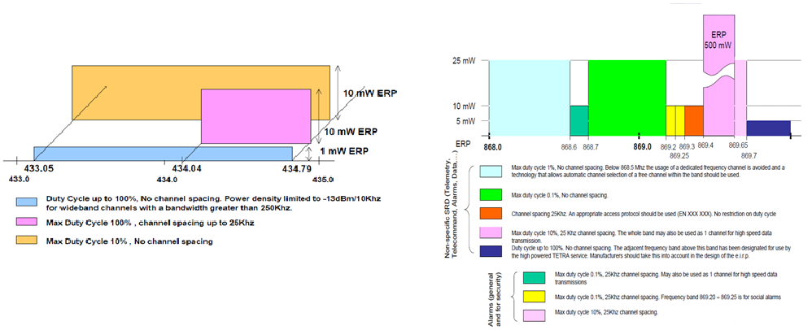
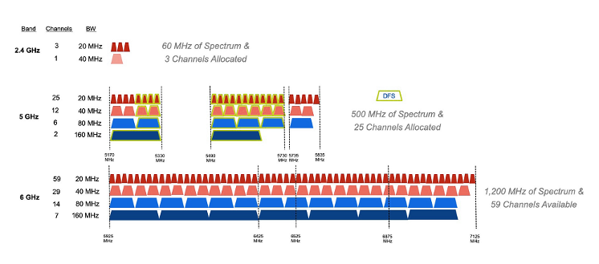

Recentemente alla banda ISM si è aggiunta un'altra **banda non licenziata**, la **NR-U** centrata all'incirca intorno ai **6GHz** che è stata assegnata al **WIFI 6** (IEE 802.11ax) e alle **RAN (Radio Access Network)** della telefonia cellulare che possono essere o **gestite dall'operatore** di telefonia o di **proprietà dell'utente** che così realizza una **rete 5G privata**. La **potenza** di un AP in banda NR-U non può eccedere i 30dBm per cui una **BS 5G** crea un'**interferenza** analoga a quella di un **AP wifi**. A parità di area, **densità** di distribuzione degli AP 5G dovrebbe essere circa la metà del WIFi ma con **costi** per dispositivo molto maggiori.

[Dettaglio mezzo radio](mezzoradio.md)

[Dettaglio banda ISM](ism.md)

## **Servizi di accesso radio per WSN**

Abbiamo visto che l'**interfaccia radio** si accede **allocando per primo** un **unico canale radio** di una multiplazione **FDM**. L'allocazione può essere sia **statica** (eseguita dal sistemista) che dinamica cioè variabile nel tempo ed **automatica**.

**Successivamente** il canale FDM **potrebbe** essere ulteriormente **partizionato in gruppi di utenti** tutti collegati ad uno **stesso dispositivo**. I dispositivi (ad es. gli AP wifi di uno stesso palazzo) interferiscono tra loro ma le comunicazioni sono rese **distinguibili e private** mediante multiplazione a spettro espanso **CDM** (Code Division Multiplexing) che associa un SSID diverso ad ogni dispositivo. Ciò è dovuto al fatto che usiamo uno dei canali della banda ISM su cui non esistono coordinamento e controllo alcuno. Anche se questa tecnica è adesso usata solo in dispositivi LPWA mentre WiFi 6 e telefonia mobile 5G preferiscono ad essa la tecnica OFDM.

[Dettaglio multiplazioni statiche](multiplazioni.md)

[Dettaglio TDM statico](tdmstatico.md) 

[Dettaglio TDM statistico su mezzi punto-punto](tdmstatistico.md) 

[Dettaglio TDM statistico su mezzi broadcast (BUS e radio)](protocollidiaccesso.md)

[Dettaglio tecnologie di accesso al mezzo radio](accessoradio.md)

### **Classificazione dei servizi radio**

Qualunque sia la modalità di accesso, alla fine, su **questo canale risultante**, privato ed eventualmente associato ad un certo **SSID**, a seconda del **servizio richiesto**, **possono parlare**:
- **due interlocutori**.
- **molti interlocutori**

In entrambi i casi sono possibili **due tipi** di **servizio** di **accesso radio**:
- **servizio sincrono**. Viene realizzato con un **TDM statico** ed è adatto **operazioni periodiche** come il **polling** di un grappolo di sensori.
- **servizio asincrono**. E' adatto a **operazioni una tantum**, cioè di cui non si riesce a sapere **in anticipo** l'occorrenza (accadere nel tempo), ad esempio il comando di accensione di una lampadina.  In questo caso riservare uno slot temporale ad una sorgente che per la maggior parte del tempo non lo utilizzerebbe è certamente **uno spreco**. Si preferisce utilizzare la tecnica di accesso **TDM a contesa** con accesso al canale arbitrato dai protocolli **ALOHA** O **CSMA/CA**.

Ulteriori **differenziazioni del servizio** distinguono tra:
- la presenza o meno di una funzione di **conferma** dei messaggi trasmessi (protocollo confermato).
- la presenza o meno di **classi di prestazione**, magari abbinate ad uno o più dei servizi precedenti.
    
La **conferma** potrebbe pure essere gestita soltanto dal **livello applicativo** (non dal protocollo LoraWAN). Sovente, nella rete di distribuzione IP è presente un server col ruolo di **broker MQTT** a cui sono associati:
- su un **topic di comando** (verso il dispositivo terminale):
    - il dispositivo **sensore** è registrato sul broker col ruolo di **publisher** perchè vuole usare questo canale di output per **inviare il comando** verso l'attuatore 
    - il dispositivo **attuatore** è registrato sul broker con il ruolo di **subscriber** perchè è interessato a ricevere, su un canale di input, eventuali comandi di attuazione (motori, cancelli). 
-  su un **topic di feedback** (dal dispositivo terminale, verso il broker):
    - il dispositivo **attuatore** è registrato sul broker con il ruolo di **publisher** perchè intende adoperare questo canale di output per **inviare il feedback** con il proprio stato ad un **display** associato al sensore di comando.
    - il dispositivo **sensore** è registrato sul broker con il ruolo di **subscriber** perchè è interessato a ricevere, su un canale di input, eventuali **feedback** sullo stato dell'attuatore per **mostrarli** all'utente. In questo caso è demandato all'utente, e non al protocollo, **decidere** se e quante volte ripetere il comando, nel caso che lo stato del dispositivo non sia ancora quello voluto.
  
Molti sistemi (wifi, zigbee, bluetooth BLE, LoRaWan, Sigfox) permettono di impostare **contemporaneamente**, sulla **stessa interfaccia** radio, un **servizio sincrono** mediante **TDMA** per le sorgenti che eseguono il **polling** di sensori e un **servizio asincrono** con **ALOHA** o **CSMA/CA** per le sorgenti che devono inoltrare il **comando** di un pulsante di accensione di un attuatore. Ciò è ottenuto **attivando** sul canale la funzionalità **beacon** con le cosiddette **superframe**.

Un **beacon** contiene informazioni che **identificano** la rete e i suoi servizi nonché una sequenza di **bit di sincronizzazione**. Vengono trasmessi **periodicamente**, servono ad **annunciare** la presenza di una LAN wireless e a **sincronizzare** i membri sui suoi servizi (sincroni e asincroni).

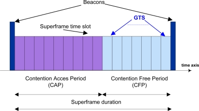

In una **supertrama** due **beacon** fungono da **limiti** (iniziale e finale) e forniscono la **sincronizzazione** con altri dispositivi e informazioni di configurazione. Un superframe è costituito da un certo numero di **slot** temporali divisi in **due gruppi**. Il **primo** è riservato per le sorgenti **asincrone** che accedono in **modalità a contesa** con i protocolli di arbitraggio ALOHA o CSMA, **il secondo** è dedicato alle sorgenti **sincrone** che, in quella porzione della trama, hanno uno **slot** esclusivamente **dedicato** a loro per tutto il tempo in cui esse **risultano attive**.

[Dettaglio classi di servizio LoraWAN](lorawanclasses.md)

##  **Stack wireless specifici per IOT**

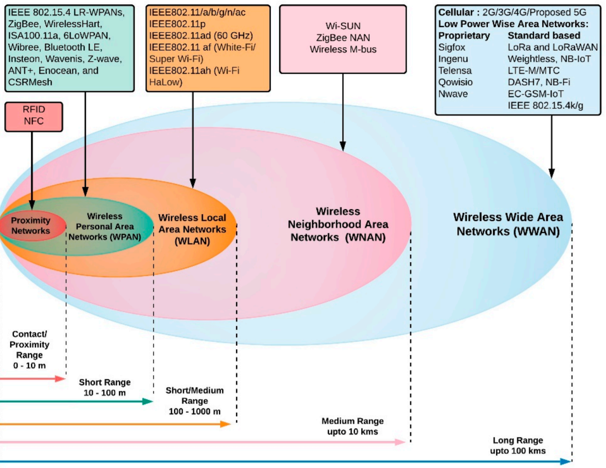

Ci si potrebbe chiedere se è proprio necessario sapere i **dettagli sui protocolli** adoperati da questo o quel dispositivo. La risposta è legata al **livello di astrazione** con cui la nostra applicazione **vede** la **risorsa rete**. 

Con alcuni protocolli l'**applicazione** ha della rete e dei suoi protocolli una visione che si può ridurre all'**elenco di servizi** di livello applicativo che lo **stack espone**, per cui, quando l'applicazione utilizza un servizio, sullo stack viene scelto, strato per strato, il **protocollo più adatto** per realizzarlo. Addirittura in Blutooth BLE e in Zigbee i **servizi applicativi**, cioè la definizione dei **casi d'uso** come accendere una lampadina o aprire una tapparella, sono dettagliatamente **catalogati** e **definiti** nello stack in strutture dati dette **profili**.

Normalmente solo la **parte fisica** dello stack è implementata in **HW** mentre tutto il resto dello stack è realizzato in **SW**. Molte volte, per progettare una rete industriale di sensori, si mantiene **solo il chip** con il suo livello fisico, mentre per i **livelli superiori** si preferisce utilizzare uno stack di protocollo alternativo, **diverso da quello originale**, realizzando, in pratica, una vera e propria **ibridazione**. In questo caso si possono ancora utilizzare **stack standardizzati** da organizzazioni transnazionali come IETF o IEEE ma questi possono essere molto articolati per cui, all'interno dello stack, un **sistemista** sceglie la classe di protocolli che ritiene più adatta alle **proprie esigenze**. Una **proprietà**, spesso non garantita dalle grandi suite come Zigbee o LoraWan, potrebbe essere l'utilizzo del **livello di rete IPV6**, proprietà che potrebbe permettere la connessione diretta del dispositivo **in Internet** trasmettendo, senza modifiche, i suoi messaggi su reti LAN o WiFi. **Un'altra motivazione** potrebbe essere l'interesse a non adoperare la parte, di per se complessa, dello stack che gestisce la rete di molti dispositivi ma soltanto realizzare una **connessione punto punto**, cioè un **ponte radio numerico** tra due dispositivi e per far ciò un semplice supporto di rete IPV6 (senza funzioni di routing) potrebbe essere sufficiente. 

La **parte logica** dei due stack sotto (LoraWan a sinistra e Zigbee a destra) potrebbe essere sostituita con IPV6 inserendo il protocollo 6LowPAN. La **parte fisica** di entrambi verrebbe mantenuta perché realizzata **in HW**. Nel caso di LoraWan l'implementazione HW è **proprietaria** è costruita da una sola azienda (Semtech) e non è standardizzata industrialmente. Nel caso dello Zigbee la **parte fisica** è **standardizzata** con le sigla **802.15.4**.

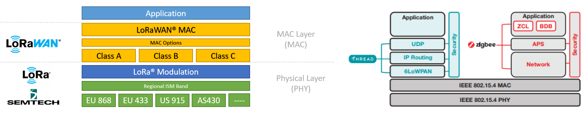

Molti **framework per IoT** come **TinyOS**, **Contiki** e **RIOT** posseggono una **struttura modulare** che permette loro di includere, senza particolare sforzo, **stack personalizzati** di protocolli  in maniera tale da adattarli alle esigenze più particolari svincolandosi dagli **stack protocollari completi** certificati dall'industria (Zigbee, LoraWan). 

[Dettagli su stack wireless specifici](stackwirelesspecifici.md)

[Dettagli su reti cellullari private](ranprivata.md)

##  **Canali di comunicazione principali in una rete di sensori**

**Riassumendo**, sono necessari almeno due canali di comunicazione che, insieme, complessivamente, realizzano la **comunicazione tra sensori e gestore** delle informazioni:
- **tra sensori e gateway** verso la LAN realizzato dalle sottoreti dei sensori:
    - **A filo** con accesso:,
        - **singolo dedicato**: un filo o un canale per sensore in tecnologia SDM o TDM (multiplexer, UART, porta analogica, porta digitale)
        - **multiplo condiviso** cioè tramite mezzo broadcast (BUS) con **arbitraggio** di tipo **master slave** (Modubus, Dallas, I2C, SPI) o **peer to peer** (CanBUS, KNX, ecc) o misto (ProfiBUS). 
        - Spesso **bidirezionale** specie se in presenza di attuatori
        
    - **Senza filo** cioè wireless con accesso:
        - **singolo dedicato**: link punto-punto analogico digitalizzato con AX25 oppure digitale con un radio modem (Yarm ACME Systems, 6LoWPAN, LoRa) resi full duplex con l'uso di multiplazioni FDM o TDM.
        - **Multiplo e condiviso** (BUS) di tipo half duplex reso bidirezionale (full duplex) tramite tecniche asincrone CSMA/CA (Zigbee, wifi, LoRa) o sincrone TDMA (Zigbee, Bluetooth).
- **Tra gateway e gestore** delle informazioni realizzato dalla rete principale:
     - Tipicamente tramite **LAN ethernet** e architettura **Client/Server**
     - Interazioni di tipo PUSH o PULL
     - Paradigma Request/Response (HTTPS, COAP), Publish/Subscriber (MQTT) oppure canale persistente bidirezionale (BSD socket o WebSocket)
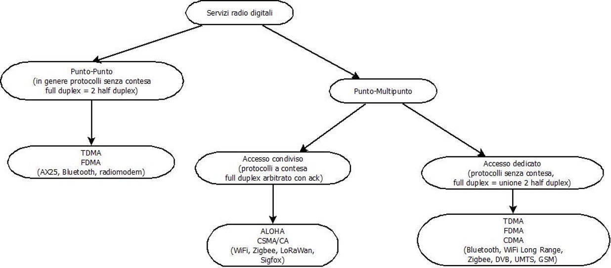

**Sitografia:**

- https://www.u-blox.com/en/publication/white-paper/short-range-low-power-wireless-devices-and-internet-things-iot
- https://www.digikey.it/it/articles/how-to-quickly-start-low-power-wireless-iot-sensing
- https://www.researchgate.net/publication/333226782_Proposal_for_the_Design_of_Monitoring_and_Operating_Irrigation_Networks_Based_on_IoT_Cloud_Computing_and_Free_Hardware_Technologies
- https://www.electronicshub.org/wireless-sensor-networks-wsn/
- http://www.iosrjournals.org/iosr-jece/papers/Vol.%2011%20Issue%206/Version-1/H1106014856.pdf
- https://it.wikipedia.org/wiki/Low_Energy_Adaptive_Clustering_Hierarchy
- https://repository.vtc.edu.hk/cgi/viewcontent.cgi?article=1043&context=ive-eng-sp
- https://it.wikipedia.org/wiki/Ad-hoc_On-demand_Distance_Vector
- http://tesi.cab.unipd.it/28281/1/Tesi.pdf
- https://citeseerx.ist.psu.edu/viewdoc/download?doi=10.1.1.736.8723&rep=rep1&type=pdf
- https://www.researchgate.net/publication/316563960_Comparative_study_and_simulation_of_flat_and_hierarchical_routing_protocols_for_wireless_sensor_network
- https://dpmrassociation.org/dPMR-Spectrum-Efficiency.html
- https://en.wikipedia.org/wiki/ALOHAnet
- https://research-information.bris.ac.uk/ws/portalfiles/portal/110218284/duquennoy17tsch.pdf
- https://hal.inria.fr/hal-01282597/file/iwipcps.pdf
- https://it.scribd.com/document/462861362/Dash7Surveyfinalreport-pdf
- https://openwsn.atlassian.net/wiki/spaces/OW/overview
- https://www.mdpi.com/2224-2708/2/2/235/htm
- https://www.ncbi.nlm.nih.gov/pmc/articles/PMC6806188/
- https://en.wikipedia.org/wiki/BACnet
- https://it.wikipedia.org/wiki/KNX_(standard)
- https://optigo.net/blog/which-better-bacnet-lonworks-modbus-or-knx
- https://en.wikipedia.org/wiki/List_of_automation_protocols
- https://iot.eetimes.com/private-lte-networks-for-critical-iot-applications/
- https://www.samsung.com/global/business/networks/insights/blog/0503_how-is-a-private-5g-network-different-from-a-public-5g-network/
- https://www.grandmetric.com/2018/03/15/how-does-ofdm-work/
- https://www.asus.com/it/support/FAQ/1042759/
- https://www.gta.ufrj.br/ensino/eel879/trabalhos_vf_2014_2/rafaelreis/ofdma_scfdma.html
- https://m.eet.com/media/1072709/LTE_Chapter2_38to42.pdf
- https://www.wwt.com/article/wi-fi-6e-the-next-generation-of-wireless/
- https://www.netmanias.com/en/post/oneshot/14103/5g/5g-protocol-stack-user-plane-control-plane
- https://www.netmanias.com/en/post/blog/14500/5g-edge-kt-sk-telecom/7-deployment-scenarios-of-private-5g-networks
- https://www.sdxcentral.com/5g/definitions/5g-network-slicing/
- https://www.zte.com.cn/global/about/magazine/zte-technologies/2018/1/Special-Topic/5G-network-Slicing.html
- https://en.wikipedia.org/wiki/5G_network_slicing
- https://www.nokia.com/about-us/newsroom/articles/open-ran-explained/
- https://www.techplayon.com/o-ran-fornthual-c-u-sync-mgmt-planes-and-protocols-stack/
- https://www.techplayon.com/o-ran-fronthaul-spilt-option-7-2x/
- https://www.gruppotim.it/tit/it/notiziariotecnico/edizioni-2019/n-3-2019/N3-Open-RAN-dalle-specifiche-ai-trials/approfondimenti-1.html
- https://www.cnit.it/wp-content/uploads/2020/09/Spieghiamo-il-5G-200803.pdf
- https://www.mdpi.com/1999-5903/12/3/46/htm
- https://www.radiomakers.it/news/bande-libereguide
- https://www.extremenetworks.com/extreme-networks-blog/what-is-a-clear-channel-assessment-cca/
- https://www.gsma.com/spectrum/wp-content/uploads/2020/04/3.5-GHz-5G-TDD-Synchronisation.pdf

>[Torna all'indice generale](index.md)
    

