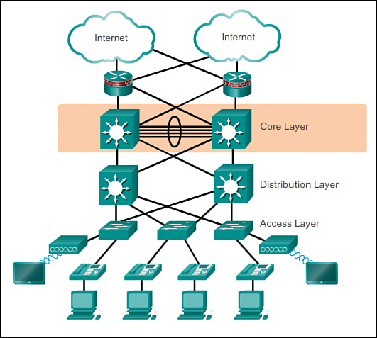
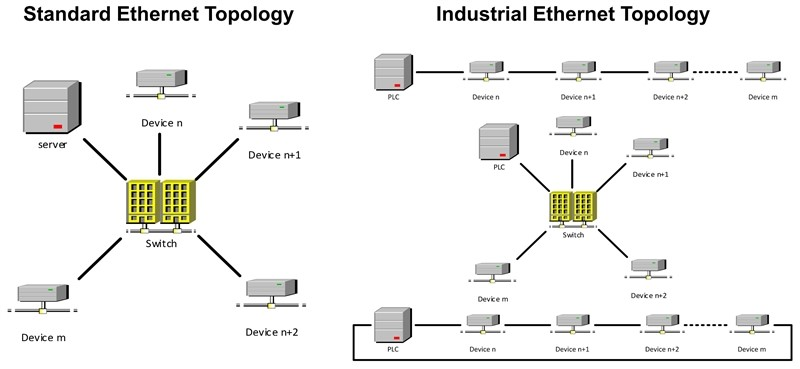
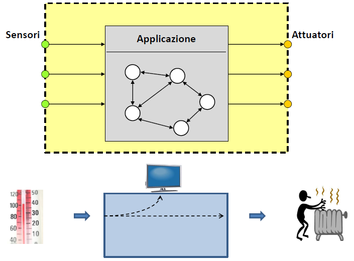
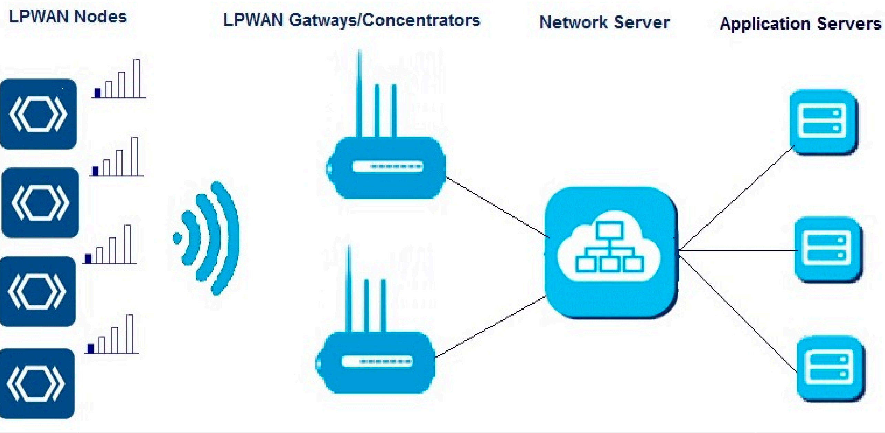
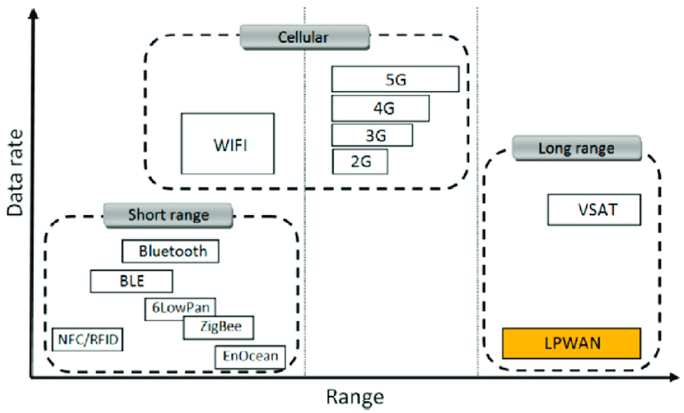
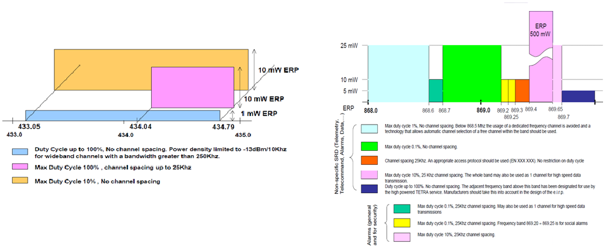
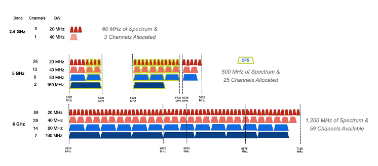
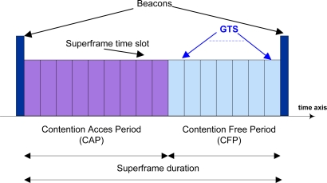
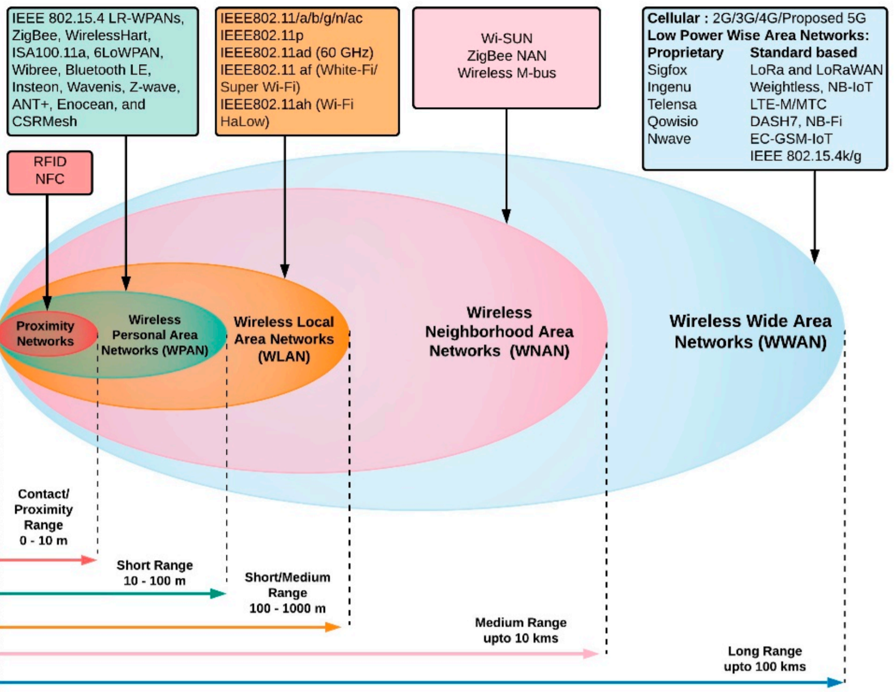
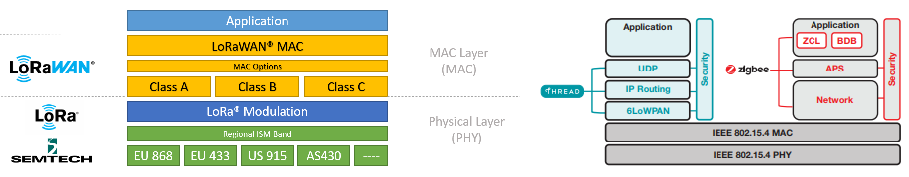

>[Torna all'indice generale](index.md)

## **Reti ethernet da ufficio**

Le **reti di ufficio** sono realizzate con tecnologie ethernet a topologia fisica a stella o a stella gerarchica (albero). Lo **switch** ha la funzione di:
- **concentratore di dispositivi**. Un **collegamento punto punto** è dedicato ad ogni dispositivo e occupa esattamente una porta sul concentratore. Servono tante porte (e tanti cavi) quanti sono i dispositivi **in prossimità** del concentratore. L'**uso esclusivo** di un cavo da parte di un dispositivo è detto **microsegmentazione** e di fatto azzera il problema delle collisioni. Se la porta è **condivisa da più dispositivi** tramite un **collegamento a BUS** o un **HUB** si dice che lo switch realizza una **microsegmentazione**, situazione in cui le collisioni ci sono e sono **arbitrate** dal protocollo Ethernet (di tipo CSMA/CD) abilitato sulla porta.
- **commutazione** cioè lo **smistamento** di una **trama MAC** tra le **dorsali** della rete LAN che, comprendendo certi switch e non altri, realizza un **percorso** (path) fino ai router di confine della stessa (**gateway**).

**Più switch** collegati insieme **realizzano una rete LAN** che si estende fino al primo router che essi incontrano. I **router** sono i dispositivi che, di fatto, **delimitano** una LAN Ethernet.

Lo **switch** è generalmente regolato dal **protocollo STP** che, secondo lo standard, limita i collegamenti a cascata a poche unità (profondità nominale di 3 dispositivi secondo standard EIA/TIA).

Il **cablaggio** può risultare **oneroso** in presenza di un elevato numero di dispositivi poichè richiederebbe l'impiego di **un cavo a parte** per ogni sensore. Per questo motivo dispositivi di commutazione e architettura **tradizionali** sono generalmente ritenuti poco adatti per la realizzazione delle **ampie reti di sensori** diffuse in ambito industriale.

[Principali tecnologie di reti di sensori](archeth.md)

## **Reti ethernet industriali**

Le **reti industriali o ferrotramviarie** sono anch'esse a **tecnologia ethernet** ma, oltre la tradizionale **topologia a stella**, per connettere tra loro i dispositivi **terminali** e per collegare tra loto **più switch** spesso utilizzano **topologia fisica a BUS o ad anello**.
Un **anello** è composto da lunghe **cascate** di switch collegati in serie ed equipaggiati con protocollo STP modificato o con altri protocolli proprietari.
Il **cablaggio**, in presenza di un cluster numeroso di dispositivi **risulta più economico** dato che con **un unico cavo** si possono collegare più switch.
Possibilità di topologie **ridondate a doppio anello** (treni, industria)

## **Reti di sensori e attuatori**

Spesso sono **reti miste** cioè composte da **sottoreti eterogenee**: 
- **più reti di sensori** costituite da dispositivi sensori e da nodi di smistamento. Sono spesso realizzate in tecnologie non IP proprietarie.
- **una rete centrale di distribuzione**. E' una rete IP e può essere una LAN, spesso interconessa ad Internet, oppure è Internet stessa.

 
 
Tra le due tipologie di reti ci sono dei **nodi di confine** aventi una interfaccia **nella rete di sensori** ed un'altra **nella rete principale IP**. Questi nodi **cerniera** sono detti **gateway** e devono trovare un modo di **rendere compatibili** i messaggi che circolano nelle due tipologie di reti, spesso realizzate con tecnologie **completamente diverse**.

#### **Rete di distribuzione**

La **rete principale**, **è di tipo ethernet** con dorsali fisiche a stella cablate e collegamenti periferici cablati o wireless WiFi. Ha principalmente la funzione di **distribuzione** dei dati **dai nodi gateway** con le reti secondarie **fino al server di gestione** dei dati. Va attentamente progettata perchè sia in grado di smaltire il traffico complessivo di **tutti i sensori**. Può diventare **critica** se, oltre ai sensori, sono presenti **sorgenti multimediali** quali **microfoni** o **telecamere** di videosorveglianza.

[Cablaggio rete LAN di ufficio](archeth.md)

#### **Rete di accesso ai sensori**

Le **reti di sensori** sono molto **eterogenee**. Tutte hanno un loro modo di **accedere al mezzo trasmissivo** stabilito dai rispettivi protocolli di **livello fisico**. Allo stesso modo, tutte hanno un loro modo di **fornire un servizio all'utente** in maniera più o meno astratta, più o meno espressiva, più o meno varia dal punto di vista della QoS cioè della qualità del servizio, stabilito dal protocollo di **livello applicativo**. 

Il **gap**, cioè il dislivello funzionale, tra il livello **fisico** e quello **applicativo** in genere è colmato da tutta una serie di **protocolli** il cui scopo è essenzialmente: risolvere determinati **problemi di rete** (indirizzamento, controllo di errore, routing, cifratura, ecc.), ottenere la **QoS richiesta dall'applicazione** (velocità, BER, tipo di interazione, ecc...). **Entrambi gli obiettivi** precedenti devono essere raggiunti **organizzando**, tra livello fisico e livello applicativo, una **pila (stack) di protocolli** che permette di raggiungerli rispettando i **vincoli** posti dall'**ambito di utilizzo** pratico della rete (consumi, dimensioni, distanze, facilità d'uso, ecc...).

[Dettaglio ES/IS](isvses.md)

[Dettaglio protocolli](protocolli.md)

[Dettaglio ISO/OSI](isoosi.md)

### **Reti di sensori non IP**

Lo **stack di protocolli OSI** è un **modello architetturale** di riferimento. Per **ogni strato** sono stati studiati nel tempo un gran numero di protocolli, ciascuno con i propri **pregi e difetti**. Un'**architettura reale**, quella che poi verrà standardizzata ed implementata in un dispositivo commerciale, per ogni strato della propria pila, sceglierà, tra i tanti disponibili in letteratura tecnica, un certo **tipo di protocollo** del quale realizzerà e standardizzerà la propria **particolare versione**. Attualmente, per **accedere ad Internet** e all'interno della maggior parte delle **reti locali LAN**, si adopera la cosiddetta suite **TCP/IP**. Ma le **reti di sensori**, per funzionare localmente al loro ambiente di lavoro, **non sempre usano** la suite TCP/IP. Inoltre, anche le reti di sensori che eventualmente lo adoperano, ai livelli inferiori come **i livelli data link e il livello fisico**, spesso utilizzano protocolli **diversi** da quelli che sono stati standardizzati per le LAN. 

#### **Livello applicativo standard**

In ogni caso, un qualsiasi **ente di telecomunicazioni internazionale** (IEE, IETF, ITUT, ecc.) o **alleanza di case produttrici** di dispositivi di rete (Zigbee, Bluetooth) o anche **singole aziende** (LoraWan e Sigfox), per realizzare reti di dispositivi utilizzabili direttamente dall'utente, devono **progettare** una **propria versione** dello **stack ISO/OSI** che includa anche i livelli superiori. Talvolta ci si ferma al tradizionale livello 6 di **presentazione** (LoraWan e Sigfox), altre volte si arriva persino a dettagliare il livello di **applicazione** (zigbee, BLE, Matter) attraverso la definizione sia del significato che del formato delle **misure** e dei **comandi** che queste reti trasportano (semantica). 

[Dettaglio interoperabilità tra reti di sensori](approfondimenti/interoperabilità_tra_reti_di_sensori.md)

#### **Formato dei messaggi**

**Misure** e **comandi** sono attualmente definiti sotto forma di **oggetti JSON** in formato ASCII. Questo dovrebbe garantire da un lato l'interoperabilità tra reti di sensori diverse, dall'altro l'interoperabilità con sistemi terzi che si occupano della pubblicazione dei dati o della loro eleborazione statistica. Il fatto che il formato scelto sia chiaro, testuale ed autoesplicativo è sicuramente un vantaggio nella rete di **distribuzione**, diventa poco pratico, o del tutto inutilizzabile, in reti di **accesso** ai sensori che possono trasmettere soltanto messaggi radi e molto brevi, quali quelle che operano in **banda ISM**. Gli oggetti JSON scambiati nella rete di distribuzione vanno **progettati** in modo tale da includere la **semantica** di tutti i dispositivi IoT coinvolti nelle reti di sensori collegate, che di volta in volta, poi andrà **tradotta**:
- nella **semantica applicativa standard** prevista nello stack della rete di accesso in uso (ad es. Zigbee o BLE)
- in una **semantica custom** che sia una versione **più compatta** di quella in uso nella rete di distribuzione in modo da adattarla alla capacità trasmissiva molto limitata (poche decine di byte al sec) della rete di accesso ai sensori.

### **Gateway applicativo**

E' il dispositivo posto a cavallo tra la rete di accesso ai sensori e la rete di distribuzione. 

Il **gateway** ha tante **schede di interfaccia** quanti sono i **tipi diversi di BUS** a cui si collega. Inoltre il **gateway** deve possedere almeno **una interfaccia** capace di traffico ethernet (cablata o wifi) che lo colleghi alla **rete di distribuzione**. 

Alla **rete di distribuzione IP** si collegano, quindi, una o più **reti secondarie** che servono da **rete di accesso** per i dispositivi sensori o attuatori con **interfacce** spesso di tipo **non ethernet** che necessitano di un **gateway** di confine con possibili funzioni di:     
  - **Inoltro**, cioè smistamento dei messaggi da un tipo di rete all'altro di tipo L3 (**routing**) o di tipo L2 (**bridging**). L'inoltro del messaggio di un sensore può essere:
       - **diretto** nella rete di distribuzione tramite link fisico verso il dispositivo di smistamento pubblico (router o switch) più vicino.
       - **indiretto** tramite una dorsale virtuale, cioè un **tunnel**, verso il network server o verso un router di una WAN privata, realizzato, ad esempio, in maniera cifrata tramite un **client di VPN**, oppure in maniera non cifrata tramite un client di tunnel generico **GRE**.
  - **Traduzione di formato** dei messaggi da rete a bus a rete ethernet con eventuale realizzazione del **bridge** L4 tra il livello applicativo in uso nella rete di sensori e quello in uso nella rete di distribuzione.
  - **Interrogazione periodica** (polling) dei dispositivi nella rete di sensori (master di una architettura master/slave)
  - **Raccolta e memorizzazione** delle informazioni per essere trasferite in un **secondo momento** al server di gestione
  - **Protezione della rete di sensori**, cioè di firewall, soprattutto quando questa, tramite il gateway, si connette direttamente alla rete **Internet** mediante un **IP pubblico**.
    
[Dettagli gateway](approfondimenti/gateway.md)

## **Server applicativo**

In genere è localizzato all'interno della **rete principale** con una collocazione **on-premise** all'interno del sistema.

Tendenze sempre più diffuse portano al **trasferimento crescente di funzioni** anche sul **cloud**. Una **soluzione estrema** è quella di spostare **tutte le funzioni** sul cloud tenendo ben presente che un **guasto della connessione ad internet** causerebbe una cessazione delle **funzioni** di regolazione e controllo che sono state progettate per essere eseguite **centralizzate sul server**. Le funzioni gestite in maniera autonoma e peer to peer **completamente a bordo** dei dispositivi non dovrebbero risentire di particolari problemi.

In ogni caso è necessario un **server di gestione** con funzioni di:
- Processamento (elaborazione nuovo stato e comando attuatori)
- Memorizzazione (storage) ed estrazione (mining) delle informazioni
- Analisi dei dati per estrarre reportistica di aiuto alle decisioni (risparmio energetico)
- Pubblicazione in Internet delle informazioni su un un sito o su un Web Service (opendata)
- Segnalazione anomalie
- Backup dei dati e gestione disaster recovery di dati e servizi
- Aggiornamento via cavo o via etere (OTA) del firmware ai nodi
- Gestione della sicurezza

Queste prese in considerazione sono generalmente tutte funzioni di **livello applicativo** in quanto si limitano a gestire servizi.

## **Server di rete**

Il **network server** è comune in alcune tipologie di **reti wireless** LPWA ed è una componente di **back-end** responsabile dello **smistamento** verso gli utenti (routing applicativo) dei dati provenienti dai vari **gateway** configurandosi, quindi, come il **centro stella logico** di una  stella di gateway. Lo **schema logico** di una rete di sensori LPWA basata su **network server** quindi appare:

#### **Funzioni essenziali**

Il **network server** è anche responsabile dello svolgimento di alcuni **processi** di **controllo** e **gestione** della rete: 
- si connette a **più gateway** tramite una connessione TCP/IP protetta 
- esegue il **filtraggio** e l'eliminazione di eventuali **pacchetti duplicati**, dato che l'inoltro di uno **stesso messaggio**, da un **sensore** al network server, può avvenire anche passando per **più gateway** (inoltro basato sul **flooding**). Il Network Server poi si occuperà di effettuarne l'**inoltro** verso il **server applicativo**.
- decide **quale gateway** dovrebbe rispondere a un messaggio di quei nodi terminali che sono connessi **contemporaneamente** a più di un gateway.
- implementa la funzionalità di **controllo remoto** dei terminali remoti tra le quali fondamentale è la gestione della loro velocità mediante **adaptive data rate (ADR)**. Il network server assegna a ogni end node che si vuole connettere alla rete, un data rate e una potenza di uscita diversa a seconda della esigenza e della situazione:
    - un data rate maggiore e una potenza di uscita minore ai nodi terminali piu`vicini al  gateway  in  quanto meno suscettibili alle interferenze (trasmissione rapida e a bassa potenza). 
    - un data rate piu`basso (minore suscettibilità ai rumori) e una maggiore potenza di uscita solo ai nodi che si trovano a distanze notevoli dal gateway (trasmissione lunga e a alta potenza).
- Inoltra messaggi di richiesta di adesione (join) e di accettazione di adesione tra i dispositivi finali e il server di adesione (Join Server).

#### **Hub di gateway**

Il **server di rete** è collegato ai **gateway dei sensori** mediante una normale **rete IP** mediante **protocollo di livello applicativo**. E' un **nodo di smistamento finale** e, in questo senso, può essere considerati come dei **router di livello applicativo**. In pratica è il **centro stella** di una **stella di gateway** (o base station) che a **loro volta** sono il **centro stella** di una **stella di sensori**. I gateway sono tutti dello stesso tipo e si collegano, tramite lo stesso protocollo, al network server realizzando, con questo, un collegamento virtuale diretto.

I dati ricevuti possono essere **inviati agli application server** per le elaborazioni successive oppure è possibile inviare eventuali notifiche agli end device per far attuare un’azione.
Non ci sono interfacce standard di trasmissione dei dati tra network server ed application server (webservice, websocket, webhook, MQTT sono variamente implementati).

Quindi sono macchine che partecipano attivamente alle **funzioni di rete** e pertanto fanno esse stesse parte della **infrastruttura di rete**. Spesso sono **virtualizzate** e le loro funzioni sono offerte come **servizio** su abbonamento. Sono presenti in quasi tutte le **infrastrutture LPWA** a lungo raggio come **LoraWan**, **Sigfox** e **NB-IoT**.

##  **Dispositivi terminali (sensori/attuatori)** 

Nelle **reti industriali** sono molto comuni topologie complesse a molti livelli. Per le applicazioni di **nostro interesse** le **topologie** più adoperate sono:
- **nodo sensore di rete**. Dispositivo che in un unico **contenitore** ingloba **insieme** un certo numero di **sensori**, la **MCU**, la **scheda di rete** verso la **rete di accesso** ai sensori, la **batteria** di alimentazione. E' un nodo unico, con tutto quello che serve per misurare e comunicare nella rete di sensori.
- **nodo MCU con scheda di rete**. In questo caso il nodo è costituito da una MCU con delle interfacce digitali verso i sensori e una interfaccia di rete verso la rete dei sensori. Il dispositivo è quindi un **gateway** tra la **il link di campo**, porte analogiche/digitali o BUS, (vedi [bus di campo](cablatisemplici.md) per dettagli) e la rete di sensori (WiFi, Zigbee, LoraWAN, LAN, BLE, ecc.). Esistono due possibilità:
    -  L'**interfaccia sui sensori** usa un collegamento **digitale/analogico dedicato**, con un solo filo verso **ciascun** sensore, per cui l'**architettura** risultante dei loro collegamenti è a **stella**, avente la MCU come **centro  stella**.
    -  L'**interfaccia sui sensori** usa un collegamento **digitale a BUS** verso un **gruppo** di sensori, usando gli stessi fili in **condivisione** per tutti, per cui l'**architettura** risultante dei loro collegamenti è a **BUS**, avente la MCU come **master** del BUS di campo. 
     
[Dettaglio sensori](approfondimenti/sensore.md)         
 

##  **Classificazione delle tecnologie WSN in base a velocità e copertura**    

Il **grafico sotto** mostra **il posizionamento** delle varie tecnologie wireless che lavorano in **banda ISM** in base alla **bitrate** e alla **distanza** e potrebbe essere usato come **tassonomia di riferimento** (classificazione) delle varie teconologie proprio in base a **queste proprieta**. Al netto di qualche sovrapposizione, sono abbastanza distinguibili **tre zone**: 
- **corto raggio**. A distanze brevissime ci stanno i sensori **RFID**, **NFC** e anche **BLE** utili per le **BAN** (Body Area Network), il tag degli oggetti, il  **tracciamento** di persone ed oggetti e il riconoscimento. **Bluetooth** si differenzia per il tipo di servizio offerto che, tipicamente per le distanze (da 10m a 100m) tipiche di una **PAN** (Perosnal Area Network), consiste nella **connessione  punto** punto diretta tra dispositivi. **BLE**, **6LowPan** e **Zigbee** sono le tecnologie principali con cui entro i 100m si realizzano **WSN a basso consumo**. **BLE** in particolare, fornisce anche servizi di  **tracciamento** e **posizionamento indoor**. Possono essere tutti usati sia indoor che outdoor ma indoor forniscono servizi che altre tecnologie hanno difficoltà a fornire con uguale semplicità.
  - [Dettaglio architettura Zigbee](archzigbee.md)
  - [Dettaglio architettura BLE](archble.md)
  - [Dettaglio architettura RFID](archrfid.md)
- **medio raggio**. E' il dominio del WiFi e della telefonia cellulare intesa come **modem dati a pacchetto**. Sono tipici in quest'ambito servizi **M2M** (Machine to Machine). Il 5G ha incorporato le tecnologie preesistenti **Cat-NB Narrowband IoT (NB-IoT)** and **Class M LTE (LTE-M)** che offrono servizi a **basso bit rate**, anche se a **consumi** significativamente **superiori** rispetto a LoraWan, però le **basse latenze** li rendono adatti ad **applicazioni mission critical** quali **robotica**, **guida autonoma** e **telecontrollo remoto**.  Una novità recente è l'introduzione delle **reti LTE private** (RAN private), cioè l'installazione di infrastrutture di telefonia cellulare private che possono essere **licensed** o **ulicensed**, cioè utilizzare o meno frequenze licenziate in concessione all'operatore o lavorare nella **banda comune NR-U** libera e simile concettualmente alla **banda ISM**.  Le **RAN private** possono essere anche **dipendent o indipendent** a seconda che siano gestite direttamente o meno dall'operatore telefonico. Il **WiFi** può realizzare reti di **notevoli dimensioni** (città intere o grandi aree rurali) ma ogni dispositivo ha range di copertura limitato (tipicamente 25m). E' possibile realizzare anche con il wifi una copertura di **tipo cellulare** che supporti il **roaming** cioè la **mobilità dei dispositivi**. Tutte queste tecnologie richiedono una **infrastruttura** (cablata o wireless) **complessa** e al momento dai **consumi elevati** soprattutto per dispositivi come i sensori. Se l'interesse preminente è il **basso consumo** e la **semplicità della rete** si rientra nella categoria delle soluzioni **LPWA** che, al momento, taglia fuori il wifi in favore di **LoraWan** e **NB-IoT**, per citare le tecnologie più conosciute ed adoperate. 
   - [Dettaglio architettura WiFi](archwifi.md)
   - [Dettaglio architettura WiFi mesh](archmesh.md)
   - [Dettagli su reti cellullari 4G/5G/6G](ranprivata.md)
- **lungo raggio**. **LPWAN** (Low Power Wide Area Network) garantiscono una trasmissione a **lungo raggio** (da qualche chilometro a qualche decina di chilometri), un **consumo energetico contenuto** per la trasmissione/ricezione dati e un **basso costo** di realizzazione dei dispositivi al prezzo di una **ridotta velocità** di trasferimento dati (poche decine di kilobit al secondo). Forniscono anche **servizi outdoor** di **posizionamento** e **tracciamento** di oggetti. Sono adatti sia per applicazioni indoor che outdoor ma **outdoor** forniscono servizi che altre tecnologie hanno difficoltà a fornire con uguale semplicità. L'infrastruttura è leggera dato che anche migliaia di dispositivi possono essere serviti da un'unica BS (Stazione Base) chiamata Gateway. Il resto dell'infrastruttura può essere realizzato semplicemente in house e utilizzato ancora più semplicemente se realizzato in cloud. Le principali **tecnologie LPWA** attualmente disponibili sono **LoraWan**, **Sigfox** e, recentemente, **NB-IoT**.  **VSAT** è una tecnologia satellitare piuttosto datata ma a basso costo e disponibile ovunque nel globo, è utilizzata in regioni rurali, spesso con alimentazione solare.
    - [Dettaglio architettura LoraWAN](lorawanclasses.md)
    - [Dettagli su reti cellullari NB IoT](ranprivata.md)

## **Interfaccia radio**

Il **mezzo trasmissivo radio** è partizionabile in **frequenza**, **tempo**, **spazio** e **potenza**. Delle grandezze precedenti quella in assoluto **più limitata** è la **frequenza** essendo **proprietà dello Stato** e ceduta in **concessione** sotto ben precise condizioni (**licenze**). Questo è il motivo per cui, nel realizzare qualsiasi tipo di comunicazione radio, per prima cosa, bisogna cominciare col **riservare** una porzione del campo delle **frequenze radio** (spettro) **allocando** degli intervalli di frequenze detti **canali**. 

I **canali** sono allocabili all'interno di intervalli di frequenze dette **bande**. Le bande si dividono in **licenziate** cioè quelle per le quali bisogna acquistare dallo stato la **concessione** per trasmetterci e in quelle **non licenziate** per le quali, sotto ben precise **condizioni tecniche** (modulazione, potenza, duty cicle, ecc.), o **vincoli burocratici** (possesso di autorizzazioni o patenti presso autorità regolatorie) la trasmissione è **libera**. Una di queste ultime è la banda **ISM** (Industrial Scientific Medical). L'**ampiezza del canale** dipende dalla **tecnologia adoperata**. Nelle bande ISM è inoltre possibile trasmettere **senza particolari restrizioni** burocratiche (acquisto di licenze o patentini), in particolare, **senza avvisare** nessuna autorità ma semplicemente utilizzando **dispositivi certificati** cioè che rispondono ai regolamenti tecnici in vigore **nella nazione** in cui sono adoperati. La libertà di accesso alla banda ISM è il motivo per cui essa è **mediamente affollata** e le sue trasmissioni **soggette ad interferenze** più o meno intense. Le **interferenze** sono **gestite** utilizzando **modulazioni robuste alle interferenze** e adoperando **segnali** a bassa **densità spettrale**, basso **duty cicle** e, soprattutto, **potenza limitata**. 

Le **bande ISM** interessanti **in Italia** per l'**IoT** sono quelle centrate a **433MHz** (Lora e Sigfox), **868MHz** (Lower EU band a 867-869 MHz per Lora e Sigfox), **915MHz** (Upper EU band a 867-869 MHz per Lora e Sigfox), **2,4GHz** (WiFi, Zigbee), **5GHz** (WiFi), **6GHz** (WiFi6, NB-IoT, 5G).

Recentemente alla banda ISM si è aggiunta un'altra **banda non licenziata**, la **NR-U** centrata all'incirca intorno ai **6GHz** che è stata assegnata al **WIFI 6** (IEE 802.11ax) e alle **RAN (Radio Access Network)** della telefonia cellulare che possono essere o **gestite dall'operatore** di telefonia o di **proprietà dell'utente** che così realizza una **rete 5G privata**. La **potenza** di un AP in banda NR-U non può eccedere i 30dBm per cui una **BS 5G** crea un'**interferenza** analoga a quella di un **AP wifi**. A parità di area, **densità** di distribuzione degli AP 5G dovrebbe essere circa la metà del WIFi ma con **costi** per dispositivo molto maggiori.

[Dettaglio mezzo radio](mezzoradio.md)

[Dettaglio banda ISM](ism.md)

## **Servizi di accesso radio per WSN**

Abbiamo visto che l'**interfaccia radio** si accede **allocando per primo** un **unico canale radio** di una multiplazione **FDM**. L'allocazione può essere sia **statica** (eseguita dal sistemista) che dinamica cioè variabile nel tempo ed **automatica**.

**Successivamente** il canale FDM **potrebbe** essere ulteriormente **partizionato in gruppi di utenti** tutti collegati ad uno **stesso dispositivo**. I dispositivi (ad es. gli AP wifi di uno stesso palazzo) interferiscono tra loro ma le comunicazioni sono rese **distinguibili e private** mediante multiplazione a spettro espanso **CDM** (Code Division Multiplexing) che associa un SSID diverso ad ogni dispositivo. Ciò è dovuto al fatto che usiamo uno dei canali della banda ISM su cui non esistono coordinamento e controllo alcuno. Anche se questa tecnica è adesso usata solo in dispositivi LPWA mentre WiFi 6 e telefonia mobile 5G preferiscono ad essa la tecnica OFDM.

[Dettaglio multiplazioni statiche](multiplazioni.md)

[Dettaglio TDM statico](tdmstatico.md) 

[Dettaglio TDM statistico su mezzi punto-punto](tdmstatistico.md) 

[Dettaglio TDM statistico su mezzi broadcast (BUS e radio)](protocollidiaccesso.md)

[Dettaglio tecnologie di accesso al mezzo radio](accessoradio.md)

### **Classificazione dei servizi radio**

Qualunque sia la modalità di accesso, alla fine, su **questo canale risultante**, privato ed eventualmente associato ad un certo **SSID**, a seconda del **servizio richiesto**, **possono parlare**:
- **due interlocutori**.
- **molti interlocutori**

In entrambi i casi sono possibili **due tipi** di **servizio** di **accesso radio**:
- **servizio sincrono**. Viene realizzato con un **TDM statico** ed è adatto **operazioni periodiche** come il **polling** di un grappolo di sensori.
- **servizio asincrono**. E' adatto a **operazioni una tantum**, cioè di cui non si riesce a sapere **in anticipo** l'occorrenza (accadere nel tempo), ad esempio il comando di accensione di una lampadina.  In questo caso riservare uno slot temporale ad una sorgente che per la maggior parte del tempo non lo utilizzerebbe è certamente **uno spreco**. Si preferisce utilizzare la tecnica di accesso **TDM a contesa** con accesso al canale arbitrato dai protocolli **ALOHA** O **CSMA/CA**.

Ulteriori **differenziazioni del servizio** distinguono tra:
- la presenza o meno di una funzione di **conferma** dei messaggi trasmessi (protocollo confermato).
- la presenza o meno di **classi di prestazione**, magari abbinate ad uno o più dei servizi precedenti.
    
La conferma dei messaggi è prevista per sia per messaggi in **uplink** che in **downlink**+funzioni di **comando** o **configurazione**, ad esempio pulsanti, rilevatori di transito, allarmi in cui l'invio del messaggiò avviene una tantum in maniera del tutto asincrona (cioè non prevedibile dal ricevitore) potrebbe essere auspicabile, invece, un feedback del protocollo mediante un meccanismo di conferma basato sui messaggi di **ack**.

La **conferma** potrebbe pure essere gestita soltanto dal **livello applicativo** (non dal protocollo Zigbee). Sovente, nella rete di distribuzione IP è presente un server col ruolo di **broker MQTT** con cui sono realizzati:
- **canali di misura o attuazione**
- **canali di feedback** 
- **canali di configurazione**

[Broker MQTT](/approfondimenti/broker_mqtt.md)

[Messaggi MQTT](/approfondimenti/messaggi_mqtt.md)

Molti sistemi (wifi, zigbee, bluetooth BLE, LoRaWan, Sigfox) permettono di impostare **contemporaneamente**, sulla **stessa interfaccia** radio, un **servizio sincrono** mediante **TDMA** per le sorgenti che eseguono il **polling** di sensori e un **servizio asincrono** con **ALOHA** o **CSMA/CA** per le sorgenti che devono inoltrare il **comando** di un pulsante di accensione di un attuatore. Ciò è ottenuto **attivando** sul canale la funzionalità **beacon** con le cosiddette **superframe**.

Un **beacon** contiene informazioni che **identificano** la rete e i suoi servizi nonché una sequenza di **bit di sincronizzazione**. Vengono trasmessi **periodicamente**, servono ad **annunciare** la presenza di una LAN wireless e a **sincronizzare** i membri sui suoi servizi (sincroni e asincroni).

In una **supertrama** due **beacon** fungono da **limiti** (iniziale e finale) e forniscono la **sincronizzazione** con altri dispositivi e informazioni di configurazione. Un superframe è costituito da un certo numero di **slot** temporali divisi in **due gruppi**. Il **primo** è riservato per le sorgenti **asincrone** che accedono in **modalità a contesa** con i protocolli di arbitraggio ALOHA o CSMA, **il secondo** è dedicato alle sorgenti **sincrone** che, in quella porzione della trama, hanno uno **slot** esclusivamente **dedicato** a loro per tutto il tempo in cui esse **risultano attive**.

[Dettaglio classi di servizio LoraWAN](lorawanclasses.md)

##  **Stack wireless specifici per IOT**

Ci si potrebbe chiedere se è proprio necessario sapere i **dettagli sui protocolli** adoperati da questo o quel dispositivo. La risposta è legata al **livello di astrazione** con cui la nostra applicazione **vede** la **risorsa rete**. 

Con alcuni protocolli l'**applicazione** ha della rete e dei suoi protocolli una visione che si può ridurre all'**elenco di servizi** di livello applicativo che lo **stack espone**, per cui, quando l'applicazione utilizza un servizio, sullo stack viene scelto, strato per strato, il **protocollo più adatto** per realizzarlo. Addirittura in Blutooth BLE e in Zigbee i **servizi applicativi**, cioè la definizione dei **casi d'uso** come accendere una lampadina o aprire una tapparella, sono dettagliatamente **catalogati** e **definiti** nello stack in strutture dati dette **profili**.

Normalmente solo la **parte fisica** dello stack è implementata in **HW** mentre tutto il resto dello stack è realizzato in **SW**. Molte volte, per progettare una rete industriale di sensori, si mantiene **solo il chip** con il suo livello fisico, mentre per i **livelli superiori** si preferisce utilizzare uno stack di protocollo alternativo, **diverso da quello originale**, realizzando, in pratica, una vera e propria **ibridazione**. In questo caso si possono ancora utilizzare **stack standardizzati** da organizzazioni transnazionali come IETF o IEEE ma questi possono essere molto articolati per cui, all'interno dello stack, un **sistemista** sceglie la classe di protocolli che ritiene più adatta alle **proprie esigenze**. Una **proprietà**, spesso non garantita dalle grandi suite come Zigbee o LoraWan, potrebbe essere l'utilizzo del **livello di rete IPV6**, proprietà che potrebbe permettere la connessione diretta del dispositivo **in Internet** trasmettendo, senza modifiche, i suoi messaggi su reti LAN o WiFi. **Un'altra motivazione** potrebbe essere l'interesse a non adoperare la parte, di per se complessa, dello stack che gestisce la rete di molti dispositivi ma soltanto realizzare una **connessione punto punto**, cioè un **ponte radio numerico** tra due dispositivi e per far ciò un semplice supporto di rete IPV6 (senza funzioni di routing) potrebbe essere sufficiente. 

La **parte logica** dei due stack sotto (LoraWan a sinistra e Zigbee a destra) potrebbe essere sostituita con IPV6 inserendo il protocollo 6LowPAN. La **parte fisica** di entrambi verrebbe mantenuta perché realizzata **in HW**. Nel caso di LoraWan l'implementazione HW è **proprietaria** è costruita da una sola azienda (Semtech) e non è standardizzata industrialmente. Nel caso dello Zigbee la **parte fisica** è **standardizzata** con le sigla **802.15.4**.

Molti **framework per IoT** come **TinyOS**, **Contiki** e **RIOT** posseggono una **struttura modulare** che permette loro di includere, senza particolare sforzo, **stack personalizzati** di protocolli  in maniera tale da adattarli alle esigenze più particolari svincolandosi dagli **stack protocollari completi** certificati dall'industria (Zigbee, LoraWan). 

[Dettagli su stack wireless specifici](stackwirelesspecifici.md)

**Sitografia:**

- https://www.u-blox.com/en/publication/white-paper/short-range-low-power-wireless-devices-and-internet-things-iot
- https://www.digikey.it/it/articles/how-to-quickly-start-low-power-wireless-iot-sensing
- https://www.researchgate.net/publication/333226782_Proposal_for_the_Design_of_Monitoring_and_Operating_Irrigation_Networks_Based_on_IoT_Cloud_Computing_and_Free_Hardware_Technologies
- https://www.electronicshub.org/wireless-sensor-networks-wsn/
- http://www.iosrjournals.org/iosr-jece/papers/Vol.%2011%20Issue%206/Version-1/H1106014856.pdf
- https://it.wikipedia.org/wiki/Low_Energy_Adaptive_Clustering_Hierarchy
- https://repository.vtc.edu.hk/cgi/viewcontent.cgi?article=1043&context=ive-eng-sp
- https://it.wikipedia.org/wiki/Ad-hoc_On-demand_Distance_Vector
- http://tesi.cab.unipd.it/28281/1/Tesi.pdf
- https://citeseerx.ist.psu.edu/viewdoc/download?doi=10.1.1.736.8723&rep=rep1&type=pdf
- https://www.researchgate.net/publication/316563960_Comparative_study_and_simulation_of_flat_and_hierarchical_routing_protocols_for_wireless_sensor_network
- https://dpmrassociation.org/dPMR-Spectrum-Efficiency.html
- https://en.wikipedia.org/wiki/ALOHAnet
- https://research-information.bris.ac.uk/ws/portalfiles/portal/110218284/duquennoy17tsch.pdf
- https://hal.inria.fr/hal-01282597/file/iwipcps.pdf
- https://it.scribd.com/document/462861362/Dash7Surveyfinalreport-pdf
- https://openwsn.atlassian.net/wiki/spaces/OW/overview
- https://www.mdpi.com/2224-2708/2/2/235/htm
- https://www.ncbi.nlm.nih.gov/pmc/articles/PMC6806188/
- https://en.wikipedia.org/wiki/BACnet
- https://it.wikipedia.org/wiki/KNX_(standard)
- https://optigo.net/blog/which-better-bacnet-lonworks-modbus-or-knx
- https://en.wikipedia.org/wiki/List_of_automation_protocols
- https://iot.eetimes.com/private-lte-networks-for-critical-iot-applications/
- https://www.samsung.com/global/business/networks/insights/blog/0503_how-is-a-private-5g-network-different-from-a-public-5g-network/
- https://www.grandmetric.com/2018/03/15/how-does-ofdm-work/
- https://www.asus.com/it/support/FAQ/1042759/
- https://www.gta.ufrj.br/ensino/eel879/trabalhos_vf_2014_2/rafaelreis/ofdma_scfdma.html
- https://m.eet.com/media/1072709/LTE_Chapter2_38to42.pdf
- https://www.wwt.com/article/wi-fi-6e-the-next-generation-of-wireless/
- https://www.netmanias.com/en/post/oneshot/14103/5g/5g-protocol-stack-user-plane-control-plane
- https://www.netmanias.com/en/post/blog/14500/5g-edge-kt-sk-telecom/7-deployment-scenarios-of-private-5g-networks
- https://www.sdxcentral.com/5g/definitions/5g-network-slicing/
- https://www.zte.com.cn/global/about/magazine/zte-technologies/2018/1/Special-Topic/5G-network-Slicing.html
- https://en.wikipedia.org/wiki/5G_network_slicing
- https://www.nokia.com/about-us/newsroom/articles/open-ran-explained/
- https://www.techplayon.com/o-ran-fornthual-c-u-sync-mgmt-planes-and-protocols-stack/
- https://www.techplayon.com/o-ran-fronthaul-spilt-option-7-2x/
- https://www.gruppotim.it/tit/it/notiziariotecnico/edizioni-2019/n-3-2019/N3-Open-RAN-dalle-specifiche-ai-trials/approfondimenti-1.html
- https://www.cnit.it/wp-content/uploads/2020/09/Spieghiamo-il-5G-200803.pdf
- https://www.mdpi.com/1999-5903/12/3/46/htm
- https://www.radiomakers.it/news/bande-libereguide
- https://www.extremenetworks.com/extreme-networks-blog/what-is-a-clear-channel-assessment-cca/
- https://www.gsma.com/spectrum/wp-content/uploads/2020/04/3.5-GHz-5G-TDD-Synchronisation.pdf
- https://datatracker.ietf.org/meeting/100/materials/slides-100-lpwan-i-etsi-erm-tg28-00
- https://github.com/Koenkk/zigbee2mqtt/discussions/7443
- https://tasmota.github.io/docs/Matter/#adding-supported-device-types
- https://www.nordicsemi.com/Products/Technologies/Matter?utm_term=matter%20protocol&utm_campaign=M_ALL_GE_US&utm_source=adwords&utm_medium=ppc&hsa_tgt=kwd-1543757786149&hsa_grp=144720084640&hsa_src=g&hsa_net=adwords&hsa_mt=b&hsa_ver=3&hsa_ad=680036204616&hsa_acc=1116845495&hsa_kw=matter%20protocol&hsa_cam=18545141408&gad_source=1&gclid=CjwKCAjwqre1BhAqEiwA7g9QhhA67tNRkwFmmsbwHAqHuPk8BLoHyrKTGNhRTO1peAHJdP_yrP5eZxoC5NEQAvD_BwE
- https://github.com/canonical/matter-mqtt-bridge

>[Torna all'indice generale](index.md)
    

