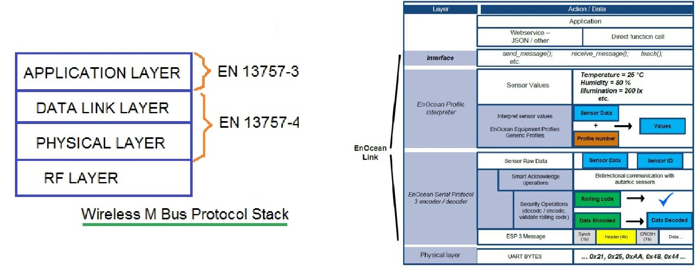
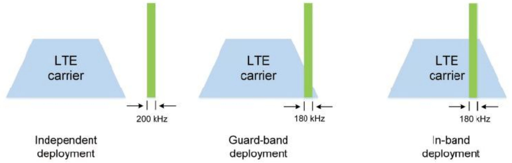
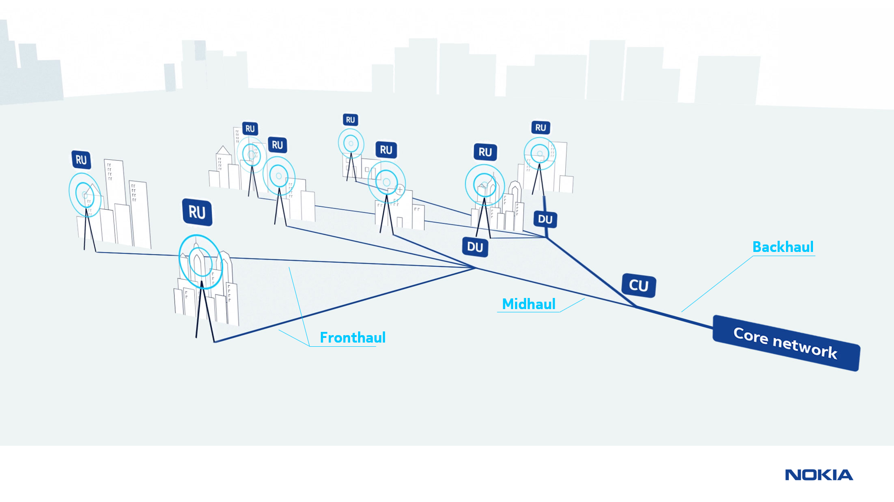
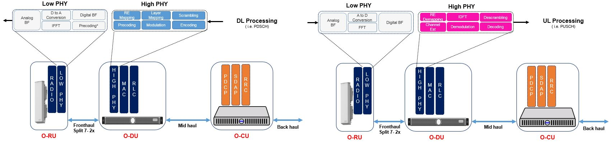

>[Torna all'indice generale](index.md)
## **Reti ethernet da ufficio**

Le **reti di ufficio** sono realizzate con tecnologie ethernet a topologia fisica a stella o a stella gerachica (albero). Lo **switch** ha la funzione dI:
- **concentratore di dispositivi**. Un **collegamento punto punto** è dedicato ad ogni din paralleloispositivo che occupa esattamente una porta sul concentratore. Servono tante porte (e tanti cavi) quanti sono i dispositivi **in prossimità** del concentratore. L'**uso esclusivo** di un cavo da parte di un dispositivo è detto **microsegmentazione** e di fatto azzera il problema delle collisioni. Se la porta è **condivisa da più dispositivi** tramite un **collegamento a BUS** o un **HUB** si dice che lo switch realizza una **macrosegmentazione**, situazione in cui le collisioni ci sono e sono **arbitrate** dal protocollo Ethernet (di tipo CSMA/CD) abilitato sulla porta.
- **commutazione** cioè lo **smistamento** di una **trama MAC** tra le **dorsali** della rete LAN che, comprendendo certi switch e non altri, realizza un **percorso** (path) fino ai router di confine della stessa (**gateway**).

**Più switch** collegati insieme **realizzano una rete LAN** che si estende fino al primo router che essi incontrano. I **router** sono i dispositivi che, di fatto, **delimitano** una LAN Ethernet.

Lo **switch** è generalmente regolato dal **protocollo STP** che, secondo lo standard, limita i collegamenti a cascate a poche unità (profondità nominale di 3 dispositivi secondo standard EIA/TIA).

Il **cablaggio** può risultare **oneroso** in presenza di un elevato numero di dispositivi poichè richiederebbe l'impiego di **un cavo a parte** per ogni sensore. Per questo motivo dispositivi di commutazione e architettura **tradizionali** sono generalmente ritenuti poco adatti per la realizzazione delle **ampie reti di sensori** diffuse in ambito industriale.

## **Reti ethernet industriali**

Le **reti industriali o ferrotramviarie** sono anch'esse a **tecnologia ethernet** ma, oltre la tradizionale **topologia a stella**, per connettere tra loro i dispositivi **terminali** e per connettere tra loto **più switch** spesso utilizzano **topologia fisica a BUS o ad anello**.
Un **anello** è composto da lunghe **cascate** di switch collegati in serie ed equipaggiati con protocollo STP modificato o con altri protocolli proprietari.
Il **cablaggio**, in presenza di un cluster numeroso di dispositivi **risulta più economico** dato che con **un unico cavo** si possono collegare più switch.
Possibilità di topologie **ridondate a doppio anello** (treni, industria)

## **Reti di sensori e attuatori**

Spesso sono **reti miste** cioè composte da **sottoreti eterogenee**: 
- **più reti di sensori** costituite da dispositivi sensori e da nodi di smistamento. Sono spesso realizzate in tecnologie non IP proprietarie.
- **una rete centrale di distribuzione**. E' una rete IP e può essere una LAN, spesso interconessa ad Internet, oppure Internet stessa.

 
 
Tra le due tipologie di reti ci sono dei **nodi di confine** aventi una interfaccia **nella rete di sensori** ed un'altra **nella rete principale IP**. Questi nodi **cerniera** sono detti **gateway** e devono trovare un modo di **rendere compatibili** i messaggi che circolano nelle due tipologie di reti, spesso realizzate con tecnologie **completamente diverse**.

La **rete principale**, **è di tipo ethernet** con dorsali fisiche a stella cablate e collegamenti periferici cablati o wireless WiFi. Ha principalmente la funzione di **distribuzione** dei dati **dai nodi gateway** con le reti secondarie **fino al server di gestione** dei dati. Va attentamente progettata perchè sia in grado di smaltire il traffico complessivo di **tutti i sensori**. Può diventare **critica** se, oltre ai sensori, sono presenti **sorgenti multimediali** quali **microfoni** o **telecamere** di videosorvelianza.

Le **reti di sensori** sono molto **eterogenee**. Tutte hanno un loro modo di **accedere al mezzo trasmissivo** stabilito dai rispettici protocolli di **livello fisico**. Allo stesso modo, tutte hanno un loro modo di **fornire un servizio all'utente** in maniera più o meno astratta, più o meno espressiva, più o meno varia dal punto di vista della QoS cioè della qualità del servizio, stabilito dal protocollo di **livello applicativo**. 

Il **gap** tra il livello **fisico** e quello **applicativo** in genere è colmato da tutta una serie di **protocolli** il cui scopo è essenzialmente: risolvere determinati **problemi di rete** (indirizzamento, controllo di errore, routing, cifratura, ecc.), ottenere la **QoS richiesta dall'applicazione** (velocità, BER, tipo di interazione, ecc...). **Entrambi gli obiettivi** precedenti devono essere raggiunti **organizzando**, tra livello fisico e livello applicativo, una **pila (stack) di protocolli** che permette di raggiungerli rispettando i **vincoli** posti dall'**ambito di utilizzo** pratico della rete (consumi, dimensioni, distanze, facilità d'uso, ecc...).

[Dettaglio ISO/OSI](isoosi.md)

Lo **stack di protocolli OSI** è un **modello architetturale** di riferimento. Per **ogni strato** sono stati studiati nel tempo un gran numero di protocolli, ciascuno con i propri **pregi e difetti**. Un'**architettura reale**, quella che poi verrà standardizzata ed implementata in un dispositivo commerciale, per ogni strato della propria pila, sceglierà, tra i tanti disponibili in letteratura tecnica, un certo **tipo di protocollo** del quale realizzerà e standardizzerà la propria **particolare versione**. Attualmente, per **accedere ad Internet** e all'interno della maggior parte delle **reti locali LAN**, si adopera la cosidetta suite **TCP/IP**. Ma molte **reti di sensori**, per funzionare localmente al loro ambiente di lavoro, **non sempre usano** la suite TCP/IP. Inoltre, anche le reti di sensori che l'adoperano, ai livelli inferiori come **i livelli data link e il livello fisico**, spesso utilizzano protocolli **diversi** da quelli che sono stati standardizzati per le LAN. 

In ogni caso, un qualsiasi **ente di telecomunicazioni internazionale** (IEE, IETF, ITUT, ecc.) o **alleanza di case produttrici** di dispositivi di rete (Zigbee, Bluetooth) o anche **singole aziende** (LoraWan e Sigfox) per realizzare reti di dispositivi devono **instanziare** una **propria versione** dello **stack ISO/OSI**. 

Occorre però tenere presente che una **interoperabilità completa** tra dispositivi di **tecnolgie diverse** si può ottenere **solamente**: 
- **creando un'unica rete** utilizzando livelli di rete **compatibili** o **praticamente uguali** come sono **IPV6 e 6LowPan**. Lo stesso deve accadere per i **livelli superiori**. In particolare nell'ultimo, il **livello applicativo**, il **payload dell'applicazione**, cioè il messaggio utente, deve poter viaggiare **direttamente** dal **client** al **sensore**, dove poi verrà elaborato e utilizzato.
- **utilizzando un gateway** tra livelli **di applicazione** diversi (detto talvolta **bridge**), che si occupa di **tradurre** i messaggi del livello di applicazione dal formato in uso nella rete  IP a quello in uso nella rete non IP **invocando le API** di questa. Un problema potrebbe sorgere se allo stesso gateway colleghiamo due reti proprietarie non IP diverse, questo sarebbe tenuto a conoscere anche le API applicative dell'altra rete di sensori.

**Unica rete con IPV6 e 6LowPan**:

**Gateway applicativo**:

Il **gateway** ha tante **schede di interfaccia** quanti sono i **tipi diversi di BUS** a cui si collega. Il **gateway** deve possedere anche **una interfaccia** capace di traffico ethernet (cablata o wifi) che lo collega alla **rete di distribuzione** (in genere cablata).

Il **gateway** ha anche la funzione di adattare il **formato dei servizi** offerti dalle varie **sottoreti di sensori** nel **formato di servizio unificato** (ad esempio un particolare messaggio JSON) con cui i sensori sono interrogati nella rete di distribuzione IP. I **protocolli di livello applicativo** utilizzati a questo scopo in genere sono **HTTPS** o **COAP** per il paradigma di interazione **Request/response** oppure **MQTT** o **Telegram** per il paradigma di interazione **Publish/Subscribe**, oppure **Websocket**, **Webhooks** e **WebRTC** per richieste asincrone, l'ultimo anche per quelle multimediali.

Talvolta il livello applicativo dello stesso stack di protocolli è non compatibile tra una marca e l'altra di dispositivi. In più i **gateway** verso la rete di sensori, nonostante abbiano nella rete di distribuzione una **interfaccia MAC/IP**, sono scatolotti **proprietari chiusi**, cioè, **non modificabili**. I fabbricanti magari tendono a renderli **non bypassabili** perchè non rilasciano di pubblico dominio le API per comunicare con i sensori. Questo significa che potrebbe essere necessario per loro un **ulteriore livello di traduzione**, cioè un altro gateway, per convertire il **formato** delle **API** e dei **protocolli** che espongono (ad es COAP) con quelle in uso nella rete di distribuzione per tutti i sensori (ad es. MQTT). Questa situazione, per i **protocolli più diffusi** come Zibgee e Bluetooth, **tende a scomparire** perchè quasi tutti i produttori ormai si sono accordati e **adottano** per le API dei servizi uno **standard comune** e pubblico, per cui non è insolito riuscire a comandare dispositivi di una marca col gateway di un'altra. 

Alla **rete di distribuzione IP** si collegano, quindi, una o più **reti secondarie** che servono da **rete di accesso** per i dispositivi sensori o attuatori con **interfacce** spesso di tipo **non ethernet** che necessitano di un **gateway** di confine con possibili funzioni di:        
  - **Traduzione di formato** dei messaggi da rete a bus a rete ethernet con evenruale realizzazione del **bridge** tra livello applicativo in uso nella rete di sensori e quello in uso nella rete di distribuzione.
  - **Interrogazione periodica** (polling) dei dispositivi (master di una architettura master/slave)
  - **Raccolta e memorizzazione** delle informazioni per essere trasferite in un secondo momento al server di gestione
    
## **Server di gestione dei servizi**

In genere è localizzato all'intermo della **rete principale** con una collocazione **on-premise** all'interno del sistema.

Tendenze sempre più diffuse portano al **trasferimento crescente di funzioni** anche sul **cloud**. Una **soluzione estrema** è quella di spostare **tutte le funzioni** sul cloud tenendo ben presente che un **guasto della connessione ad internet** causerebbe una cessazione delle **funzioni** di regolazione e controllo che sono state progettate per essere eseguite **centralizzate sul server**. Le funzioni gestite in maniera autonoma e peer to peer **completamente a bordo** dei dispositivi non dovrebero risentire di particolari problemi.

In ogni caso è necessario un **server di gestione** con funzioni di:
- Processamento (elaborazione nuovo stato e comando attuatori)
- Memorizzazione (storage) ed estrazione (mining) delle informazioni
- Analisi dei dati per estrarre reportistica di aiuto alle decisioni (risparmio energetico)
- Pubblicazione in Internet delle informazioni su un un sito o su un WebService (opendata)
- Segnalazione anomalie
- Backup dei dati e gestione disaster recovery di dati e servizi
- Aggiornamento via cavo o via etere (OTA) del firmware ai nodi
- Gestione della sicurezza

Queste prese in considerazione sono generalmente tutte funzioni di **livello applicativo** in quanto si limitano a gestire servizi.

## **Server di rete**

Il **network server** è comune in alcune tipologie di **reti wireless** ed è una componente di **back-end** responsabile della ricezione dei dati provenienti dai vari **gateway** e dello svolgimento dei **processi** di gestione della rete: 
- fondamentale è il **filtraggio** ed eliminazione di eventuali **pacchetti duplicati**. 
- implementa la funzionalità di **controllo remoto** dei terminali remoti tra le quali fondamentale è l'impostazione **adaptive data rate (ADR)** allo scopo di massimizzare la vita delle batterie dei dispositivi e la capacità totale della rete. Il linea generale, un minor tempo di trasmissione e minore potenza di uscita si traducono in un ovvio risparmio energetico.    
- Sono collegati ai **gateway dei sensori** mediante una normale **rete IP** mediante **protoolli di livello applicativo**. Sono dei **nodi di smistamento finale** e, in questo senso, possono essere considerati come dei **router di livello applicativo**.

I dati ricevuti possono essere **inviati agli application server** per le elaborazioni successive oppure è possibile inviare eventuali notifiche agli end device per far attuare un’azione.
Non ci sono interfacce standard di trasmissione dei dati tra network server ed application server (webservice, websocket, webhook, MQTT sono variamente implementati).

Quindi sono macchine che partecipano attivamente alle **funzioni di rete** e pertanto fanno esse stesse parte della **infrastruttura di rete**. Spesso sono **virtualizzat**e e le loro funzioni sono offerte come **servizio** su abbonamento. 

Sono presenti in quasi tutte le **infrastrutture LPWA** a lungo raggio come **LoraWan**, **Sigfox** e **NB-IoT**.

##  **Topologia delle reti di sensori cablata** 

Nelle **reti industriali** sono molto comuni topologie complesse a più livelli. Per le applicazioni di **nostro interesse** le **topologie** più adoperate sono quelle classiche a **stella** e a **bus**. **I collegamenti** dei sensori, in questo caso, si attestano sulle **porte** di **schede programmabili** che ospitano dispositivi a microcontrollore. Le stesse schede hanno, in genere, funzione di **gateway** verso la **rete di distribuzione** per cui posseggono almeno **due interfacce**: una **verso il BUS** ed un altra, ethernet ed IP **verso la rete LAN**. Inoltre le schede ospitano le **librerie** SW di **gestione del BUS** e il codice per realizzare il **bridge** tra il **livello applicativo** in uso nella rete di sensori e quello in uso nella rete IP. Il **bridge** è generalmente realizzato o da librerie di **terze parti** oppure direttamente dal **programmatore** in C/C++ o, se la potenza di calcolo della scheda lo consente, mediante linguaggi di scripting come **Python** o **Node.js**. Si realizzano spesso anche in maniera **visuale** adoperando **framework** come **Nodered** e **Openhab**.

### **Esempi di collegamenti base con topologia a stella**:

  
  
 
### **Esempi di collegamenti base con topologia a bus:**

 
 
[Dettaglio su collegamenti cablati a stella e a bus basici per domotica e sensoristica](cablatisemplici.md)

[Dettaglio su stack cablati specifici per domotica e sensoristica](stackcablati.md)
 
##  **Topologia delle reti di sensori wireless**     
 
Le reti di **sensori wireless** hanno una estensione nello spazio variabile e la loro **topologia** preferita è **a stella** o **a maglia**.

La **rete principale ethernet** può **estendersi nello spazio** secondo un'architettura (ad albero o ad anello) che può comprendere molti switch. Lo **smistamento completo** di una trama dati lungo la rete può prevedere una catena di **smistamenti successivi** lungo gli switch (hops) più o meno lunga. Nel caso di una rete ethernet questo non è generalmente un problema eccessivo nè dal punto di vista dei ritardi nè rispetto a quello dei consumi (gli switch sono alimentati attraverso la rete elettrica).

La situazione potrebbe essere molto diversa nel caso delle **reti di sensori**. Queste sono spesso **wireless** e realizzate con dispositivi **alimentati a batteria** che si vorrebbe fosse sostituita idealmente  **non prima di un paio di anni**.

A seconda dello schema adoperato, dal **punto di vista energetico** non è indifferente considerare se **un comando** o **l'accesso in lettura ad un sensore** avvengono connettendosi direttamente **all'unico** dispositivo hub centrale (magari distante) o se avvengono connettendosi **al più vicino** di una cascata di nodi:
- **Hop singolo**: ciascun nodo del sensore è collegato all'**unico gateway centrale** posto generalmente in **posizione baricentrica** rispetto a tutti i dispositivi. Sebbene sia possibile la trasmissione a lunga distanza, il consumo di energia sarà significativamente superiore a quello speso per la misura del valore del sensore e per la sua elaborazione. Tecnica molto utilizzata per le **grandi distanze** dai gateway **LoraWan** e **Sigfox**, ma anche dalle BS (Base Station) **NB-IoT**  e **LTE-M** del 5G. Mentre per le **medio-piccole** è adoperata dagli AP **WiFi** e **Bluetooth BLE** in **modalità infrastruttura** (non ad-hoc).
- **Hop multiplo**: esiste un percorso verso i nodi terminali passando attraverso dei nodi intermedi. L’energia che un **singolo dispositivo** impiega per raggiungere **un nodo remoto** (ad esempio per accenderlo) si limita a quella per raggiungere il **nodo più prossimo**. Su reti mesh (magliate) di **grandi dimensioni** anche questa energia può essere non trascurabile. Su **reti indoor** è invece la soluzione decisamente **più conveniente** dato che spesso **il primo** dispositivo di smistamento raggiungibile (router o switch) non è a più di un metro di distanza mentre quello in **posizione baricentrica** può essere anche a 10-50m di distanza.

Le reti di sensori wireless (WSN) ad **hop multiplo** in realtà sono di **due tipi** di base più una loro **ibridazione**:
- a **stella gerarchica** In questa categoria, molto popolare è il protocollo Low Energy Adaptive Clustering Hierarchy **(LEACH)**. In LEACH i nodi dei sensori sono divisi in diversi **cluster**. In ogni cluster, il nodo con il livello di energia **più alto** è generalmente scelto come la **testa del cluster** o CH. I CH cono **centro stella** delle comunicazioni con funzione di **aggregazione** e **compressione** dei dati provenienti dai diversi sensori per **ridurre** il numero di **messaggi trasmessi** alla destinazione. Il **ruolo del CH** viene **ruotato** allo scopo di distribuire il carico energetico tra i sensori. Benchè abbia una **grande efficienza energetica** ha delle limitazioni dovute ad alcune ipotesi di progetto. Una di queste queste, il vincolo che i nodi abbiano una potenza di trasmissione tale da poter sempre raggiungere la BS, lo rende **inadatto a reti estese**. Ritenuto attualmente particolarmente adatto ai **requisiti di una WSN** è invece il protocollo **IETF RPL**. Progettato per le reti **6LoWPAN** è un protocollo di tipo **distance vector** che genera, attraverzo lo scambio di messaggi DV con i nodi vicini, un albero di instradamento ottimo **unico** per tutti i nodi avente per **radice** la BS (gateway). E' il protocollo di routing adottato da molti framework per IoT come **TinyoS** o **RIOT**. Anche le **piconet** nelle reti di dispositivi **Buetooth** (IEEE 802.15.1) utilizzano una loro implementazione di routing gerarchico.
- a **maglia** anche detti **flat** o **peer to peer**. Rete **omogenea** di dispositivi in cui tutti i nodi di smistamento (router) **sono simili** in termini di **energia**, **risorse di calcolo** e **memoria**. In questo caso  **ogni nodo** si calcola **il proprio** albero di instradamento ottimo per raggiungere gli altri nodi e la base station. Gli alberi, avendo, di volta in volta, per **radice un nodo** differente sono generalmente anch'essi diversi. Il protocollo di instradamento è spesso distribuito e dinamico e, rispetto all'altra soluzione, garantisce **percorsi ottimali** per **tutti i nodi**, **non solo** per la base station. Un protocollo per reti flat molto usato è **AODV** ed è un derivato per reti ad-hoc del protocollo **distance vector**. Generalmente i protocolli flat mostrano **migliori prestazioni complessive** in termini di **banda** e **ritardo** ma il loro **consumo energetico** **molto elevato** riduce la durata di attività di ciascun **nodo router** a meno che esso non sia **perennemente alimentato**. Tecnica adoperata dai dispositivi **Zigbee** (IEEE 802.15.4).
- **mista** delle precedenti, ovvero **albero di cluster** dove un **cluster** è formato da una **rete a maglia** di piccole dimensioni. Viene così realizzata una rete peer-to-peer con un **minimo overhead** di routing, proprietà che induce un **più basso consumo** dei dispositivi router. Il **routing interno** tra i nodi interni al cluster è con con alberi di istradamento **individuali** per ogni nodo. Il **routing esterno** tra i cluster è con un albero di instradamento **unico** per tutti cluster (spanning tree ottimo). Anche questa tecnica è adoperata dai dispositivi **Zigbee** (IEEE 802.15.4).

Un'altra funzione **potenzialmente energivora** è il **polling dei sensori** ovvvero la loro lettura periodica con annessa **trasmissione in remoto** dei dati. In questo caso se il **primo nodo** di smistamento della catena è parecchio distante (è il caso di tenologie outdoor come LoraWan o Sigfox) o sebbene indoor si adopera una **trasmissione** in una **tecnologia  energivora** (come è in modalità standard il WiFi) allora sono possibili almeno due **soluzioni operative** per abbattere i consumi:
- **allungare l'intervallo di polling** facendolo passare dall'ordine dei secondi a quello dei minuti o delle ore.
- **memorizzare le misure in locale** sul dispositivo e, ad intervalli regolari adeguatamente lunghi, inviare dei **dati aggregati nel tempo** come **medie e varianze** o statistiche in genere.

Quasi **tutte le tecnologie wireless** poi permettono di mettere, nell'intervallo di tempo tra una misura e l'altra, il dispositivo in modalità di **sleep** o **standby** profondo che **rallenta** di molto il clock della CPU permettendo un grande **risparmo di energia**.

Il **consumo di energia** è generalmente proporzionale alla **velocità di trasmissione** e alla lunghezza dei messaggi. Tecnologie **general purpose** che sono **ottimizzate** per la trasmissione di **file o stream** più che di **brevi messaggi** in genere sono più complesse e esibiscono consumi **più elevati**.

Il **grafico sotto** mostra **il posizionamento** delle varie tecnologie wireless che lavorano in **banda ISM** in base alla **bitrate** e alla **distanza** e potrebbe essere usato come **tassonomia di riferimento** (classificazione) delle varie teconologie proprio in base a **queste proprieta**. Al netto di qualche sovrapposizione, sono abbastanza distinguibili **tre zone**: 
- **corto raggio**. A distanze previssime ci stanno i sensori **RFID**, **NFC** e anche **BLE** utili per le **BAN** (Body Area Network), il tag degli oggetti, il  **tracciamento** di persone ed oggetti e il riconoscimento. **Bluetooth** si differenzia per il tipo di servizio, cioè la **connessione  punto** punto diretta tra dispositivi, che per le distanze (da 10m a 100m) tipiche di una **PAN** (Perosnal Area Network). **BLE**, **6LowPan** e **Zigbee** sono le tecnologie principali con cui entro i 100m si realizzano **WSN a basso consumo**. **BLE** in particolare, fornisce anche servizi di  **tracciamento** e **posizionamento indoor**. Possono essere tutti usati sia indoor che outdoor ma indoor forniscono servizi che altre tecnologie hanno difficolta a fornire con uguale semplicità. 
- **medio raggio**. E' il dominio del WiFi e della telefonia cellulare intesa come **modem dati a pacchetto**. Sono tipici in quest'ambito servizi **M2M** (Machine to Machine). Il 5G ha incorporato le tecnologie preesitenti **Cat-NB Narrowband IoT (NB-IoT)** and **Class M LTE (LTE-M)** che offrono servizi a **basso bit rate**, anche se a **consumi** significativamente **superiori** rispetto a LoraWan, però le **basse latenze** li rendono adatti ad **applicazioni mission critical** quali **robotica**, **guida autonoma** e **telecontrollo remoto**.  Una novità recente è l'introduzione delle **reti LTE private** (RAN private), cioè l'installazione di infrastrutture di telefonia cellulare private che possono essere **licensed** o **ulicensed**, cioè utilizzare o meno frequenze licenziate in concessione all'operatore o lavorare nella **banda comune NR-U** libera e simile concettualmente alla **banda ISM**.  Le **RAN private** possono essere anche **dipendent o indipendent** a seconda che siano gestite direttamente o meno dall'operatore telefonico. Il **WiFi** può realizzare reti di **notevoli dimensioni** (città intere o grandi aree rurali) ma ogni dispositivo ha range di copertura limitato (tipicamente 25m). E' possibile realizzare anche con il wifi una copertura di **tipo cellulare** che supporti il **roaming** cioè la **mobilità dei dispositivi**. Tutte queste tecnologie richiedono una **infrastruttura** (cablata o wireless) **complessa** e al momento dai **consumi elevati** soprattutto per dispositivi come i sensori. Se l'interesse preminente è il **basso consumo** e la **semplicità della rete** si rientra nella categoria delle soluzioni **LPWA** che, al momento, taglia fuori il wifi in favore di **LoraWan** e **NB-IoT**, per citare le tecnologie più comosciute ed adoperate. 
- **lungo raggio**. **LPWAN** (Low Power Wide Area Network) garantiscono una trasmissione a **lungo raggio** (da qualche chilometro a qualche decina di chilometri), un **consumo energetico contenuto** per la trasmissione/ricezione dati e un **basso costo** di realizzazione dei dispositivi al prezzo di una **ridotta velocità** di trasferimento dati (poche decine di kilobit al secondo). Forniscono anche **servizi outdoor** di **posizionamento** e **tracciamento** di oggetti. Sono adatti sia per applicazioni indoor che autdoor ma **outdoor** forniscono servizi che altre tecnologie hanno difficolta a fornire con uguale semplicità. L'infrastruttura è leggera dato che anche migliaia di dispositivi possono essere serviti da un'unica BS (Stazione Base) chiamata Gateway. Il resto dell'infrastruttura può essere realizzato semplicemente in house e utilizzato ancora più semplicemente se realizzato in cloud. Le principali **tecnologie LPWA** attualmente disponibili sono **LoraWan**, **Sigfox** e, recentemente, **NB-IoT**.  **VSAT** è una tecnologia satellitare piuttosto datata ma a basso costo e disponibile ovunque nel globo, è utilizzata in regioni rurali, spesso con alimentazione solare.

Versione più **dettagliata**:

## **Interfaccia radio**

Il **mezzo trasmissivo radio** è partizionabile in **frequenza**, **tempo**, **spazio** e **potenza**. Delle grandezze precedenti quella in assoluto **più limitata** è la **frequenza** essendo **proprietà dello Stato** e ceduta in **concessione** sotto ben precise condizioni (**licenze**). Questo è il motivo per cui, nel realizzare qualsiasi tipo di comunicazione radio, per prima cosa, bisogna cominciare col **riservare** una porzione del campo delle **frequenze radio** (spettro) **allocando** degli intervalli di frequenze detti **canali**. 

I **canali** sono allocabili all'interno di intervalli di frequenze dette **bande**. Le bande si dividono in **licenziate** cioè quelle per le quali bisogna acquistare dallo stato la **concessione** per trasmmetterci e in quelle **non licenziate** per le quali, sotto ben precise **condizioni tecniche** (modulazione, potenza, duty cicle, ecc.), o **vincoli burocratici** (possesso di autorizzazioni o patenti presso autorità regolatorie) la trasmissione è **libera**. Una di queste ultime è la banda **ISM** (Industrial Scientific Medical). L'**ampiezza del canale** dipende dalla **tecnologia adoperata**. Nelle bande ISM è inoltre possibile trasmettere **senza particolari restrizioni** burocratiche (acquisto di licenze o patentini), in particolare, **senza avvisare** nessuna autorità ma semplicemente utilizzando **dispositivi certificati** cioè che rispondono ai regolamenti tecnici in vigore **nella nazione** in cui sono adoperati. La libertà di accesso alla banda ISM è il motivo per cui essa è **mediamente affollata** e le sue trasmissioni **soggette ad interferenze** più o meno intense. Le **interferenze** sono **gestite** utilizzando **modulazioni robuste alle interferenze** e adoperando **segnali** a bassa densità spettrale, basso duty cicle e, soprattutto, **potenza limitata**. 

Recentemente alla banda ISM si è aggiunta un'altra **banda non licenziata**, la **NR-U** centrata all'incirca intorno ai **6GHz** che è stata assegnata al **WIFI 6** (IEE 802.11ax) e alle **RAN (Radio Access Network)** della telefonia cellulare che possono essere o **gestite dall'aperatore** di telefonia o di **proprietà dell'utente** che così realizza una **rete 5G privata**. La **potenza** di un AP in banda NR-U non può eccedere i 30dBm per cui una **BS 5G** crea un'**interferenza** analoga a quella di un **AP wifi**. A parità di area, **densità** di distribuzione degli AP 5G dovrebbe essere circa la metà del WIFi ma con **costi** per dispositivo molto maggiori.

[Dettaglio mezzo radio](mezzoradio.md)

## **Servizi di accesso radio per WSN**

Abbiamo visto che l'**interfaccia radio** si accede **allocando per primo** un **unico canale radio** di una multiplazione **FDM**. L'allocazione può essere sia **statica** (eseguita dal sistemista) che dinamica cioè variabile nel tempo ed **automatica**.

**Successivamente** il canale FDM **potrebbe** essere ulteriormente **partizionato in gruppi di utenti** tutti collegati ad uno **stesso dispositivo**. I dispositivi (ad es. gli AP wifi di uno stesso palazzo) interferiscono tra loro ma le comunicazioni sono rese **distinguibili e private** mediante multiplazione a spettro espanso **CDM** (Code Division Multiplexing) che associa un SSID diverso ad ogni dispositivo. Ciò è dovuto al fatto che usiamo uno dei canali della banda ISM su cui non esistono coordinamento e controllo alcuno. Anche se questa tecnica è adesso usata solo in dispositivi LPWA mentre WiFi 6 e telefonia mobile 5G preferiscono ad essa la tecnica OFDM.

[Dettaglio tecnologie di accesso al mezzo radio](accessoradio.md)

### **Classificazione dei servizi radio**

Qualunque sia la modalità di accesso, alla fine, su **questo canale risultante**, privato ed eventualmente associato ad un certo **SSID**, a seconda del **servizio richiesto**, **possono parlare**:
- **due interlocutori**.
- **molti interlocutori**

In entrambi i casi sono possibili **due tipi** di **servizio** di **accesso radio**:
- **servizio sincrono**. Viene realizzato con un **TDM statico** ed è adatto **operazioni periodiche** come il **polling** di un grappolo di sensori.
- **servizio asincrono**. E' adatto a **operazioni una tantum**, cioè di cui non si riesce a sapere **in anticipo** l'occorenza (accadere nel tempo), ad esempio il comando di accensione di una lampadina.  In questo caso riservare uno slot temporale ad una sorgente che per la maggior parte del tempo non lo utilizzerebbe è certamente **uno spreco**. Si preferisce utilizzare la tecnica di accesso **TDM a contesa** con accesso al canale arbitrato dai protocolli **ALOHA** O **CSMA/CA**.

Ulteriori **differenziazioni del servizio** distinguono tra:
- la presenza o meno di una funzione di **conferma** dei messaggi trasmessi (protocollo confermato).
- la presenza o meno di **classi di prestazione**, magari abbinate ad uno o più dei servizi precedenti.
    
Molti sistemi (wifi, zigbee, bluetooth BLE, LoRaWan, Sigfox) permettono di impostare **contemporaneamente**, sulla **stessa interfaccia** radio, un **servizio sincrono** mediante **TDMA** per le sorgenti che eseguono il **polling** di sensori e un **servizio asincrono** con **ALOHA** o **CSMA/CA** per le sorgenti che devono inoltrare il **comando** di un pulsante di accensione di un attuatore. Ciò è ottenuto **attivando** sul canale la funzionalità **beacon** con le cosidette **superframe**.

Un **beacon** contiene informazioni che **identificano** la rete e i suoi servizi nonchè una sequenza di **bit di sincronizzazione**. Vengono trasmessi **periodicamente**, servono ad **annunciare** la presenza di una LAN wireless e a **sincronizzare** i membri sui suoi servizi (sincroni e asincroni).

In una **supertrama** due **beacon** fungono da **limiti** (iniziale e finale) e forniscono la **sincronizzazione** con altri dispositivi e informazioni di configurazione. Un superframe è costituito da un certo numero di **slot** temporali divisi in **due gruppi**. Il **primo** è riservato per le sorgenti **asincrone** che accedono in **modalità a contesa** con i protocolli di arbitraggio ALOHA o CSMA, **il secondo** è dedicato alle sorgenti **sincrone** che, in quella porzione della trama, hanno uno **slot** esclusivamente **dedicato** a loro per tutto il tempo in cui esse **risultano attive**.

##  **Stack wireless specifici per IOT**

Ci si potrebbe chiedere se è proprio necessario sapere i **dettagli sui protocolli** adoperati da questo o quel dispositivo. La risposta è legata al **livello di astrazione** con cui la nostra applicazione **vede** la **risorsa rete**. 

Con alcuni protocolli essa ha della rete e dei suoi protocolli una visione che si può ridurre all'**elenco di servizi** di livello applicativo che lo **stack espone**, per cui, quando l'applicazione utilizza un servizio, sullo stack viene scelto, strato per strato, il **protocollo più adatto** per realizzarlo. Addirittura in Blutooth BLE e in Zigbee i **servizi applicativi**, cioè la definizione dei cai d'uso come accendere una lampadina o aprire una tapparella, sono dettagliatamente **catalogati** e **definiti** nello stack.

Normalmente solo la **parte fisica** dello stack è implementata in **HW** mentre tutto il resto dello stack è realizzato in **SW**. Molte volte, per progettare una rete industriale di sensori, si mantiene **solo il chip** con il suo livello fisico, mentre per i **livelli superiori** si preferisce utilizare uno stack di protocollo alternativo, **diverso da quello originale**, realizzando, in pratica, una vera e propria **ibridazione**. In questo caso si possono ancora utilizare stack standardizzati da organizzazioni trasnazionali come IETF o IEEE ma questi possono essere molto articolati per cui, all'interno dello stack, si sceglie la classe di protocolli che si ritiene più adatta alle **proprie esigenze**. Una **proprietà**, spesso non garantita dalle grandi suite come Zigbee o LoraWan, potrebbe essere l'utilizzo del **livello di rete IPV6**, proprietà che potrebbe permettere la connessione diretta del dispositivo **in Internet** trasmettendo, senza modifiche, i suoi messaggi su reti LAN o WiFi. **Un'altra motivazione** potrebbe essere l'interesse a non adoperare la parte, di per se complessa, dello stack che gestisce la rete di molti dispositivi ma soltanto realizzare una **connessione punto punto**, cioè un **ponte radio numerico** tra due dispositivi e per far ciò un semplice supporto di rete IPV6 (senza funzioni di routing) potrebbe essere sufficiente. 

La **parte logica** dei due stack sotto (LoraWan a sinistra e Zigbee a destra) potrebbe essere sostituita con IPV6 inserendo il rpotocollo 6LowPAN. La **parte fisica** di entrambi verrebe mantenuta perchè realizzata **in HW**. Nel caso di LoraWan l'implementazione HW è **proprietaria** è costruita da una sola azienda (Semtech) e non è standardizzata industrialmente. Nel caso dello Zigbee la **parte fisica** è **standardizzata** con le sigla **802.15.4**.

Molti **framework per IoT** come **TinyOS**, **Contiki** e **RIOT** posseggono una **struttura modulare** che permette loro di includere, senza particolare sforzo, **stack personalizzati** di protocolli  in maniera tale da adattarli alle esigenze più particolari svicolandosi dagli stack protocollari completi certificati dall'industria (Zigbee, LoraWan). 

### **Stack wireless opensource**

Esistono anche **stack opensource** rilasciati da alleanze di sviluppatori pensati per sostituire il **livello applicativo** dei chip IoT attualmente più diffusi per orientarli verso ambiti di utilizzo più **specializzato**. Un esempio è **OpenThread** che si pone sopra i chip **802.15.4** realizzando con l'implementazione dello stack **Thread** una alternativa a Zigbee per l'**industria**. Sempre basandosi sul livello fisico di Zigbee (**802.15.4**), lo stack aperto per l'industria **ISA100.11a** (IEC62734) lo integra con il livello di rete **6LowPan** e, a **livello applicativo**, realizza **funzioni** specifiche, di **monitoraggio**, **controllo** (catena a perta e chiusa) e **sicurezza** (sensori di gas). Oppure **OpenWSN** che utilizza l'implementazione di **TSCH** IEEE 802.15.4g/e come protocollo di accesso al mezzo e protocolli standard IETF come protocolli di livello superiore (6LowPan, REPL e UDP), o anche **OSS-7** che implementa la pila di protocolli **DASH7**. **DASH7** ha la particolarità di avere un **livello fisico** praticamente **agnostico**, cioè supporta la maggior parte dei protocolli di accesso disponibili come, ad esempio, LoRa o IEEE 802.15.4g inoltra possiede la **particolarità insolita** di mapparsi perfettamente sullo stack ISO/OSI, cioè definisce un **protocollo per ogni livello OSI**.

Gli **stack personalizzati** o **opensource** sono utili per realizzare **soluzioni ad hoc** calate in un ben preciso **contesto aziendale** come, ad esempio, la gestione dell'automazione **HVAC** (riscaldamento, ventilazione e condizionamento dell'aria). In questo caso per una **stessa funzione**, magari in zone diverse, sono dislocata **tegnologie diverse**, cioè **reti WSN eterogenee** oppure **miste** wireless e cablate, che magari si ha l'interesse a rendere **interoperabili** ai **livelli superiori** del loro stack OSI. In **questo contesto** sono ancora dominanti, in ambito WSN, il **WiFi** e le tecnologie cellulari (**NB-IoT**) indoor. In ambiti specializzati cercano di farsi strada, tra gli stack e i protocolli non citati, Insteon, Wavenis, Webree, Z-wave, ANT+ e CSRMesh.

Uno **stack commerciale**, essendo completo fino al **livello di applicazione**, ha il vantaggio di garantire una grande **interoperabilità** con tutti i dispositivi in commercio a prescindere dalla loro marca, l'importante è che sia **standardizzato** e tutti i **vendor** derivino i loro dispositivi da esso. Si consideri, ad esempio, una **rete mesh (magliata) Zigbee** (ma la situazione sarebbe analoga per il Blutooth BLE). Questa è composta da **router**, cioè nodi di smistamento, che, dispiegati in numero adeguato, hanno il compito di allargarne le dimensioni della rete, ben oltre la linea di raggiungibilità del nodo sorgente dei comandi, ipoteticamente in ogni angolo della casa. In un contesto domestico (**home automation**), i **router** sono essi stessi **dispositivi commerciali** acquistati non curandosi affatto della loro funzione di rete (routing) ma semplicemente tenendo conto di una **funzione** di utilità domestica come ad esempio creare un punto di illuminazione (lampadina). Se i dispositivi **condividono** tutti lo **stesso stack WSN** il vantaggio per l'utente è chiaro. Con l'acquisto di un dispositivo con **alimentazione costante** (magari perchè **collegato alla rete**) l'utente compra anche il **dispositivo** che permette di **espandere la rete**, e ciò a beneficio non solo dei dispositivi del brand del prodotto acquistato ma anche a vantaggio di quelli **già installati** e di quelli che **si acquisteranno** in futuro. La **rete** diventa una infrastruttura completamente **trasparente** all'utente **basata** fisicamente e funzionalmente su tutti gli **oggetti smart** con cui egli popola la propria abitazione. Il **protocollo** di **routing dinamico** della rete garantisce l'**affidabilità** dell'infrastruttura ricalcolando, in maniera **trasparente all'utente**, il percorso di un messaggio di azionamento in caso di **guasto** di un nodo di transito.

### **Stack wireless orientati allo smart metering**

**Wireless M-Bus**

Detto anche **Wireless Meter-Bus** è lo **standard europeo (EN 13757-4)** che specifica la **comunicazione** tra **contatori** delle utenze e **gateway** per contatori intelligenti.
Sviluppato come standard per soddisfare la necessità di un sistema wireless di lettura dei contatori delle utenze in Europa, Wireless M-Bus viene adesso utilizzato come base per la nuova Infrastruttura di Misurazione Avanzata (**AMI**).
Il **DLMS** è uno standard di tipo aperto ratificato come IEC 61334-4-41. E' un protocollo di **livello applicativo** che definsce i requisiti minimi per un **contatore** affinché possa comunicare con altri dispositivi DLMS. Vengono, in particolare, stabiliti tutti i **tipi di misure** che il contatore deve essere in grado di rilevare e le relative **modalità di invio**, su richiesta di un client remoto, oltre ai requisiti in termini di **performance** che il dispositivo deve garantire. Il DLMS, inoltre, è uno standard adatto non solo alle sole reti elettriche, ma anche alle reti di altri **vettori energetici**, quali **gas**, **calore** ed **acqua**. 

**IEEE 802.15.4g**

Lo **IEEE 802.15** WPAN Task Group 4g (TG4g) ha proposto questo standard per estendere il corto raggio dello standard di base IEEE 802.15.4 (livello fisico Zigbee) per le reti di **smart metering** intelligenti o Smart Utility Network (SUN). Definisce tre livelli fisici intercambiabili, uno basato su frequency shift keying (FSK), accesso  multiplo a divisione di frequenza ortogonale (OFDMA), e sfasamento in quadratura offset keying (OQPSK). Fornisce copertura di diversi km. Le velocità dati supportate vanno da 40 kbps a 1 Mbps a seconda del livello fisico e regione in cui opera. Funziona secondo il principio di CSMA/CA e supporta stella, mesh, e altre topologie. E' il **livello fisico** dello stack commerciale **Zigbee NAN**, di quello **Wi SUN**, oltre che di quello opensource **DASH7**. Nati per il contesto dello **smart metering** ambiscono ad un utilizzo per l'IoT generico in ambito **LPWA** a corto raggio.

**NB-Fi**

WAVIoT ha sviluppato il protocollo **LPWAN aperto**, chiamato NB-Fi, che opera nella banda radio ISM senza licenza. Il protocollo NB-Fi consente comunicazioni wireless a **lunghissimo raggio** (fino a 10 km in aree urbane, fino a 30 km in aree rurali) a **basso consumo** energetico. Poiché le bande ISM sub-1 GHz sono affollate, i gateway sono progettati per funzionare con un algoritmo di **prevenzione delle interferenze**. Per ottenere una migliore efficienza nell'allocazione della banda e migliori prestazioni, impiega algoritmi  basati sulla **tecnologia SDR**, **reti neurali** e tecniche di **intelligenza artificiale**. Nato per il contesto dello **smart metering** si vorrebbe utilizzarlo in quello **più ampio** dell'**LPWA** in generale.

### **Stack wireless orientati all'energy harvesting**

La tecnologia **EnOcean** utilizza un **protocollo ottimizzato** per il risparmio energetico (**energy harvesting**) standardizzato come ISO/IEC 14543-3-10 Home Electronic Systems (HES) protocollo Wireless Short-Packet (WSP). 
I **pacchetti** di dati wireless EnOcean sono relativamente **piccoli**, essendo lunghi solo 14 byte e trasmessi a **125 kbit/s**. L'**energia RF** viene trasmessa solo per **gli 1** dei dati binari, riducendo la quantità di potenza richiesta. **Tre** pacchetti vengono inviati a **intervalli pseudo-casuali** riducendo la possibilità di collisioni di pacchetti RF.

L'**harvesting** consiste nel **recupero** dell'energia necessaria alla trasmissione o alla ricezione dall'**ambiente** mediante lo sfruttamento di movimenti meccanici e altri potenziali ambientali come la luce interna e le differenze di temperatura. Per trasformare le fluttuazioni di energia magnetica, solare e termica raccolte dall'ambiente in energia elettrica per alimentare il dispositivo, vengono utilizzati **convertitori di energia** molto compatti.

I **dispositivi**, come sensori e interruttori della luce, funzionano **senza batterie** e i **segnali radio** di questi sensori e interruttori possono essere trasmessi in modalità wireless fino a una **distanza** di 300 metri all'**aperto** e fino a 30 metri all'**interno** degli edifici. 

##  **Canali di comunicazione principali in una rete di sensori**

**Riassumendo**, sono necessari almeno due canali di comunicazione che, insieme, complessivamente, realizzano la **comunicazione tra sensori e gestore** delle informazioni:
- **tra sensori e gateway** verso la LAN realizzato dalle sottoreti dei sensori:
    - **A filo** con accesso:,
        - **singolo dedicato**: un filo o un canale per sensore in tecnologia SDM o TDM (multiplexer, UART, porta analogica, porta digitale)
        - **multiplo condiviso** cioè tramite mezzo broadcast (BUS) con **arbitraggio** di tipo **master slave** (Modubus, Dallas, I2C, SPI) o **peer to peer** (CanBUS, KNX, ecc) o misto (ProfiBUS). 
        - Spesso **bidirezionale** specie se in presenza di attuatori
        
    - **Senza filo** cioè wireless con accesso:
        - **singolo dedicato**: link punto-punto analogico digitalizzato con AX25 oppure digitale con un radio modem (Yarm ACME Systems, 6LoWPAN, LoRa) resi full duplex con l'uso di multiplazioni FDM o TDM.
        - **Multiplo e condiviso** (BUS) di tipo half duplex reso bidirezionale (full duplex) tramite tecniche asincrone CSMA/CA (Zigbee, wifi, LoRa) o sincrone TDMA (Zigbee, Bluetooth).
- **Tra gateway e gestore** delle informazioni realizzato dalla rete principale:
     - Tipicamente tramite **LAN ethernet** e architettura **Client/Server**
     - Interazioni di tipo PUSH o PULL
     - Paradigma Request/Response (HTTPS, COAP), Publish/Subscriber (MQTT) oppure canale persistente bidirezionale (BSD socket o WebSocket)

## **RETI CELLULARI PRIVATE**

Il 5G, per sua natura, ha una conformazione dei suoi servizi parecchio **scalabile** sia in termini di **banda allocabile** ai singoli dispositivi sia in termini di **ritardi** per andare incontro alle applicazioni **Real Time**. Inoltre 5G ha **inglobato** nelle sue specifiche anche le teclologie del 4G **NB-IoT** che offrono **servizi a bassisimo bit rat**e utili per realizzare **WSN di grandi dimensioni**, in concorrenza diretta con tecnologie come **Sigfox** e **LoraWan**.

Il **5G fa uso** delle seguenti **frequenze di trasmissione**:
- **Banda bassa** (inferiore a 1 GHz): 694-790 MHz
- **Banda media** (inferiore a 6 GHz): 3,6-3,8 GHz
- **Banda elevata** (a onde millimetriche): 26,6-27,5 GHz  (5G NR Band n258 in banda K)
propriamente dette partono dal valore minimo di 30 GHz. La banda 26,6-27,5 GHz viene
tuttavia assimilata alle onde millimetriche in quanto sufficientemente vicina a questo
valore minimo.)

Ricordando che nel 5G, a **parità di potenza** trasmessa, se si **aumenta la frequenza** di
trasmissione si **riduce la distanza** a cui il segnale è utilizzabile, ma si **aumenta la banda**
disponibile, si può dire che:
- la **banda bassa** è utile per garantire una copertura maggiore del territorio anche **nelle
aree rurali**;
- la **banda media** è utile per offrire un **misto** di **copertura e di capacità** (quello che
tecnicamente si chiama throughput);
- la **banda elevata** è utile in quelle applicazioni che richiedano **alta capacità**, ma
localizzata in **aree molto limitate** per estensione (a queste alte frequenze il segnale si
indebolisce velocemente con il propagarsi dall’antenna), con elevata direttività del
segnale.

Per quanto riguarda la **banda bassa (sub GHz)** e la **banda media (sub 6 GHz)**, **non** si prevede un aumento significativo del numero di stazioni radio base, in quanto queste frequenze sono analoghe a quelle attualmente in uso per le generazioni precedenti. Per quanto riguarda la banda a onde millimetriche, l’elevata attenuazione subita dal  segnale, unita alla necessità di supportare capacità dell’ordine dei Gigabit per secondo, renderà necessaria la **capillare installazione** di stazioni radio base in **prossimità degli utenti**. Tuttavia, tali stazioni radio base non saranno dislocate su tutto il territorio, ma verranno impiegate soltanto laddove saranno **strettamente necessarie**, per esempio in **centri commerciali**, **stadi**, **stazioni** e **aeroporti**, ovvero in luoghi dove la **richiesta di capacità**, unita al **numero di dispositivi** connessi, sarà **elevata**.

Il **canale NB-IoT** (la cui larghezza di banda è 180 kHz) può essere **allocato** con **tre modalità**:
- Independent deployment (**stand-alone mode**): banda frequenziale indipendente che non si sovrappone con quella dei canali LTE
- Guard-band deployment (**guard-band mode**): banda frequenziale localizzata nelle bande di guardia dei canali LTE
- In-band deployment (**in-band mode**): utilizza la banda frequenziale e le risorse allocate per un canale LTE

Si è calcolato che per poter soddisfare servizi ad **alta bit rate**, la qualità del segnale ricevuto deve essere estremamente buona e questo si traduce in una **distanza** fra trasmettitore e ricevitore molto corta (nell’ordine delle decine di metri). Al contrario, altri servizi del 5G utilizzano delle capacità estremamente ridotte (nell’ordine del kilobit per secondo), e possono essere soddisfatti anche se la distanza fra trasmettitore e ricevitore è elevata (nell’ordine dei chilometri).

Una novità dei prossimi anni sarà l'introduzione delle **reti 5G private**, cioè di **proprietà dell'utente**, che permetteranno l'**accesso alla rete LAN** con gli **stessi dispositivi** in uso per la **rete cellulare**. La **rete 5G privata** potrà essere **installata** e **gestita** da un **operatore telefonico**, oppure installata e gestita **da terzi**, oppure **installata** da **terzi** e **gestita** direttamente **dall'utente**, al limite, se ne ha le capacità tecniche, fa **tutto in house** l'utente. Le reti 5G private, per ragioni di costi, dovranno essere composte da **dispositivi di rete** necessariamente **multivendor**, cioè produttori diversi dovranno fabbricare dispositivi tra loro **interoperabili** (cosa che non è accaduta finora in ambito operatore di telefonia).

Il **processo di standardizzazione** è ancora in atto sotto il nome **Open RAN (O-RAN)** e include la standardizzazione di **protocolli** e di **interfacce** tra i vari dispositivi (potenzialmente di marca diversa). La **scalabilità dei servizi** e l'**esigenza di semplificazione** hanno suggerito di includere in questo processo anche la **virtualizzazione della rete** con l'introduzione dei **network slice**, piani di servizio e gestione paralleli, resi disponibili da **tecnologie di automazione** e virtualizzazione basate su **SDN** (Software Defined Network).

La **rete 5G privata** può essere implementata in **due modi**:
- Il **primo** è implementare una **rete 5G privata** fisicamente isolata (isola 5G) indipendente dalla rete 5G pubblica dell'operatore di telefonia mobile (come se si costruisse una LAN cablata o una WLAN Wi-Fi nell'azienda). In questo caso, la rete 5G privata può essere realizzata da **imprese specializzate** o **operatori mobili**.
- Il **secondo** è costruire reti 5G private **condividendo** le risorse di **rete 5G pubbliche** dell'operatore mobile. In questo caso, il **gestore costruirà** reti 5G private per le imprese.

La RAN gestisce lo spettro radio, assicurandosi che sia utilizzato in modo efficiente e soddisfi i requisiti di qualità del servizio di ogni utente. Corrisponde a un insieme distribuito di stazioni base.

La **RAN** è il collegamento finale tra la rete e il telefono. È il pezzo visibile e include le antenne che vediamo sulle torri, in cima agli edifici o negli stadi, più le stazioni base. Quando effettuiamo una chiamata o ci connettiamo a un server remoto, ad es. per guardare un video di YouTube, l'antenna trasmette e riceve segnali da e verso i nostri telefoni o altri dispositivi portatili. Il segnale viene quindi digitalizzato nella stazione base RAN e connesso alla rete.

Man mano che i produttori di apparecchiature miglioravano le capacità, l'industria si consolidava attorno a quelli con l'offerta più forte e spesso con funzionalità proprietarie. Ma oggi gli operatori vogliono un ecosistema di fornitori più diversificato e stanno ridefinendo i loro requisiti per l'architettura di rete, specialmente nella RAN.

In un **ambiente RAN aperto**, la RAN è **disaggregata** in **tre elementi** costitutivi principali:

- **l'Unità Radio (UR)**
- **l'Unità Distribuita (DU)**
- **l'Unità Centralizzata (CU)**

L'**RU** è il luogo in cui vengono **trasmessi**, **ricevuti**, **amplificati** e **digitalizzati** i segnali in radiofrequenza. L'RU si trova vicino o integrato nell'antenna. La DU e la CU sono le parti di calcolo della stazione base, che inviano il segnale radio digitalizzato nella rete. Il **DU** si trova fisicamente **presso** o **vicino** all'**RU** mentre il **CU** può essere posizionato **più vicino** al**Core**.

Il concetto chiave di **Open RAN** è "**aprire**" i **protocolli** e le **interfacce** tra questi vari elementi costitutivi (radio, hardware e software) nella RAN. L'**O-RAN ALLIANCE** ha definito **3** diverse **interfacce** all'**interno** della **RAN**, incluse quelle per:

- **Fronthaul** tra l'**unità radio** e l'**unità distribuita**
- **Midhaul** tra l'**Unità Distribuita** e l'**Unità Centralizzata**
- **Backhaul** che collega la **RAN** al **Core**

Al momento la **complessità** e il **costo** del **livello fisico** della RAN ha portato alla proposta di un'architettura mista che suddivide, sia in downlink che in uplink, la **gestione fisica dei mezzo** su **due apparati** distinti, uno **abbinato all'antenna**, un'altro a parte **comune a più antenne**. Di seguito è illustrato il dettaglio del livello fisico di **downlink** e **uplink**:

O-RAN **Fronthaul** definisce i seguenti **piani operativi**:

- **C-Plane** (Piano di controllo): i messaggi del piano di controllo definiscono la pianificazione, il coordinamento richiesto per il trasferimento dei dati, la formazione del fascio delle antenne, ecc.
- **U-Plane (User Plane)**: i messaggi del piano utente per un trasferimento dati efficiente entro i rigorosi limiti di tempo delle numerologie 5G.
 - **S-Plane (Piano di sincronizzazione)**: il piano di sincronizzazione è responsabile degli aspetti di temporizzazione e sincronizzazione tra O-DU e O-RU. Nelle implementazioni Cloud RAN, per svolgere tutta una serie di processi, è necessaria una sincronizzazione molto accurata tra O-DU e O-RU ottenuta sincronizzandosi con l'orologio ad alte prestazioni disponibile sul lato O-DU.
- **Piano M (piano di gestione)**: i messaggi del piano di gestione vengono utilizzati per **gestire l'unità radio**. **M-Plane** fornisce una varietà di funzioni di gestione per impostare i parametri sul lato O-RU come richiesto da C/U-Plane e S-Plane. Ad es. gestire il software O-RU, eseguire la gestione dei guasti, ecc. La specifica del fronthaul O-RAN per quanto riguarda l'M-Plane fornisce tra le varie cose modelli di dati che eliminino la dipendenza dall'implementazione di ciascun fornitore e rende possibile una vera Open RAN multi-vendor
    - Supporta il modello gerarchico/ibrido
    - C/U Plane IP e gestione dei ritardi
    - FCAPS inclusa la configurazione e lo stato della sincronizzazione
    
**FCAPS** è l'acronimo di **fault**, **configuration**, **accounting**, **performance**, **security**, le categorie di gestione in cui il modello ISO definisce le **attività di gestione** della rete. Nelle organizzazioni **senza fatturazione** la **contabilità** viene talvolta sostituita con l'**amministrazione**.

Un'altra **caratteristica** di **Open RAN** è il RAN Intelligent Controller (**RIC**) che aggiunge programmabilità alla RAN.

Un ambiente aperto espande l'ecosistema e, con più fornitori che forniscono gli elementi costitutivi, c'è più innovazione e più opzioni per gli operatori. Possono anche aggiungere nuovi servizi. Ad esempio, l'**Intelligenza Artificiale** può essere introdotta tramite il **RIC** per **ottimizzare** la rete in prossimità di uno stadio di calcio **il giorno** di una partita.

Il **Mobile Core** è un insieme di funzionalità (al contrario di un dispositivo) che serve a diversi scopi.
- Fornisce **connettività Internet (IP)** sia per i dati che per i servizi vocali.
- Assicura che questa connettività soddisfi i **requisiti di QoS** promessi.
- **Tiene traccia della mobilità** degli utenti per garantire un servizio ininterrotto.
- **Tiene traccia dell'utilizzo** dell'abbonato per la fatturazione e l'addebito.

Il **Mobile Core** in **4G** è chiamato Evolved Packet Core (**EPC**) e in **5G** è chiamato Next Generation Core (**NG-Core**).

La **figura sottostante** mostra un possibile uso delle **reti mobili private**. Un uso **indipendente dal gestore** con la **rete di telefonia aziendale** collegata alla LAN e **suddivisa** in **classi di servizio fisse** (realizzate magari con reti **fisicamente separate**), solo quelle necessarie ai processi aziendali. Un uso **dipendente dalla rete pubblica** dell'operatore telefonico che ritaglia servizi su misura per quell'azienda utilizzando per questo scopo le proprie **funzioni dinamiche** di **network slicing**.

Per comprendere l'impatto delle tecnologie e delle pratiche cloud applicate alla rete di accesso (RAN), è utile prima capire cosa è importante per il cloud. **Il cloud** ha cambiato radicalmente il modo in cui elaboriamo e, soprattutto, il ritmo dell'innovazione. Lo ha fatto attraverso una **combinazione** di quanto segue.

- **Disaggregazione**: scomposizione di sistemi integrati verticalmente in componenti indipendenti con interfacce aperte.

- **Virtualizzazione**: essere in grado di eseguire più copie indipendenti di tali componenti su una piattaforma hardware comune.

- **Commoditizzazione**: essere in grado di scalare in modo elastico quei componenti virtuali attraverso i **mattoncini hardware** di base in base al **carico di lavoro**.

Lo **slicing della rete 5G** è l'uso della **virtualizzazione della rete** per dividere le **singole connessioni** di rete in **più connessioni virtuali** distinte che forniscono **diverse quantità di risorse** a **diversi tipi** di traffico.

**Per realizzare** quantitativamente tale concetto, vengono impiegate **diverse tecniche**:
- **Funzioni di rete**: esprimono funzionalità di rete elementari che vengono utilizzate come "mattoni" per creare ogni fetta di rete.
- **Virtualizzazione**: fornisce una rappresentazione astratta delle risorse fisiche secondo uno schema unificato ed omogeneo. Inoltre, consente una distribuzione scalabile delle sezioni basata su NFV che consente il disaccoppiamento di ogni istanza della funzione di rete dall'hardware di rete su cui viene eseguita.
- **Orchestrazione**: è un processo che consente il coordinamento di tutte le diverse componenti di rete che sono coinvolte nel ciclo di vita di ciascuna fetta di rete. In questo contesto, SDN viene impiegato per consentire una configurazione delle sezioni dinamica e flessibile.

Elenco di **prodotti opensource** utilizzabili per la gestione di una **RAN 5G**:

**Sitografia:**

- https://www.u-blox.com/en/publication/white-paper/short-range-low-power-wireless-devices-and-internet-things-iot
- https://www.digikey.it/it/articles/how-to-quickly-start-low-power-wireless-iot-sensing
- https://www.researchgate.net/publication/333226782_Proposal_for_the_Design_of_Monitoring_and_Operating_Irrigation_Networks_Based_on_IoT_Cloud_Computing_and_Free_Hardware_Technologies
- https://www.electronicshub.org/wireless-sensor-networks-wsn/
- http://www.iosrjournals.org/iosr-jece/papers/Vol.%2011%20Issue%206/Version-1/H1106014856.pdf
- https://it.wikipedia.org/wiki/Low_Energy_Adaptive_Clustering_Hierarchy
- https://repository.vtc.edu.hk/cgi/viewcontent.cgi?article=1043&context=ive-eng-sp
- https://it.wikipedia.org/wiki/Ad-hoc_On-demand_Distance_Vector
- http://tesi.cab.unipd.it/28281/1/Tesi.pdf
- https://citeseerx.ist.psu.edu/viewdoc/download?doi=10.1.1.736.8723&rep=rep1&type=pdf
- https://www.researchgate.net/publication/316563960_Comparative_study_and_simulation_of_flat_and_hierarchical_routing_protocols_for_wireless_sensor_network
- https://dpmrassociation.org/dPMR-Spectrum-Efficiency.html
- https://en.wikipedia.org/wiki/ALOHAnet
- https://research-information.bris.ac.uk/ws/portalfiles/portal/110218284/duquennoy17tsch.pdf
- https://hal.inria.fr/hal-01282597/file/iwipcps.pdf
- https://it.scribd.com/document/462861362/Dash7Surveyfinalreport-pdf
- https://openwsn.atlassian.net/wiki/spaces/OW/overview
- https://www.mdpi.com/2224-2708/2/2/235/htm
- https://www.ncbi.nlm.nih.gov/pmc/articles/PMC6806188/
- https://en.wikipedia.org/wiki/BACnet
- https://it.wikipedia.org/wiki/KNX_(standard)
- https://optigo.net/blog/which-better-bacnet-lonworks-modbus-or-knx
- https://en.wikipedia.org/wiki/List_of_automation_protocols
- https://iot.eetimes.com/private-lte-networks-for-critical-iot-applications/
- https://www.samsung.com/global/business/networks/insights/blog/0503_how-is-a-private-5g-network-different-from-a-public-5g-network/
- https://www.grandmetric.com/2018/03/15/how-does-ofdm-work/
- https://www.asus.com/it/support/FAQ/1042759/
- https://www.gta.ufrj.br/ensino/eel879/trabalhos_vf_2014_2/rafaelreis/ofdma_scfdma.html
- https://m.eet.com/media/1072709/LTE_Chapter2_38to42.pdf
- https://www.wwt.com/article/wi-fi-6e-the-next-generation-of-wireless/
- https://www.netmanias.com/en/post/oneshot/14103/5g/5g-protocol-stack-user-plane-control-plane
- https://www.netmanias.com/en/post/blog/14500/5g-edge-kt-sk-telecom/7-deployment-scenarios-of-private-5g-networks
- https://www.sdxcentral.com/5g/definitions/5g-network-slicing/
- https://www.zte.com.cn/global/about/magazine/zte-technologies/2018/1/Special-Topic/5G-network-Slicing.html
- https://en.wikipedia.org/wiki/5G_network_slicing
- https://www.nokia.com/about-us/newsroom/articles/open-ran-explained/
- https://www.techplayon.com/o-ran-fornthual-c-u-sync-mgmt-planes-and-protocols-stack/
- https://www.techplayon.com/o-ran-fronthaul-spilt-option-7-2x/
- https://www.gruppotim.it/tit/it/notiziariotecnico/edizioni-2019/n-3-2019/N3-Open-RAN-dalle-specifiche-ai-trials/approfondimenti-1.html
- https://www.cnit.it/wp-content/uploads/2020/09/Spieghiamo-il-5G-200803.pdf
- https://www.mdpi.com/1999-5903/12/3/46/htm

>[Torna all'indice generale](index.md)
    

