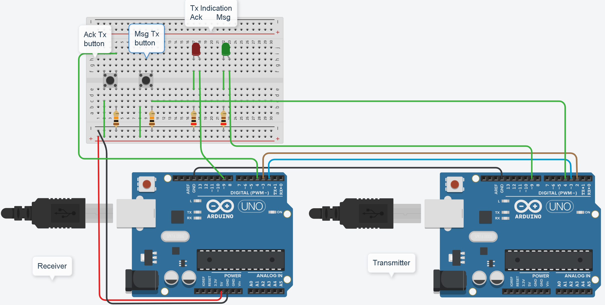
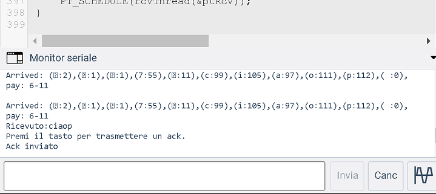

>[Torna all'indice](indexstatifiniti.md)>[Simulatore con async/await](simalohaasync.md)
## **SIMULATORE PROTOCOLLO ALOHA PER ARDUINO E TINKERCAD CON I PROTOTHREAD**



### **Utilizzo**


1) Premere il tasto codice in alto a destra per aprire la finestra del codice
2) Premere il tasto monitor seriale in basso sulla finestra del codice
3) Selezionare dal menu a tendina in alto a destra il dispositivo di cui si vuole vsualizzare il codice
4) Avviare la simulazione con il tasto apposito in alto a destra
5) Osservare i messaggi di log nella finestra del monitor serial in basso a destra
	- Se si osserva il **monitor dell'arduino N.1** si ritrova in output il log del **ricevitore** che informa sull'arrivo di un nuovo messaggio dati e l'nvito a premere il pulsante **ackBtn** per inviare un nuovo **messaggio di controllo di ack** al trasmettitore.
	- Se si osserva il **monitor dell'arduino N.2** si ritrova in output il log del **trasmettitore** che informa sull'arrivo di un nuovo messaggio dati e l'nvito a premere il pulsante **msgBtn** per inviare un nuovo **messaggio dati** al ricevitore.

	 
Simulazione in tinkercad: https://www.tinkercad.com/embed/56c7MiYw2mc?editbtn=1


### **Descrizione schema**

Il **collegamento** tra i due dispositivi in realtà non avviene tramite un mezzo a BUS ma tramite un collegamento full duplex realizzato con i due link di una porta seriale.

Arduino Uno però possiede **una sola** porta seriale UART che è utilizzata in genere per il **monitoring** del dispositivo cioè per l'invio di messaggi dal PC al dispositivo e per la ricezione sul PC di messaggi provenienti dal dispositivo.

Si è quindi usata la libreria **SoftwareSerial** per **emulare** un collegamento seriale tra **due dispositivi**  impiegando due **porte digitali** per la trasmissione nei due versi **uplink** e **downlink** impostate tramite:

```C++
#define rxPin 2
#define txPin 3
```

Un tasto **(Msg TxBtn)** sul trasmettitore abilita la **trasmissione di un messaggio** verso il ricevitore. 


Un tasto **(Ack TxBtn)** sul ricevitore abilita la **trasmissione di un ack** verso il trasmettitore. La mancata ricezione dell'ack è interpretata dal trasmettitore come una valutazioe indiretta di collisione e quindi causa la ripetizione della trasmissione del messaggio.



Un **blink** su **un led** per ogni scheda indica l'avvenuta trasmissione del messaggio o dell'ack.

### **Formato dei messaggi**

Il formato del messaggio è uniforme per messaggi di ack o dati ed è composto da 5 campi di lunghezza fissa di un byte più un sesto campo finale di lunghezza variabile che contiene il data da trasmettere.

Il messaggio da trasmettere è memorizzato in una **coda di trasmissione** di 64 byte che viene svuotata e riutilizzata per ogni nuovo messaggio da trasmettere.

Il messaggio ricevuto è memorizzato in una **coda di ricezione** di 64 byte che viene svuotata e riutilizzata per ogni nuovo messaggio ricevuto.

Nella presente implementazione del protocollo Aloha le due code **coincidono** per non si può ricevere un messaggio mentre se ne trasmette un'altro.

I **campi** del messaggio sono:
- ```DA```   destination address position
- ```SA```  source address position
- ```GROUP``` function code position
- ```I``` service identifier position
- ```BYTE_CNT``` byte counter position
- ```PAYLOAD``` 	start of data position

I **messaggi dati** hanno nel campo I il valore MSG (55) e hanno un BYTE_CNT variabile maggiore di 5. 
il log Arrived: (:2),(:1),(:1),(7:55),(:11),(c:99),(i:105),(a:97),(o:111),(p:112),(:0),
pay: 6-11 indica che il TX 2 ha inviato al RX 1 del gruppo 1 un messaggio 55 (dati) che contiene la stringa "ciaop" ed avente 11 byte complessivi di cui 6 fissi.

I **messaggi di controllo ack** hanno nel campo I il valore ACK (129) e hanno un BYTE_CNT sempre di 5. Il log Arrived: (:1),(:2),(:1),(:129),(:5),Ricevuto ack: indica che il TX 1 ha inviato al RX 2 del gruppo 1 un messaggio 129 (ack) di 5 byte complessivi sempre fissi.

### **Fasi ALOHA**
Una **stazione trasmittente**:
- al momento che ha una trama pronta, la invia senza aspettare.
- Dopo l’invio aspetta per un certo tempo (detto **timeout**) lo scadere di un timer (detto **timer di trasmissione**).
- Se essa riceve il messaggio di ack allora la trasmissione è avvenuta con successo.
- Altrimenti la stazione usa una strategia di backoff e invia nuovamente il pachetto.
- Dopo molte volte che non si ricevono conferme (acknowledgement) allora la stazione abbandona l’dea di trasmettere.

### **Programmazione sequenziale**

L'algoritmo è realizzato in maniera **sequenziale nel tempo**  pianificando il **blocco** del flusso di esecuzione di parti del codice per un certo **tempo di attesa**. Il tempo di attesa potrebbe essere:
- una quantità **stabilita a priori** dal valore di una costante, dal valore di una variabile o dal valore di una espressione e si può rappresentare, in linea di principio con l'istruzione ```Wait(t)``` che, nel caso di Arduino diventa ```delay(t)``` oppure nel caso dei protothread diventa ```PT_SLEEP(t)```. 
- una **quantità non nota in anticipo** collegata al verificarsi di un **evento di input** proveniente dall'esterno come l'arrivo di un certo messaggio di controllo e si può rappresentare, in linea di principio con l'istruzione ```WaitUntil(pollingInput)```. 

In **entrambi i casi** il flusso di esecuzione rimane **in attesa** della valutazione periodica (**polling**) di un **flag** che rappresenta l'accadere di un evento, il **timeout** di un timer preimpostato nel caso del ```Wait(t)```, l'**arrivo di un messaggio** nel caso del ```WaitUntil(pollingInput)```. 

### **Eventi di input**

Gli eventi di input rilevanti che potrebbero essere valutati durante lo svolgimento dell'algoritomo sono:

- ```bool dataFrameArrived()```. Controlla se è arrivato un messaggio dati
- ```bool ack_received()```. Controlla se è arrivato un messaggio di controllo di conferma (ack) di trasmissione avvenuta con successo.
- ```bool ackOrTimeout()```. Controlla se i trasmettitore è in attesa della ricezione di un ack o se non lo è più perchè è scaduto il timeout del timer di trasmissione di un messaggio.
- ```bool isMsgWaitState()```. Controlla se il ricevitore è nello stato di attesa di un messaggio 
- ```bool isAckWaitState()```. Controlla se il trasmettitore è nello stato di attesa di un ack 

### **Thread di ricezione e trasmissione**

In realtà, il **polling** degli eventi è fatto all'interno di **un'unica funzione** chiamata ```poll()``` che viene periodicamente richiamata all'interno del **loop principale** del sistema:

```C++
void loop() 
{
	poll(&rxobj);
	.............
}
```

La ```poll()```modifica delle **variabili globali** con funzione di indicazione di evento dette **flag** (bandierine) che sono **specifiche** per ogni evento e che vengono **valutate** all'interno dei **thread** del sistema (i thread condividono le stesse variabili globali).

I **thread** rappresentano blocchi di codice la cui esecuzione si svolge in maniera **parallela** ed **indipendente** e, per uno stesso dispositivo fisico, sono essenzialmente **due**: un thread di **ricezione** ed un thread di **trasmissione**.

**Arduino** non possiede capacità di multithreading reale di **tipo preemptive** (competitvo con prerilascio) e realizzato in HW, ciònonostante è comunque possibile realizzare in SW una schedulazione di **tipo non preemptive** (collaborativa senza prerilascio) utilizzando i **protothread**.

## **Ricevitore**

**Protocollo ALOHA in ricezione pseudocodice:**

```C++
While(true){
	WaitUntil(dataFrameArrived());
	if(!duplicate()){ 
		deliver(frame) 
	}
	send(ack_frame);
}

```

### **Definizione del thread di ricezione messaggio**

```C++
pt ptRcv;
int rcvThread(struct pt* pt) {
  PT_BEGIN(pt);
  // Loop forever
  while(true) {
	digitalWrite(led, HIGH);
	PT_SLEEP(pt, 50);
	digitalWrite(led, LOW);
	PT_SLEEP(pt, 50);	
	PT_WAIT_UNTIL(pt, dataFrameArrived());
	rcvEventCallback();
	Serial.println("Premi il tasto per trasmettere un ack.");
	PT_WAIT_UNTIL(pt, digitalRead(ackBtn));
	sendAck();  
  }
  PT_END(pt);
```

## **Trasmettitore**

**Protocollo ALOHA in trasmissione in pseudocodice:**
```C++
N=1;
while(N <= max){
	send(data_frame);
	waitUntil(ackOrTimeout());
	if(ack_received){
		exit while;
	}else{
		/* timeout scaduto: ritrasmissione*/
		t=random()*WNDW*2^n;
		wait(t);
		N=N+1;
}
/* troppi tentativi: rinuncio a trasmette
```

### **Definizione del thread di trasmissione messaggio**

```C++
pt ptSend;
int sendThread(struct pt* pt) {
  PT_BEGIN(pt);
  // Loop forever
  while(true) {
	while(n < MAXATTEMPTS){
		sendData(&txobj);
		Serial.println("Attendo ack o timeout: ");
		PT_WAIT_UNTIL(pt, ackOrTimeout());
		if(ack_received()){
			n = MAXATTEMPTS;
			Serial.println("Ricevuto ack: ");
		}else{
			Serial.print("Timeout n: ");
			Serial.print(n);
			Serial.print(": ritrasmissione tra: ");
			tt = getBackoff();
			Serial.print((float) tt/1000);
			Serial.println(" secondi");
			/* timeout scaduto: ritrasmissione*/
			PT_SLEEP(pt, tt);
			Serial.print(" Ritrasmesso.");
			PT_WAIT_UNTIL(pt, digitalRead(txBtn));
			digitalWrite(led, HIGH);
			PT_SLEEP(pt, 50);
			digitalWrite(led, LOW);
			PT_SLEEP(pt, 50);	
			n = 0;  //azzera conteggio			
		}
	 }
	 Serial.println("Premi il tasto per trasmettere un messaggio.");
	 PT_WAIT_UNTIL(pt, digitalRead(txBtn));
	 n = 0;
  }
  PT_END(pt);
}

```
### **Backoff a finestra variabile**

L'algoritmo ALOHA proposto utilizza un backoff a **finestra variabile** in cui la **finestra di trasmissione** aumenta esponenzialmente (con la potenza del 2) ad ogni incremento del **numero di tentativi** andati a vuoto. La finestra di trasmissione è detta anche **finestra di contesa** e rappresenta l'intervallo temporale in cui ogni stazione calcola individualmente un **tempo random** di accesso a partire dal quale cominciare a trasmettere.

```C++
long getBackoff(){
	return random(0, WNDW*pow(2,n));
}
```


- [Codice completo del ricevitore](ricevitoreproto.ino)
- [Codice completo del trasmettitore](trasmettitoreproto.ino)

>[Torna all'indice](indexstatifiniti.md)>[Simulatore con async/await](simalohaasync.md)
