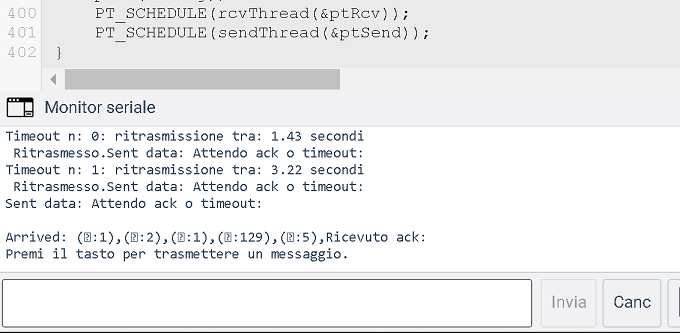

>[Torna all'indice](indexstatifiniti.md)
## **SIMULATORE PROTOCOLLO ALOHA PER ARDUINO E TINKERCAD CON I PROTOTHREAD**


### **Utilizzo**


1) Premere il tasto codice in alto a destra per aprire la finestra del codice
2) Premere il tasto monitor seriale in basso sulla finestra del codice
3) Selezionare dal menu a tendina in alto a destra il dispositivo di cui si vuole vsualizzare il codice
4) Avviare la simulazione con il tasto apposito in alto a destra
5) Osservare i messaggi di log nella finestra del monitor serial in basso a destra
	- Se si osserva il **monitor dell'arduino N.1** si ritrova in output il log del **ricevitore** che informa sull'arrivo di un nuovo messaggio dati e l'nvito a premere il pulsante **ackBtn** per inviare un nuovo **messaggio di controllo di ack** al trasmettitore.
	- Se si osserva il **monitor dell'arduino N.2** si ritrova in output il log del **trasmettitore** che informa sull'arrivo di un nuovo messaggio dati e l'nvito a premere il pulsante **msgBtn** per inviare un nuovo **messaggio dati** al ricevitore.

	 
Simulazione in tinkercad: https://www.tinkercad.com/embed/56c7MiYw2mc?editbtn=1


### **Descrizione schema**

Il **collegamento** tra i due dispositivi in realtà non avviene tramite un mezzo a BUS ma tramite un collegamento full duplex realizzato con i due link di una porta seriale.

Arduino Uno però possiede **una sola** porta seriale UART che è utilizzata in genere per il **monitoring** del dispositivo cioè per l'invio di messaggi dal PC al dispositivo e per la ricezione sul PC di messaggi provenienti dal dispositivo.

Si è quindi usata la libreria **SoftwareSerial** per **emulare** un collegamento seriale tra **due dispositivi**  impiegando due **porte digitali** per la trasmissione nei due versi **uplink** e **downlink** impostate tramite:

```C++
#define rxPin 2
#define txPin 3
```

Un tasto **(Msg TxBtn)** sul trasmettitore abilita la **trasmissione di un messaggio** verso il ricevitore. 



Un tasto **(Ack TxBtn)** sul ricevitore abilita la **trasmissione di un ack** verso il trasmettitore. La mancata ricezione dell'ack è interpretata dal trasmettitore come una valutazioe indiretta di collisione e quindi causa la ripetizione della trasmissione del messaggio.


Un **blink** su **un led** per ogni scheda indica l'avvenuta trasmissione del messaggio o dell'ack.

### **Formato dei messaggi**

Il formato del messaggio è uniforme per messaggi di ack o dati ed è composto da 5 campi di lunghezza fissa di un byte più un sesto campo finale di lunghezza variabile che contiene il data da trasmettere.

Il messaggio da trasmettere è memorizzato in una **coda di trasmissione** di 64 byte che viene svuotata e riutilizzata per ogni nuovo messaggio da trasmettere.

Il messaggio ricevuto è memorizzato in una **coda di ricezione** di 64 byte che viene svuotata e riutilizzata per ogni nuovo messaggio ricevuto.

Nella presente implementazione del protocollo Aloha le due code **coincidono** per non si può ricevere un messaggio mentre se ne trasmette un'altro.

I **campi** del messaggio sono:
- ```DA```   destination address position
- ```SA```  source address position
- ```GROUP``` function code position
- ```I``` service identifier position
- ```BYTE_CNT``` byte counter position
- ```PAYLOAD``` 	start of data position

I **messaggi dati** hanno nel campo I il valore MSG (55) e hanno un BYTE_CNT variabile maggiore di 5. 
il log Arrived: (:2),(:1),(:1),(7:55),(:11),(c:99),(i:105),(a:97),(o:111),(p:112),(:0),
pay: 6-11 indica che il TX 2 ha inviato al RX 1 del gruppo 1 un messaggio 55 (dati) che contiene la stringa "ciaop" ed avente 11 byte complessivi di cui 6 fissi.

I **messaggi di controllo ack** hanno nel campo I il valore ACK (129) e hanno un BYTE_CNT sempre di 5. Il log Arrived: (:1),(:2),(:1),(:129),(:5),Ricevuto ack: indica che il TX 1 ha inviato al RX 2 del gruppo 1 un messaggio 129 (ack) di 5 byte complessivi sempre fissi.

### **Fasi ALOHA**
Una **stazione trasmittente**:
- al momento che ha una trama pronta, la invia senza aspettare.
- Dopo l’invio aspetta per un certo tempo (detto **timeout**) lo scadere di un timer (detto **timer di trasmissione**).
- Se essa riceve il messaggio di ack allora la trasmissione è avvenuta con successo.
- Altrimenti la stazione usa una strategia di backoff e invia nuovamente il pachetto.
- Dopo molte volte che non si ricevono conferme (acknowledgement) allora la stazione abbandona l’dea di trasmettere.

### **Programmazione sequenziale**

L'algoritmo è realizzato in maniera **sequenziale nel tempo**  pianificando il **blocco** del flusso di esecuzione di parti del codice per un certo **tempo di attesa**. Il tempo di attesa potrebbe essere:
- una quantità **stabilita a priori** dal valore di una costante, dal valore di una variabile o dal valore di una espressione e si può rappresentare, in linea di principio con l'istruzione ```Wait(t)``` che, nel caso di Arduino diventa ```delay(t)``` oppure nel caso dei protothread diventa ```PT_SLEEP(t)```. 
- una **quantità non nota in anticipo** collegata al verificarsi di un **evento di input** proveniente dall'esterno come l'arrivo di un certo messaggio di controllo e si può rappresentare, in linea di principio con l'istruzione ```WaitUntil(pollingInput)```. 

In **entrambi i casi** il flusso di esecuzione rimane **in attesa** della valutazione periodica (**polling**) di un **flag** che rappresenta l'accadere di un evento, il **timeout** di un timer preimpostato nel caso del ```Wait(t)```, l'**arrivo di un messaggio** nel caso del ```WaitUntil(pollingInput)```. 

### **Eventi di input**

Gli eventi di input rilevanti che potrebbero essere valutati durante lo svolgimento dell'algoritomo sono:

- ```bool dataFrameArrived()```. Controlla se è arrivato un messaggio dati
- ```bool ack_received()```. Controlla se è arrivato un messaggio di controllo di conferma (ack) di trasmissione avvenuta con successo.
- ```bool ackOrTimeout()```. Controlla se i trasmettitore è in attesa della ricezione di un ack o se non lo è più perchè è scaduto il timeout del timer di trasmissione di un messaggio.
- ```bool isMsgWaitState()```. Controlla se il ricevitore è nello stato di attesa di un messaggio 
- ```bool isAckWaitState()```. Controlla se il trasmettitore è nello stato di attesa di un ack 

### **Thread di ricezione e trasmissione**

In realtà, il **polling** degli eventi è fatto all'interno di **un'unica funzione** chiamata ```poll()``` che viene periodicamente richiamata all'interno del **loop principale** del sistema:

```C++
void loop() 
{
	poll(&rxobj);
	.............
}
```

La ```poll()```modifica delle **variabili globali** con funzione di indicazione di evento dette **flag** (bandierine) che sono **specifiche** per ogni evento e che vengono **valutate** all'interno dei **thread** del sistema (i thread condividono le stesse variabili globali).

I **thread** rappresentano blocchi di codice la cui esecuzione si svolge in maniera **parallela** ed **indipendente** e, per uno stesso dispositivo fisico, sono essenzialmente **due**: un thread di **ricezione** ed un thread di **trasmissione**.

**Arduino** non possiede capacità di multithreading reale di **tipo preemptive** (competitvo con prerilascio) e realizzato in HW, ciònonostante è comunque possibile realizzare in SW una schedulazione di **tipo non preemptive** (collaborativa senza prerilascio) utilizzando i **protothread**.

## **Ricevitore**

**Protocollo ALOHA in ricezione pseudocodice:**

```C++
While(true){
	WaitUntil(dataFrameArrived());
	if(!duplicate()){ 
		deliver(frame) 
	}
	send(ack_frame);
}

```

### **Definizione del thread di ricezione messaggio**

```C++
pt ptRcv;
int rcvThread(struct pt* pt) {
  PT_BEGIN(pt);
  // Loop forever
  while(true) {
	digitalWrite(led, HIGH);
	PT_SLEEP(pt, 50);
	digitalWrite(led, LOW);
	PT_SLEEP(pt, 50);	
	PT_WAIT_UNTIL(pt, dataFrameArrived());
	rcvEventCallback();
	Serial.println("Premi il tasto per trasmettere un ack.");
	PT_WAIT_UNTIL(pt, digitalRead(ackBtn));
	sendAck();  
  }
  PT_END(pt);
```

## **Trasmettitore**

**Protocollo ALOHA in trasmissione in pseudocodice:**
```C++
N=1;
while(N <= max){
	send(data_frame);
	waitUntil(ackOrTimeout());
	if(ack_received){
		exit while;
	}else{
		/* timeout scaduto: ritrasmissione*/
		t=random()*WNDW*2^n;
		wait(t);
		N=N+1;
}
/* troppi tentativi: rinuncio a trasmette
```

### **Definizione del thread di trasmissione messaggio**

```C++
pt ptSend;
int sendThread(struct pt* pt) {
  PT_BEGIN(pt);
  // Loop forever
  while(true) {
	while(n < MAXATTEMPTS){
		sendData(&txobj);
		Serial.println("Attendo ack o timeout: ");
		PT_WAIT_UNTIL(pt, ackOrTimeout());
		if(ack_received()){
			n = MAXATTEMPTS;
			Serial.println("Ricevuto ack: ");
		}else{
			Serial.print("Timeout n: ");
			Serial.print(n);
			Serial.print(": ritrasmissione tra: ");
			tt = getBackoff();
			Serial.print((float) tt/1000);
			Serial.println(" secondi");
			/* timeout scaduto: ritrasmissione*/
			PT_SLEEP(pt, tt);
			Serial.print(" Ritrasmesso.");
			PT_WAIT_UNTIL(pt, digitalRead(txBtn));
			digitalWrite(led, HIGH);
			PT_SLEEP(pt, 50);
			digitalWrite(led, LOW);
			PT_SLEEP(pt, 50);	
			n = 0;  //azzera conteggio			
		}
	 }
	 Serial.println("Premi il tasto per trasmettere un messaggio.");
	 PT_WAIT_UNTIL(pt, digitalRead(txBtn));
	 n = 0;
  }
  PT_END(pt);
}

```
### **Backoff a finestra variabile**

L'algoritmo ALOHA proposto utilizza un backoff a **finestra variabile** in cui la **finestra di trasmissione** aumenta esponenzialmente (con la potenza del 2) ad ogni incremento del **numero di tentativi** andati a vuoto. La finestra di trasmissione è detta anche **finestra di contesa** e rappresenta l'intervallo temporale in cui ogni stazione calcola individualmente un **tempo random** di accesso a partire dal quale cominciare a trasmettere.

```C++
long getBackoff(){
	return random(0, WNDW*pow(2,n));
}
```

### **Codice completo del ricevitore**

```C++
#define LC_INIT(lc)
struct pt { unsigned short lc; };
#define PT_THREAD(name_args)  char name_args
#define PT_BEGIN(pt)          switch(pt->lc) { case 0:
#define PT_WAIT_UNTIL(pt, c)  pt->lc = __LINE__; case __LINE__: \
                              if(!(c)) return 0
#define PT_END(pt)            } pt->lc = 0; return 2
#define PT_INIT(pt)   LC_INIT((pt)->lc)
#define PT_SLEEP(pt, delay) \
{ \
  do { \
    static unsigned long protothreads_sleep; \
    protothreads_sleep = millis(); \
    PT_WAIT_UNTIL(pt, millis() - protothreads_sleep > delay); \
  } while(false); \
}
#define PT_EXITED  2
#define PT_SCHEDULE(f) ((f) < PT_EXITED)
#define PT_YIELD(pt) PT_SLEEP(pt, 0)

#define MAX_BUFFER 		64
#define WNDW	10
#define STOP_BIT  		10
#define MSG  			55 	
#define SOFV			254	  
#define ACK  			129 //(100000001)  il primo (MSB) bit è un ack bit
#define NACK  			128 //(100000001)  il primo (MSB) bit è un ack bit
#define TBASE			2000
#define MAXATTEMPTS  		5
#define WNDW    		20
#define TXTIMEOUT 		2000
#define ERR_BUFF_OVERFLOW   -1

#include <SoftwareSerial.h>

#define rxPin 2
#define txPin 3
#define dirPin 13

SoftwareSerial mySerial =  SoftwareSerial(rxPin, txPin);
// struttura dati parallela (non serializzata) che costituisce il messaggio
typedef struct{
   uint8_t u8sof;
   uint8_t u8da;          
   uint8_t u8sa;
   uint8_t u8group;         
   uint8_t u8si;    
   uint8_t data[20];    //lunghezza massima del payload!!!  
   int8_t msglen;
   bool multicast;
} telegram_t;

void sendMsg(telegram_t *tosend);
bool sendData(telegram_t *tosend);
void parallelToSerial(const telegram_t *tosend);
int8_t poll(telegram_t *rt);
void rcvEvent(telegram_t* rcvd, uint8_t msglen);


// offesets (spiazzamenti) dei campi del messaggio a partire dall’inizio
enum MESSAGE
{
    DA            = 0, //!< destination address position
    SA,		//!< source address position
    GROUP, 		//!< Function code position
    SI, 		//!< Service identifier position
    BYTE_CNT,  	//!< byte counter position
    PAYLOAD 	//!<  start of data position
};

// stati del protocollo
enum PROTO_STATE
{
    MSGWAIT             	= 1,
    ACKWAIT              	= 2
};
enum FLAGS
{
    ACKARRIVED              = 0,
    MSGARRIVED              = 1,
    TIMEOUTEVNT             = 2
};

uint8_t u8Buffer[MAX_BUFFER]; // buffer unico condiviso per TX e RX (da usare alternativamente)
uint8_t u8lastRec; // per rivelatore di fine trama (stop bit)
uint32_t u32time, u32difsTime;
uint8_t _txpin;
uint8_t n;
uint8_t mysa;
uint8_t mygroup;
uint8_t u8state = MSGWAIT;
unsigned long precAck=0;
unsigned long timeoutTime=TXTIMEOUT;
Stream *port;
bool flags[3];// flags[ACKARRIVED], flags[MSGARRIVED], flags[TIMEOUTEVNT]

char* rcvdata;
telegram_t txobj, rxobj, ackobj;
unsigned long prec=0;
byte ackBtn = 4;
byte led=9; 

uint8_t getMySA(){
	return mysa;
}

uint8_t getMyGroup(){
	return mygroup;
}

bool isMsgWaitState(){
	return (u8state == MSGWAIT);
}

void rcvEventCallback(){
	Serial.print("Ricevuto:");
	Serial.println(rcvdata);
}

bool dataFrameArrived(){
	return flags[MSGARRIVED];	
}

bool ack_received(){
	return flags[ACKARRIVED];
}

bool ackOrTimeout(){
	return (flags[ACKARRIVED] || flags[TIMEOUTEVNT]);
}

long getBackoff(){
	return random(0, WNDW*pow(2,n));
}

void init(Stream *port485, uint8_t _txpin485, uint8_t mysa485, uint8_t mygroup485, uint32_t u32speed=0){
	randomSeed(analogRead(0));
	port = port485;
	_txpin = _txpin485;
	mysa = mysa485;
	mygroup = mygroup485;
	if(u32speed > 0){
		static_cast<HardwareSerial*>(port)->begin(u32speed);
	}
	ackobj.u8sa = mysa;
	ackobj.u8group = mygroup;
	ackobj.u8si = ACK;
	ackobj.msglen = 0;
}

void sendAck(){
	flags[MSGARRIVED] = false;
	ackobj.u8si = ACK;
	sendMsg(&ackobj); 
	Serial.println("Ack inviato ");
}

bool sendData(telegram_t *tosend){
	bool sent = false;
	
	ackobj.u8si = MSG;
	sendMsg(tosend);
	u8state = ACKWAIT;
	if(u8state == MSGWAIT){
		sent = true;
	}
	precAck = millis();
	flags[ACKARRIVED] = false;
	flags[TIMEOUTEVNT] = false;
	Serial.print("Sent data: ");
	return sent;
}
//invia un messaggio in formato "parallelo" sotto forma di struct 
// sull'uscita seriale
void sendMsg(telegram_t *tosend){
	tosend->u8sa = mysa;
	tosend->u8group = mygroup;
	parallelToSerial(tosend);
	sendTxBuffer(u8Buffer[ BYTE_CNT ]); //trasmette sul canale
}

// carica i campi della struct nella giusta posizione nel buffer 
// secondo il formato del messaggio stabilito dal protocollo
void parallelToSerial(const telegram_t *tosend){
	//copia header
	u8Buffer[ DA ] = tosend->u8da;
	u8Buffer[ SA ] = tosend->u8sa;
	u8Buffer[ GROUP ] = tosend->u8group;
	u8Buffer[ SI ] = tosend->u8si;
	u8Buffer[ BYTE_CNT ] = tosend->msglen + PAYLOAD;
	//copia payload
	for(int i=0; i < tosend->msglen; i++){
		u8Buffer[i+PAYLOAD] = tosend->data[i];
	}
}

// ascolta in polling l'ingresso seriale
int8_t poll(telegram_t *rt)
{
	uint8_t u8current;
	//GENERATORE EVENTI
	// Lista di condizioni annidate. La valutazione di una condizione è vincolata alla verità di tutte quelle che la precedono.
	// La relazione tra le condizioni consiste in un AND logico tra una condizione e la successiva.
	// Per rendere più leggibile il codice, la valutazione annidata delle condizioni è sostituita da una valutazione 
	// sequenziale delle stesse che può far ritornare in anticipo la funzione prima dell'esecuzione del codice a valle 
	// di una condizione non vera.
	// Ogni condizione valuta l'accadere di un evento. Un evento può essere un particolare valore in ingresso (messaggo) 
	// o lo scadere del tempo (timeout) di un timer. 
	// Il mancato accadimento di un evento in cima alla lista disattiva la valutazione dell'accadimento di tutti quelli a valle // (short circuit). 
	
	 // listen on the SoftwareSerial port.
	
	// RECEIVE EVENT DETECTOR. Polling che controlla quanti caratteri del messaggio sono arrivati
	// sulla coda di ricezione
	
	u8current = port->available(); 
	//Serial.println("pre_a");
	// ACK TIMER TIMEOUT DETECTOR
	if (u8current == 0){ // nessun messaggio 
		//allora valuta lo scadere del timer
		if(u8state == ACKWAIT){
			if(millis()-precAck > timeoutTime){
				flags[TIMEOUTEVNT] = true;
			}
		}
		// rendi mutuamente esclusivo il blocco di codice
		return 0;  // se non è arrivato nulla ricontrolla al prossimo giro
	}
	
	// RESET STOP BIT TIMER. Se arrivano nuovi caratteri rimani in ascolto
	// perchè il messaggio è ancora incompleto
	if (u8current != u8lastRec)
	{
		// aggiorna ogni volta che arriva un nuovo carattere!
		u8lastRec = u8current;
		u32time = millis();
		// rendi mutuamente esclusivo il blocco di codice
		return 0;
	}

	// STOP BIT DETECTOR. Se non arrivano nuovi caratteri ma è troppo presto allora aspetta
	if ((unsigned long)(millis() -u32time) < (unsigned long)STOP_BIT) 
		// rendi mutuamente esclusivo il blocco di codice
		return 0;
	//Serial.println("pre_c");
	// COPY TO RECEIVE BUFFER. Se non arrivano nuovi caratteri ma è passato il tempo di interframe
	// alllora vuol dire che la trama è completa allora bufferizza
	int8_t i8state = getRxBuffer(); 

	printRxBuffer(u8Buffer[ BYTE_CNT ]);
    // INCOMPLETE MESSAGES DETECTOR. Se è palesemente incompleta scartala!
   	if (i8state < PAYLOAD) 
	{
		// rendi mutuamente esclusivo il blocco di codice
		return i8state;
	}
	//Serial.println("b");
	// MSSAGE SELECTOR.
	
    if (u8Buffer[ SI ] == MSG){ // se ricevo un messaggio
		// prendi l'indirizzo di sorgente del messaggio ricevuto
		// e fallo diventare indirizzo di destinazione del messaggio di ack
		ackobj.u8da = u8Buffer[ SA ]; 
		rcvEvent(rt, i8state); // parallelizza
		// se ricevo un messaggio invio l'ack
		// funzione che realizza l'azione da compiere all'arrivo del  //messaggio
		rcvdata = (char*)rt->data;
		flags[MSGARRIVED] = true;
		// rendi mutuamente esclusivo il blocco di codice
		return i8state; 
	}else if (u8Buffer[ SI ] == ACK){ // se ricevo un ack
		if(u8state == ACKWAIT){
			u8state = MSGWAIT;	//next go to MSGWAIT
			flags[ACKARRIVED] = true;
		}//else messaggio di ack si perde....
	}
	//Serial.println("d");
	return i8state;
}

void sendTxBuffer(uint8_t u8BufferSize){
    // transfer buffer to serial line
    port->write( u8Buffer, u8BufferSize );
    port->flush();
    while(port->read() >= 0);
}

void printRxBuffer(uint8_t u8BufferSize)
{
    uint8_t i=0;
    Serial.println();
    Serial.print("Arrived: ");
    while ( i < u8BufferSize ) // finchè ce ne sono, leggi i caratteri && u8Buffer[ i ]!=0
    {					  // e mettili sul buffer di ricezione
	Serial.print("(");
	Serial.print((char) u8Buffer[ i ]);
	Serial.print(":");
	Serial.print((uint8_t) u8Buffer[ i ],DEC);
	Serial.print("),");
	Serial.flush();
        i ++;
    }
}

void resetRxBuffer(uint8_t u8BufferSize)
{
   uint8_t i=0;
    while ( i < u8BufferSize ) // finchè ce ne sono, leggi i caratteri
    {					  // e mettili sul buffer di ricezione
	u8Buffer[ i ] = 0;
        i ++;
    }
}

int8_t getRxBuffer()
{
    boolean bBuffOverflow = false;
    uint8_t u8BufferSize = 0;
    uint8_t i = 0;

    while ( port->available() && i<=BYTE_CNT) // finchè ce ne sono, leggi i caratteri
    {					  // e mettili sul buffer di ricezione
        u8Buffer[ u8BufferSize ] = port->read();
        u8BufferSize ++;
	i++;
    }
    while ( port->available() && i<u8Buffer[ BYTE_CNT ]) // finchè ce ne sono, leggi i caratteri
    {					  // e mettili sul buffer di ricezione
        u8Buffer[ u8BufferSize ] = port->read();
        u8BufferSize ++;
		// segnala evento di buffer overflow (un attacco hacker?)
        if (u8BufferSize >= MAX_BUFFER){
		return ERR_BUFF_OVERFLOW;
	}
	i++;
    }
    return u8BufferSize;
}

// deserializzzazione in ricezione
void rcvEvent(telegram_t* rcvd, uint8_t msglen){
// converti da formato seriale (array di char) in formato parallelo   
//(non serializzato)
	// header
	rcvd->u8da = u8Buffer[ SA ];
	rcvd->u8group = u8Buffer[ GROUP ];
	rcvd->u8si = u8Buffer[ SI ];
	rcvd->msglen = u8Buffer[ BYTE_CNT ]-PAYLOAD;
	// payload
	Serial.println();
	Serial.print("pay: ");
	Serial.print(rcvd->msglen);
	Serial.print("-");
	Serial.println(msglen);
	for(int i=0; i < rcvd->msglen; i++){
		rcvd->data[i] = u8Buffer[i+PAYLOAD];
	}
	// notifica l'evento di ricezione all'applicazione con una callback
}

pt ptRcv;
int rcvThread(struct pt* pt) {
  PT_BEGIN(pt);
  // Loop forever
  while(true) {
	digitalWrite(led, HIGH);
	PT_SLEEP(pt, 50);
	digitalWrite(led, LOW);
	PT_SLEEP(pt, 50);	
	PT_WAIT_UNTIL(pt, dataFrameArrived());
	rcvEventCallback();
	 Serial.println("Premi il tasto per trasmettere un ack.");
	PT_WAIT_UNTIL(pt, digitalRead(ackBtn));
	sendAck();  
  }
  PT_END(pt);
}

void setup(){
	pinMode(led, OUTPUT); 
	pinMode(ackBtn, INPUT);
	pinMode(dirPin, OUTPUT);
	PT_INIT(&ptRcv);
	//Serial.begin(9600);
	Serial.println("I am reciver!");
	Serial.begin(115200);
	mySerial.begin(2400); //300, 600, 1200, 2400, 4800, 9600, 14400, 19200, 28800, 31250, 38400, 57600, and 115200
	init(&mySerial, dirPin, 2, 1, 0); // port485, txpin, mysa, mygroup4, speed=9600
	//preparazione messaggio TX (parallelo)
	txobj.u8da = 1;
	n = MAXATTEMPTS;
}

void loop() // run over and over
{
	poll(&rxobj);
	PT_SCHEDULE(rcvThread(&ptRcv));
}

```


### **Codice completo del trasmettitore**

```C++
#define LC_INIT(lc)
struct pt { unsigned short lc; };
#define PT_THREAD(name_args)  char name_args
#define PT_BEGIN(pt)          switch(pt->lc) { case 0:
#define PT_WAIT_UNTIL(pt, c)  pt->lc = __LINE__; case __LINE__: \
                              if(!(c)) return 0
#define PT_END(pt)            } pt->lc = 0; return 2
#define PT_INIT(pt)   LC_INIT((pt)->lc)
#define PT_SLEEP(pt, delay) \
{ \
  do { \
    static unsigned long protothreads_sleep; \
    protothreads_sleep = millis(); \
    PT_WAIT_UNTIL(pt, millis() - protothreads_sleep > delay); \
  } while(false); \
}
#define PT_EXITED  2
#define PT_SCHEDULE(f) ((f) < PT_EXITED)
#define PT_YIELD(pt) PT_SLEEP(pt, 0)

#define MAX_BUFFER 		64
#define WNDW			10
#define STOP_BIT  		5  
#define MSG  			55 	
#define SOFV			254	  
#define ACK  			129 //(100000001)  il primo (MSB) bit è un ack bit
#define NACK  			128 //(100000001)  il primo (MSB) bit è un ack bit
#define TBASE			3000
#define MAXATTEMPTS  		5
#define WNDW    		2000
#define TXTIMEOUT 		2000
#define ERR_BUFF_OVERFLOW   -1

#include <SoftwareSerial.h>
#define rxPin 2
#define txPin 3
#define dirPin 13
SoftwareSerial mySerial =  SoftwareSerial(rxPin, txPin);

// struttura dati parallela (non serializzata) che costituisce il messaggio
typedef struct{
   uint8_t u8sof;
   uint8_t u8da;          
   uint8_t u8sa;
   uint8_t u8group;         
   uint8_t u8si;    
   uint8_t data[20];    //lunghezza massima del payload!!!  
   int8_t msglen;
   bool multicast;
} telegram_t;

void sendMsg(telegram_t *tosend);
bool sendData(telegram_t *tosend);
void parallelToSerial(const telegram_t *tosend);
int8_t poll(telegram_t *rt);
void rcvEvent(telegram_t* rcvd, uint8_t msglen);


// offesets (spiazzamenti) dei campi del messaggio a partire dall’inizio
enum MESSAGE
{
    DA            = 0, //!< destination address position
    SA,		//!< source address position
    GROUP, 		//!< Function code position
    SI, 		//!< Service identifier position
    BYTE_CNT,  	//!< byte counter position
    PAYLOAD 	//!<  start of data position
};

// stati del protocollo
enum PROTO_STATE
{
    MSGWAIT             	= 1,
    ACKWAIT              	= 2
};
enum FLAGS
{
    ACKARRIVED              = 0,
    MSGARRIVED              = 1,
    TIMEOUTEVNT             = 2
};

uint8_t u8Buffer[MAX_BUFFER]; // buffer unico condiviso per TX e RX (da usare alternativamente)
uint8_t u8lastRec; // per rivelatore di fine trama (stop bit)
uint32_t u32time, u32difsTime;
uint8_t _txpin;
uint8_t n=0;
uint8_t mysa;
uint8_t mygroup;
uint8_t u8state = MSGWAIT;
unsigned long precAck=0;
unsigned long timeoutTime=TXTIMEOUT;
Stream *port;
bool flags[3];// flags[ACKARRIVED], flags[MSGARRIVED], flags[TIMEOUTEVNT]

char* rcvdata;
telegram_t txobj, rxobj, ackobj;
unsigned long prec=0;
byte txBtn = 5;
byte led=9; 
long tt;

uint8_t getMySA(){
	return mysa;
}

uint8_t getMyGroup(){
	return mygroup;
}

bool isMsgWaitState(){
	return (u8state == MSGWAIT);
}

void rcvEventCallback(){
	Serial.print("Ricevuto:");
	Serial.println(rcvdata);
}

bool dataFrameArrived(){
	return flags[MSGARRIVED];	
}

bool ack_received(){
	return flags[ACKARRIVED];
}

bool ackOrTimeout(){
	return (flags[ACKARRIVED] || flags[TIMEOUTEVNT]);
}

long getBackoff(){
	return random(0, WNDW*pow(2,n));
}

void init(Stream *port485, uint8_t _txpin485, uint8_t mysa485, uint8_t mygroup485, uint32_t u32speed=0){
	randomSeed(analogRead(0));
	port = port485;
	_txpin = _txpin485;
	mysa = mysa485;
	mygroup = mygroup485;
	if(u32speed > 0){
		static_cast<HardwareSerial*>(port)->begin(u32speed);
	}
	ackobj.u8sa = mysa;
	ackobj.u8group = mygroup;
	ackobj.u8si = ACK;
	//ackobj.data = 0;
	ackobj.msglen = 0;
}

void sendAck(){
	flags[MSGARRIVED] = false;
	ackobj.u8si = ACK;
	sendMsg(&ackobj); 
	Serial.println("rcv:ack sent ");
}

bool sendData(telegram_t *tosend){
	bool sent = false;
	tosend->u8si = MSG;
	sendMsg(tosend);
	u8state = ACKWAIT;
	if(u8state == MSGWAIT){
		sent = true;
	}
	precAck = millis();
	flags[ACKARRIVED] = false;
	flags[TIMEOUTEVNT] = false;
	Serial.print("Sent data: ");
	return sent;
}
//invia un messaggio in formato "parallelo" sotto forma di struct 
// sull'uscita seriale
void sendMsg(telegram_t *tosend){
	tosend->u8sa = mysa;
	tosend->u8group = mygroup;
	parallelToSerial(tosend);
	sendTxBuffer(u8Buffer[ BYTE_CNT ]); //trasmette sul canale
}

void printRxBuffer(uint8_t u8BufferSize)
{
    uint8_t i=0;
    Serial.println();
    Serial.print("Arrived: ");
    while ( i < u8BufferSize ) // finchè ce ne sono, leggi i caratteri && u8Buffer[ i ]!=0
    {					  // e mettili sul buffer di ricezione
	Serial.print("(");
	Serial.print((char) u8Buffer[ i ]);
	Serial.print(":");
	Serial.print((uint8_t) u8Buffer[ i ],DEC);
	Serial.print("),");
        i ++;
    }
}

// carica i campi della struct nella giusta posizione nel buffer 
// secondo il formato del messaggio stabilito dal protocollo
void parallelToSerial(const telegram_t *tosend){
	//copia header
	u8Buffer[ DA ] = tosend->u8da; //2
	u8Buffer[ SA ] = tosend->u8sa; //1
	u8Buffer[ GROUP ] = tosend->u8group; //1
	u8Buffer[ SI ] = tosend->u8si; //55
	u8Buffer[ BYTE_CNT ] = tosend->msglen + PAYLOAD; //15
	//copia payload
	for(int i=0; i < tosend->msglen; i++){
		u8Buffer[i+PAYLOAD] = tosend->data[i];
	}
}

// ascolta in polling l'ingresso seriale
int8_t poll(telegram_t *rt)
{
	uint8_t u8current;
	//GENERATORE EVENTI
	// Lista di condizioni annidate. La valutazione di una condizione è vincolata alla verità di tutte quelle che la precedono.
	// La relazione tra le condizioni consiste in un AND logico tra una condizione e la successiva.
	// Per rendere più leggibile il codice, la valutazione annidata delle condizioni è sostituita da una valutazione 
	// sequenziale delle stesse che può far ritornare in anticipo la funzione prima dell'esecuzione del codice a valle 
	// di una condizione non vera.
	// Ogni condizione valuta l'accadere di un evento. Un evento può essere un particolare valore in ingresso (messaggo) 
	// o lo scadere del tempo (timeout) di un timer. 
	// Il mancato accadimento di un evento in cima alla lista disattiva la valutazione dell'accadimento di tutti quelli a valle // (short circuit). 
	
	
	// RECEIVE EVENT DETECTOR. Polling che controlla quanti caratteri del messaggio sono arrivati
	// sulla coda di ricezione
	u8current = port->available();
	if(u8state == ACKWAIT){
		if(millis()-precAck > timeoutTime){
			flags[TIMEOUTEVNT] = true;
			//Serial.println("Timeout");
		}
	}
	// ACK TIMER TIMEOUT DETECTOR
	if (u8current == 0){ // nessun messaggio 
		//allora valuta lo scadere del timer
		
		// rendi mutuamente esclusivo il blocco di codice
		return 0;  // se non è arrivato nulla ricontrolla al prossimo giro
	}
	// RESET STOP BIT TIMER. Se arrivano nuovi caratteri rimani in ascolto
	// perchè il messaggio è ancora incompleto
	if (u8current != u8lastRec)
	{
		// aggiorna ogni volta che arriva un nuovo carattere!
		u8lastRec = u8current;
		u32time = millis();
		// rendi mutuamente esclusivo il blocco di codice
		return 0;
	}
	// STOP BIT DETECTOR. Se non arrivano nuovi caratteri ma è troppo presto allora aspetta
	if ((unsigned long)(millis() -u32time) < (unsigned long)STOP_BIT) 
		// rendi mutuamente esclusivo il blocco di codice
		return 0;
	// COPY TO RECEIVE BUFFER. Se non arrivano nuovi caratteri ma è passato il tempo di interframe
	// alllora vuol dire che la trama è completa allora bufferizza
   	int8_t i8state = getRxBuffer();  
	printRxBuffer(u8Buffer[ BYTE_CNT ]);
        // INCOMPLETE MESSAGES DETECTOR. Se è palesemente incompleta scartala!
   	if (i8state < PAYLOAD) 
	{
		// rendi mutuamente esclusivo il blocco di codice
		return i8state;
	}
	// MSSAGE SELECTOR.
        if (u8Buffer[ SI ] == MSG){ // se ricevo un messaggio
		// prendi l'indirizzo di sorgente del messaggio ricevuto
		// e fallo diventare indirizzo di destinazione del messaggio di ack
		ackobj.u8da = u8Buffer[ SA ]; 
		rcvEvent(rt, i8state); // parallelizza
		// se ricevo un messaggio invio l'ack
		ackobj.u8si = ACK;
		flags[MSGARRIVED] = true;
		// funzione che realizza l'azione da compiere all'arrivo del  //messaggio
		rcvdata = (char*)rt->data;
		// rendi mutuamente esclusivo il blocco di codice
		return i8state; 
	}else if (u8Buffer[ SI ] == ACK){ // se ricevo un ack
		if(u8state == ACKWAIT){
			u8state = MSGWAIT;	//next go to MSGWAIT
			flags[ACKARRIVED] = true;
		}//else messaggio di ack si perde....
	}
	return i8state;
}

void sendTxBuffer(uint8_t u8BufferSize){
	// transfer buffer to serial line
	port->write( u8Buffer, u8BufferSize );
	port->flush();
	while(port->read() >= 0);
}

int8_t getRxBuffer()
{
    boolean bBuffOverflow = false;
    uint8_t u8BufferSize = 0;
	uint8_t i = 0;

    while ( port->available() && i<=BYTE_CNT) // finchè ce ne sono, leggi i caratteri
    {					  // e mettili sul buffer di ricezione
        u8Buffer[ u8BufferSize ] = port->read();
        u8BufferSize ++;
	i++;
    }
   while ( port->available() && i<u8Buffer[ BYTE_CNT ]) // finchè ce ne sono, leggi i caratteri
    {					  // e mettili sul buffer di ricezione
        u8Buffer[ u8BufferSize ] = port->read();
        u8BufferSize ++;
		// segnala evento di buffer overflow (un attacco hacker?)
        if (u8BufferSize >= MAX_BUFFER){
		return ERR_BUFF_OVERFLOW;
	}
	i++;
    }
    return u8BufferSize;
}

// deserializzzazione in ricezione
void rcvEvent(telegram_t* rcvd, uint8_t msglen){
// converti da formato seriale (array di char) in formato parallelo   
//(non serializzato)
	// header
	rcvd->u8da = u8Buffer[ SA ];
	rcvd->u8group = u8Buffer[ GROUP ];
	rcvd->u8si = u8Buffer[ SI ];
	rcvd->msglen = u8Buffer[ BYTE_CNT ];
	// payload
	for(int i=0; i < msglen-PAYLOAD; i++){
		rcvd->data[i] = u8Buffer[i+PAYLOAD];
	}
	// notifica l'evento di ricezione all'applicazione con una callback
}

pt ptRcv;
int rcvThread(struct pt* pt) {
  PT_BEGIN(pt);
  // Loop forever
  while(true) {
	PT_WAIT_UNTIL(pt, dataFrameArrived());
	rcvEventCallback();
	sendAck();  
  }
  PT_END(pt);
}

pt ptSend;
int sendThread(struct pt* pt) {
  PT_BEGIN(pt);
  // Loop forever
  while(true) {
	while(n < MAXATTEMPTS){
		sendData(&txobj);
		Serial.println("Attendo ack o timeout: ");
		PT_WAIT_UNTIL(pt, ackOrTimeout());
		if(ack_received()){
			n = MAXATTEMPTS;
			Serial.println("Ricevuto ack: ");
		}else{
			Serial.print("Timeout n: ");
			Serial.print(n);
			Serial.print(": ritrasmissione tra: ");
			tt = getBackoff();
			Serial.print((float) tt/1000);
			Serial.println(" secondi");
			/* timeout scaduto: ritrasmissione*/
			PT_SLEEP(pt, tt);
			Serial.print(" Ritrasmesso.");
			n++;			
		}
	 }
	 Serial.println("Premi il tasto per trasmettere un messaggio.");
	 PT_WAIT_UNTIL(pt, digitalRead(txBtn));
	 digitalWrite(led, HIGH);
	 PT_SLEEP(pt, 50);
	 digitalWrite(led, LOW);
	 PT_SLEEP(pt, 50);	
	 n = 0;  //azzera conteggio
  }
  PT_END(pt);
}

void setup(){
	pinMode(led, OUTPUT); 
	pinMode(txBtn, INPUT);
	PT_INIT(&ptRcv);
	PT_INIT(&ptSend);
	Serial.println("I am sender!");
	Serial.begin(115200);
	mySerial.begin(2400);
	init(&mySerial, dirPin, 1, 1, 0); // port485, txpin, mysa, mygroup4, speed=9600
	//preparazione messaggio TX (parallelo)
	txobj.u8da = 2;
	strcpy((char*)txobj.data,"ciaop");
	txobj.msglen = strlen((char*) txobj.data) + 1;
}

void loop() // run over and over
{
	poll(&rxobj);
	PT_SCHEDULE(rcvThread(&ptRcv));
	PT_SCHEDULE(sendThread(&ptSend));
}
```


>[Torna all'indice](indexstatifiniti.md)
