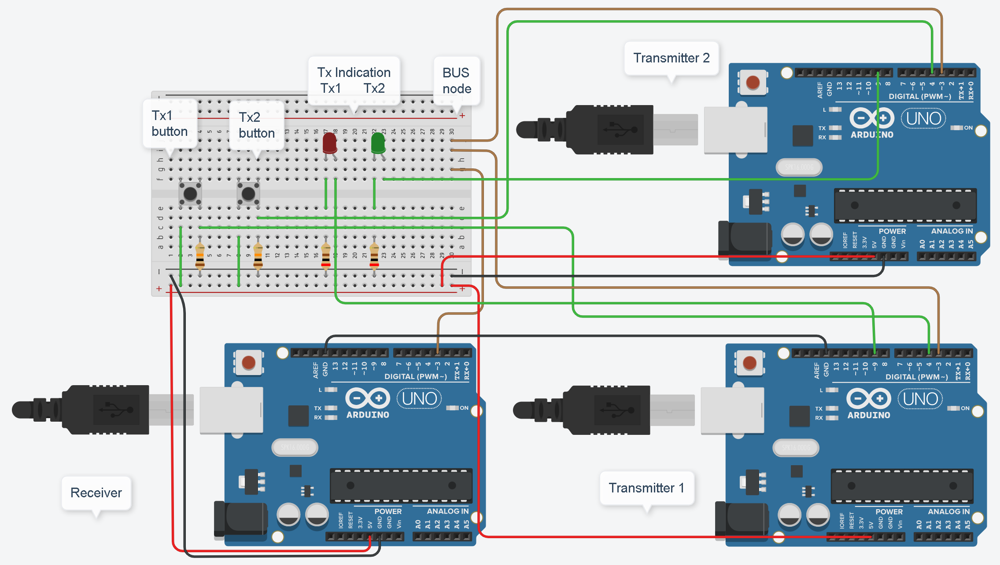

>[Torna all'indice](indexstatifiniti.md)>[Simulatore con protothread](simcsma-caproto.md)
## **SIMULATORE PROTOCOLLO CSMA/CA PER ARDUINO E TINKERCAD**



### **Utilizzo**


1) Premere il tasto codice in alto a destra per aprire la finestra del codice
2) Premere il tasto monitor seriale in basso sulla finestra del codice
3) Selezionare dal menu a tendina in alto a destra il dispositivo di cui si vuole vsualizzare il codice
4) Avviare la simulazione con il tasto apposito in alto a destra
5) Osservare i messaggi di log nella finestra del monitor serial in basso a destra
	- Se si osserva il **monitor dell'arduino N.1** si ritrova in output il log del **ricevitore** che informa sull'arrivo di un nuovo messaggio dati e l'nvio automatico di un nuovo **messaggio di controllo di ack** al trasmettitore.
	- Se si osserva il **monitor dell'arduino N.2** si ritrova in output il log del **trasmettitore N2** che informa sull'arrivo di un nuovo messaggio dati e l'nvito a premere il pulsante **msgBtn** per inviare un nuovo **messaggio dati** al ricevitore.
	- Se si osserva il **monitor dell'arduino N.3** si ritrova in output il log del **trasmettitore N3** che informa sull'arrivo di un nuovo messaggio dati e l'nvito a premere il pulsante **msgBtn** per inviare un nuovo **messaggio dati** al ricevitore.

Il **log** di un **generico dispositivo** informa sulla **presenza** sul BUS di eventuali messaggi e li mostra evidenziando i **valori dei campi** che lo costituiscono: Ciò accade a prescindere dal fatto che un messaggio sia destinato a quel dispositivo o meno, se è destinato a lui evidenzia l'evento con il log ```"msg destinato a me"```.


	 
Simulazione in Tinkercad https://www.tinkercad.com/embed/8EmEo7VmnNR=1

### **Descrizione schema**

Il **collegamento** tra i due dispositivi in avviene attraverso un **mezzo a BUS reale** costituito da un collegamento di tipo **half duplex** realizzato dai 3 fili marroni che convergono sul nodo con etichetta **BUS node**. I 3 fili sono assimilabili ad **un'unico filo** che collega la porta 3 di ogni dispositivo. Tutti i dispositivi sono collegati elettricamente **in parallelo** con piedini corrispondenti (di porta e di GND) collegati insieme. 

Il **protocollo** è il classico seriale RS232 realizzato in SW sulla stessa porta digitale di ogni dispositivo tramite la libreria **SoftwareSerial**. La libreria di base realizza un canale **full duplex** con due link su due porte, una di TX ed una di RX ma, in questo progetto, è stata adattata a funzionare in **half duplex su un'unico link**. La soluzione scelta per ottenere ciò è abbastanza semplice e consiste nel mantenere uno **stato di default** del link, che è quello di ricezione attivo quando nessuno trasmette, e nel commutare lo stato di quella stazione che deve trasmettere da RX a TX solo per il tempo necessario a completare la trasmissione del suo messaggio, subito dopo questa viene rimessa nella condizione di default.

Il **collegamento** a BUS half duplex **realizzato** tramite un unico filo e la libreria SoftwareSerial è effettivamente **praticamente realizzabile** sempre, però, tenendo conto che esso non è percorso da **segnali bilanciati** per cui **non** è adatto per lunghe distanze ma solo per **collegamenti corti** dell'ordine di qualche metro.

### **Messaggi di log**

Premendo, in rapida succesione, entrambi i tasti **Tx1 Btn o Tx2 Btn** sui trasmettitori si abilita la **trasmissione di un messaggio** verso il ricevitore. Nella finestra di log si legge la catena di eventi innescata:

**Log ad un trasmettitore**
```
Premi il tasto per trasmettere un messaggio.
Attendo che si liberi il canale: 
Transmitted: 
(:1),(:2),(:1),(7:55),(:11),(c:99),(i:105),(a:97),(o:111),(p:112),(:0),(	:9),(Ë:203),
Sent data: Attendo ack o timeout: 
Received: 
(:2),(:1),(:1),(:129),(:5),
msg destinato a me
DA: 2
SA mio: 2
SI: 129
Ricevuto ack: 
Premi il tasto per trasmettere un messaggio.
Received: 
(:1),(:3),(:1),(7:55),(:11),(c:99),(i:105),(a:97),(o:111),(p:112),(:0),
msg NON destinato a me
Received: 
(:3),(:1),(:1),(:129),(:5),
msg NON destinato a me
```

**Log al ricevitore**
```
Premi il tasto per trasmettere un messaggio.
Received: 
(:1),(:2),(:1),(7:55),(:11),(c:99),(i:105),(a:97),(o:111),(p:112),(:0),
msg destinato a me
DA: 1
SA mio: 1
SI: 55
Ricevuto:ciaop
Transmitted: 
(:2),(:1),(:1),(:129),(:5),(­:173),(¯:175),
receiver ack sent 
Received: 
(:1),(:3),(:1),(7:55),(:11),(c:99),(i:105),(a:97),(o:111),(p:112),(:0),
msg destinato a me
DA: 1
SA mio: 1
SI: 55
Ricevuto:ciaop
Transmitted: 
(:3),(:1),(:1),(:129),(:5),(:144),(o:111),
receiver ack sent 
```

Un **blink** su **un led** per ogni scheda indica l'avvenuta trasmissione di un messaggio.

### **Formato dei messaggi**

Il formato del messaggio è uniforme per messaggi di ack o dati ed è composto da 5 campi di lunghezza fissa di un byte più un sesto campo finale di lunghezza variabile che contiene il data da trasmettere.

Il messaggio da trasmettere è memorizzato in una **coda di trasmissione** di 64 byte che viene svuotata e riutilizzata per ogni nuovo messaggio da trasmettere.

Il messaggio ricevuto è memorizzato in una **coda di ricezione** di 64 byte che viene svuotata e riutilizzata per ogni nuovo messaggio ricevuto.

Nella presente implementazione del protocollo CSMA le due code **coincidono** per non si può ricevere un messaggio mentre se ne trasmette un'altro.

I **campi** del messaggio sono:
- ```DA```   destination address position
- ```SA```  source address position
- ```GROUP``` function code position
- ```I``` service identifier position
- ```BYTE_CNT``` byte counter position
- ```PAYLOAD``` 	start of data position

I **messaggi dati** hanno nel campo I il valore MSG (55) e hanno un BYTE_CNT variabile maggiore di 5. 
il log Arrived: (:2),(:1),(:1),(7:55),(:11),(c:99),(i:105),(a:97),(o:111),(p:112),(:0),
pay: 6-11 indica che il TX 2 ha inviato al RX 1 del gruppo 1 un messaggio 55 (dati) che contiene la stringa "ciaop" ed avente 11 byte complessivi di cui 6 fissi.

I **messaggi di controllo ack** hanno nel campo I il valore ACK (129) e hanno un BYTE_CNT sempre di 5. Il log Arrived: (:1),(:2),(:1),(:129),(:5),Ricevuto ack: indica che il TX 1 ha inviato al RX 2 del gruppo 1 un messaggio 129 (ack) di 5 byte complessivi sempre fissi.


### **Calcolo CRC**

Il **protocollo** di trasmisione utilizzato è di tipo **confermato** per cui prevede che un TX, contestualmente alla trasmissione di un messaggio, attivi un **timer di trasmissione** che ha lo **scopo** di misurare il tempo di arrivo del **messaggio di conferma** (ack) che deve essere inviato **dal ricevitore** per certificare la **corretta ricezione** del messaggio trasmesso. Allo scadere di un **tempo massimo di attesa** impostato sul timer, detto **timeout**, il trasmettitore è costretto ad effettuare la **ritrasmissione** del messaggio che non è stato ancora confermato, e farà ciò per tutte le volte in cui il timeout del timer di trasmissione scadrà, fino ad un numero massimo di tentativi prestabilito (solitamente tra 7 e 10).

La **corretta ricezione** è verificata **dal ricevitore** confrontando l'impronta (riassunto) **del messaggio trasmesso** (calcolata **sul trasmettitore**) con l'impronta **del messaggio ricevuto** calcolata **sul ricevitore** a partire dalla copia ricevuta. Se le due impronte **coincidono** la trasmissione è andata a buon fine e **il ricevitore** invia l'ack al trasmetitore, se **non coincidono** l'ack **non** viene inviato e si aspetta una nuova copia.

L'**impronta** calcolata **dal trasmettitore** viene inserita in un **campo particolare** del messaggio detto **FCS** (Frame Check Sequence) ed è  genericamente calcolata con degli algoritmi di rilevazione e correzione di errore detti ciclici o **CRC** (Cyclic Redundancy Check). Normalmente il campo FCS è in coda al messaggio. Nel nostro caso è in **coda** e ha una **lunghezza di 2 byte**. La funzione che lo calcola è riportata di seguito:


```C++
//lo calcola dal primo byte del messaggio (header compreso)
uint16_t calcCRC(uint8_t u8length)
{
    unsigned int temp, temp2, flag;
    temp = 0xFFFF;
    for (unsigned char i = 0; i < u8length; i++)
    {
        temp = temp ^ u8Buffer[i];
        for (unsigned char j = 1; j <= 8; j++)
        {
            flag = temp & 0x0001;
            temp >>=1;
            if (flag)
                temp ^= 0xA001;
        }
    }
    // Reverse byte order.
    temp2 = temp >> 8;
    temp = (temp << 8) | temp2;
    temp &= 0xFFFF;
    // the returned value is already swapped
    // crcLo byte is first & crcHi byte is last
    return temp;
}
```

### **Fasi CSMA**
Significa Carrier Sensing Multiple Access cioè protocollo di Accesso Multiplo con Ascolto della Portante (prima della trasmissione)
Una stazione trasmittente: 
- al momento che ha una trama pronta, aspetta finchè non “sente” il canale libero (cioè nessuno trasmette).
- Appena essa rileva il canale libero invia immediatamente la trama.
- Dopo l’invio aspetta per un certo tempo.
- Se essa riceve il messaggio di ack allora la trasmissione è avvenuta con successo.
- Altrimenti la stazione usa una strategia di backoff e invia nuovamente il pachetto dopo un tempo casuale.
- Dopo molte volte che non si ricevono conferme (acknowledgement) allora la stazione abbandona l’dea di trasmettere.

### **Programmazione sequenziale**

L'algoritmo è realizzato in maniera **sequenziale nel tempo**  pianificando il **blocco** del flusso di esecuzione di parti del codice per un certo **tempo di attesa**. Il tempo di attesa potrebbe essere:
- una quantità **stabilita a priori** dal valore di una costante, dal valore di una variabile o dal valore di una espressione e si può rappresentare, in linea di principio con l'istruzione ```Wait(t)``` che, nel caso di Arduino diventa ```delay(t)``` oppure nel caso dei protothread diventa ```PT_SLEEP(t)```. 
- una **quantità non nota in anticipo** collegata al verificarsi di un **evento di input** proveniente dall'esterno come l'arrivo di un certo messaggio di controllo e si può rappresentare, in linea di principio con l'istruzione ```WaitUntil(pollingInput)```. 

In **entrambi i casi** il flusso di esecuzione rimane **in attesa** della valutazione periodica (**polling**) di un **flag** che rappresenta l'accadere di un evento, il **timeout** di un timer preimpostato nel caso del ```Wait(t)```, l'**arrivo di un messaggio** nel caso del ```WaitUntil(pollingInput)```. 

### **Eventi di input** 

Gli eventi di input rilevanti che potrebbero essere valutati durante lo svolgimento dell'algoritomo sono:

- ```bool channelFree()```. Controlla se il canale è occupato da un messaggio.
- ```bool dataFrameArrived()```. Controlla se è arrivato un messaggio dati
- ```bool ack_received()```. Controlla se è arrivato un messaggio di controllo di conferma (ack) di trasmissione avvenuta con successo.
- ```bool ackOrTimeout()```. Controlla se i trasmettitore è in attesa della ricezione di un ack o se non lo è più perchè è scaduto il timeout del timer di trasmissione di un messaggio.
- ```bool isMsgWaitState()```. Controlla se il ricevitore è nello stato di attesa di un messaggio 
- ```bool isAckWaitState()```. Controlla se il trasmettitore è nello stato di attesa di un ack 

### **Thread di ricezione e trasmissione**

In realtà, il **polling** degli eventi è fatto all'interno di **un'unica funzione** chiamata ```poll()``` che viene periodicamente richiamata all'interno del **loop principale** del sistema:

```C++
void loop() 
{
	poll(&rxobj);
	.............
}
```

La ```poll()```modifica delle **variabili globali** con funzione di indicazione di evento dette **flag** (bandierine) che sono **specifiche** per ogni evento e che vengono **valutate** all'interno dei **thread** del sistema (i thread condividono le stesse variabili globali).

I **thread** rappresentano blocchi di codice la cui esecuzione si svolge in maniera **parallela** ed **indipendente** e, per uno stesso dispositivo fisico, sono essenzialmente **due**: un thread di **ricezione** ed un thread di **trasmissione**.

**Arduino** non possiede capacità di multithreading reale di **tipo preemptive** (competitvo con prerilascio) e realizzato in HW, ciònonostante è comunque possibile realizzare in SW una schedulazione di **tipo non preemptive** (collaborativa senza prerilascio) utilizzando i **protothread**.

## **Ricevitore**

**Protocollo CSMA in ricezione pseudocodice:**

```C++
While(true){
	WaitUntil(dataFrameArrived());
	if(!duplicate()){ 
		deliver(frame) 
	}
	send(ack_frame);
}

```

### **Definizione del thread di ricezione messaggio**

```C++
async rcvTask(as_state *pt) {
  async_begin(pt);
  // Loop forever
  while(true) {
	await(dataFrameArrived());
	rcvEventCallback();
	sendAck();  
  }
  async_end;
}
```

## **Trasmettitore**

**Protocollo CSMA in trasmissione in pseudocodice:**

```C++
N=1;
while(N <= max){
	waitUntil(channelFree()); 
	send(data_frame); 	
	waitUntil(ackOrTimeout()); 
	if(ack_received){ 
		exit while;
	}else{
		/* timeout scaduto: ritrasmissione*/
		/* timeout scaduto: ritrasmissione*/ 	
		t=random()*WNDW*2^n;
		wait(t);
		N=N+1;
	}
}
/* troppi tentativi: rinuncio a trasmettere*/	
```

### **Definizione del thread di trasmissione messaggio**

```C++
async sendTask(as_state *pt) {
  async_begin(pt);
  // Loop forever
  while(true) {
	 Serial.println("Premi il tasto per trasmettere un messaggio.");
	 await(digitalRead(txBtn));
	 digitalWrite(led, HIGH);
	 await_delay(50);
	 digitalWrite(led, LOW);
	 await_delay(50);	
	 n = 0;  //azzera conteggio
	 while(n < MAXATTEMPTS){
		Serial.println("Attendo che si liberi il canale: ");
		await(channelFree()); 
		await_delay(DIFS);	
		Serial.print("Timeout n: ");
		Serial.print(n);
		Serial.print(": ritrasmissione tra: ");
		tt = getBackoff();
		Serial.print((float) tt/1000);
		Serial.println(" secondi");
		await(channelFreeDuringBackoff());
		sendData(&txobj);
		Serial.print(" Ritrasmesso.");
		Serial.println("Attendo ack o timeout: ");
		await(ackOrTimeout());
		if(ack_received()){
			n = MAXATTEMPTS;
			Serial.println("Ricevuto ack: ");
		}else{
			/* timeout scaduto: si ritrasmette*/
			n++;			
		}
	 }
  }
  async_end;
}
```
### **Backoff a finestra variabile**

L'algoritmo ALOHA proposto utilizza un backoff a **finestra variabile** in cui la **finestra di trasmissione** aumenta esponenzialmente (con la potenza del 2) ad ogni incremento del **numero di tentativi** andati a vuoto. La finestra di trasmissione è detta anche **finestra di contesa** e rappresenta l'intervallo temporale in cui ogni stazione calcola individualmente un **tempo random** di accesso a partire dal quale cominciare a trasmettere.

```C++
long getBackoff(){
	return random(0, WNDW*pow(2,n));
}
```

### **Codice completo di tutte le stazioni collegate al BUS**

Il codice di seguito è comune a tutte le stazioni e possiede **entrambe le funzioni** di trasmissione e ricezione. **Tutte le stazioni** sono dotate di **indirizzo univoco** che deve essere quindi diverso per tutte e deve essere impostato nel blocco ```setup()``` del dispositivo modificando il parametro attuale ```mysa``` della funzione ```init()```..

**Ricevitore**

```C++
init(mySerial, dirPin, 1, 1, 0); // port485, txpin, mysa, mygroup4, speed=9600
```
**Trasmettitore 1**

```C++
init(mySerial, dirPin, 2, 1, 0); // port485, txpin, mysa, mygroup4, speed=9600
```

**Trasmettitore 2**

```C++
init(mySerial, dirPin, 3, 1, 0); // port485, txpin, mysa, mygroup4, speed=9600
```

[Codice completo di tutte le stazioni collegate al BUS](csma-catxrxasync.ino)

>[Torna all'indice](indexstatifiniti.md)>[Simulatore con protothread](simcsma-caproto.md)
