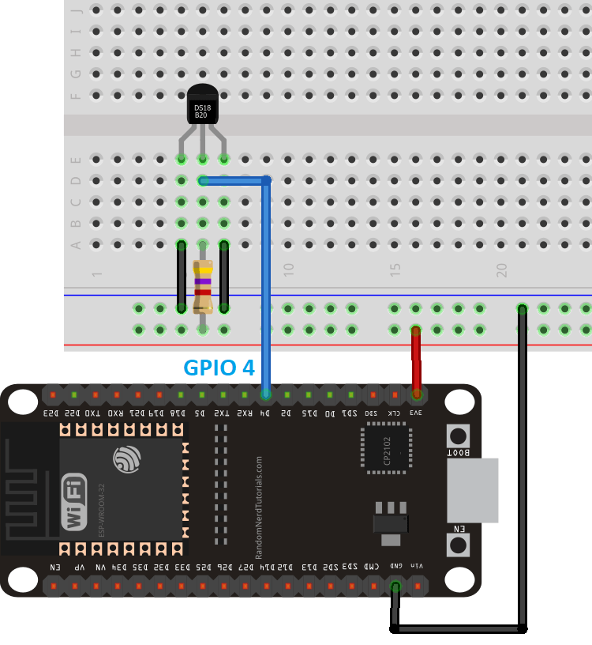

>[Torna a gateway analogico](gateway.md)

## **Gateway per Soil Mousture Sensor capacitivo**

### **Schema di principio del collegamento a stella**

Notare i **collegamenti punto-punto** tra tutti i dispositivi e il microcontrollore tramite linee esclusive.


### **Il sensore di temperatura DS18B20**


### **Parasite mode**

Il bus onewire teoricamente possiede **2 soli fili** (uno senza la massa):
- una **massa comune** per il ritorno della corrente 
- un **filo dati** che è usato anche per l'alimentazione del dispositivo. Poichè il livello **L (basso)** è di solito codificato con 0V l'alimentazione risulta **intermittente**. Per ovviare a questi buchi (lack) di alimentazione si collega una **capacità** in parallelo a massa e linea dati che funge da **tampone locale** alla mancanza di alimentazione dovuta a sequenze consecutive di zeri. Questo modo di funzionamente si chiama **parasite mode**.



### **Normal mode**

In pratica è usuale anche un collegamento a **3 fili** (2 senza la massa):
- una **massa comune** per il ritorno della corrente 
- un **filo dati** che è **a se stante** cioè **non** viene usato anche per l'alimentazione del dispositivo.
- un **positivo di alimentazione** che alimenta tutti i dispositivi. Questa modalità si chiama **normal mode**.


### **Librerie del progetto**

Dal **punto di vista SW** sevono **due librerie** da scaricare e scompattare dentro la solita cartella **libraries** (disponibili su Git al link https://github.com/PaulStoffregen/OneWire e al link https://github.com/milesburton/Arduino-Temperature-Control-Library) :
- **OneWire-master.zip** da scompattare e rinominare semplicemente **OneWire**. Per installare il protocollo standard OneWire.
- **Arduino-Temperature-Control-Library-master** da scompattare e rinominare semplicemente **DallasTemperature** per installare il particolare protocollo applicativo di quella categoria di sensori di temperatura (**DS18B20**).

### **Gateway OneWire-MQTT per la lettura di un solo sensore**

La libreria MQTT è asincrona per cui non bloccante. E' adoperabile sia per **ESP8266** che per **ESP32**.

Anche in questo caso sono possibili entrambi i collegamenti, **normal mode** e **parasite mode**. Di seguito è illustrato il **normal mode**:


```C++
//#include <WiFiClientSecure.h>
#include <WiFi.h>       // per ESP32
//#include <ESP8266WiFi.h> per ESP8266
#include <AsyncMqttClient.h>
#include <OneWire.h>
#include <DallasTemperature.h>
#include <Ticker.h>

#define WIFI_SSID "myssid"
#define WIFI_PASSWORD "mypsw"

Ticker mqttReconnectTimer;
Ticker wifiReconnectTimer;
// Raspberry Pi Mosquitto MQTT Broker
//#define MQTT_HOST IPAddress(192, 168, 1, 254)
#define MQTT_HOST "test.mosquitto.org"
// For a cloud MQTT broker, type the domain name
//#define MQTT_HOST "example.com"
#define MQTT_PORT 1883

// Temperature MQTT Topic
#define MQTT_PUB_TEMP "esp32/ds18b20/temperature"

// GPIO where the DS18B20 is connected to
const int oneWireBus = 4;          
// Setup a oneWire instance to communicate with any OneWire devices
OneWire oneWire(oneWireBus);
// Pass our oneWire reference to Dallas Temperature sensor 
DallasTemperature sensors(&oneWire);
// Temperature value
float temp;

AsyncMqttClient mqttClient;

unsigned long previousMillis = 0;   // Stores last time temperature was published
const long interval = 4000;        // Interval at which to publish sensor readings
byte count = 0;

void connectToWifi() {
  Serial.println("Connecting to Wi-Fi...");
  WiFi.mode(WIFI_STA);
  //WiFi.disconnect();
  WiFi.begin(WIFI_SSID, WIFI_PASSWORD);
}

void connectToMqtt() {
  Serial.println("Connecting to MQTT...");
  mqttClient.connect();
}

void WiFiEvent(WiFiEvent_t event) {
  Serial.printf("[WiFi-event] event: %d\n", event);
  switch(event) {
    case SYSTEM_EVENT_STA_GOT_IP:
      Serial.println("WiFi connected");
      Serial.println("IP address: ");
      Serial.println(WiFi.localIP());
      connectToMqtt();
      break;
    case SYSTEM_EVENT_STA_DISCONNECTED:
      Serial.println("WiFi lost connection");
      mqttReconnectTimer.detach(); // ensure we don't reconnect to MQTT while reconnecting to Wi-Fi
      wifiReconnectTimer.once_ms(2000, connectToWifi);
      break;
  }
}

void onMqttConnect(bool sessionPresent) {
  Serial.println("Connected to MQTT.");
  Serial.print("Session present: ");
  Serial.println(sessionPresent);
}

void onMqttDisconnect(AsyncMqttClientDisconnectReason reason) {
  Serial.println("Disconnected from MQTT.");
  if (WiFi.isConnected()) {
    mqttReconnectTimer.once_ms(2000, connectToMqtt);
  }
}

void onMqttPublish(uint16_t packetId) {
  Serial.println("Publish acknowledged.");
  Serial.print("  packetId: ");
  Serial.println(packetId);
}

void setup() {
  // Start the DS18B20 sensor
  sensors.begin();
  
  Serial.begin(115200);
  Serial.println();
  Serial.println();

  WiFi.onEvent(WiFiEvent);

  mqttClient.onConnect(onMqttConnect);
  mqttClient.onDisconnect(onMqttDisconnect);
  mqttClient.onPublish(onMqttPublish);
  mqttClient.setServer(MQTT_HOST, MQTT_PORT);
  // If your broker requires authentication (username and password), set them below
  //mqttClient.setCredentials("REPlACE_WITH_YOUR_USER", "REPLACE_WITH_YOUR_PASSWORD");
  connectToWifi();
  count = 0;
  while (WiFi.status() != WL_CONNECTED && count < 10) {
    delay(500);
    count++;
    Serial.print(".");
  }
}

void loop() {
  unsigned long currentMillis = millis();
  if (currentMillis - previousMillis >= interval) {
    previousMillis = currentMillis;
    
    // New temperature readings
    sensors.requestTemperatures(); 
    // Temperature in Celsius degrees
    temp = sensors.getTempCByIndex(0);
    // Temperature in Fahrenheit degrees
    //temp = sensors.getTempFByIndex(0);
    
    // Publish an MQTT message on topic esp32/ds18b20/temperature
    uint16_t packetIdPub1 = mqttClient.publish(MQTT_PUB_TEMP, 1, true, String(temp).c_str(), strlen(String(temp)));                            
    Serial.printf("Pubblicato sul topic %s at QoS 1, packetId: ", MQTT_PUB_TEMP);
    Serial.println(packetIdPub1);
    Serial.printf("Messaggio: %.2f \n", sensors.getTempCByIndex(0));
  }
}

```
### **Gateway OneWire-MQTT per la lettura di più sensori**


### **Librerie del progetto**

Dal **punto di vista SW** sevono sempre **due librerie**, le solite due librerie del singolo sensore da scaricare dentro la solita cartella **libraries** (disponibili su Git al link https://github.com/PaulStoffregen/OneWire e al link https://github.com/milesburton/Arduino-Temperature-Control-Library).

Il **codice** va modificato per utilizzare l'**indirizzamento** in uso nel **BUS OneWire** per recuperare le misure dei **singoli sensori**.

Il **gateway** proposto di seguito esegue lo **scan** degli indirizzi OneWire dei dispositivi presenti sul BUS e li memorizza in un array di array durante il **setup()**. Nel **loop()**, ad ogni iterazione schedulata, **legge** i valori di temperatura per ogni indirizzo e li **impacchetta in un JSON** che manda **via client MQTT** all'applicazione remota. All'inizio del codice, **MAXNSENSORS** è la costante che imposta il numero massimo di sensori presenti sul BUS.

```C++
//#include <WiFiClientSecure.h>
#include <WiFi.h>       // per ESP32
//#include <ESP8266WiFi.h> per ESP8266
#include <AsyncMqttClient.h>
#include <OneWire.h>
#include <DallasTemperature.h>
#include <Ticker.h>

#define WIFI_SSID "casafleri"
#define WIFI_PASSWORD "fabseb050770250368120110$"

Ticker mqttReconnectTimer;
Ticker wifiReconnectTimer;
// Raspberry Pi Mosquitto MQTT Broker
//#define MQTT_HOST IPAddress(192, 168, 1, 254)
#define MQTT_HOST "test.mosquitto.org"
// For a cloud MQTT broker, type the domain name
//#define MQTT_HOST "example.com"
#define MQTT_PORT 1883

// Temperature MQTT Topic
#define MQTT_PUB_TEMP "esp32/ds18b20/temperature"
#define MAXNSENSORS 4

// GPIO where the DS18B20 is connected to
const int oneWireBus = 4;          
// Setup a oneWire instance to communicate with any OneWire devices
OneWire oneWire(oneWireBus);
// Pass our oneWire reference to Dallas Temperature sensor 
DallasTemperature sensors(&oneWire);
// Temperature value
float temp;
unsigned short int nsensors = 0;
String datastr = "";

AsyncMqttClient mqttClient;

unsigned long previousMillis = 0;   // Stores last time temperature was published
const long interval = 4000;        // Interval at which to publish sensor readings
byte count = 0;
byte addresses[MAXNSENSORS][8];

void connectToWifi() {
  Serial.println("Connecting to Wi-Fi...");
  WiFi.mode(WIFI_STA);
  //WiFi.disconnect();
  WiFi.begin(WIFI_SSID, WIFI_PASSWORD);
}

void connectToMqtt() {
  Serial.println("Connecting to MQTT...");
  mqttClient.connect();
}

void WiFiEvent(WiFiEvent_t event) {
  Serial.printf("[WiFi-event] event: %d\n", event);
  switch(event) {
    case SYSTEM_EVENT_STA_GOT_IP:
      Serial.println("WiFi connected");
      Serial.println("IP address: ");
      Serial.println(WiFi.localIP());
      connectToMqtt();
      break;
    case SYSTEM_EVENT_STA_DISCONNECTED:
      Serial.println("WiFi lost connection");
      mqttReconnectTimer.detach(); // ensure we don't reconnect to MQTT while reconnecting to Wi-Fi
      wifiReconnectTimer.once_ms(2000, connectToWifi);
      break;
  }
}

void onMqttConnect(bool sessionPresent) {
  Serial.println("Connected to MQTT.");
  Serial.print("Session present: ");
  Serial.println(sessionPresent);
}

void onMqttDisconnect(AsyncMqttClientDisconnectReason reason) {
  Serial.println("Disconnected from MQTT.");
  if (WiFi.isConnected()) {
    mqttReconnectTimer.once_ms(2000, connectToMqtt);
  }
}

void onMqttPublish(uint16_t packetId) {
  Serial.println("Publish acknowledged.");
  Serial.print("  packetId: ");
  Serial.println(packetId);
}

void addrSearch() {
  nsensors= 0;
  while(oneWire.search(addresses[nsensors]) && nsensors < MAXNSENSORS) {
	  Serial.print(" ROM =");
	  for(int i = 0; i < 8; i++) {
		Serial.write(' ');
		Serial.print(addresses[nsensors][i], HEX);
		Serial.println();
	  }
  } 
  nsensors++;  
  Serial.println(" No more addresses.");
  Serial.println();
  oneWire.reset_search();
  delay(250);
}

void busInit(){
	// Start the DS18B20 sensor
	sensors.begin();
	//scan degli indirizzi sul BUS OneWire
	addrSearch();
}

void setup() { 
  Serial.begin(115200);
  Serial.println();
  Serial.println();

  WiFi.onEvent(WiFiEvent);

  mqttClient.onConnect(onMqttConnect);
  mqttClient.onDisconnect(onMqttDisconnect);
  mqttClient.onPublish(onMqttPublish);
  mqttClient.setServer(MQTT_HOST, MQTT_PORT);
  // If your broker requires authentication (username and password), set them below
  //mqttClient.setCredentials("REPlACE_WITH_YOUR_USER", "REPLACE_WITH_YOUR_PASSWORD");
  connectToWifi();
  count = 0;
  while (WiFi.status() != WL_CONNECTED && count < 10) {
    delay(500);
    count++;
    Serial.print(".");
  }
  busInit();
}

void readData(String &str){    
	//costruisci il messaggio JSON
	str = "{";
	for(int i = 0; i < nsensors; i++){
		str += "\"sensor";
		str += String(i+1);
		str += "\":\"";
		//leggi la temperatura del sensore con un certo indirizzo
		temp = sensors.getTempC(addresses[i]);
		str += temp;
		str += "\"";
		if(i < nsensors-1){
			str += ",";
		}else{
			str += "}";
		}
	}
}

void loop() {
  unsigned long currentMillis = millis();
  if (currentMillis - previousMillis >= interval) {
	previousMillis = currentMillis;
	
	Serial.print("Requesting temperatures...");
	// Send the command to get temperatures
	sensors.requestTemperatures(); 
	Serial.println("DONE");
	//carica i valori su datastr
	readData(datastr); 

	// Publish an MQTT message on topic esp32/ds18b20/temperature    
	uint16_t packetIdPub1 = mqttClient.publish(MQTT_PUB_TEMP, 1, true, datastr.c_str(), datastr.length());                           
	Serial.printf("Pubblicato sul topic %s at QoS 1, packetId: ", MQTT_PUB_TEMP);
	Serial.println(packetIdPub1);
	Serial.print("Messaggio inviato: ");
	Serial.println(datastr); 
  }
}

```


**Sitografia:**

https://randomnerdtutorials.com/esp32-mqtt-publish-ds18b20-temperature-arduino/
https://randomnerdtutorials.com/micropython-mqtt-publish-ds18b10-esp32-esp8266/
https://randomnerdtutorials.com/esp32-ds18b20-temperature-arduino-ide/
https://randomnerdtutorials.com/esp32-multiple-ds18b20-temperature-sensors/

>[Torna a gateway BUS](gateway.md)
