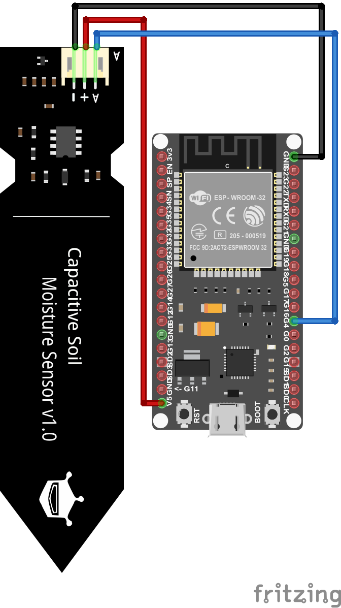

>[Torna a gateway analogico](gateway.md)

## **Gateway per Sensore di umidità del suolo capacitivo**

### **Schema di principio del collegamento a stella**

Notare i **collegamenti punto-punto** tra tutti i dispositivi e il microcontrollore tramite linee esclusive.


### **Il sensore di livello capacitivo**


### **Schema cablaggio**



### **Condizionamento digitale**

    | Tensione di alimentazione               |        3.3V         |          5V           |
    |-----------------------------------------|---------|-----------|-----------|-----------|
    | Umido/Secco                             |  Umido  |   Secco   |   Umido   |   Secco   |
    | Sensore di umidità del suolo capacitivo |  2...8  |  14...21  | 821...824 | 490...549 |
    | Sensore di umidità del suolo resistivo  |   1024  | 483...505 |   1023    | 344...358 |
    
Teoricamente si può usare una qualsiasi di queste combinazioni, ma è necessario calibrare il  sensore prima di dichiarare che il terreno è bagnato o asciutto.

Per il sensore di umidità del suolo capacitivo si vede anche dalla tabella che la differenza nel valore del sensore per una tensione di esercizio di 3,3V è molto bassa. Pertanto per evitare probabili errori è consigliabile, per il sensore capacitivo, utilizzare una tensione operativa di 5V.

### **Librerie del progetto**

Dal **punto di vista SW** non servono librerie particolari tranne quelle per la pubblicazione dei valorri traite MQTT. Una parte del codice va comunque dedicata al condizionamento dei valori misurati dal sensore per tradurli ai valori di interesse di umidità.

### **Gateway OneWire-MQTT per la lettura di un solo sensore**

La libreria MQTT è asincrona per cui non bloccante. E' adoperabile sia per **ESP8266** che per **ESP32**.

Anche in questo caso sono possibili entrambi i collegamenti, **normal mode** e **parasite mode**. Di seguito è illustrato il **normal mode**:


```C++
//#include <WiFiClientSecure.h>
#include <WiFi.h>       // per ESP32
//#include <ESP8266WiFi.h> per ESP8266
#include <AsyncMqttClient.h>
#include <OneWire.h>
#include <DallasTemperature.h>
#include <Ticker.h>

#define WIFI_SSID "myssid"
#define WIFI_PASSWORD "mypsw"

Ticker mqttReconnectTimer;
Ticker wifiReconnectTimer;
// Raspberry Pi Mosquitto MQTT Broker
//#define MQTT_HOST IPAddress(192, 168, 1, 254)
#define MQTT_HOST "test.mosquitto.org"
// For a cloud MQTT broker, type the domain name
//#define MQTT_HOST "example.com"
#define MQTT_PORT 1883

// Temperature MQTT Topic
#define MQTT_PUB_TEMP "esp32/ds18b20/temperature"

// GPIO where the DS18B20 is connected to
const int oneWireBus = 4;          
// Setup a oneWire instance to communicate with any OneWire devices
OneWire oneWire(oneWireBus);
// Pass our oneWire reference to Dallas Temperature sensor 
DallasTemperature sensors(&oneWire);
// Temperature value
float temp;

AsyncMqttClient mqttClient;

unsigned long previousMillis = 0;   // Stores last time temperature was published
const long interval = 4000;        // Interval at which to publish sensor readings
byte count = 0;

void connectToWifi() {
  Serial.println("Connecting to Wi-Fi...");
  WiFi.mode(WIFI_STA);
  //WiFi.disconnect();
  WiFi.begin(WIFI_SSID, WIFI_PASSWORD);
}

void connectToMqtt() {
  Serial.println("Connecting to MQTT...");
  mqttClient.connect();
}

void WiFiEvent(WiFiEvent_t event) {
  Serial.printf("[WiFi-event] event: %d\n", event);
  switch(event) {
    case SYSTEM_EVENT_STA_GOT_IP:
      Serial.println("WiFi connected");
      Serial.println("IP address: ");
      Serial.println(WiFi.localIP());
      connectToMqtt();
      break;
    case SYSTEM_EVENT_STA_DISCONNECTED:
      Serial.println("WiFi lost connection");
      mqttReconnectTimer.detach(); // ensure we don't reconnect to MQTT while reconnecting to Wi-Fi
      wifiReconnectTimer.once_ms(2000, connectToWifi);
      break;
  }
}

void onMqttConnect(bool sessionPresent) {
  Serial.println("Connected to MQTT.");
  Serial.print("Session present: ");
  Serial.println(sessionPresent);
}

void onMqttDisconnect(AsyncMqttClientDisconnectReason reason) {
  Serial.println("Disconnected from MQTT.");
  if (WiFi.isConnected()) {
    mqttReconnectTimer.once_ms(2000, connectToMqtt);
  }
}

void onMqttPublish(uint16_t packetId) {
  Serial.println("Publish acknowledged.");
  Serial.print("  packetId: ");
  Serial.println(packetId);
}

void setup() {
  // Start the DS18B20 sensor
  sensors.begin();
  
  Serial.begin(115200);
  Serial.println();
  Serial.println();

  WiFi.onEvent(WiFiEvent);

  mqttClient.onConnect(onMqttConnect);
  mqttClient.onDisconnect(onMqttDisconnect);
  mqttClient.onPublish(onMqttPublish);
  mqttClient.setServer(MQTT_HOST, MQTT_PORT);
  // If your broker requires authentication (username and password), set them below
  //mqttClient.setCredentials("REPlACE_WITH_YOUR_USER", "REPLACE_WITH_YOUR_PASSWORD");
  connectToWifi();
  count = 0;
  while (WiFi.status() != WL_CONNECTED && count < 10) {
    delay(500);
    count++;
    Serial.print(".");
  }
}

void loop() {
  unsigned long currentMillis = millis();
  if (currentMillis - previousMillis >= interval) {
    previousMillis = currentMillis;
    
    // New temperature readings
    sensors.requestTemperatures(); 
    // Temperature in Celsius degrees
    temp = sensors.getTempCByIndex(0);
    // Temperature in Fahrenheit degrees
    //temp = sensors.getTempFByIndex(0);
    
    // Publish an MQTT message on topic esp32/ds18b20/temperature
    uint16_t packetIdPub1 = mqttClient.publish(MQTT_PUB_TEMP, 1, true, String(temp).c_str(), strlen(String(temp)));                            
    Serial.printf("Pubblicato sul topic %s at QoS 1, packetId: ", MQTT_PUB_TEMP);
    Serial.println(packetIdPub1);
    Serial.printf("Messaggio: %.2f \n", sensors.getTempCByIndex(0));
  }
}

```

**Sitografia:**

https://randomnerdtutorials.com/esp32-mqtt-publish-ds18b20-temperature-arduino/
https://randomnerdtutorials.com/micropython-mqtt-publish-ds18b10-esp32-esp8266/
https://randomnerdtutorials.com/esp32-ds18b20-temperature-arduino-ide/
https://randomnerdtutorials.com/esp32-multiple-ds18b20-temperature-sensors/

>[Torna a gateway BUS](gateway.md)
