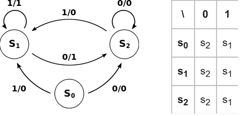

>[Torna all'indice](indexstatifiniti.md)

**MACCHINE A STATI FINITI**

Un **automa** a stati finiti (o macchina a stati finiti) è un modello astratto utile per rappresentare il comportamento di un sistema. 

Si basa sull’assunto che un sistema sia modellabile con un insieme finito di stati interni e che esso passi da uno all’altro, a seguito di uno stimolo in ingresso. In letteratura si distinguono due tipi principali di automi, l’**automa di Mealy** e quallo di **Moore**. 

La differenza tra i due sta nella particolare maniera con cui si genera l’**uscita**: nel caso di **Moore** essa è dipendente **solo dallo stato** e da null’altro, nel caso di **Mealy** l’uscita, oltre che con lo stato, varia anche in base all’**ingresso** applicato.

In **informatica** privilegeremo la **rappresentazione di Mealy** che possiamo immaginare composta da un certo numero di stati (situazioni diverse in cui si può trovare il sistema), da un certo numero di ingressi (eventi utente o generati dall’HW) e da un certo numero di uscite (azioni svolte). 

Vale la relazione **```(stato, ingresso) -> uscita```** cioè, fissati uno stato e un certo ingresso si genera sempre **la stessa** uscita.

L'usuale rappresentazione grafica di un automa a stati finiti è il **grafo orientato**, dove i **cerchi** rappresentano lo stato e gli **archi** la transizione da uno stato all’altro. Le **etichette degli archi** rappresentano l’ingresso che ha generato la transizione usualmente rappresentato abbinato all’uscita da esso scatenata. **Ingressi (eventi) diversi** si rappresentano con **archi diversi** e possono generare **uscite diverse**.

                      

Una rappresentazione alternativa al grafo, buona per la memorizzazione in un PC, è la **matrice di transizione**, dove, per ogni **stato** (righe) e per ogni **ingresso** (colonne) si trova, all’**incrocio**, il valore dello **stato successivo**.

La **macchina a stati finiti** è una tecnica importante nella programmazione embedded per creare codice che non si blocchi pur facendo accadere molte cose contemporaneamente (multitasking). 

Comunemente, si rappresentano con macchine a stati la **schedulazione** dei processi e dei thread, ma anche l’evoluzione di quei **protocolli di comunicazione** in cui i dati, scambiati in un certo istante, sono correlati a quelli scambiati in istanti precedenti (ad esempio dati di acquisto solo dopo che sono stati forniti dati di login).

>[Torna all'indice](indexstatifiniti.md)
