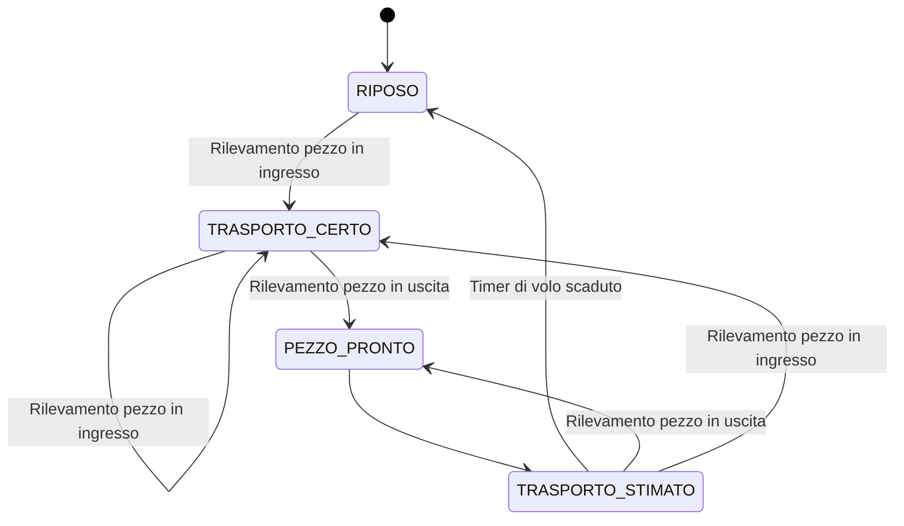

>[Torna all'indice](indexstatifiniti.md)
# **Sviluppo di una FSM**

## **Priorità stato/ingresso**

In linea generale, una **linea guida per** sviluppare una macchina a stati finiti potrebbe proporre **due strade**: 

- **prima valutare gli stati** e poi gli ingressi:
   - scrivere uno switch-case con **tutti** i **possibili stati** del sistema
   - all’interno di ogni campo dello switch-case valutare soltanto **gli ingressi attivi**, cioè quegli ingressi che potrebbero generare una **transizione** da quel particolare **stato**.
   - in corrispondenza di **ciascun ingresso**:
        - aggiornare il valore dello **stato corrente** con quello **stato successivo** in funzione del valore della coppia (**ingresso, stato**).
        - calcolare il **valore delle uscite** in funzione del valore della coppia (**ingresso, stato**).
        - impostare l'**inizializzazione** dello stato successivo (timers, contatori, ecc.).

- oppure, alternativamente, **prima valutare gli ingressi** e poi gli stati:
    - scrivere tante funzioni (o blocchi di codice mutuamente esclusivi di una stessa funzione) quanti sono **tutti** i **possibili ingressi**
    - dentro ogni funzione (o blocco di codice) scrivere uno switch-case (o un blocco if-else-if) con tutti i soli **stati raggiungibili** dall’ingresso che essa rappresenta
    - in corrispondenza di **ciascuno stato**:
        - aggiornare il valore dello **stato corrente** con quello **stato successivo** in funzione del valore della coppia (**ingresso, stato**).
        - calcolare il **valore delle uscite** in funzione del valore della coppia (**ingresso, stato**).
        - impostare l'**inizializzazione** dello stato successivo (timers, contatori, ecc.).


### **Esempi a confronto**

Esempio tipico per ogni approccio a confronto. Si notino la presenza, in pratica obbligatoria per ogni ingresso, del **rilevatore di fronti** bloccante con debounce ```waitUntilInputLow(P1, 50)```. Sono possibili altri approcci **non bloccanti** basati su ```millis()```.

```C++
// APPROCCIO 1: Prima stati, poi ingressi            | // APPROCCIO 2: Prima ingressi, poi stati
void FSM_StatiPrimaIngressi() {                      | void FSM_IngressiPrimaStati() {
   // Valutazione dello stato                        |     // Valutazione dell'ingresso
   switch(stato_corrente) {                          |     if (digitalRead(input1) == HIGH) {
       case STATO_1:                                 |         waitUntilInputLow(input1, 50);
           // Ingressi per STATO_1                   |         // Stati raggiungibili da input1 HIGH
           if (digitalRead(input1) == HIGH) {        |         switch(stato_corrente) {
               waitUntilInputLow(input1, 50);        |             case STATO_1:
               // Transizione                        |                 // Transizione
               stato_corrente = STATO_2;             |                 stato_corrente = STATO_2;
               // Calcolo uscite                     |                 // Calcolo uscite
               uscita = USCITA_X;                    |                 uscita = USCITA_X;
               // Inizializzazione stato successivo  |                 // Inizializzazione stato successivo
               timer = 100;                          |                 timer = 100;
               contatore_eventi = 0;                 |                 digitalWrite(LED_STATO_2, HIGH);
           }                                         |                 break;
           else if (digitalRead(input2) == HIGH) {   |             
               waitUntilInputLow(input2, 50);        |             case STATO_3:
               // Transizione                        |                 // Transizione
               stato_corrente = STATO_5;             |                 stato_corrente = STATO_4;
               // Calcolo uscite                     |                 // Calcolo uscite
               uscita = USCITA_W;                    |                 uscita = USCITA_Y;
               // Inizializzazione stato successivo  |                 // Inizializzazione stato successivo
               allarme_attivo = false;               |                 contatore = 0;
           }                                         |                 ritardo_ms = 500;
           break;                                    |                 break;
                                                     |             
       case STATO_2:                                 |             // Altri stati raggiungibili
           // Ingressi per STATO_2                   |         }
           if (digitalRead(input2) == HIGH) {        |     }
               waitUntilInputLow(input2, 50);        |     else if (digitalRead(input2) == HIGH) {
               /* Transizione */                     |         waitUntilInputLow(input2, 50);
               stato_corrente = STATO_3;             |         // Stati raggiungibili da input2 HIGH
               /* Calcolo uscite */                   |         switch(stato_corrente) {
               uscita = USCITA_Z;                    |             case STATO_2:
               // Inizializzazione stato successivo  |                 // Transizione
               cicli_rimanenti = 3;                  |                 stato_corrente = STATO_3;
           }                                         |                 // Calcolo uscite
           break;                                    |                 uscita = USCITA_Z;
                                                     |                 // Inizializzazione stato successivo
       // Altri possibili stati                      |                 timeout = millis() + 2000;
   }                                                 |                 break;
}                                                    |             
                                                     |             // Altri stati raggiungibili
                                                     |         }
                                                     |     }
                                                     |     // Altri possibili ingressi
                                                     | }
```


Quando si sceglie l'approccio per implementare una macchina a stati finiti (FSM), il rapporto tra numero di stati e numero di ingressi è un fattore importante da considerare:

### **Cardinalità**

Quando ci sono più stati che ingressi:
- È generalmente preferibile l'approccio **"valutare prima gli ingressi, poi gli stati"**
- Questo riduce la complessità del codice poiché avrai meno funzioni/blocchi principali (uno per ciascun ingresso)
- La struttura del codice diventa più gestibile perché si evita di scrivere un grande blocco switch-case con molti stati

Quando ci sono più ingressi che stati:
- È generalmente preferibile l'approccio **"valutare prima gli stati, poi gli ingressi"**
- Questo crea una struttura più compatta con un numero limitato di casi (uno per stato)
- All'interno di ogni stato, la logica per gestire i diversi ingressi risulta più coesa e facile da seguire

### **Clusterizzazione**

Possiamo osservare una stessa struttura di macchina a stati, da due prospettive **duali**:
- Se la struttura è tale che solo **pochi ingressi** sono rilevanti per ogni stato (pochi ingressi che si addensano su ciascun stato) → approccio "prima gli stati"
- Se la struttura è tale che solo **pochi stati** sono sensibili a ogni ingresso (pochi stati che si addensano su ciascun ingresso) → approccio "prima gli ingressi"

### **Complessità**

La **complessità** dell'elaborazione dell'ingresso dovrebbe guidare la scelta dell'approccio.
- Se interpretare il significato dell'ingresso è semplice e diretto, l'approccio "prima gli ingressi" può funzionare bene.
- Se invece richiede logica condizionale complessa che varia da stato a stato, l'approccio "prima gli stati" potrebbe offrire una struttura più chiara.

Questo si collega al concetto di **"coesione"** in ingegneria del software: raggruppiamo insieme le parti di codice che hanno maggiore **affinità logica**. Se la logica è principalmente guidata dai **valori degli ingressi**, organizziamo il codice intorno agli ingressi; se è principalmente guidata dal **contesto dello stato**, organizziamo il codice intorno agli stati.

### **Mappatura 1:1 stato-ingresso**

Data questa macchiana a stati FSM:



Consideriamo questo esempio di approccio " prima gli ingressi e dopo gli stati":

```C++
// Definizione degli stati
typedef enum {
  RIPOSO,
  TRASPORTO_CERTO,
  PEZZO_PRONTO,
  TRASPORTO_STIMATO
} Stato;

// Stato corrente del sistema
Stato stato_corrente = RIPOSO;

void loop() {
  // Gestione degli ingressi in base allo stato corrente
  // Approccio "prima gli ingressi"
  
  // Rilevamento pezzo in ingresso
  if (digitalRead(startSensorHigh) == HIGH) {
    // Transizione a TRASPORTO_CERTO da qualsiasi stato
    stato_corrente = TRASPORTO_CERTO;
    engineon = true;
    volo.stop();
    waitUntilInputLow(startSensorHigh, 50);
  }
  
  // Rilevamento pezzo in uscita
  else if (digitalRead(stopSensor) == HIGH) {
    // Transizione a PEZZO_PRONTO
    stato_corrente = PEZZO_PRONTO;
    engineon = false;
    ready = true;
    waitUntilInputLow(stopSensor, 50);
    
    // Transizione automatica a TRASPORTO_STIMATO
    stato_corrente = TRASPORTO_STIMATO;
    ready = false;
    engineon = true;
    volo.start();
    volo.reset();
  }
  
  // Timer di volo scaduto
  if (stato_corrente == TRASPORTO_STIMATO && volo.get() > 10000) {
    // Transizione a RIPOSO
    stato_corrente = RIPOSO;
    volo.stop();
    volo.reset();
    engineon = false;
  }
}
```

La regola che consente di eliminare gli if interni sugli stati in questo caso può essere formulata così:

**Quando un determinato ingresso causa sempre la stessa transizione di stato, indipendentemente dallo stato di partenza, non è necessario verificare lo stato corrente prima di effettuare la transizione.**

Questo principio si applica perché:

1. Nel nostro diagramma degli stati, quando viene rilevato un pezzo in ingresso (startSensorHigh), il sistema dovrebbe sempre passare allo stato TRASPORTO_CERTO, indipendentemente dallo stato di partenza.

2. Similmente, quando viene rilevato un pezzo in uscita (stopSensor), il sistema dovrebbe sempre passare a PEZZO_PRONTO (e poi a TRASPORTO_STIMATO), indipendentemente dallo stato di partenza.

3. L'unico caso in cui dobbiamo mantenere il controllo dello stato è per il timer di volo, perché questo ha effetto solo quando siamo nello stato TRASPORTO_STIMATO.

In altre parole, quando c'è una **mappatura diretta 1:1** tra un ingresso e uno stato di destinazione, il codice può essere strutturato intorno agli ingressi piuttosto che agli stati. Questo è precisamente il vantaggio dell'approccio "prima gli ingressi" che abbiamo discusso: riduce la complessità del codice eliminando verifiche di stato ridondanti.

Questa regola è particolarmente efficace in macchine a stati semplici con flussi lineari o con transizioni "dominanti" dove certi eventi hanno sempre la priorità e causano le stesse transizioni indipendentemente dal contesto.


### **Frequenza delle modifiche**

Una considerazione aggiuntiva potrebbe essere la **frequenza di cambiamento**: 
- se prevedi che gli stati del sistema cambieranno più frequentemente nel tempo (ad esempio, aggiungendo nuove funzionalità), potrebbe essere preferibile l'approccio "priorità ingresso" che isola meglio i cambiamenti.
- Viceversa, se prevedi che cambieranno gli ingressi (nuovi sensori, interfacce utente, ecc.), l'approccio "priorità stato" potrebbe essere più robusto.

### **Riassumendo**

Queste linee guida aiutano a minimizzare la complessità del codice e a migliorare la leggibilità. In generale, conviene organizzare la struttura in modo da avere il **minor numero** possibile di **blocchi di codice** principali (casi o funzioni), **raggruppando** la logica attorno all'**elemento meno numeroso** (stati o ingressi).

## **Ingressi**

**In generale**, si possono considerare **ingressi**:
-	eventi generati dall’utente (input dati, pressione di un pulsante, ecc.)
-	eventi in risposta ad eventi generati dall’utente (invio di un messaggio su un canale, attivazione di un timer, ecc.) 
-	eventi generati dall’HW (interrupt che segnalano lo scadere di un timer, o l’arrivo di un dato sul canale)
-	polling di funzioni o di flag legati ad eventi HW o SW (verifica della disponibilità di dati in ricezione su un canale tramite Serial.available(), verifica dell’avvenuto scadere di un timeout tramite millis(), ecc.)
-	contatori che una volta il loro target di conteggio determinano l'esecuzione di una azione

### **Ingressi sui fronti o sui valori**

Riguardo agli **ingressi** bisogna tenere presente che normalmente andrebbero realizzati solamente input **attivi sui fronti** (ingressi con memoria) piuttosto che input **attivi sui livelli** (ingressi senza memoria) a seguito di alcune considerazioni:
- più **letture successive** dello stesso valore potrebbero indurre, invece che una singola transizione verso il prossimo stato, una **sequenza** di transizioni **spurie** attraverso molti stati, tutti quelli raggiungibili attraverso quel particolare ingresso.
- lo stato di atterragio finale di un **singolo evento** di input **non è prevedibile** dipendendo dalla **durata dell'input** che è a sua volta non deterministicamente prevedibile.
- una lettura **senza memoria**, cioè una lettura **attiva su un livello**, potrebbe essere ammissibile solamente se l'ingresso che lo genera porta ad un **solo stato**, tra i tanti di una macchina FSM.
- nella **maggior parte dei casi** la complessità di una macchina FSM richiede l’uso di **input con memoria** per garantire un **comportamento consistente**.

### **Debounce sugli ingressi**

Se un sistema rileva un ingresso su fronte di salita (passaggio da 0 a 1) e non si applica un debounce, potrebbe registrare più eventi invece di uno solo, causando comportamenti indesiderati come:
- Doppie pressioni accidentali su un pulsante.
- **Transizioni spurie** di stato in una FSM.
- Attivazioni multiple di comandi o funzioni.

Il **debounce Software** può essere realizzato con:
- **Ritardo temporale tra i campioni**: Aspettare qualche millisecondo dopo la prima lettura prima di accettare il valore stabile. Esempio con ```delay()``` (bloccante) o ```millis()``` (non bloccante).
- **Media dei campioni**: Eseguire più letture ravvicinate e considerare valido il valore più stabile.

In sistemi **real-time** (come FSM o microcontrollori), il debounce software è spesso implementato con **```millis()```** per evitare di bloccare il codice. 

Senza debounce, un semplice pulsante può generare ingressi errati e comportamenti imprevedibili.

## **Stati**

Si possono considerare **stati**:
-	situazione in cui evolve un protocollo alla quale corrisponde un ben preciso messaggio
-	situazione in cui si trova l’applicazione alla quale corrisponde un preciso elenco di azioni possibili

La linea guida generale per la progettazione di macchine a stati è quella di mantenerla il più semplice possibile, con il minor numero possibile di stati e di evitare stati duplicati.

Una macchina a stati esegue azioni in risposta agli eventi. Gli stati possono essere considerati diversi/unici se sono significativamente diversi nella loro risposta agli input degli eventi.

Considera la differenza tra uno "stato" e una "proprietà dello stato". Ad esempio un semplice sistema con un singolo LED bicolore rosso/verde:
- Stati, il LED è spento, il LED è acceso.
- **Proprietà dello stato**:
     - il LED è verde, il LED è rosso.
     - Quando il LED è acceso, il LED può essere verde o rosso.

Posso modellare così:
- **Stati fondamentali**: spento, acceso
- **Proprietà dello stato** "acceso": colore (rosso, verde)

Questo concetto è importante perché spesso porta a una progettazione più pulita. 

Anziché avere: Stati: SPENTO, ACCESO_ROSSO, ACCESO_VERDE

È più elegante concettualmente:
- Stati: SPENTO, ACCESO
- Proprietà di ACCESO: colore ∈ {ROSSO, VERDE}
  
Questo approccio è particolarmente utile quando le proprietà hanno combinazioni multiple, evitando un'esplosione combinatoria degli stati. Ad esempio, se aggiungessimo l'intensità (alta/bassa) al LED, avremmo solo:
- Stati: ```SPENTO, ACCESO```
- Proprietà di ACCESO: ```colore ∈ {ROSSO, VERDE}```, ```intensità ∈ {ALTA, BASSA}```

Invece di quattro stati separati: ```ACCESO_ROSSO_ALTO```, ```ACCESO_ROSSO_BASSO```, ```ACCESO_VERDE_ALTO```, ```ACCESO_VERDE_BASSO```.

## **Protocollo di comunicazione**

Nello specifico di un **protocollo di comunicazione**:

Si possono considerare tipici **ingressi**:

-	nessun messaggio. In questo caso, presumibilmente, l’evento che si attende è lo scadere del timeout di un timer (timeout di trasmissione, o timeout di un backoff, ecc.)
-	l’evento arrivo di un messaggio (messaggio dati, messaggio di controllo, messaggio errato o incompleto, ecc.), valutato in base a:
    - lunghezza del messaggio
    - valutazione checksum sul messaggio
    - riconoscimento indirizzi del messaggio
    - riconoscimento di particolari campi o flag del messaggio (ack, nack, messaggio dati, messaggio controllo, ecc.)

Si possono considerare **stati**:
- situazione tipiche in cui evolve un protocollo alla ricezione di un certo messaggio:
  * stato di idle del canale (WAIT_STATE)
  * stato di attesa di ricezione di un messaggio di controllo entro lo scadere di un timeout (ACK_STATE, ecc.)
  * stato di attesa di trasmissione di un messaggio di controllo entro lo scadere di un timeout (BACKOFF_STATE, DIFS, ecc.)

## **Attese e contatori**

Le **attese** ritardano le transizioni fino allo **scadere** di un certo **TIMEOUT** o in attesa di un **certo valore** su un **ingresso** o su un **flag di comunicazione** con un task/processo posto su di un altro thread. I contatori tengono traccia del numero di eventi come ingressi o transizioni di stato. Vengono in genere **tutti** interpretati come degli **ingressi**. Possono essere, come sempre, **bloccanti** o **non bloccanti**:
- **```delay(TIMEOUT)```**, rappresenta un **timer bloccante** che attende per un tempo **```TIMEOUT```**.
- **```if(get() < TIMEOUT){...}```**, dopo uno start() precedente, rappresenta un **timer non bloccante** che attende per un tempo **```TIMEOUT```**.
- **```waitUntilInputLow(porta, tempo_mninimo)```**, rappresenta l'**attesa attiva bloccante** (polling) su un ingresso per un tempo minimo. Utile per separare un **prima**, fronte di salita alla **pressione** di un tasto, da un **dopo**, fronte di discesa al **rilascio** dello stesso tasto. 
- **```waitUntil(flag)```**, rappresenta , rappresenta l'**attesa attiva bloccante** (polling) su un **flag** di segnalazione, in attesa che questo venga modificato da una istruzione su un altro **thread**.
- **contatori**, un conteggio prima dell'accadere di un evento (ad esempio il numero di ingressi in un cinema) potrebbe essere interpretato come un **ingresso** che assume due possibili valori: ```conteggio < target``` e ```conteggio >= target```.
     

## **Debug**

Se si sceglie, all'interno del codice, il criterio di organizzare prima la selezione degli stati e solo dopo, dentro ognuno di questi, la selezione degli ingressi che a loro competono, allora è possibile gestire la sua complessità in base ad alcune considerazioni:
- l'**analisi** del loop() può essere **compartimentata** stato per stato, cioè, si può esaminare il codice guardando, di volta in volta, il singolo blocco che è attivo in un certo stato. Il resto del codice che appartiene a stati diversi, pur essendo formalmente presente nel loop(), non viene eseguito in quel momento.
- quindi, per fare il **debug**, è importante sincerarsi con certezza dello **stato** in cui si trova la macchina, in modo da poter controllare, osservando il codice, che esegua correttamente le azioni previste per quello stato (**output**) in risposta a tutti gli **ingressi** che possono/non possono attivare **transizioni** su di esso.
- va valutata pure la correttezza delle **transizioni**, sia osservando **chi** le ha generate, sia controllando quale stato **raggiungono**. Il tutto deve essere **coerente** con la **tabella** delle trasnizioni e con il **diagramma** dele transizioni.
- alcuni **ingressi** non generano transizioni su certi stati. Vuol dire che non hanno effetto in quello stato e possono essere tralasciati. Nel grafo sono rappresentati con archi chiusi che tornano sullo stato stesso. Nel codice semplicemente non sono considerati in quello stato (ad esempio l'istruzione che legge la pressione di un certo pulsante).

### **Stati di errore**

Si potrebbe pure integrare la FSM con stati e transizioni progettati appositamente per la gestione degli errori:

- **Stati di Errore:** È utile includere stati di errore nella FSM per gestire situazioni impreviste, come ingressi non validi o malfunzionamenti hardware. Questi stati possono aiutare a ripristinare il sistema in uno stato sicuro o a notificare l'utente del problema.
- **Transizioni di Errore:** Definire transizioni specifiche per gestire errori può migliorare la robustezza del sistema. Ad esempio, se un messaggio ricevuto non è valido, la FSM potrebbe passare a uno stato di errore invece di rimanere bloccata in uno stato indefinito.

**Sitografia:**
- https://www.reddit.com/r/embedded/comments/19879zo/embedded_c_finite_state_machine_best_practices/?tl=it
- https://docs.google.com/document/d/e/2PACX-1vQ9FFtlZaQ_mcdUgz8e0VI6HgL8hcXBsIZ_l_iKPR4yrT5BaltgUHBLT38qxdI3dyUWP4gqp_FsPM7V/pub
  
>[Torna all'indice](indexstatifiniti.md) 
