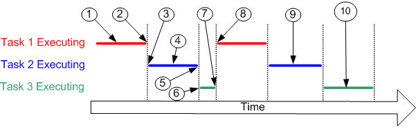
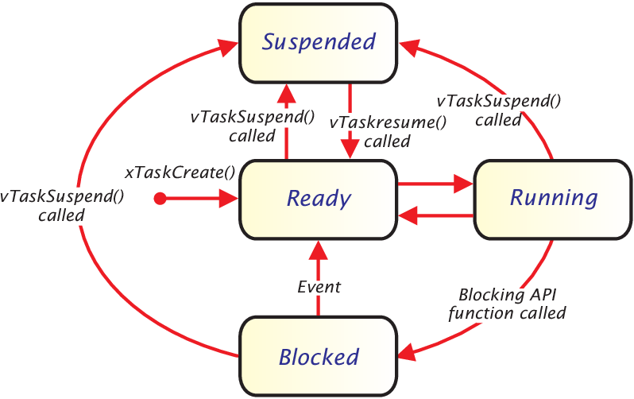

## **GESTIONE DEI TASK/THREAD**

Un'attività può esistere in uno dei seguenti stati:

- **Esecuzione (running)**
Quando un'attività è effettivamente in esecuzione, si dice che si trova nello stato In esecuzione. Attualmente sta utilizzando il processore. Se il processore su cui è in esecuzione RTOS ha un solo core, può esserci solo un'attività nello stato In esecuzione alla volta.
- **Pronto (ready)**
Le attività pronte sono quelle che possono essere eseguite (non sono nello stato Bloccato o Sospeso) ma non sono attualmente in esecuzione perché un'attività diversa con priorità uguale o superiore è già nello stato In esecuzione.
- **Bloccato (blocked)**
Si dice che un'attività si trova nello stato Bloccato se è attualmente in attesa di un evento temporale o esterno. Ad esempio, se un'attività chiama vTaskDelay() si bloccherà (verrà posta nello stato Bloccato) fino alla scadenza del periodo di ritardo, un evento temporale. Le attività possono anche bloccare l'attesa per la coda, il semaforo, il gruppo di eventi, la notifica o l'evento del semaforo. Le attività nello stato Bloccato normalmente hanno un periodo di "timeout", dopo il quale l'attività andrà in timeout e verrà sbloccata, anche se l'evento che l'attività stava aspettando non si è verificato.
Le attività nello stato Bloccato non utilizzano alcun tempo di elaborazione e non possono essere selezionate per entrare nello stato In esecuzione.
- **Sospeso (suspended)**
Come le attività che si trovano nello stato Bloccato, le attività nello stato Sospeso non possono essere selezionate per entrare nello stato In esecuzione, ma le attività nello stato Sospeso non hanno un timeout. Al contrario, le attività entrano o escono dallo stato Sospeso solo quando esplicitamente richiesto tramite le chiamate API vTaskSuspend() e xTaskResume() rispettivamente.

