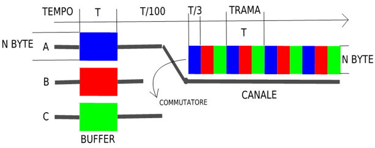
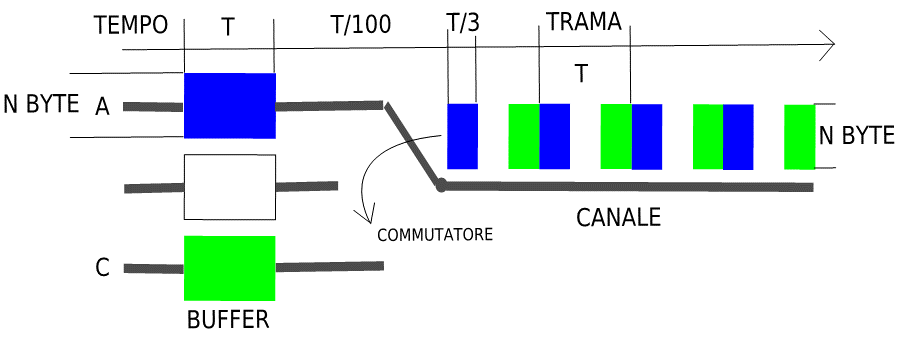

>[Torna a multiplazione TDM](mezzoradio.md#Multiplazione-TDM)

**Metafora 1**

Nella **metafora** parlare significa trasmettere sul canale, un **una famiglia** è una sorgente, **una anno** è una istanza della trama nel tempo, **la vacanza** è un messaggio, la **casa** in città è la coda di ingresso, la **casa vacanze** è il canale. 

Una casa vacanze in un luogo di villeggiatura esclusivo, molto ambito e caldo per 365 giorni l’anno è particolarmente costosa ed è mediamente utilizzata per una sola settimana.
Si decide di abbattere i costi di acquisto offrendola in multiproprietà, forma di acquisto che ne consente un utilizzo efficiente per tutto l’anno.
L’anno è diviso in 40 settimane utili per l’affitto, le altre sono dedicate alla manutenzione dell’immobile.
Le settimane utili all’affitto di un anno solare sono numerate dalla 1 alla 40.

Ogni famiglia prenota l’immobile per una settimana l’anno prestabilita e segnata in una tabella di allocazione che si ripete uguale ogni anno.
Tutte le famiglie attendono un anno il loro momento a casa loro (coda di ingresso diversa per ciascuna)
Ogni famiglia occupa la stessa casa vacanza (canale) una volta l’anno in una settimana prestabilita (slot).
L’anno di vacanza parte dalla settimana 1 fino alla 40 e si ripete uguale per sempre.

**Metafora 2**

Nella metafora **parlare** significa trasmettere sul canale, il **canale** è la tavola rotonda e la sala col pubblico, un **relatore** è una sorgente, **round** è una istanza della trama nel tempo, **risposta** è un messaggio, il **moderatore** è il nodo master, il **posto** in platea è la coda di ingresso. 

In un evento informativo più interlocutori devono condividersi la scena di un auditorium con pubblico che ascolta il dibattito.
Un numero arbitrario di interlocutori parlano a turno secondo un criterio di dialogo assimilabile a quello della **"tavola rotonda"**. Ciascun interlocutore è **numerato**. Il numero è un numero d'ordine all'interno della **scaletta** degli interlocutori abilitati a parlare.
Gli interventi sono suddivisi in **round**. Dentro ciascun round parlano, a turno, tutti i partecipanti al dibattito seguendo, ad ogni round, sempre **la stessa scaletta**.
Tutti i relatori **parlano** per lo stesso tempo (detto **slot**). **La scaletta rappresentata nel tempo** e limitata agli slot di uno stesso round è detta **trama**. 
All'interno della trama, ogni slot segue la numerazione crescente del partecipante a cui è assegnato. 
La **trama** viene ripetuta **periodicamente** in un tempo detto periodo di trama.

E' possibile **riconoscere** il relatore senza vederlo **contando gli slot** dall'**inizio della trama**. 
Ogni relatore ha un **tempo di trama** per **preparare la risposta** alla domanda del round ma solamente un **tempo di slot** per **esporla**. Il relatore prepara la risposta al proprio **posto**.
La multiplazione statica TDM di parecchie sorgenti richiede però che tutti i **relatori** siano **sincronizzati** con precisione presso un **moderatore** che fa da **master** e detta i tempi. 

Il **nodo master** stabilisce la **composizione** della "tavola rotonda" (cioè **chi** può trasmettere), in **che ordine** (cioè la scaletta degli interventi) e per **quanto tempo** deve **durare** un intervento. 

## **Schema di principio**

I messaggi arrivano simultaneamente ma su N porte di ingresso diverse (SDM) e si caricano sul buffer a valle di ciascuna dopo un tempo T.

Una volta finito il caricamento, gli N messaggi vengono inviati, in momenti diversi (TDM), nell’unica porta di uscita e con velocità maggiore di quella di arrivo in modo che la trasmissione di tutti avvenga sempre nel tempo T di arrivo di uno solo. 

Il tempo T viene detto tempo di trama o periodo:
è suddiviso in slot numerati di ugual durata sui quali è allocata la trasmissione di tutte le sorgenti in successione, una dopo l’altra. 
- Ogni slot ha la durata di T/N ed è assegnato sempre alla stessa sorgente che lo ha prenotato in fase di setup del canale.
- La trama si ripete all’infinito sempre con lo stesso ordine di trasmissione delle sorgenti e con ugual durata T.

I messaggi **arriva** ad **ondate successive** assimilabilia a **round periodici**. Mentre si **trasmette** quella appena **ricevuta** si **riceve** la **successiva**. Il **ritardo** tra il momento della ricezione di un messaggio e quello della sua trasmissione è esattamente **T**.

**T** è anche l’intervallo di tempo che intercorre tra **slot allocati** alla **stessa sorgente** cioè slot consecutivi in cui si trasmettono i messaggi di una stessa sorgente.

### **Struttura**

Il multiplatore è composto da:
- Code di ingresso dove i messaggi delle varie sorgenti arrivano contemporaneamente
- Un deviatore che commuta, quasi istantaneamente, da una sorgente all’altra
- Una porta di uscita su cui è collegato il canale da condividere tra le sorgenti

Il processo di multiplazione è una conversione parallelo-seriale:
- messaggi ricevuti in ugual tempo su porte diverse in ingresso diventano, in uscita,  messaggi trasmessi sulla stessa porta ma in tempi diversi detti slot.
- I messaggi di sorgenti diverse vengono ripartiti, in successione, sugli slot seguendo una turnazione delle sorgenti che si ripete uguale ogni N slot

**Vincolo operativo:** nel tempo in cui arriva un messaggio in ingresso ne devono essere spediti N in uscita. Questo tempo si chiama periodo di frame.

### **Caratteristiche del TDM statico**

I messaggi di comunicazioni diverse arrivano in ingresso tutte nello stesso tempo ma su porte diverse (SDM)
I messaggi di comunicazioni diverse vengono trasmessi in uscita sulla stessa porta ma in tempi diversi (TDM)
L’allocazione delle comunicazioni nel tempo è:
- prestabilita e non cambia mai per tutta la durata della comunicazione (TDM statico). E’ prenotata in fase di setup della comunicazione.
- periodica, si ripete dopo un tempo detto periodo di trama
- esclusiva. Il canale è di una certa sorgente per tutto il tempo (slot) in cui è ad essa assegnato (tutta la durata della comunicazione), anche quando questa non trasmette.

Il periodo della trama coincide col tempo di arrivo di un messaggio sulle porte di ingresso

### **Identificazione della sorgente**

Le risorse sono allocate on demand all’apertura della comunicazione (allocazione statica)

L’allocazione effettuata in fase di setup crea l’associazione tra l’identificativo della sorgente col numero dello slot

I messaggi sono identificati come appartenenti ad una certa sorgente implicitamente in base ad alla loro posizione all’interno della trama:
- Ad esempio la sorgente A sarà sempre in posizione 1, la B in posizione 2, la C in posizione 3 e così via…

I protocolli possono essere solamente di tipo connesso (connectionful) perchè deve esistere una fase di setup

### **Ritardi**

Completato l’arrivo sulle code di ingresso, i messaggi vengono trasmessi secondo un ordine prestabilito che si ripete periodicamente

Il ritardo di trasmissione è fisso ed è pari al tempo di trama, cioè al periodo tra una trasmissione e l’altra dello stessa sorgente

Ritardi si trasmissione fissi rendono la multiplazione statica adatta a quelle sorgenti che sono sensibili alle variazioni del tempo di consegna dei dati: audio, video, e multimediali in genere

### **Inefficienza intrinseca**

La sorgente B non sta trasmettendo, l’intervallo di trasmissione sul canale (slot) ad essa assegnato appare periodicamente vuoto e, per tutta la sua durata, la risorsa fisica (il canale) è di fatto inutilizzata. 

### **TDM statico: riepilogo**

i messaggi di piu’ utenti diversi condividono le stesse risorse trasmissive (multiplazione dei canali fisici) 
La contesa per l’accesso al mezzo è risolta nel dominio del tempo  mediante allocazione statica (le risorse sono allocate all’inizio) in fase di setup della comunicazione.

ogni pacchetto usa una frazione della capacità (banda) del canale (il canale è impegnato solo  in parte da una sorgente alla volta)
I pacchetti hanno un ritardo di trasferimento fisso dipendente dal tempo di attesa in coda.

L’utilizzo esclusivo del canale da parte di una sorgente è stabilito all’apertura della comunicazione, in fase di setup, e permane anche quando la sorgente non trasmette nulla 

>[Torna a multiplazione TDM](mezzoradio.md#Multiplazione-TDM)

