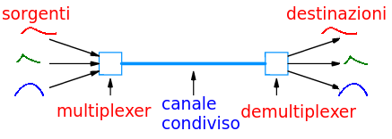

>[Torna a multiplazione TDM](mezzoradio.md#Multiplazione-TDM)

## **Commutazione di pacchetto**

### **Obiettivo**

Come tutte le multiplazioni, è una **tecnica** che serve a migliorare l'**efficienza** di utilizzo di un canale attraverso la **condivisione** dello stesso tra **più sorgenti**. 

Nella forma che vedremo di seguito, è la tecnica di multiplazione **principalmente adoperata** nei **link punto-punto** che fanno capo ai dispositivi che realizzano le moderne **reti dati** di ufficio (**switch** e **router**) e le **reti dati** attualmente adoperate dagli **ISP** (Internet Service Provider) per realizzare la connettività ad Internet. Di anno in anno è sempre più utilizzata anche in **ambito telefonico** per la realizazione della **parte voce** delle comunicazioni.

La **grandezza fisica** che non viene condivisa tra più sorgenti, quella in base alla quale è **differenziato** e ripartito l'**accesso** al canale tra le diverse sorgenti, è il **tempo**.

### **Idea di base**

La commutazione di circuito utilizza il **TDM statico** che prevede di allocare rigidamente delle risorse ad una comunicazione su base richiesta (**prenotazione**) effettuata in fase di **set-up** (apertura) della comunicazione: l’**efficienza** può essere bassa dato che impegno il canale anche quando **non dico niente**.

Idea per migliorare la situazione:
- Spezzo l’informazione in più segmenti
- Trasmetto un segmento, impegnando le risorse, solo quando questo è “pieno”

La commutazione di pacchetto prevede di allocare dinamicamente delle risorse a diverse comunicazioni, sempre su base richiesta, ma effettuata in fase di trasmissione sul canale: efficienza molto elevata perchè impegno il canale solo quando devo dire qualcosa.

### **Metafora**
Allo stesso check-in di un aeroporto arrivano i viaggiatori che devono andare in tre diverse destinazioni, tutti si accodano in un unica fila che termina all’ingresso del check-in

Ipotesi:
- I viaggiatori per Milano sono molti e arrivano a gruppi numerosi circa ogni 5 min
- I viaggiatori per Venezia sono un po’ di meno e arrivano a piccoli gruppi circa ogni 10 min 
- I viaggiatori per Catania sono pochissimi e arrivano singolarmente circa ogni 15 min

Al check in non è possibile stabilire nessuna periodicità fissa: non posso stabilire la provenienza in base all’ordine di arrivo nella coda
Mi serve un indirizzo di provenienza esplicito: devo guardare il documento di identità

### **TDM dinamico**

E' un **TDM**, per cui i messaggi di comunicazioni diverse:
- arrivano in **ingresso** tutte nello stesso tempo ma su **porte diverse** (SDM)
- vengono trasmessi in **uscita** sulla stessa porta ma in **tempi diversi** (TDM)

L’**allocazione** delle comunicazioni nel tempo è:
- **non prestabilita**, cioè può cambiare all’interno della medesima comunicazione (TDM dinamico)
- **aperiodica**, le comunicazioni, nel flusso dati, non hanno una posizione regolare loro assegnata nel tempo
- **non esclusiva**. Il canale è di una certa sorgente per tutto il tempo (slot) in cui è ad essa assegnato ma la durata di questa assegnazione è limitata alla durata della trasmissione del **singolo pacchetto**

Il **momento** della trasmissione di un messaggio non è prevedibile a priori perchè dipende dal tempo di arrivo del messaggio stesso e da quanti messaggi ci stanno prima di lui nella coda di trasmissione. In generale, il tempo di coda è un evento prevedibile solo in termini statistici.

### **Prerequisito**

La **multiplazione statistica** richiede che ogni messaggio lungo (ad es. stream o file) venga suddiviso in una **catena di messaggi brevi** capaci di essere riconoscibili a **se stante**, indipendentemente gli uni dagli altri, detti **frame** o **pacchetti** a seconda delle circostanze. Per viaggiare a se stante un pacchetto deve contenere un **riferimento univoco** alla sorgente che ha emesso il messaggio originale detto **etichetta**. L'etichetta permette di **individuare**, per ogni pacchetto, la **sorgente** che lo ha emesso.

Ogni **messaggio** lungo (stream o file) è diviso **dalla sorgente** in unità dati più corte dette **pacchetti** (packets) mediante un processo detto **segmentazione**. La **lunghezza** in bit dei pacchetti è **variabile** (entro un valore massimo) e non è nota in anticipo al multiplatore:
- **sorgenti diverse** possono inviare pacchetti di **dimensione diversa**
- **pacchetti diversi** della stessa sorgente possono avere **dimensione diversa**

### **Struttura**

Un **multiplatore** è una **memoria temporanea**, implementata in HW o in SW, che realizza la **coda** che accumula i pacchetti che **attendono la trasmissione** sul canale.

Il **tempo di riempimento** delle code di ingresso non è istantaneo ma dipende dalla **velocità della sorgente** che al multiplatore statistico è del tutto **ignota**. Potrebbero arrivare **contemporaneamente** o **separatamente** o anche insieme ma **parzialmente sovrapposte**, cioè sfalsate temporalmente l'una dall'altra, cosìcchè il caricamento di una per un po' si sovrappone con quello di un'altra.

I **pacchetti in arrivo** vengono ospitati sulle code **di ingresso** che in genere ospitano esattamente **un sol** pacchetto.

I **pacchetti in uscita** vengono ospitati sulle code **di uscita** che invece ospitano **molti** pacchetti.

Non appena un pacchetto **completa il suo arrivo**, viene trasferito da una coda di ingresso su una **coda di uscita** posta dinanzi al canale. Il **ruolo** della coda di uscita è principalmente quello di risolvere il problema della **contesa del canale** da parte di quei pacchetti che vengano eventualmente **smistati simultaneamente** da più porte di ingresso sulla **stessa porta** di uscita.

La **coda di ingresso** contiene esattamente un pacchetto, mentre **la coda di uscita** può ospitare molti pacchetti. L'**accumulo** dei pacchetti sulla coda di uscita può essere dovuto:
- all'**arrivo simultaneo** di un pacchetto per ogni porta di ingresso
- **picco di velocità** su una porta di **ingresso** che, essendo eccessivo, **satura** la velocità di smaltimento della porta di uscita che pertanto è costretta ad accumulare pacchetti sulla coda antistante ad essa. La coda in questo caso fa come un ammortizzatore che assorbe il picco momentaneo in attesa che questo si estingua nei momenti in cui arriveranno meno pacchetti.

L’**ordine di trasmissione** è uguale all’ordine di arrivo nella coda.

### **Vincoli operativi**

Una volta arrivato il loro turno, i pacchetti vengono spediti **in uscita** alla **massima velocità consentita** dal canale. Vale a dire che non c'è nessun vincolo prestabilito tra le velocità in ingresso e quelle in uscita che possono essere quindi del tutto **indipendenti**. 

Anche i **tempi** di arrivo dei pacchetti possono essere **indipendenti**. Le sorgenti **non** devono essere **sincronizzate** nè tra di loro e neppure con il dispositivo multiplatore poichè per lui ogni istante è buono per ricevere pacchetti. Le rilassate esigenze sui tempi rende l'utilizzo di questa tecnica molto più agevole rispetto alla multiplazione statica.

L'**unico vincolo** è che la **somma** delle velocità medie **in ingresso** di tutte le porte sia **inferiore** a quella media **in uscita** di una singola porta altrimenti il dispositivo perde dei pacchetti.

**Vincolo operativo**: la **velocità** di trasmissione **in uscita** sul canale  di un singolo pacchetto deve essere (a regime) almeno la **somma** delle velocità di tutte le sorgenti presenti sulle porte di **ingresso**. Se questo non accade allora, presto o tardi, le code **satureranno** e cominceranno a scartare (eliminare) i pacchetti non allocabili (condizione di **drop** dei pacchetti). Il **drop** dei pacchetti è un fenomeno impossibile nelle multiplazioni statiche in virtù del **rapporto fisso** tra le velocità in ingresso e quelle in uscita. 

Nelle reti con multiplazione statistica il drop delle code va evitato tramite il controllo della velocità delle sorgenti.

### **Definizione**

É una **multiplazione** (perché lo stesso canale è condiviso da più utenti) a **divisione di tempo** (i pacchetti sono trasmessi in intervalli di tempo diversi) non fissa, ma **statistica**, in quanto i pacchetti, tutti di **lunghezza diversa**, sono **ordinati in trasmissione** non in base a chi trasmette ma solo in base all’**ordine di arrivo** nella coda posta davanti al canale.

### **Proprietà**

- La  **contesa** del canale si risolve mediante accodamento dei pacchetti delle varie sorgenti al suo ingresso.
- le sorgenti **impegnano** il canale solamente quando hanno dei pacchetti pronti per la trasmissione (allocazione dinamica) 
- Non esiste una **trama** che identifica le finestre temporali di trasmissione delle sorgenti (slot) dato che l’ordine di trasmissione non identifica la sorgente: necessità di una  etichetta
- Le sorgenti negli istanti in cui **non trasmettono** non impegnano il canale.
- Ciascuna sorgente trasmette il suo pacchetto con una **velocità indipendente** da quella di ciascun altra e poi lo invia nella coda 

### **Ritardi**

Completato l’arrivo sulle code di ingresso, i messaggi vengono trasmessi secondo un **ordine casuale** aperiodico.
Il **ritardo** di trasmissione è **variabile** ed è pari al tempo di attesa in coda che è non prevedibile se non in maniera statistica

Ritardi si trasmissione variabili rendono la multiplazione statica adatta a quelle sorgenti che non sono sensibili alle **variazioni del tempo** di consegna dei dati: file, chat, sorgenti intermittenti in genere
Le **variazioni del ritardo** oltre certi limiti danneggiano le **comunicazioni multimediali** in modo tale da rendere non più fruibile il servizio da esse fornito.

### **Identificazione della sorgente**
Le risorse sono allocate on demand al momento della **trasmissione** del messaggio (allocazione dinamica). Non è necessario stabilire nulla preventivamente cioè prima dell’inizio della trasmissione.

I pacchetti sono **identificati esplicitamente** come appartenenti ad una certa sorgente in base ad una **etichetta** (un ID della connessione oppure l’indirizzo della sorgente) che li accompagna.

I **protocolli** possono essere di tipo **non connesso** (connectionless) perchè non è necessaria una fase di setup
Nulla vieta di utilizzare protocolli di tipo connesso per scopi diversi dalla multiplazione

### **Efficienza**

L'**efficienza** del TDM statistico è in genere **molto più elevata** di quella del TDM statico, soprattutto per le **sorgenti dati intermittenti**, perchè permette di sfruttare al meglio il canale in quanto questo è impiegato soltanto dalle sorgenti che, istante per istante, hanno messaggi da trasmettere. Se una sorgente è inattiva non occuperà mai il canale dato che non esiste una prenotazione anticipata dello stesso effettuata prima dell'inizio di una comunicazione. 

Il canale è **impegnato** in maniera **esclusiva** da una sorgente solo fino a quando questa non **completa la trasmissione** di un **pacchetto**. In questo caso l'**allocazione** della risorsa trasmissiva rimane ancora **esclusiva** per una sola sorgente ma solo limitatamente al tempo strettamente necessario a **spedire** un pacchetto sul canale.

### **Riepilogo**

- L’**accesso** al mezzo è risolta nel dominio del tempo  mediante allocazione dinamica (le risorse sono allocate solo quando servono)
in fase di trasmissione di un pacchetto.
- ogni pacchetto usa **tutta la capacità** (banda) del canale (il canale è impegnato per intero da un solo pacchetto alla volta)
- I pacchetti hanno un **ritardo** di trasferimento **variabile** dipendente dal tempo di attesa in coda.
- è possibile il fenomeno del **drop** dei pacchetti dalle code dei multiplatori che deve essere tenuto, in qualche modo, sotto controllo.

### **Sitografia**

- http://www.myreadingroom.co.in/notes-and-studymaterial/68-dcn/777-time-division-multiplexing.html
- http://www.programmiamo.altervista.org/internet/3/3f.html

>[Torna a multiplazione TDM](mezzoradio.md#Multiplazione-TDM)

