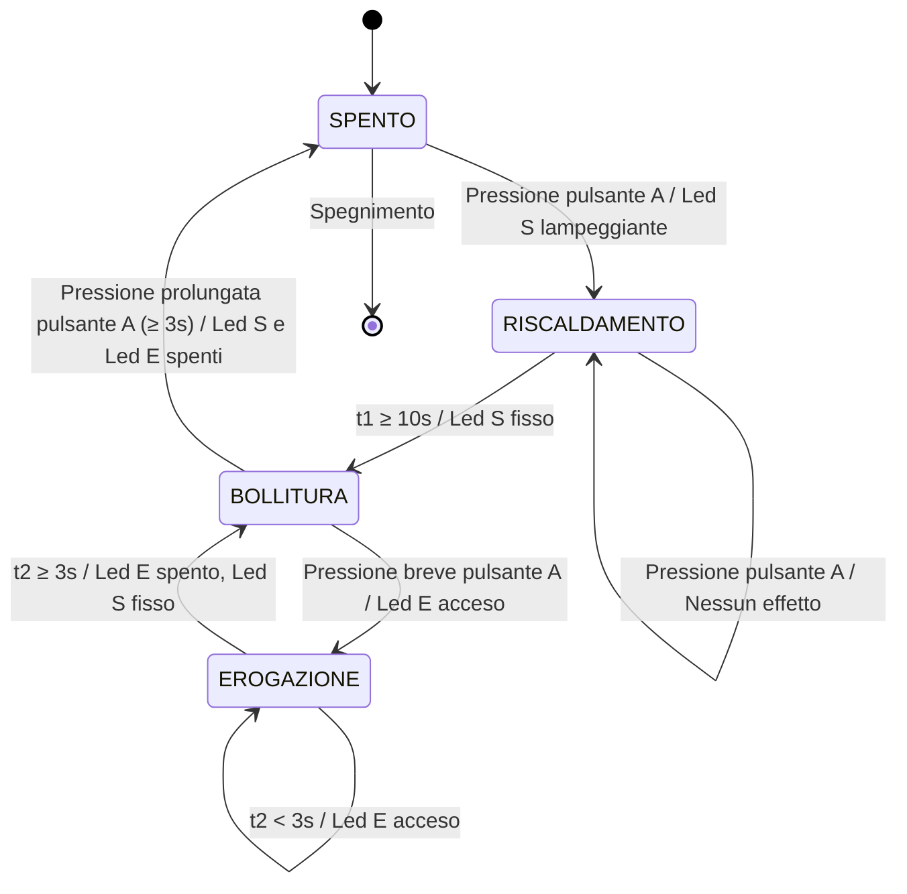

# **TEIERA AUTOMATICA**

Scrivere un programma che realizzi una teiera automatica tale che:
- si accenda premendo il pulsante A, alla cui pressione si mette a blinkare il led S di stato dell'acqua che così indica che la temperatura ancora non è quella giusta. 
- Una pressione del pulsante A mentre il led S blinka non ha alcun effetto.
- l'acqua è a temperatura quando, dopo 10 secondi, il led S non blinka più ma è a luminosità fissa
- premere il pulsante A con il  led S è fisso mette in azione la erogazione del te da un ugello, segnalata da un led E acceso
- l'erogazione termina dopo 3 secondi, passati i quali il led E si spegne.
- una pressione prolungata del pulsante A (più di 3 secondi) spegne la teiera disattivando tutti i led.

Prima di tutto, identifico gli stati presenti nel programma:
1. SPENTO - La teiera è spenta
2. RISCALDAMENTO - L'acqua si sta riscaldando (led S/led_A lampeggia)
3. BOLLITURA - L'acqua ha raggiunto la temperatura (led S/led_A fisso)
4. EROGAZIONE - Erogazione del tè in corso (led E/led_E acceso)

Gli input del sistema sono:
- Pressione del pulsante A (breve o prolungata)
- Timer t1 ≥ 10 secondi (riscaldamento completato)
- Timer t2 ≥ 3 secondi (erogazione completata)

Ecco la tabella di transizione di Mealy:

| Stato attuale | Input | Stato prossimo | Output |
|---------------|-------|---------------|--------|
| SPENTO | Pressione pulsante A | RISCALDAMENTO | Led S lampeggiante |
| RISCALDAMENTO | t1 < 10s | RISCALDAMENTO | Led S lampeggiante |
| RISCALDAMENTO | t1 ≥ 10s | BOLLITURA | Led S fisso |
| RISCALDAMENTO | Pressione pulsante A | RISCALDAMENTO | Led S lampeggiante (nessun effetto) |
| BOLLITURA | Pressione breve pulsante A | EROGAZIONE | Led E acceso |
| BOLLITURA | Pressione prolungata pulsante A (≥ 3s) | SPENTO | Led S e Led E spenti |
| EROGAZIONE | t2 < 3s | EROGAZIONE | Led E acceso |
| EROGAZIONE | t2 ≥ 3s | BOLLITURA | Led E spento, Led S fisso |

Questa tabella descrive il comportamento completo del sistema della teiera automatica secondo il codice fornito, mostrando come gli stati cambiano in risposta agli input e quali output vengono generati durante ciascuna transizione.

