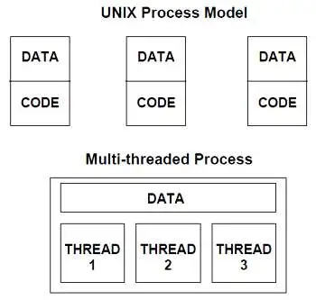
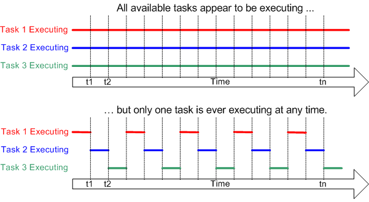
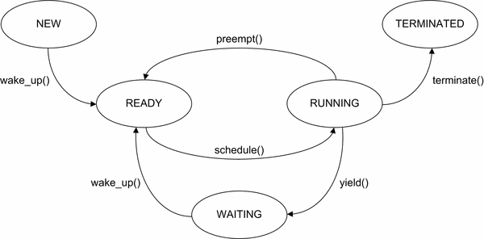

>[Torna all'indice generazione tempi](indexgenerazionetempi.md)  >[Versione in Python](threadschedpy.md)
>
# **SCHEDULAZIONE CON I THREAD**

### **Base teorica**

I thread, detti anche processi leggeri, sono dei **flussi di esecuzione** separati da quello principale (il programma main) che procedono **indipendentemente** l'uno dall'altro e soprattutto in maniera **parallela** cioè **contemporaneamente** l'uno con l'altro. Il **parallelismo** può essere:
- **reale** se flussi di esecuzione diversi sono eseguiti da core (o CPU) diversi. Possiede la proprietà di effettiva **simultaneità** nell'esecuzione di più istruzioni.
- **emulato** se flussi di esecuzione diversi sono eseguiti dallo stesso core della stessa CPU. La proprietà di **simultaneità** è relativa all'esecuzione di più **programmi** nello stesso momento ma con **istruzioni** dell'uno e dell'altro eseguite in momenti diversi (tecnica dell'interleaving).

Normalmente una **istruzione delay(x)** fa attendere per x secondi non solo l'esecuzione di un certo task ma anche quella di tutti gli altri che quindi, in quel frattempo, sono bloccati. Il motivo risiede nel fatto che tutti i task condividono **il medesimo flusso** di esecuzione (o thread) e, se questo viene fermato, viene fermato per tutti i task.

Se però due o più task vengono eseguiti su thread differenti è possibile **bloccarne soltanto uno** con un delay impedendo temporaneamente ad uno dei suoi task di andare avanti, ma **lasciando liberi tutti gli altri** task sugli altri thread di proseguire la loro esecuzione. Questo perchè thread differenti sono assimilabili a **flussi di esecuzione** differenti eseguiti su CPU (logiche) differenti. In realtà le diverse CPU logiche sono solamente **virtuali** perchè condividono un'unica CPU fisica.

Avere più **flussi di esecuzione paralleli** fornisce quindi il **vantaggio** di poter realizzare gli algoritmi in **maniera lineare** suddividendoli in **fasi successive** la cui **tempistica** può essere stabilita in **maniera semplice** ed intuitiva impostando dei **ritardi**, cioè dei delay, tra una fase e l'altra. La **separazione** dei flussi permette una **progettazione indipendente** degli algoritmi eccetto che per i **dati comuni** a più flussi (thread), per i quali deve essere **sincronizzato l'accesso** con opportuni meccanismi. 

Anche i **processi** sono flussi di esecuzione indipendenti che procedono in parallelo su una o più CPU, esiste però una **differenza pratica** notevole con i thread:
- nei **processi** sia input/output, che **area dati globale** che **area dati locale** (stack) sono indipendenti e separate in zone diverse della memoria RAM.
- nei **thread**  input/output e **area dati globale** sono **in comune** nella stessa posizione in RAM mentre soltanto le **aree dati locali** (stack) sono indipendenti e separate in zone diverse della memoria RAM.



Ma come è possibile che thread diversi possano essere mandati in esecuzione contemporaneamente su un'unica CPU fisica?

In realtà ad essere eseguiti **contemporaneamente** sono soltanto i **task**, cioè i programmi ed i relativi algoritmi, le **istruzioni** in linguaggio macchina che li compongono vengono invece eseguite **a turno**, un blocco di istruzioni alla volta. La durata del turno viene detta **quanto di tempo**. Terminato il quanto di tempo di un thread si passa ad eseguire le istruzioni di un altro thread nel quanto di tempo successivo. Ciò accade a patto che i thread siano **"preemptive"** cioè supportino il **prerilascio** della risorsa CPU **prima** del termine naturale del task (il comando return o il completamento del task). Le istruzioni accorpate in un quanto potrebbero non coincidere esattamente con un multiplo intero delle istruzioni ad alto livello, ci potrebbe essere, ad esempio, metà di un'assegnazione in un quanto e l'altra metà in un'altro. Le istruzioni **atomiche**, cioè indivisibili, sono soltanto quelle in **linguaggio macchina**.



Normalmente i thread possono lavorare in due **modalità operative**:
- **prempitive o competitiva**. Se un task di un thread possiede una risorsa (ad esempio la CPU) ed è bloccato in attesa di un input o di un un delay(), viene marcato come **interrompibile** in **maniera trasparente al task**, senza che questo se ne accorga. Allo scadere di un timer HW, **il task** viene interrotto da un segnale di **interrupt** che blocca il flusso di esecuzione corrente e assegna la risorsa CPU ad **un altro thread** tra quelli che, in quel momento, aspettano di andare in esecuzione (**stato ready**).
- **"non preemptive" cioè cooperativa**. Se un task di un thread possiede una risorsa (ad esempio la CPU) ed è bloccato in attesa di un input o di un una qualsiasi altra risorsa, esso stesso decide **spontaneamente** di cedere il controllo della CPU allo schedulatore **invocando** la sua esecuzione con un **suo** comando inserito **nel codice del task** (ad es. yeld()). Lo **schedulatore** assegna la risorsa CPU ad **un altro thread** tra quelli che, in quel momento, aspettano di andare in esecuzione (**stato ready**).

Di seguito è riportata una possibile rappresentazione della **macchina a stati** dei thread:



Ogni singolo **stato** in realtà può rappresentare una situazione comune a molti thread per cui è opportuno associare a ciascuno un elenco di thread organizzati in una **coda**. Se più thread posseggono i requisiti per uscire da un certo stato, la politica più semplice per farlo è la FIFO (First in First out), cioè tra i thread **abilitati a uscire**, estrae dalla coda quello che vi era **entrato per primo**.

La **transizione** da uno stato all'altro avviene in seguito ad un **evento** che può essere sia interno che esterno al thread. In genere, dallo stato **running**,  si va in stato di **attesa** (WAIT) per:
- attesa di un evento di input esterno
- attesa dello scadere del tempo di uno sleep del thread (istruzione **delay()**)
- istruzione yeld() eseguita nel codice del thread
- scadere del timer HW di sistema che assegna il tempo di CPU per quel thread

In figura sono indicate alcune funzioni tipiche:
- **schedule()** viene richiamata dallo **schedulatore** ogni volta che una **CPU diventa disponibile** per l'esecuzione di un thread. **schedule()** deve scorrere la coda dei thread nello **stato ready**, selezionare il prossimo thread da eseguire secondo un dato **algoritmo di scheduling** ed eseguire il **cambio di contesto** dal thread corrente al nuovo thread su quella CPU.
- **preempt()** a seguito dell'**interruzione** del thread corrente da parte del **timer HW**, questa funzione esegue il **cambio di contesto** dal thread corrente a quello dello schedulatore.
- **wake_up()** è una funzione che, richiamata allo scadere di un **evento esterno** al thread interrotto, lo "risveglia" mettendolo nella coda dei processi pronti (ready) per essere eseguiti. Può essere richiamata da un **evento** che avviene in un **altro thread** (ad es. una condizione su una variabile che si avvera) oppure può essere la **fine dell'attesa dell'input** che bloccava quel thread o, ancora, può essere collegata allo **scadere del tempo** di un ritardo **delay()**, che è la situazione che esploreremo nei prossimi esempi.

### **Vantaggi e svantaggi dei thread**

Abbiamo visto che **usare i delay** per progettare i tempi di un task **è più semplice** perchè la programmazione rimane quella **lineare** a cui è solito ricorrere un programmatore per pensare gli algoritmi ma, in questo caso, **è anche molto meno costosa** in termini di efficienza che in un programma a singolo thread dato che la CPU può sempre servire tutti i task nello stesso momento (in maniera reale o simulata). 

Può capitare, specie in **dispositivi con risorse HW molto ristrette**, che i thread non siano interrompibili ma possano lavorare solo in modo "cooperativo", allora, in questo caso, alcune librerie forniscono una funzione delay() alternativa che contiene al suo interno il comando yeld() di rilascio "spontaneo" della CPU. In questo modo **è preservata**, anche su quei dispositivi, la possibilità di adottare uno stile di **programmazione sequenziale** degli algoritmi.

Un **altro vantaggio** per il programmatore è che la gestione della schedulazione è trasparente alla applicazione che deve essere schedulata, nel senso che l'algoritmo che deve gestire la schedulazione non deve essere incluso nel codice dell'applicazione. Qualcuno deve comunque gestire la schedulazione nel tempo dei thread e questo qualcuno è un **modulo SW** diverso dall'applicazione che può:
- essere fornito da una **libreria** apposita
- essere incluso in framework di terze parti (**middleware**)
- essere fornito dal **sistema operativo** presente sulla macchina

Il **costo da pagare** è una certa dose di **inefficienza residua** perchè la shedulazione dei thread può essere fatta in maniera più o meno sofisticata ma comunque richiede l'utilizzo di un certo ammontare della risorsa CPU. Il peso di queste inefficienze potrebbe diventare insostenibile in presenza di **molti task** che girano su sistemi con limitate risorse di calcolo, come sono tipicamente i **sistemi embedded**.

Riassumendo, la **schedulazione mediante thread** comporta:
- **vantaggio**.  Maggiore semplicità nella progettazione dei programmi, grazie alla possibilità di utilizzare uno **stile lineare** di programmazione.
- **vantaggio**. Maggiore semplicità nella progettazione dei programmi perchè non devono realizzare la logica della schedulazione dei task ma solo quella interna al singolo task.
- **svantaggio**. Minore efficienza nell'uso della risorsa CPU che deve comunque eseguire un thread a parte di gestione delle schedulazioni sugli altri thread.
- **svantaggio**. Bisogna conoscere le API di libreria con cui viene realizzato il multithreading in un certo sistema con un certo linguaggio specifico. Le maniere possono essere parecchie per cui potrebbe essere utile ricorrere ad interfacce standard consolidate (ad esempio Thread POSIX)
- **svantaggio**. la schedulazione, cioè il passaggio da un thread all'altro, è comandata dallo schedulatore secondo una tempistica che, di base, **non è governata dal programma principale**, per effetto di ciò potrebbe diventare molto probematica la gestione delle **risorse condivise**  tra un thread e l'altro. Cosa accade se due istruzioni di due task differenti scrivono contemporaneamente sullo stessa variabile globale? E se modificano contemporaneamente lo stesso registro di una periferica? 

L'ultimo svantaggio è **particolarmente critico** e può comportare l'introduzione di errori difficilmente rilevabili, anche dopo innumerevoli prove sistematiche. La progettazione della gestione delle **risorse condivise**, e della gestione della **comunicazione tra i thread** in generale, deve essere molto accurata e ben ponderata. Vari strumenti SW e metodologie ad hoc permettono di affrontare più o meno efficacemente il problema.

### **Utilizzo in pratica**

**Ogni thread** realizza un **flusso** di esecuzione **parallelo** a quello degli altri thread, inoltre ognuno possiede un proprio **loop() principale** di esecuzione in cui realizzare le operazioni che tipicamente riguardano le **tre fasi** di lettura degli ingressi, calcolo dello stato del sistema e della sua risposta e la fase finale di scrittura della risposta sulle uscite. Il loop principale può essere definito sotto forma di **ciclo infinito** come ad esempio:

```C++
// loop del thread (eseguito all'infinito)
while(true) {
    // codice del thread
    .........................
}
```
oppure sotto la forma di **loop condizionato** dal valore di una variabile globale, ad es. ```isrun```, che può interrompere il thread, facendolo terminare, una volta che questa viene negata nel loop() principale:
```C++
// loop del thread
while(isrun){
    // codice del thread (eseguito più volte)
    .........................
}
// istruzioni eseguite  (una sola volta) alla chiusura del thread
```

Le **fasi di lavoro** del loop possono essere **schedulate** (pianificate nel tempo) dagli usuali delay()  bloccanti che permettono la progettazione **lineare** di un algoritmo nel tempo. In realtà, una volta che il thread che ha in uso la CPU entra in un delay(), lo schedulatore, che adesso è di tipo preemptive, sottrae il controllo della CPU al thread corrente e lo assegna ad un altro thread che, in quel momento, è in attesa di esecuzione.

**Modalità cooperativa**

Per quanto riguarda la **definizione** di un task va ricordato che l'interno del loop del task **ogni ramo** di esecuzione **potrebbe** essere reso **non bloccante** inserendo, la funzione **```delay(10)```** se il flusso di esecuzione deve essere **bloccato temporaneamente** per un certo tempo fissato, oppure la funzione **```delay(0)```** se questo **non deve essere bloccato**. Ciò serve a richiamare lo schedulatore **almeno una volta**, qualunque **direzione** di  esecuzione prenda il codice, in modo da cedere **"spontaneamente"** il controllo ad un altro task al termine del loop() del task corrente. La **cessione del controllo** dello schedulatore ad ogni ramo di esecuzione **è facoltativa** perchè comunque gli altri task verrebbero eseguiti (il sistema **è preemptive**).

Sia ```delay(0)``` che ```delay(10)``` cedono il controllo della CPU allo schedulatore che lo assegna agli altri task che eventualmente in quel momento hanno scaduto il tempo di attesa di un loro delay.


### **Thread POSIX**

**Ogni thread** è definito da un **descrittore** che è una variabile di tipo ```pthread_t```, cioè il tipo thread definito dallo **standard POSIX** del C (https://it.wikipedia.org/wiki/POSIX), che rappresenta il thread. Il **nome** del descrittore è arbitrario a discrezione del programmatore. Il descrittore deve essere passato come **argomento** ad ogni chiamata della funzione dello schedulatore che lancia il thread in esecuzione, cioè la ```pthread_create()```.

Il **flusso di esecuzione** di un thread è **definito** all'interno di una **funzione** e può essere avviato passando a ```pthread_create()``` il riferimento a questa funzione sotto la forma di parametro. In sostanza la funzione **serve** al programmatore per definire il thread e allo schedulatore per poterlo richiamare. 

In definitiva la **dichiarazione e definizione** di **descrittore e funzione** del thread possono assumere la forma:

```C++
pthread_t thMioScopo;

void * mioScopoThread(void * d){
  // loop del thread
  while(true) {
	// codice del thread
	.........................
  }
  return NULL
}
```

Ogni thread è **inizializzato** nel **setup()** tramite la funzione **```pthread_create()```**, il passaggio del descrittore è per **riferimento** perchè questo deve poter essere **modificato** al momento della inizializzazione.
```C++
void setup() {
  pthread_create(&thMioScopo, NULL, blink1, (void *)param);
}
```

### **Esempi**

**Blinks a tempo**

Esempio di realizzazione di due task che eseguono un blink mediante delay() insieme ad altre generiche operazioni svolte nel main (piattaforma **Espress if ESP32**, **IDE Arduino** e librerie thread **preemptive**). (Link simulatore online https://wokwi.com/projects/345668178687296083)

I blink sono due e si svolgono in maniera indipendente su due **thread separati**. Uno dei due blink viene interrotto dalla **terminazione** del loop di un thread **comandata nel main** impostando una **variabile globale**. 

```C++
#include <pthread.h> //libreria di tipo preemptive

pthread_t t1;
pthread_t t2;
int delayt ;
bool blink2_running = true;
int led1 = 13;
int led2 = 12;

void * blink1(void * d)
{
    int time;
    time = (int) d;
    // loop del thread 1
    while(true){
	digitalWrite(led1, !digitalRead(led1));
	delay(time);
    }
    // non arriva mai quà
    // questo thread non termina mai
    return NULL;
}

void * blink2(void * d)
{
    int time;
    time = (int) d;
    // loop del thread 2 (interrompibile dal loop principale)
    while(blink2_running){
	digitalWrite(led2, !digitalRead(led2));
	delay(time);
    }
    //se il flag è negato arriva quà
    digitalWrite(led2, LOW);
    // spegne il led e poi termina (su comando del loop())
    return NULL;
}

void setup() {
  Serial.begin(115200);
  pinMode(led1, OUTPUT);
  pinMode(led2, OUTPUT);
  delayt = 500;
  if (pthread_create(&t1, NULL, blink1, (void *)delayt)) {
         Serial.println("Errore crezione thread 1");
  }
  delayt = 1000;
  if (pthread_create(&t2, NULL, blink2, (void *)delayt)) {
         Serial.println("Errore crezione thread 2");
  } 
}

void loop() {
	int count = 0;
	while(count < 10){
		Serial.print("Faccio qualcosa... ");
		Serial.println(count);
		count += 1;
		delay(1000);
	}
	Serial.println("Termino il threads 2");
	// interrompe il loop del secondo thread
	blink2_running = false;
}
```
**Blinks a tempo **

Esempio di realizzazione di due task che eseguono un blink mediante delay() insieme ad altre generiche operazioni svolte nel main (piattaforma **Espress if ESP32**, **IDE Arduino** e librerie thread **preemptive**). (Link simulatore online https://wokwi.com/projects/345668178687296083)

I blink sono due e si svolgono in maniera indipendente su due **thread separati**. Uno dei due blink viene interrotto dalla **terminazione** del loop di un thread **comandata nel main** impostando una **variabile globale**. 
Link simulatore online https://wokwi.com/projects/378817246047694849

**Blinks a tempo con una sola funzione**

Esempio di realizzazione di due task che eseguono un blink mediante delay() insieme ad altre generiche operazioni svolte nel main (piattaforma **Espress if ESP32**, **IDE Arduino** e librerie thread **preemptive**). (Link simulatore online https://wokwi.com/projects/356371886501703681)

I blink sono due e si svolgono in maniera indipendente su due **thread separati**. La funzione di blink è unica con due parametri (dello stesso tipo) passati alla funzione 
```pthread_create()``` con un parametro array.

```C++
#include <pthread.h>
int led_pin_1 = 12;
int led_pin_2 = 18;
pthread_t t1_led, t2_led;

void * blink(void* arg) {
  int *p = (int *) arg;
  int pin = p[0];
  int time = p[1];
  while (true) { 
    digitalWrite(pin,!digitalRead(pin));
    delay(time); // this speeds up the simulation
  }
  return NULL;
}

void setup() {
  Serial.begin(115200);
  Serial.println("Hello, ESP32!");
  
  pinMode(led_pin_1,OUTPUT);
  int tdata1[] = {led_pin_1, 1000};
  if (pthread_create(&t1_led,NULL,blink,(void*)tdata1)) {
    Serial.println("ERRORE CREAZIONE THREAD!!");
  }

  pinMode(led_pin_2,OUTPUT);
  int tdata2[] = {led_pin_2, 2000};
  if (pthread_create(&t2_led,NULL,blink,(void*)tdata2)) {
    Serial.println("ERRORE CREAZIONE THREAD!!");
  }
}

void loop() {
  delay(1000); // this speeds up the simulation
}

```

### **Thread RTOS**

In realtà nella piattaforma **Espress if ESP32** i phtread sono una libreria eseguita al di sopra una implementazione nativa basata sui thread del sistema operativo FreeRTOS, pertando si potrebbe evitare di includere la libreria phtread.h e si potrebbe utilizzare direttamente l'implementazione nativa. Questa è anch'essa **preeenptive** per cui la funzione **delay()** causa la sospensione del thread chiamante e l'assegnazione della CPU al primo thread libero in attesa. Inoltre il codice seguente è un esempio di **parallelismo reale** dei thread in quanto sono allocati su **due core diversi** della medesima CPU:
(Link simulatore online https://wokwi.com/projects/348708804037182034)

I blink sono due e si svolgono in maniera indipendente su due **thread separati**. Uno dei due blink viene interrotto dalla **terminazione** del loop di un thread **comandata nel main** impostando una **variabile globale**. Per terminare correttamente un thread RTOS è necessario mettere come sua ultima istruzione la funzione ```vTaskDelete(NULL)```.

```C++
static uint8_t taskCore0 = 0;
static uint8_t taskCore1 = 1;
bool blink1_running = true;
bool blink2_running = true;
int led1 = 13;
int led2 = 12;
 
void blink1(void * parameter){
	String taskMessage = "Task running on core ";
  	taskMessage = taskMessage + xPortGetCoreID();
	//loop del thread (interrompibile dal loop principale)
	while(blink1_running){
		digitalWrite(led1, HIGH);
		delay(500);
		digitalWrite(led1, LOW);
		delay(500);
		Serial.println(taskMessage);
	}
	//se il flag è negato arriva quà
  	digitalWrite(led1, LOW);
  	// spegne il led e poi termina (su comando del loop())
	vTaskDelete(NULL);
}

void blink2(void * parameter){
	String taskMessage = "Task running on core ";
  	taskMessage = taskMessage + xPortGetCoreID();
	//loop del thread (interrompibile dal loop principale)
	while(blink2_running){
		digitalWrite(led2, HIGH);
		delay(1000);
		digitalWrite(led2, LOW);
		delay(1000);
		Serial.println(taskMessage);
	}
	//se il flag è negato arriva quà
  	digitalWrite(led2, LOW);
  	// spegne il led e poi termina (su comando del loop())
	vTaskDelete(NULL);
}
 
void setup() {
  Serial.begin(115200);
  pinMode(led1, OUTPUT);
  pinMode(led2, OUTPUT);
  
  Serial.print("Starting to create task on core ");
  Serial.println(taskCore0);
  xTaskCreatePinnedToCore(
                    blink1,   /* Function to implement the task */
                    "blink1", /* Name of the task */
                    10000,      /* Stack size in words */
                    NULL,       /* Task input parameter */
                    0,          /* Priority of the task */
                    NULL,       /* Task handle. */
                    taskCore0);  /* Core where the task should run */
   Serial.println("Task created...");
   delay(500);
   Serial.print("Starting to create task on core ");
   Serial.println(taskCore1);
   xTaskCreatePinnedToCore(
                    blink2,   /* Function to implement the task */
                    "blink2", /* Name of the task */
                    10000,      /* Stack size in words */
                    NULL,       /* Task input parameter */
                    0,          /* Priority of the task */
                    NULL,       /* Task handle. */
                    taskCore1);  /* Core where the task should run */
  Serial.println("Task created...");
}
 
void loop() {
	int count = 0;
	while(count < 10){
		Serial.print("Faccio qualcosa... ");
		Serial.println(count);
		count += 1;
		delay(1000);
	}
	Serial.println("Termino il threads...");
	delay(1000);
	// interrompe i loop di tutti i thread
	blink1_running = false;
	blink2_running = false;
}
```
### **Sitografia**
- https://www.freertos.org/implementation/a00004.html
- https://www.cs.unibo.it/~ghini/didattica/sistop/pthreads_tutorial/POSIX_Threads_Programming.htm
- http://www.ladispe.polito.it/corsi/industrial-network/Slide/Book%20on%20C%20linux/POSIX%20Threads%20Programming.pdf

>[Torna all'indice generazione tempi](indexgenerazionetempi.md)  >[Versione in Python](threadschedpy.md)
