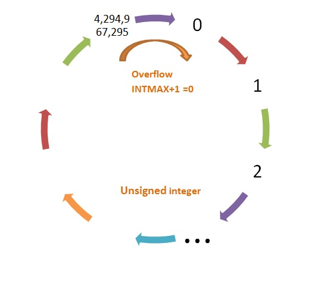

>[Torna all'indice generazione tempi](indexgenerazionetempi.md)     >[Versione in Python](timefuncpy.md)

# **GENERAZIONE DI TEMPI**

## **DELAY(), MILLIS() e WAITUNTIL()**

### **Delay()**

Mette in **pausa** il programma per la quantità di tempo (in millisecondi) specificata come parametro. (Ci sono 1000 millisecondi in un secondo).

Con la funzione ```delay()``` si può pianificare con precisione l'esecuzione delle istruzioni all'interno del ```loop()``` stabilendo, in maniera **sequenziale**, l'intervallo di tempo tra ciascuna e la precedente. 

Lo sviluppo di un programma in un linguaggio di tipo imperativo è di tipo **sequenziale** per cui rimane stabilito l'**ordine** di esecuzione di ciascuna istruzione.

Inserendo la funzione ```delay()``` tra una istruzione e l'altra è possibile stabilire, oltre che l'ordine dell'istruzione, anche il **momento** in cui l'esecuzione dell'istruzione deve accadere. 

Valgono due **considerazioni**:
- il tempo stabilito da una ```delay()``` è uno **stop** dell'esecuzione corrente che dura tot millisecondi tra la **fine** di un blocco di istruzioni e l'**inizio** del successivo
- il **momento effettivo** dell'esecuzione di un blocco di istruzioni deve tenere conto, oltre che dell'intervallo stabilito con un ```delay()``` tra l'uno e l'altro, anche del **tempo di esecuzione** di ciascun blocco che normalmente non è prevedibile. Se le istruzioni tra un delay() e l'altro sono poche e, ancor di più, se nessuna di esse interroga ingressi, allora il tempo speso è grossomodo trascurabile.

Esempio:

```C++
	void setup() {
		Serial.begin(115200);
	}

	void loop() {
		Serial.println("il loop è iniziato");
		delay(2000);
		Serial.println("Sono passati 2 secondi dall'ultima istruzione esguita");
		Serial.println("Sono passati circa 2 secondi dall'inizio del loop");
		delay(4000);
		Serial.println("Sono passati 2 secondi dall'ultima istruzione eseguita");
		Serial.println("Sono passati circa 4 secondi dall'inizio del loop");
	}
```

### **Millis()**

Restituisce il numero di **millisecondi** trascorsi da quando la scheda Arduino ha iniziato a eseguire il programma corrente (**accensione** del sistema). Questo tempo è rappresentato con un **unsigned long** che è un tipo **codificato** con 32 bit. Una variabile **unsigned long** può quindi contare fino a **2^32** (circa 4 miliardi) millisecondi,  oltrepassato quel valore il conteggio trabocca (fenomeno dell'overflow) e ripartirà da **zero**. L'**overflow** della funzione millis() avviene a circa **50 giorni** dall'accensione del dispositivo.

Questo perchè l'orizzonte dei valori in cui si sviluppa il conteggio in un numero intero senza segno e rappresentato con un numero finito di bit si può immaginare **circolare**. Il conteggio parte dal **valore zero**, aumenta lungo la circonferenza, raggiunge il **suo massimo** e poi **ritorna a zero** per oltrepassarlo e **ricomiciare** il conteggio d'accapo.



Bisogna prestare attenzione alle **operazioni aritmetiche** con **espressioni** che comprendono, oltre a ```millis()``` anche altre variabili aventi tipi più piccoli, come ad esempio ```int```. Infatti la capacità di conteggio di variabili di dimensione inferiore ad ```unsigned long``` è minore di quella di ```millis()``` per cui potrebbero andare in overflow in un **momento differente** rispetto a ```millis()``` generando **risultati scorretti**.

Le **misure di tempo** devono sempre tenere conto del problema dell’**overflow**:  

- Sulle **misure assolute** di tempo (misurate a partire dall’accensione della macchina) si può fare poco, quelle andranno in overflow comunque. 

- Sulle **misure relative**, cioè tra le **differenze di tempo**  tra istanti campionati (e conservati su una variabile) e quelli misurati con la millis(), è possibile rendere il fenomeno dell'overflow **non dannoso**. Il segreto è lavorare sempre **su differenze di tempo** che **non vadano mai** in overflow, ciò si ottiene assicurandosi di **ricampionare il valore del riferimento**, quello a partire da cui si misura la differenza, prima che l'evento di overflow accada. 

Si consideri la differenza:
```C++
	millis()-precm
```
se ```precm``` è dello stesso tipo di ```millis()```, cioè è di tipo **unsigned long**, allora sia l’una che l’altra andranno in overflowma in **tempi diversi**. Per effetto di un evento di overflow i **valori assoluti** delle variabili perderanno di significato mentre i **valori relativi** continueranno a mantenerlo. Infatti, nonostante le due variabili vadano in overflow in momenti diversi, la **differenza relativa** si mantiene ugualmente **corretta**. 

Ciò accade perché l’operazione di **sottrazione** delle variabili **senza segno** nei computer avviene **modulo il valore massimo** di conteggio della variabile.

Infatti si può verificare che il programma seguente restituisce il valore 2.
```C++
	void setup() {
		Serial.begin(115200);
		unsigned long a = 1;
		unsigned long b = 4294967295; //unsigned long maximum value
		Serial.println(a-b);
	}

	void loop() {
	}
```
Esempio di **ricampionamento periodico** del tempo corrente dopo una differenza tbase abbastanza breve da non andare in overflow:
```C++
	#define TBASE 100  // periodo base in millisecondi
	unsigned long precm=0;
	
	void setup(){}

	void loop()
	{
		// polling di millis()
		if((millis()-precm) >= tbase){  // tbase deve essere minore del valore di overflow
			// ricampionamento
			precm = millis();  // memorizzo l’istante dell’ultimo tempo “buono per eseguire”
			//......
		}
	}
```

### **waitUntil()**

Alcuni linguaggi hanno una istruzione di **attesa attiva**, cioè di blocco del programma in un certo punto del codice fino a che il valore di una **condizione** non diventa vero. La funzione è analoga ad un ```delay()``` solo che l'argomento, oltre ad un **tempo**, può essere anche una **condizione** valutata, a scelta del programmatore, su un **ingresso** o su una **variabile**. Il **C++ di Arduino** purtroppo **non** fornisce questo tipo di delay ma solo quello di **attesa in base al tempo**.

Nonostante questa limitazione del linguaggio è però possibile **emulare** un'istruzione con quella caratteristica realizzandola con una **funzione**. La funzione ```waitUntilInLow```

```C++
// attesa evento con tempo minimo di attesa
void waitUntilInLow(int btn, unsigned t)
{
    while(!digitalRead(btn)==LOW){
	 delay(t);
    }
}
```

resta in attesa di un **tempo minimo** ```t``` al termine del quale viene valutato se il valore dell'ingresso è basso (LOW). Se questa condizione è **vera** si prosegue all'esecuzione dell'**istruzione successiva**.  Se invece è **falsa** (ingtresso HIGH) si continua ad attendere per un ulteriore tempo ```t```, al termine del quale si ritorna a valutare la condizione ripetendo il test ed, eventualmente, proseguendo uletriormente l'attesa.

Con il blocco in **attesa di un ingresso** l'esecuzione resta bloccata indefinitivamente su un certo ingresso fino a quando un certo evento non lo **modfica** (in questo caso il valore LOW), facendo ripartire il programma dall'istruzione successiva.

Il blocco in **attesa di una variabile** l'esecuzione resta bloccata indefinitivamente su quella variabile fino a quando un certo evento su un altro task (thread o ISR) non la **modifica** facendo ripartire il programma dall'istruzione successiva. Si noti il passaggio per **riferimento** del parametro condizione.

```C++
// attesa evento con tempo minimo di attesa
void waitUntilFalse(bool &c, unsigned t)
{
    while(!c){
	delay(t);
    }
}
```

>[Torna all'indice generazione tempi](indexgenerazionetempi.md)     >[Versione in Python](timefuncpy.md)
