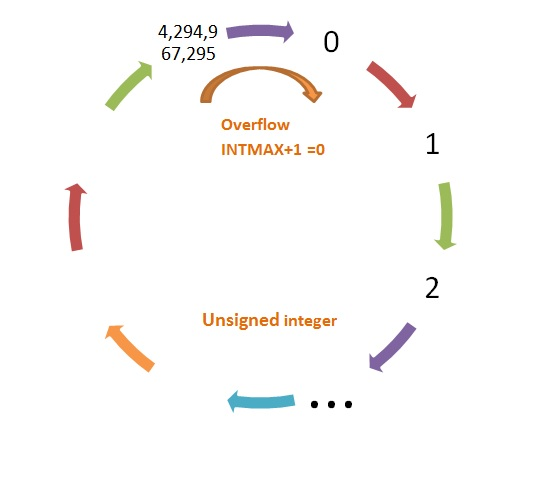

>[Torna all'indice generazione tempi](indexgenerazionetempi.md)     >[Versione in C++](timefunc.md)
# **GENERAZIONE DI TEMPI**

## **DELAY() E UPTIME()**

**delay()**

Mette in pausa il programma per la quantità di tempo (in millisecondi) specificata come parametro. (Ci sono 1000 millisecondi in un secondo).

**uptime()**

Restituisce il numero di millisecondi trascorsi da quando la scheda Arduino ha iniziato a eseguire il programma corrente. Questo numero supererà il massimo (e tornerà a zero) dopo circa 50 giorni (overflow).

Il tipo di dato ritornato dalla funzione è `unsigned long`.



Bisogna prestare attenzione alle **operazioni aritmetiche** con **espressioni** che comprendono, oltre ad `uptime()`, anche altre variabili aventi tipi con dinamica minore (più piccoli), come ad esempio `int`. Infatti la capacità di conteggio di variabili di dimensione inferiore ad `unsigned long` è minore di quella di `uptime()` per cui potrebbero andare in overflow in un momento differente rispetto ad `uptime()` generando risultati scorretti.

Le misure di tempo devono sempre tenere conto del problema dell’overflow. Sulle misure di tempo assolute (misurate a partire dall’accensione della macchina) si può fare poco, quelle andranno in overflow comunque; quelle relative tra istanti campionati (e conservati su una variabile) e misurati con la `uptime()` è invece possibile renderle non dannose. Il segreto è lavorare sempre **su differenze di tempo** che non superano mai il valore di overflow, ciò si ottiene assicurandosi di **ricampionare il valore del riferimento**, a partire da cui si misura la differenza, prima che l'evento di overflow accada. 

Se si considera la differenza:
```Python
	uptime() - precm
```
se `precm` è dello stesso tipo di `uptime()`, cioè è di tipo `unsigned long`, allora sia l’una che l’altra andranno in overflow e in istanti di tempo diversi. Per effetto di un evento di overflow i valori assoluti delle variabili perderanno di significato mentre quelli relativi continueranno a mantenerlo: infatti, nonostante le due variabili vadano in overflow in momenti diversi, la differenza relativa si mantiene ugualmente corretta. 

Ciò accade perché l’operazione di sottrazione delle variabili senza segno nei computer avviene modulo il valore massimo di conteggio della variabile.

Infatti si può verificare che il programma seguente restituisce il valore 2.
```Python
def main():
	pulsante = 0
	a = 1
	b = 4294967295
	print(a-b) # output: 2

	while True:
		pass

if __name__ == "__main__":
	main()
```
Esempio di **ricampionamento periodico** del tempo corrente dopo una differenza tbase abbastanza breve da non andare in overflow:
```Python	
	def main():
		TBASE = 100  # periodo base in millisecondi
		precm=0;
		
		while True:
			# polling di millis()
			if (uptime()-precm) >= tbase:    # tbase deve essere minore del valore di overflow
				# ricampionamento
				precm = uptime();  	 # memorizzo l’istante dell’ultimo tempo “buono per eseguire”
				#......
```

### **waitUntil()**

Alcuni linguaggi hanno una istruzione di **attesa attiva**, cioè di blocco del programma in un certo punto del codice fino a che il valore di una **condizione** non diventa vero. La funzione è analoga ad un ```delay()``` solo che l'argomento, oltre ad un **tempo**, può essere anche una **condizione** valutata, a scelta del programmatore, su un **ingresso** o su una **variabile**. Il **C++ di Arduino** purtroppo **non** fornisce questo tipo di delay ma solo quello di **attesa in base al tempo**.

Nonostante questa limitazione del linguaggio è però possibile **emulare** un'istruzione con quella caratteristica realizzandola con una **funzione**. La funzione ```waitUntilInLow```

```C++
// attesa evento con tempo minimo di attesa
void waitUntilInLow(int btn, unsigned t)
{
    while(!digitalRead(btn)==LOW){
	 delay(t);
    }
}
```

resta in attesa di un **tempo minimo** ```t``` al termine del quale viene valutato se il valore dell'ingresso è basso (LOW). Se questa condizione è **vera** si prosegue all'esecuzione dell'**istruzione successiva**.  Se invece è **falsa** (ingtresso HIGH) si continua ad attendere per un ulteriore tempo ```t```, al termine del quale si ritorna a valutare la condizione ripetendo il test ed, eventualmente, proseguendo uletriormente l'attesa.

Con il blocco in **attesa di un ingresso** l'esecuzione resta bloccata indefinitivamente su un certo ingresso fino a quando un certo evento non lo **modfica** (in questo caso il valore LOW), facendo ripartire il programma dall'istruzione successiva.

Il blocco in **attesa di una variabile** l'esecuzione resta bloccata indefinitivamente su quella variabile fino a quando un certo evento su un altro task (thread o ISR) non la **modifica** facendo ripartire il programma dall'istruzione successiva. Si noti il passaggio per **riferimento** del parametro condizione.

```C++
// attesa evento con tempo minimo di attesa
void waitUntil(bool &c, unsigned t)
{
    while(!c){
	delay(t);
    }
}
```

>[Torna all'indice generazione tempi](indexgenerazionetempi.md)     >[Versione in C++](timefunc.md)

