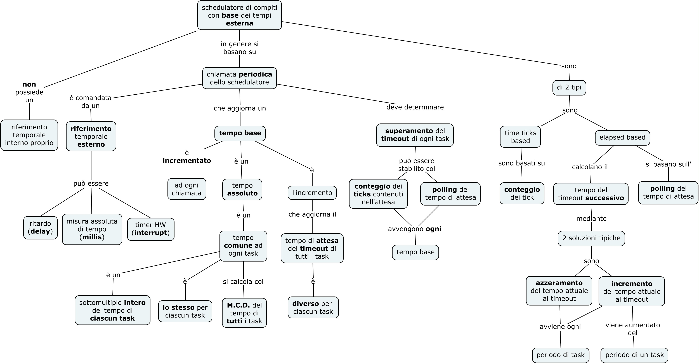

>[Torna all'indice generazione tempi](indexgenerazionetempi.md) >[versione in C++](timersched.md)

## **SCHEDULAZIONE CON I TIMERS HW**

La **schedulazione dei task** normalmente riguarda quei compiti che devono essere ripetuti in **maniera periodica**, infatti si parla di **loop() principale** e di **loop secondari** eventualmente sullo stesso thread (**protothread**) o su altri **thread**. Lo stesso scopo può essere ottenuto con dei timer HW che realizzano un loop su **base evento**. L'**evento** è l'**interrupt** di un timer HW, il **loop** è rappresentato dalla **calback** associata al timer e che viene viene da esso **periodicamente richiamata**.

Ma un **timer** si può impostare per **generare**:
- **eventi sincroni** cioè **periodici** dopo intervalli fissi e programmabili
- **eventi asincroni** cioè **aperiodici** da eseguire una sola volta (monostabili o one-shot) dopo un certo tempo calcolato **nel futuro** a partire dal **momento** in cui avviene il comando di **attivazione** (start).

Per cui un **timer HW** offre una versatilità in più se, nello stesso progetto, si vogliono **combinare insieme** eventi periodici con eventi aperiodici triggerati da eventi su un **ingresso** o da altri **eventi** (scadenza di timeout o contatori).

La **stessa cosa** è in realtà possibile realizzarla anche con i **timer SW** basati sul polling nel loop principale della funzione millis(). La loro **versatilità** è uguale se non **superiore**, ma sono soggetti ad alcune limitazioni che potrebbero renderli non adatti in certi contesti. L'ambito che **penalizza** di più i timer SW è quello delle applicazioni **mission-critical** (o **critical-time**) in cui si deve prevedere con certezza della puntualità l'esecuzione di certi compiti pena l'**instabilità** del sistema o una sua **perdita di sicurezza**.

Rispetto agli altri metodi di creazione di base dei tempi (polling della millis(), thread e protothread), è tendenzialmente più legato ad uno specifico vendor di HW e ad una specifica linea di prodotti. Le **API dei timer**, pur esendo **molto simili** tra loro, **non sono standardizzate** e la **portabilità** del SW nel tempo potrebbe non essere garantita. In ogni caso **semplificano** parecchio la **gestione delle ISR** associate a timer HW che altrimenti, eseguita a basso livello, richiede una impostazione di **registri interni** della CPU che necessita di conoscenze di dettaglio molto specifiche.

### **I TIMERS HW DI ESP32**

Il microcontrollore **esp32** ha 4 **timer HW**. Tutti i timer sono divisi in **2 gruppi**, 2 timer in ciascun gruppo. **Ogni timer** HW può avere una propria **configurazione indipendente**.

Sebbene siano disponibili **timer software** di FreeRTOS (il sistema operativo di ESP32) questi timer presentano alcune limitazioni:
- La **risoluzione massima** è uguale al periodo di tick di RTOS
- Le **callback** del timer vengono lanciate da un task a **bassa priorità**

Similmente ad Arduino, ESP32 permette l'accesso diretto ai timer HW in almeno tre modi:
- accesso ai registri HW del timer per impostare il prescaler
- utilizzo di una libreria di sistema che astrae e semplifica le operazioni del punto precedente
- attraverso librerie di terza parti

I **timer hardware** però, sebbene siano liberi da entrambe le limitazioni precedenti, spesso sono **meno convenienti** da usare. Ad esempio, i componenti dell'applicazione potrebbero richiedere che gli eventi del timer si attivino in determinati **momenti nel futuro**, ma il timer hardware contiene un **unico** valore di "confronto" utilizzato per la generazione di un interrupt. 

Ciò significa che è necessario costruire una **astrazione** in cima ai timer hardware che, nonostante utilizzi ancora il meccanismo delle interruzioni, implementi: 
-  **funzionalità** per gestire l'**elenco** degli **eventi in sospeso** e per richiamare le **callback** per questi eventi man mano che si verificano le interruzioni hardware corrispondenti.
-  una **semplificazione logica** del timer HW (un **timer logico**) che si possa **instanziare molte volte**, ognuna associandola ad una **propria callback**. I timer HW sottostanti rimangono però sempre e soltanto 4.

In ESP32, le **callback** del timer possono essere inviate con due metodi:
- ```ESP_TIMER_TASK```. Le callback del timer vengono inviati da un unico **task** ```esp_timer``` ad **alta priorità**. Poiché tutte le callback vengono smistate dallo **stesso task**, si consiglia di eseguire solo la **minima** quantità di lavoro possibile all'interno di una stessa callback. Se sono in esecuzione altri task con **priorità superiore** a ```esp_timer```, l'invio della callback verrà ritardato fino a quando l'attività esp_timer non avrà la possibilità di essere eseguita.
- ```ESP_TIMER_ISR```. Le callback del timer vengono inviati direttamente dal gestore di interrupt del timer. Questo metodo è utile per alcune semplici callback che mirano a una latenza inferiore.


### **Modalità di utilizzo**

La **modalità di utilizzo** è simile a quella di una **usuale ISR**. Una **funzione di callback** viene associata ad un evento di un timer tramite un metodo **init()**. La dissociazione si fa con il metodo contrario **deinit()**. Gli **eventi possibili** sono:
- una chiamata una tantum (**one shot** o timer monostabile)
- una chiamata **periodica** o timer bistabile. Nella definizione dell'**init()** viene anche impostato il **tempo di scadenza** del timer. 

I **timer HW** possono essere:
- **fisici**. Cioè **limitati in numero** ai dispositivi HW dedicati a questo scopo effettivamente presenti nel sistema (nell'ESP32 sono 4) e inoltre devono essere riferiti esplicitamente nel codice con un loro specifico id (un numero da 1 a 4).
- **logici o virtuali**. Sono virtualmente di **numero infinito** e rappresentano delle **astrazioni SW** del sottostante HW fisico che è condiviso in qualche modo da uno **strato di gestione** trasparente al programmatore. Sono istanzianbili in micropython con l'id convenzionale **-1** ma arttualmente **non** sono implementati su ESP32. 

La possibilità di poter **instanziare** un **timer logico** per **ogni task**, a sua volta definito all'interno di una certa **callback**, rende l'utilizzo dei timer una strada **effettivamente percorribile** per la realizzazione di uno **schedulatore di compiti** sia periodici che one shot (esecuzione singola non ripetuta). La **schedulazione** dei compiti inoltre rimane **molto precisa** perchè collegata a ISR eseguite da segnali di interrupt lanciati da **timer fisici**.

### **Limitazioni nell'utilizzo**

I timer richiamano particolari funzioni di callback , le ISR, che sono attivate a seguito di  un interrupt HW (timeout del timer). Nei sistemi multi-core questi interrupt possono essere chiamati solo dal core che ha eseguito il timer. Ciò significa che se si utilizza un timer per attivare un interrupt, è necessario assicurarsi che l'interrupt venga chiamato solo dal core che sta eseguendo il timer.

le ISR di base **non** sono **interrompibili** a meno di impostare apposite istruzioni che lo consentono. **Interrompere una ISR** potrebbe causare inconsistenze nella gestione delle risorse condivise con il loop o altri thread. D'altra parte, una ISR che non si interrompe per molto tempo impedisce la tempestiva esecuzione delle altre ISR dovute ad interruzioni **simultanee** o **temporalmente vicine**.

Esistono **limitazioni speciali** su ciò che può e non può essere fatto all'interno delle ISR nella maggior parte dei controllori: 
- Ad esempio, non è consentito allocare **memoria dinamica** all'interno di una ISR. 
- una ISR che esegue una **logica complessa** potrebbe essere eseguita così lentamente da creare instabilità del sistema dovuta al fatto che altre interruzioni, che gestiscono servizi essenziali del sistema, non sono state prontamente soddisfatte. Un gestore di interrupt dovrebbe essere sempre una funzione **breve** che esegue il **lavoro minimo** necessario per **modificare** delle **variabili esterne**.
- In genere, in molte implementazioni, callback diverse di uno stesso timer vengono eseguite **in sequenza** e non su thread paralleli per cui operazioni bloccanti come le ```delay()```, oltre a causare possibili **instabilità** (sono ISR basate su interrupt), **ritardano** l'esecuzione delle callback **a seguire**.
- eseguire **task complessi** con un timer HW è possibile a patto che questi vengano resi interrompibili senza creare problemi, e ciò si può ottenere eseguendoli in un **altro thread** o nel **loop principale**. Nel **loop principale**, un **task complesso** può sempre essere immediatamente attivato da una ISR che asserisce un opportuno **flag di avvio**.
  

Esempio di dichiarazione e instanziazione di un **oggetto timer**:
```python
from machine import Timer 
```
Esempio delle due modalità di impostazione:
```python
# Create physical timers 
tim1 = Timer(1)
tim1.init(mode=Timer.PERIODIC, period=100, callback=mycallback)
tim2 = Timer(2, mode=Timer.PERIODIC, period=500, callback=mycallback)
tim3 = Timer(3, mode=Timer.ONE_SHOT)
# Create a virtual timer with period 500ms
tim = Timer(-1)
tim.init(period=500, callback = mycallback)
```

La funzione ```Timer.deinit()``` può essere utilizzata per rimuovere un timer dal sistema. Ciò è utile se si desidera arrestare un timer attualmente in esecuzione. Se ci sono molti timer che utilizzano ciascuno la memoria, è una buona pratica rimuoverli quando il loro compito è terminato.


Esempio completo:
```python
import time
from machine import Pin, Timer

def blink(led):
     led.value(not led.value())

def periodicPrint(t):
    global executionsCount
    global led
    print("printing in periodic function. Exec nr: ", (executionsCount+1));
    executionsCount += 1
    blink(led)

    if executionsCount >= maxExecutionsCount:
        tim.deinit()

led = Pin(13, Pin.OUT)
tim = Timer(-1)
tim.init(period=500, callback = periodicPrint)	
maxExecutionsCount = 10
executionsCount = 0

while True:
    time.sleep_ms(1)
```
Simulazione su Esp32 con Wowki: https://wokwi.com/projects/371694109619973121

L'esp_timer è un set di APIs che fornisce timer one-shot e periodici, con risoluzione di tempo dei microsecondo e 64-bit di range di conteggio. In ogni caso è bene tenere presente che:
- la libreria Ticker fornisce però la precisione del millisecondo quindi se si ha bisogno di qualcosa di più granulare, è utile sapere che le funzioni sottostanti sono più flessibili.
- le funzioni di callback non è detto che vengano eseguite immediatamente quando si attiva il timer hardware. L'effettiva implementazione dell'API IDF esegue la chiamata annidata di una funzione ausiliaria che potrebbe ritornare con un certo ritardo.
-  se si registrano callback multiple per uno stesso timer, maggiore sarà il ritardo per le callback che verranno chiamate dopo, dato che per essere eseguite loro devono necessariamente ritornare le precedenti.
- le callback sono chiamate da funzioni ISR lanciate da segnali di interrupt provenienti dai timer. Le ISR di norma dovrebbero essere molto brevi e, in ogni caso, **mai bloccanti**, per evitare instabilità del sistema. Invece di eseguire operazioni bloccanti nella callback del ticker è consigliabile impostare li un **flag**  e **controllare** quel flag all'interno della funzione **loop**.

```python
import time
from machine import Pin, Timer

def blink(led):
    led.value(not led.value())

led1 = Pin(12, Pin.OUT)
led2 = Pin(18, Pin.OUT)
tim1 = Timer(2)
tim1.init(period=500, callback = lambda t: blink(led1))	
tim2 = Timer(3)
tim2.init(period=1000, callback = lambda t: blink(led2))	
count = 0

while True:
    print("Doing stuff... ", count)
    count += 1
    if count >= 10:
        break
    time.sleep_ms(1000)

print("Ending timers...")
tim1.deinit()
tim2.deinit()
```

Simulazione su Esp32 con Wowki: https://wokwi.com/projects/371695217789720577

### **PROBLEMA DEL NUMERO LIMITATO DI TIMER HW**

Esistono dei limiti nel **numero dei timer HW** a bordo di un sistema a microcontrollore. ESP32, ad esempio ne ha solo 4, virtualizzabili in un numero indefinito in C++, non virtualizzabili in python. Arduino, nelle varie versioni (come prortotipo di microcontrollori più semplici) ne ha un numero ridotto e non virtualizzabile.

Se i **task** da mandare in esecuzione **in parallelo** sono in numero maggiore dei **timer allocabili** (HW o virtuali) allora bisogna condividere un timer tra più task e per questo scopo si possono usare le solite tecniche di schedulazione che permettono, a fronte di un tempo comune (tempo base), di generare i **tempi propri** di ciascun task. Invocando lo schedulatore in corrispondenza del momento dello **scadere (elapsed)** di questi tempi, viene invocata la funzione (o il blocco di codice) del task.



### **TIMERS HW SCHEDULATO TRAMITE CONTEGGIO DEI TIMES TICK**

Si tratta della stessa situazione dell'esempio precedente in cui ci stanno **tre task** da eseguire con precisione e soltanto **due timer HW** per farlo. I **task** complessivamente in esecuzione sono **quattro**:
- **uno** in esecuzione **nel loop** schedulato da un delay() casuale che simula task pesanti dalla durata impredicibile
- **uno** affidato ad un **proprio timer HW** che ne programma l'esecuzione ad intervalli precisi, eventualmente sottraendo l'esecuzione al task nel loop mediante un segnale di interrupt
- **due** affidati ad un **unico timer HW** condiviso che esegue ad intervalli di tempo precisi uno schedulatore SW basato sul polling della funzione millis. Lo schedulatore viene richiamato in intervalli di tempo **comuni** ai due task che poi vengono **filtrati** mediante conteggio e selezione dei **times tick**.


```python
import time
from machine import Pin, Timer
import random

def blink(led):
    led.value(not led.value())

def scheduleAll(leds):
    global step
    step = (step + 1) % nstep      # conteggio circolare arriva al massimo a nstep-1
    # il codice eseguito al tempo base va quì	
    # ..........
    # task 1
    if not(step % 2):      # schedulo eventi al multiplo del tempo stabilito (1 sec)
        blink(leds[0])                       
    # task 2
    if not(step % 3):      # schedulo eventi al multiplo del tempo stabilito (1,5 sec)
        blink(leds[1])      
    # task 3
    if not(step % 4):      # schedulo eventi al multiplo del tempo stabilito (2 sec)
        blink(leds[2])      
    # task 4
    if not(step % 6):      # schedulo eventi al multiplo del tempo stabilito (3 sec)
        blink(leds[3])      
    # il codice eseguito al tempo base va quì	
    # ..........

led1 = Pin(12, Pin.OUT)
led2 = Pin(14, Pin.OUT)
led3 = Pin(27, Pin.OUT)
led4 = Pin(5, Pin.OUT)
led5 = Pin(4, Pin.OUT)
led6 = Pin(2, Pin.OUT)
leds1 = [led1, led2, led3, led4]
leds2 = [led5, led6]
tim1 = Timer(3)
tim1.init(period=500, callback = lambda t: scheduleAll(leds1))	
tim2 = Timer(4)
tim2.init(period=1000, callback = lambda t: blink(led5))	
step = 0
nstep = 1000

while True:
    print("task 6 pesante nel loop")
    blink(led6)
    randomDelay = random.randint(500,800)
    print("delay: ", randomDelay)
    time.sleep_ms(randomDelay)
    #time.sleep_ms(500)
```

Simulazione su Arduino con Wowki: https://wokwi.com/projects/371769605396662273

### **TIMERS HW SCHEDULATI TRAMITE AGGIORNAMENTO DEL PERIODO DEL TASK**

Gli schedulatori utilizzati sono **due**:
- basato su https://www.ics.uci.edu/~givargis/pubs/C50.pdf e in https://www.cs.ucr.edu/~vahid/rios/
- basato su https://github.com/marcelloromani/Arduino-SimpleTimer/tree/master/SimpleTimer e su [Generazione di tempi assoluti](absolutetimepy.md)

Entrambi possono essere utilizzati a partire da una generazione di tempi costante (delay, millis(), timer HW). Per una dissertazione più accurata sul loro utilizzo vedi [Schedulatore di compiti basato sul polling della millis()](taskschedpy.md) 

```python
import time
from machine import Pin, Timer

def blink(led):
    led.value(not led.value())

def scheduleAll(leds):
    global tbase1
    global elapsedTime
    global period
    #task3
    if elapsedTime[0] >= period[0]:
        blink(leds[0])
        elapsedTime[0] = 0
    elapsedTime[0] += tbase1
    #task4
    if elapsedTime[1] >= period[1]:
        blink(leds[1])
        elapsedTime[1] = 0
    elapsedTime[1] += tbase1
    #task5
    if elapsedTime[2] >= period[2]:
        blink(leds[2])
        elapsedTime[2] = 0
    elapsedTime[2] += tbase1

led1 = Pin(12, Pin.OUT)
led2 = Pin(14, Pin.OUT)
led3 = Pin(27, Pin.OUT)
led4 = Pin(5, Pin.OUT)
led5 = Pin(4, Pin.OUT)
led6 = Pin(2, Pin.OUT)
leds1 = [led1, led2, led3]
leds2 = [led4, led5]
#parametri dello sheduler 1
period2 = [500, 3000]
precs= [0, 0]
precm = 0
#inizializzazione dello scheduler 1
for i in range(2):
    precs[i] = precm -period2[i];
#parametri dello sheduler 2
period = [500, 1000, 2000]
elapsedTime = [0, 0, 0]
tbase1 = 500
#inizializzazione dello scheduler 2
tbase2 = 500
for i in range(2):
     elapsedTime[i] = period[i]
#configurazione timers HW
tim1 = Timer(3)
tim1.init(period=500, callback = lambda t: scheduleAll(leds1))	
tim2 = Timer(4)
tim2.init(period=1000, callback = lambda t: blink(led6))	

while True:
    time.sleep_ms(500)
    precm += tbase2
    #task1
    if precm - precs[0] >= period2[0]:
        precs[0] += period2[0]
        blink(leds2[0])
    #task2
    if precm - precs[1] >= period2[1]:
        precs[1] += period2[1]
        blink(leds2[1])
```
Simulazione su Arduino con Wowki: https://wokwi.com/projects/371783717482539009

### **Pulsante toggle con antirimbalzo insieme a blink**

In questo esempio si utilizza un unico **timer HW** come **base dei tempi** per uno **schedulatore SW** che gestisce la tempistica di **due task**: 
- uno per la relizzazione di un **tasto toggle** con proprietà di antirimbalzo
- un'altra per la realizzazione del **blink periodico** di un led

Le operazioni benchè semplici vengono considerate come prototipi di task più complessi e magari soggetti a **ritardi** considerevoli. In questa circostanza la loro esecuzione all'interno di una ISR è **sconsigliata** per cui essi vengono eseguiti nel ```loop()``` principale su **segnalazione** di un **flag** asserito dentro la ISR del timer.

```python
import time
from machine import Pin, Timer

class Toggle(object):
    def __init__(self, btn, state = False):
        self.btn = btn
        self.state = state
        self.precval = 0
    def toggle(self):
        changed = False
        val = self.btn.value()
        if self.precval == 0 and val == 1: 
            changed = True
            self.state = not self.state
            print(self.state)
        self.precval = val 
        return changed
    def getState(self):
        return self.state
    def setState(self,state):
        self.state = state

def blink(led):
    led.value(not led.value())

def press(p):
    p.toggle()
    time.sleep_ms(200)# emulazione ritardo del task

def toggleLogic(led):
    global pulsante
    if pulsante.getState():
        blink(led)
        print("Stato ",pulsante.getState())
        time.sleep_ms(100)# emulazione ritardo del task
    else:
        led.off()
         
def  timerISR(timer):
    global timerFlag
    global count
    if timerFlag:
        for i in range(taskNum):
            elapsedTime[i] += tbase
            count[i] +=1
    else:
        timerFlag = True
        for i in range(taskNum):
            if count[i] > 0:
                print("Recuperati ", count[i], " ticks del task ", i)
        for i in range(taskNum):
             count[i] = 0

def scheduleAll():
    global elapsedTime
    global tickFct
    global elapsedTime
    global taskNum
    for i in range(taskNum):
        if elapsedTime[i] >= period[i]:
            tickFct[i](pin[i])
            elapsedTime[i] = 0			
        elapsedTime[i] += tbase

btn1 = Pin(12,Pin.IN)
led1 = Pin(13,Pin.OUT)
led2 = Pin(2,Pin.OUT)
pulsante = Toggle(btn1)
pin = [led1, led2, pulsante]
timerFlag = False
tickFct = [toggleLogic, blink, press]
period = [1000, 500, 50]
elapsedTime = [0, 0, 0]
taskNum = len(period)
tbase = 50
count = [0, 0, 0]
myPerTimer = Timer(3)
myPerTimer.init(period=tbase, mode=Timer.PERIODIC, callback=timerISR)
#inizializzazione dei task
for i in range(taskNum):
     elapsedTime[i] = period[i]

while True:
    if timerFlag:
        scheduleAll()
        #time.sleep_ms(200)
        timerFlag = False
    time.sleep_ms(1)
    # il codice eseguito al tempo massimo della CPU va quì 
```

Di seguito il link della simulazione online con Tinkercad su Arduino: https://wokwi.com/projects/371662961899688961

### **Sitografia**

- https://www.coderdojotc.org/micropython/advanced-labs/13-timers/
- https://docs.micropython.org/en/latest/library/machine.Timer.html
- https://www.ics.uci.edu/~givargis/pubs/C50.pdf e in https://www.cs.ucr.edu/~vahid/rios/.
- https://github.com/marcelloromani/Arduino-SimpleTimer/tree/master/SimpleTimer

>[Torna all'indice generazione tempi](indexgenerazionetempi.md) >[versione in C++](timersched.md) 
