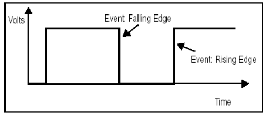
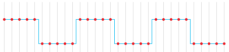

>[Torna all'indice generale](index.md) >[versione in Python](togglepy.md)

## **PULSANTI CON LETTURA DI UN FRONTE**

###  **PULSANTE TOGGLE**

Si vuole realizzare un pulsante con una memoria dello stato che possa essere modificata ad ogni pressione. Pressionfche è stata dichiarata i successive in sequenza accendono e spengono un led. Quindi, a seconda da quando si comincia, pressioni in numero pari accendono mentre quelle in numero dispari spengono, oppure al contrario, pressioni in numero pari spengono mentre quelle in numero dispari accendono.

Inizialmente si potrebbe essere tentati di provare seguente soluzione, adattando la strategia del pulsante precedente introducendo una variabile che conservi lo stato del pulsante che chiameremo **closed**.

```C++
byte in;
byte pulsante =2;
boolean closed=false; // stato pulsante
void setup()
{
	pinMode(pulsante, INPUT);
}

void loop()
{
	in = digitalRead(pulsante);
	if(in==HIGH){ // selezione del livello alto (logica di comando)
		closed = !closed;
		digitalWrite(led,closed);  //scrittura uscita
	}
}
```
Purtroppo questa soluzione ha un paio di **problemi** che ne pregiudicano il **funzionamento corretto**.

**Il primo** è relativo alla **selezione del tipo di evento in ingresso**. In questa soluzione viene rilevata la pressione del pulsante **sul livello** dell’ingresso. Il problema è che il livello viene rilevato per tutto il tempo che il tasto è premuto mediante una lettura per ogni loop(). Il numero di queste letture è imprevedibile sia perché sono moltissime al secondo e sia perché la durata della pressione dipende dall’utente. In più, ad ogni lettura viene modificato lo stato del pulsante con l’istruzione closed=!closed, ne consegue che lo stato finale del pulsante è il risultato di una catena di commutazioni che termina dopo un tempo casuale: abbiamo realizzato una slot machine!.

###  **RILEVATORE DI TRANSITO**

Si vuole realizzare un rilevatore del transito di un oggetto su una fotocellula. Poichè la fotocellula legge l'assenza del fascio luminoso di ritorno, la sua uscita è ripetutamernte vera fino a che l'oggetto non ha completato il suo passaggio. Un passaggio temporalmente lungo genera letture ripetute del transito segnalando più oggetti in corrispondenza di uno solo.

## **SOLUZIONE**

La **soluzione** è **modificare il tipo di selezione** **dell’evento** in ingresso, che deve stavolta avvenire sui **fronti** piuttosto che sui livelli. I fronti sono due, **salita** o **discesa**. Se si rileva il fronte di **salita** si cattura l’evento di **pressione** del pulsante, se si rileva il fronte di **discesa** si cattura l’evento di **rilascio** del pulsante. Ma come facciamo a capire quando siamo in presenza di un **evento di fronte**? Di salita o di discesa?



In **entrambi i casi**, un evento di fronte si ha quando si è in presenza di una **transizione di livello** di un ingresso, quindi per **rilevare un fronte** è sufficiente **rilevare una transizione**.

Una **evento di fronte** si può rilevare in due modi:

- **Polling degli ingressi.** Lo scopo è rilevare una **transizione di livello**. Si tratta di campionare periodicamente il livello di un ingresso avendo cura di memorizzare sempre l’ultimo campione misurato su una variabile globale. Al loop successivo questo valore verrà confrontato col nuovo alla ricerca di eventuali variazioni. Il polling, cioè il campionamento, può essere effettuato ad ogni loop, o può essere **decimato**, cioè eseguito periodicamente **ogni tot loop scartati** (decimati).

- **Interrupt.** Su alcune porte di un microcontrollore può essere abilitato il riconoscimento di un evento di interrupt, segnalabile, a scelta, su fronte di salita, fronte di discesa, entrambi i fronti. L’interrupt determina la chiamata asincrona di una funzione di servizio dell’interrupt detta ISR (Interrupt Service Routine) che esegue il codice con la logica di comando in risposta all’evento. La funzione è definita esternamente al loop() e la sua esecuzione è del tutto indipendente da questo.

In figura sono evidenziati i **campionamenti** eseguibili, ad esempio, ad ogni loop(), oppure ad intervalli di tempo preordinati stabiliti da uno schedulatore.



Si nota chiaramente che in corrispondenza di ogni fronte, prima e dopo, si misurano differenze di livello. In particolare si può avere:

- Un **fronte di salita** se la **transizione** avviene dal livello basso a quello alto

- Un **fronte di discesa** se la **transizione** avviene dal livello alto a quello basso

Se un rilevatore si limita a segnalare un **generico fronte**, allora per stabilire in quale ci troviamo, basta determinare, al momento della segnalazione, in **quale livello** si trova **l’ingresso**: se è al livello alto è un fronte di salita, se è a quello basso è un fronte di discesa.

Il **secondo problema** è costituito dal fenomeno dei **rimbalzi**. Si palesano come una sequenza di rapide oscillazioni che hanno sia fronti di salita che di discesa. Se l’accensione di un led è associata ad un fronte e il suo spegnimento a quello successivo, allora la pressione di un pulsante realizza, di fatto, la solita slot machine…è necessario un algoritmo di debouncing.

Gli esempi successivi sono stati esposti relativamente al problema del **pulsante toggle** premendo il quale, ad ogni lettura di un fornte, si genera la modifica di una opportuna **variabile di stato** (```stato``` negli esempi).

A ben vedere, le soluzioni proposte di seguito possono essere tutte facilmente adattate alla realizzazione di un **sensore di transito** sostituendo la pressione del pulsante con la lettura del sensore e interpretando la variabile ```stato``` con la **variabile di stato** che deve tenere traccia del passaggio rilevato.

Pulsante toggle con rilevazione del fronte di salita (pressione) e con antirimbalzo realizzato con una **schedulazione ad eventi (time tick)**  (per una spiegazione dettagliata dei time tick si rimanda a [schedulatore di compiti basato sui time tick](tasksched.md)):

```C++
#define tbase  100  // periodo base in milliseconds
unsigned long precm;
//unsigned long step;
byte pari, in;
byte precval, val;
byte led = 13;
byte pulsante =2;
byte stato= LOW;  // variabile globale che memorizza lo stato del pulsante
// utilizzare variabili globali è una maniera per ottenere
// che il valore di una variabile persista tra chiamate di funzione successive
// situazione che si verifica se la funzione è richiamata dentro il loop()

void setup()
{
	precm=0;
	pinMode(led, OUTPUT);
	pinMode(pulsante, INPUT);
	precval=LOW;
}

void loop()
{
	//schedulatore ad eventi con funzione di antirimbalzo
	if((millis()-precm) >= tbase){  	//se è passato un periodo tbase dal precedente periodo	
		precm = millis();             	//preparo il tic successivo azzerando il conteggio del tempo ad adesso

		//codice eseguito al tempo stabilito
		val = digitalRead(pulsante);  // lettura ingressi
		if(precval==LOW && val==HIGH){ // rivelatore di fronte di salita
			stato = !(stato); // impostazione dello stato del toggle
		}
		precval=val;  //memorizzazione livello loop precedente
		digitalWrite(led,stato); // scrittura uscite
	}
}
```
### **Conta numeri sequenziale**

```C++
/*Realizzare un programma Arduino che dati due led, led1 e led2 ed un tasto, conta il numero di volte che 
si preme il tasto e si accende il led1 quando si raggiungono 10 pressioni e quando si raggiungono le 20 
si accende il led2, mentre quando si raggiungono le 30 si spegne tutto e si ricomincia da 0. Se è possibile, 
rendere, in qualche modo, le pressioni insensibili ai rimbalzi del tasto.
*/
int led1=13; // led associato alle porte
int led2=12;
int tasto=2;
int count; // indica quale led si spegne e poi il successivo che si accende quando lo incrementiamo

// attesa evento con tempo minimo di attesa
void waitUntilInputLow(int btn, unsigned t)
{
    while(!digitalRead(btn)==LOW){
	    delay(t);
    }
}

void setup() 
{ 
  pinMode(led1,OUTPUT);
  pinMode(led2,OUTPUT);
  pinMode(tasto,INPUT);
  digitalWrite(led1,LOW); // nel pulldown è LOW
  digitalWrite(led2,LOW);
  count=0;
}

void loop() 
{
	//legge valore attuale dell'ingresso
	if(digitalRead(tasto)==HIGH){
		//fronte di salita
	        waitUntilInputLow(tasto,50);			// attendi finchè non c'è fronte di discesa
		//fronte di discesa
		count++;
		if(count==10)
		{
			digitalWrite(led1,HIGH);
		}
		else if(count==20)
		{
			digitalWrite(led1,LOW);
			digitalWrite(led2,HIGH);
		}
		else if(count==30)
		{
			digitalWrite(led1,LOW);
			digitalWrite(led2,LOW);
			count=0;
		}
      }
      delay(10);
}
```
Di seguito il link della simulazione online con Tinkercad su Arduino: https://www.tinkercad.com/things/6toP0Dc3v0x-copy-of-conta-numeri-schedulato/editel?tenant=circuits

### **Conta numeri ad eventi**

```C++
/*Realizzare un programma Arduino che dati due led, led1 e led2 ed un tasto, conta il numero di volte che 
si preme il tasto e si accende il led1 quando si raggiungono 10 pressioni e quando si raggiungono le 20 
si accende il led2, mentre quando si raggiungono le 30 si spegne tutto e si ricomincia da 0. Se è possibile, 
rendere, in qualche modo, le pressioni insensibili ai rimbalzi del tasto.
*/

//inizio variabili e costanti dello schedulatore (antirimbalzo)
#define tbase    	50        // periodo base in millisecondi
unsigned long precm=0;
//fine variabili e costanti dello schedulatore
byte in;
int led1=13; // led associato alle porte
int led2=12;
int tasto=2;
int count; // indica quale led si spegne e poi il successivo che si accende quando lo incrementiamo
bool stato=0;// sono le variabili globali del toggle stato indica lo stato del toggle se acceso o spento che poi viene copiato sul led con digitalwrite
int precval=0;//  e precval indica il valore precedente del tasto se premuto è 1 altrimenti 0

//switch che si attiva sul fronte di salita
int switchH(int val){
	int changed;
	if((val==HIGH)&&(precval==LOW)){
		changed=HIGH;
	}else{
		changed=LOW;
		}
	precval=val;
	return changed;
}

void setup() 
{ 
  pinMode(led1,OUTPUT);
  pinMode(led2,OUTPUT);
  pinMode(tasto,INPUT);
  digitalWrite(led1,LOW); // nel pulldown è LOW
  digitalWrite(led2,LOW);
  count=0;
}

void loop() 
{
	if((millis()-precm) > tbase) //schedulatore con funzione di antirimbalzo (legge ogni 50 mSec)
	{
		precm = millis(); 
		
		//legge valore attuale dell'ingresso
		in=digitalRead(tasto);
		//valuto se con il valore attuale si è su un fronte di salita (pressione tasto)
		if(switchH(in)==HIGH){
			//se si, aggiorno il contatore di numero tasti accessi
			count++;
			if(count==10)
			{
				digitalWrite(led1,HIGH);
			}
			else if(count==20)
			{
				digitalWrite(led1,LOW);
				digitalWrite(led2,HIGH);
			}
			else if(count==30)
			{
				digitalWrite(led1,LOW);
				digitalWrite(led2,LOW);
				count=0;
			}
		}
	}
}
```

Simulazione su Arduino con Tinkercad: https://www.tinkercad.com/embed/3qFE4pEpy8V?editbtn=1

## Esempi di blink insieme a pulsanti toggle antirimbalzo realizzati con tecniche di schedulazione diverse

La lettura di un fronte (di salita o di discesa) può essere effettuata con tutte le tecniche di schedulazione a disposizione (delay, protothread, thread, polling della millis e interrupts) ma non tutte hanno uguali caratteristiche di velocità ed efficienza. L'**appropriatezza** dell'una o dell'altra deriva dal **contesto di utilizzo**.

- Se il task in esecuzione nel ```loop()``` è **uno solo**, una **qualsiasi** delle tecniche precedenti garantisce una **adeguata responsività** ed inoltre **tutte** (comprese time tick e thread) possono essere interrotte, all'occorenza, da un **segnale di interrupt** per cui è preservata la possibilità di far intervenire processamenti a più **alta priorità** come quelli riconducibili a **dispositivi di sicurezza**.

- Se i task in esecuzione nel ```loop()``` sono **più di due** la tecnica dei **delay** nel loop è sicuramente la **meno responsiva** dato che un task per cominciare a processare i suoi ingressi deve prima attendere la fine del processamento del task precedente.

- Se si usano i **protothread** o i **thread** viene mantenuta la proprietà di intrinseca **semplicità** tipica della programmazione **lineare** basata su attese di tempo (**delay**) o attese su ingressi (**waitUntil**). La **responsività** degli ingressi viene sostanzialmente garantita in **ogni task** dato che ognuno ottiene periodicamente il controllo della CPU grazie al **prerilascio** forzato della stessa da parte degli altri task, dopo che è scaduto il **quanto** di tempo assegnato a ciascuno di essi. 

- Se si usano gli **interrupt** gli ingressi vengono trattati con la **massima priorità** possibile e vengono serviti **in cima** a quelli gestiti con tutte le altre tecniche di schedulazione. Questa circostanza, oltre a garantire la massima responsività (non si attende nessun quanto temporale), garantisce anche la **massima sicurezza** nella gestione di eleborazioni di segnali **critici** (guasti, allarmi, soglie di sicurezza). 

Non è consigliabile mettere```delay()``` o comunque codice lento, in una ISR che serve un interrupt di una porta, perchè tutti gli altri dispositivi (le altre porte come anche i timer HW) che utilizzano gli interrupt normalmente mettono le chiamate delle rispettive ISR una in coda all'altra, in attesa che venga il loro turno di essere servite dalla CPU (non è detto che siano abilitate le interruzioni annidate).

### **Schedulatore basato sui delay**

In questo caso, il **rilevatore dei fronti** è realizzato **campionando** il valore del livello al loop di CPU **attuale** e **confrontandolo** con il valore del livello campionato in un momento diverso (dello stesso loop) stabilito mediante l'istruzione di attesa ```waitUntilInputLow()``.

L'**attesa** è spesa campionando continuamente un **ingresso** fino a che questo non **diventa LOW**. Quando ciò accade allora vuol dire che si è rilevato un **fronte di discesa** per cui, qualora **in futuro**, in un loop successivo, si determinasse sullo stesso ingresso un valore HIGH, allora si può essere certi di essere in presenza di un **fronte di salita**.  

Questa tecnica ha lo svantaggio presentare un certa dose di **interferenza temporale** nell'esecuzione dei vari task separarti per mezzo del ritardo ```delay()```. I task devono essere eseguiti **in sequenza** e inoltre sono concatenati, per cui l'esecuzione del task successivo non può cominciare se prima non termina quella del task corrente. Di fatto un task può rimanere **bloccato** e quindi non essere **responsivo** per un input da parte dell'utente, oppure può **non elaborare prontamente** l'uscita richiesta in un dato momento.

```C++
/*Alla pressione del pulsante si attiva o disattiva il lampeggo di un led*/
int led = 13;
byte pulsante =12;
byte stato= LOW;  // variabile globale che memorizza lo stato del pulsante
// utilizzare variabili globali è una maniera per ottenere
// che il valore di una variabile persista tra chiamate di funzione successive
// situazione che si verifica se la funzione è richiamata dentro il loop()

// attesa evento con tempo minimo di attesa
void waitUntilInputLow(int btn, unsigned t)
{
    while(!digitalRead(btn)==LOW){
	    delay(t);
    }
}
  
void setup() {
  Serial.begin(115200);
  pinMode(led, OUTPUT);
  pinMode(pulsante, INPUT);
}

// loop principale
void loop() {
	if(digitalRead(pulsante)==HIGH){			// se è alto c'è stato un fronte di salita
		stato = !stato; 				// impostazione dello stato del toggle
		waitUntilInputLow(pulsante,50);			// attendi finchè non c'è fronte di discesa
	}
	if (stato) {
		digitalWrite(led, !digitalRead(led));   	// inverti lo stato precedente del led
		delay(500);
	} else {
		digitalWrite(led, LOW);    	// turn the LED off by making the voltage LOW
	}
}
```
Simulazione online su Arduino con Tinkercad del codice precedente: https://www.tinkercad.com/embed/cFhsDE3pyeH?editbtn=1

Simulazione online su Esp32 con Wowki del codice precedente: https://wokwi.com/projects/349322438385861202

### **Schedulatore basato su time ticks**

In questo caso, il **rilevatore dei fronti** è realizzato **campionando** il valore del livello al loop di CPU **attuale** e **confrontandolo** con il valore del livello campionato al **loop precedente** (o a uno dei loop precedenti). Se il valore attuale è HIGH e quello precedente è LOW si è rilevato un **fronte di salita**, mentre se il valore attuale è LOW e quello precedente è HIGH si è rilevato un **fronte di discesa**.  

Pulsante toggle che realizza blink e  antirimbalzo realizzato con una **schedulazione ad eventi senza ritardi (time tick)**:
```C++
/*Alla pressione del pulsante si attiva o disattiva il lampeggo di un led*/
#define tbase    100       // periodo base in milliseconds
#define nstep    1000      // numero di fasi massimo di un periodo generico

unsigned long precm;
unsigned long step;
byte pari, val;
byte precval;
byte pulsante=12;
byte led = 13;
byte stato= LOW;	// variabile globale che memorizza lo stato del pulsante
			// utilizzare variabili globali è una maniera per ottenere
			// che il valore di una variabile persista tra chiamate di funzione successive
			// situazione che si verifica se la funzione è richiamata dentro il loop()

void setup()
{
  precm=0;
  step=0;
  pinMode(led, OUTPUT);
  pinMode(pulsante, INPUT);
  precval=LOW;
}

// loop principale
void loop()
{
  //metronomo
  if((millis()-precm) >= tbase){  	//se è passato un periodo tbase dal precedente periodo	
	precm = millis();             	//preparo il tic successivo azzerando il conteggio del tempo ad adesso

	step = (step + 1) % nstep;  	//conteggio circolare arriva al massimo a nstep-1
	
	// schedulazione degli eventi con periodicità tbase (funzione di antibounce per il digitalread a seguire)
	val = digitalRead(pulsante);		//pulsante collegato in pulldown
	//val = digitalRead(!pulsante);		//pulsante collegato in pullup
	if(precval==LOW && val==HIGH){ 		//rivelatore di fronte di salita
		stato = !stato; 		//impostazione dello stato del toggle	
	}
	precval=val;	

	// schedulazione degli eventi con periodicità 1 sec
	if(!(step%10)){     	//ogni secondo (vero ad ogni multiplo di 10)
		if(stato){      // valutazione dello stato del toggle
			digitalWrite(led,!digitalRead(led)); //stato alto: led blink
		}else{
			digitalWrite(led,LOW);		 //stato basso: led spento
		}
	}
  }
}
```
Simulazione online su Arduino con Tinkercad del codice precedente: https://www.tinkercad.com/embed/2wo4e7wLqr0?editbtn=1

Simulazione online su Esp32 con Wowki del codice precedente: https://wokwi.com/projects/348707844567073364

### **Schedulatore basato sul polling del tempo corrente get()**

In questo caso, il **rilevatore dei fronti** è realizzato **campionando** il valore del livello al loop di CPU **attuale** e **confrontandolo** con il valore del livello campionato al **loop precedente** (o a uno dei loop precedenti). Se il valore attuale è HIGH e quello precedente è LOW si è rilevato un **fronte di salita**, mentre se il valore attuale è LOW e quello precedente è HIGH si è rilevato un **fronte di discesa**.  

Pulsante toggle che realizza blink e  antirimbalzo realizzato con una **schedulazione ad eventi senza ritardi (time tick)**:
```C++
/*Alla pressione del pulsante si attiva o disattiva il lampeggo di un led*/
#include "urutils.h"
int led = 13;
byte pulsante =12;
#define DEBOUNCETIME 50
byte precval, val;
DiffTimer tmrblink;
DiffTimer tmrdebounce;
 
void setup() {
  pinMode(led, OUTPUT);
  pinMode(pulsante, INPUT);
  precval=LOW;
  tmrdebounce.start(); 
}

// loop principale
void loop() {
  if(tmrdebounce.get() > DEBOUNCETIME){  	
    tmrdebounce.reset();   

    val = digitalRead(pulsante);		
    if(precval==LOW && val==HIGH){ 		//rivelatore di fronte di salita
      tmrblink.toggle();		
    }
    precval=val;	
  }
  if (tmrblink.get() > 500) {
    digitalWrite(led, !digitalRead(led));
    tmrblink.reset();
  } 
  delay(10);
}

```
Simulazione online su Esp32 con Wowki del codice precedente: https://wokwi.com/projects/388292295134772225

### **Schedulatore basato su protothreads**

In questo caso, il **rilevatore dei fronti** è realizzato **campionando** il valore del livello al loop di CPU **attuale** e **confrontandolo** con il valore del livello campionato **nello stesso loop** ma in un momento diverso stabilito mediante un istruzione ```WAIT_UNTIL()```. La funzione, di fatto, esegue un **blocco** del protothread corrente in **"attesa"** della asserzione di una certa **condizione**, senza bloccare l'esecuzione degli altri protothread. L'**attesa** è spesa campionando continuamente un **ingresso** fino a che questo non **diventa LOW**. Quando ciò accade allora vuol dire che si è rilevato un **fronte di discesa** per cui, qualora **in futuro**, in un loop successivo, si determinasse sullo stesso ingresso un valore HIGH, allora si può essere certi di essere in presenza di un **fronte di salita**.  

Pulsante toggle che realizza blink e  antirimbalzo realizzato con una **schedulazione sequenziale con i ritardi** emulati tramite **protothreads** (per una spiegazione dettagliata dei protothread si rimanda a [schedulazione con i protothread](protothreadsched.md)):
```C++
#define LC_INIT(lc)
struct pt { unsigned short lc; };
#define PT_THREAD(name_args)  char name_args
#define PT_BEGIN(pt)          switch(pt->lc) { case 0:
#define PT_WAIT_UNTIL(pt, c)  pt->lc = __LINE__; case __LINE__: \
                              if(!(c)) return 0
#define PT_END(pt)            } pt->lc = 0; return 2
#define PT_INIT(pt)   LC_INIT((pt)->lc)
#define PT_SLEEP(pt, delay) \
{ \
  do { \
    static unsigned long protothreads_sleep; \
    protothreads_sleep = millis(); \
    PT_WAIT_UNTIL(pt, millis() - protothreads_sleep > delay); \
  } while(false); \
}
#define PT_EXITED  2
#define PT_SCHEDULE(f) ((f) < PT_EXITED)
#define PT_YIELD(pt) PT_SLEEP(pt, 0)
//-----------------------------------------------------------------------------------------------------------
// se si usa questa libreria al posto delle macro sopra, togliere il commento iniziale all'include 
// e commentare le macro sopra
//#include "protothreads.h"
/*Alla pressione del pulsante si attiva o disattiva il lampeggo di un led*/
byte led = 13;
byte pulsante =2;
byte stato= LOW;  // variabile globale che memorizza lo stato del pulsante
// utilizzare variabili globali è una maniera per ottenere
// che il valore di una variabile persista tra chiamate di funzione successive
// situazione che si verifica se la funzione è richiamata dentro il loop()

// definizione protothread del pulsante
pt ptBtn;
int btnThread(struct pt* pt) {
  PT_BEGIN(pt);

  // Loop del protothread
  while(true) {
	if(digitalRead(pulsante)==HIGH){		// se è alto c'è stato un fronte di salita
		stato = !(stato); 	// impostazione dello stato del toggle
		PT_SLEEP(pt, 50);		// antirimbalzo
		PT_WAIT_UNTIL(pt, digitalRead(pulsante)==LOW);	// attendi fino al prossimo fronte di discesa
	}
	PT_YIELD(pt);
  }
  PT_END(pt);
}

// definizione protothread del lampeggio
pt ptBlink;
int blinkThread(struct pt* pt) {
  PT_BEGIN(pt);

  // Loop del protothread
  while(true) {
	if (stato) {
		digitalWrite(led, HIGH);   	// turn the LED on (HIGH is the voltage level)
		PT_SLEEP(pt, 1000);
		digitalWrite(led, LOW);    	// turn the LED off by making the voltage LOW
		PT_SLEEP(pt, 1000);
	} else {
		digitalWrite(led, LOW);    	// turn the LED off by making the voltage LOW
		PT_YIELD(pt);
	}
  }
  PT_END(pt);
}

void setup()
{
	PT_INIT(&ptBtn);
	PT_INIT(&ptBlink);
	pinMode(led, OUTPUT);
	pinMode(pulsante, INPUT);
}

// loop principale
void loop()
{
	PT_SCHEDULE(btnThread(&ptBtn)); 	// esecuzione schedulatore protothreads
	PT_SCHEDULE(blinkThread(&ptBlink)); 	// esecuzione schedulatore protothreads
}
```

Simulazione online su Arduino con Tinkercad del codice precedente: https://www.tinkercad.com/embed/0cAN5RGK8cB?editbtn=1

Simulazione online su Esp32 con Wowki del codice precedente https://wokwi.com/projects/348833702098240083

### **Schedulatore basato su threads**

In questo caso, il **rilevatore dei fronti** è realizzato **campionando** il valore del livello al loop di CPU **attuale** e **confrontandolo** con il valore del livello campionato **nello stesso loop** ma in un momento diverso stabilito mediante un istruzione ```waitUntilInputLow()```. La funzione, di fatto, esegue un **blocco** del **thread** corrente in **"attesa"**  della soddisfazione di una certa **condizione**, senza bloccare l'esecuzione degli altri thread. L'**attesa** è spesa campionando continuamente un **ingresso** fino a che questo non **diventa LOW**. Quando ciò accade allora vuol dire che si è rilevato un **fronte di discesa** per cui, qualora **in futuro**, in un loop successivo, si determinasse sullo stesso ingresso un valore HIGH, allora si può essere certi di essere in presenza di un **fronte di salita**. 

La funzione 
```C++
// attesa evento con tempo minimo di attesa
void waitUntilInputLow(int btn, unsigned t)
{
    while(!digitalRead(btn)==LOW){
	    delay(t);
    }
}
```
realizza una funzione di **wait su condizione** che ritarda il thread corrente di un delay() prefissato al  termine del quale ricalcola l'ingresso. L'operazione viene ripetuta fin tanto che la condizione attesa non è asserita. Si tratta di una funzione utile per due **scopi**:
- **debouncing** software dell'ingresso digitale
- determinazione del **fronte di discesa** di un ingresso digitale

Di seguito è riportata la gestione di un pulsante toggle che realizza blink e  antirimbalzo realizzato con una **schedulazione sequenziale con i ritardi** reali all'interno di **threads**. La libreria usata è quella standard **phthread** che non è supportata nativamente da ESP32 ma solo indirettamente tramite l'**inclusione** di una libreria di **terze parti** che implementa pthreads **sopra** le API FreeRTOS esistenti:

```C++
/*Alla pressione del pulsante si attiva o disattiva il lampeggo di un led*/
#include <pthread.h> //libreria di tipo preemptive
pthread_t t1;
pthread_t t2;
int delayTime ;
int led = 13;
byte pulsante =12;
byte stato= LOW;  // variabile globale che memorizza lo stato del pulsante
// utilizzare variabili globali è una maniera per ottenere
// che il valore di una variabile persista tra chiamate di funzione successive
// situazione che si verifica se la funzione è richiamata dentro il loop()

// attesa evento con tempo minimo di attesa
void waitUntilInputLow(int btn, unsigned t)
{
    while(!digitalRead(btn)==LOW){
	    delay(t);
    }
}

void * btnThread(void * d)
{
    int time;
    time = (int) d;
    while(true){   			                                // Loop del thread
        if(digitalRead(pulsante)==HIGH){			        // se è alto c'è stato un fronte di salita
            stato = !stato; 	                            // impostazione dello stato del toggle
            waitUntilInputLow(pulsante,time);		// attendi finchè non c'è fronte di discesa
        }
        delay(10); 					// equivale a yeld() (10 per le simulazioni 0 in HW)
    }
}

void * blinkThread(void * d)
{
    int time;
    time = (int) d;
    while(true){    				// Loop del thread	
	if (stato) {
		digitalWrite(led, !digitalRead(led));
		delay(time);
	} else {
		digitalWrite(led, LOW);    	// turn the LED off by making the voltage LOW
		delay(10); 			// equivale a yeld() (10 per le simulazioni 0 in HW)
	}
    }
    return NULL;
}

void setup() {
  Serial.begin(115200);
  pinMode(led, OUTPUT);
  pinMode(pulsante, INPUT);
  delayTime = 50;
  if (pthread_create(&t1, NULL, btnThread, (void *)delayTime)) {
         Serial.println("Errore crezione btnThread");
  }
  delayTime = 500;
  if (pthread_create(&t2, NULL, blinkThread, (void *)delayTime)) {
         Serial.println("Errore crezione blinkThread");
  } 
}

void loop() {
 delay(10); // this speeds up the simulation
	
}
```
Simulazione online del codice precedente https://wokwi.com/projects/348523574025257556

Pulsante toggle che realizza blink e  antirimbalzo realizzato con una **schedulazione sequenziale con i ritardi** reali all'interno di **threads** su **core diversi**. La libreria usata è quella nativa dello ESP32 che implementa dalla fabbrica un **middleware RTOS** per cui non è necessario **includere** nessuna libreria esterna (per una spiegazione dettagliata dei thread si rimanda a [schedulatore di compiti basato sui thread](threadsched.md)):

```C++
/*Alla pressione del pulsante si attiva o disattiva il lampeggo di un led*/
static uint8_t taskCore0 = 0;
static uint8_t taskCore1 = 1;
int led = 13;
byte pulsante =12;
byte stato= LOW;  // variabile globale che memorizza lo stato del pulsante
// utilizzare variabili globali è una maniera per ottenere
// che il valore di una variabile persista tra chiamate di funzione successive
// situazione che si verifica se la funzione è richiamata dentro il loop()

// attesa evento con tempo minimo di attesa
void waitUntilInputLow(int btn, unsigned t)
{
    while(!digitalRead(btn)==LOW){
	    delay(t);
    }
}
 
void btnThread(void * d){
	String taskMessage = "Task running on core ";
    	taskMessage = taskMessage + xPortGetCoreID();
	
	// Loop del thread
	while(true){
		if(digitalRead(pulsante)==HIGH){			// se è alto c'è stato un fronte di salita
			stato = !stato; 				// impostazione dello stato del toggle
			waitUntilInputLow(pulsante,50);			// attendi finchè non c'è fronte di discesa
		}
		delay(10); 						// equivale a yeld() (10 per le simulazioni 0 in HW)
	}
}

void blinkThread(void * d){
	String taskMessage = "Task running on core ";
    	taskMessage = taskMessage + xPortGetCoreID();
	
	// Loop del thread
	while(true){
		if (stato) {
			digitalWrite(led, HIGH);   	// turn the LED on (HIGH is the voltage level)
			delay(500);
			digitalWrite(led, LOW);    	// turn the LED off by making the voltage LOW
			delay(500);
		} else {
			digitalWrite(led, LOW);    	// turn the LED off by making the voltage LOW
			delay(10); 			// equivale a yeld() (10 per le simulazioni 0 in HW)
		}
	}
}
 
void setup() {
  Serial.begin(115200);
  pinMode(led, OUTPUT);
  pinMode(pulsante, INPUT);
  
  Serial.print("Starting to create task on core ");
  Serial.println(taskCore0);
  xTaskCreatePinnedToCore(
		blinkThread,   /* Function to implement the task */
		"blinkThread", /* Name of the task */
		10000,      /* Stack size in words */
		NULL,       /* Task input parameter */
		0,          /* Priority of the task */
		NULL,       /* Task handle. */
		taskCore0);  /* Core where the task should run */
   Serial.println("Task created...");
   delay(500);
   Serial.print("Starting to create task on core ");
   Serial.println(taskCore1);
   xTaskCreatePinnedToCore(
		btnThread,   /* Function to implement the task */
		"btnThread", /* Name of the task */
		10000,      /* Stack size in words */
		NULL,       /* Task input parameter */
		0,          /* Priority of the task */
		NULL,       /* Task handle. */
		taskCore1);  /* Core where the task should run */
  Serial.println("Task created...");
}

// loop principale
void loop() {
	delay(10);
}
```
Simulazione online del codice precedente https://wokwi.com/projects/348705487464694356

**FreeRTOS** è un **SO per sistemi embedded** molto usato e dalle buone prestazioni che però, per l'utilizzo dei thread, espone delle **API proprietarie** che non possono essere usate su sistemi diversi da FreeRTOS. Per i thread è stato sviluppato da anni lo **standard POSIX** detto **phthread** che definisce in maniera **uniforme**, per **i sistemi** (Linux, Microsoft) e per i **linguaggi** (C, C++) ad esso aderenti, una serie di API che rendono il codice che contiene la programmazione dei thread molto **più portabile**.

### **Schedulatore basato su interrupts e debounce nella ISR**

Per una discussione generale sugli interrupt si rimanda a [interrupt](indexinterrupts.md).

All'**ingresso** di una **porta digitale**, per ottenere la rilevazione **sicura** (senza rimbalzi) del solo **fronte di salita** è stata usata la **combinazione** di due tecniche di schedulazione:
- una **asincrona** (una ISR), non governata dal sistema, ma da un segnale di **interrupt** in ingresso proveniente dall'**esterno**, per la determinazione istantanea (o quasi) del suo fronte di salita per poter elaborare la risposta il più vicino possibile all'evento che la ha causata.


Il **funzionamento** è agevolmente comprensibile alla luce delle seguenti considerazioni:
- L'**interrupt** è attivo su **entrambi** i fronti. 
- Al **momento della pressione** del pulsante si genera almeno un fronte di salita che, valutato nel ramo ```pressed==false``` delll'if, attiva la ISR portando lo **stato del pulsante** da ```pressed=false``` a ```pressed=true```. Nello stesso momento, lo **stato del toggle** commuta facendo accendere il led se era spento o il contrario se era acceso. I successivi rimbalzi **non** vengono filtrati dal debouncer sulla ISR e pertanto  generano commutazioni casuali dello stato del toggle.
- Al **momento del rilascio** del pulsante si genera almeno un fronte di discesa che, valutato nel ramo ```pressed==true``` delll'if, attiva la ISR portando lo **stato del pulsante** da ```pressed=true``` a ```pressed=false```. In questa transizione non è prevista alcuna commutazione dello stato del toggle che, pertanto, rimane **immutato** al rilascio del pulsante. I successivi rimbalzi **non** vengono filtrati dal debouncer sulla ISR e pertanto  generano commutazioni casuali dello stato del toggle, in ogni caso questi non vengono letti.
- il **primo fronte** serve a comandare la **commutazione** dello stato del **toggle** alla **pressione** del pulsante (fronte di salita), mentre il secondo fronte (quello di discesa) serve solo a stabilire **quando** avviene il **rilascio** del pulsante, senza misurarne il valore, dato che esso, in quel momento, è sicuramente affetto da rimbalzi.

Per eliminare questo problema basta inserire l'**attuazione del toggle**
```C++
  if(stato){
    digitalWrite(ENGINE, HIGH);
  }else{
    digitalWrite(ENGINE, LOW);
  }
```
all'interno della ISR.

Un esempio con l'**attuazione nel loop** potrebbe essere:

```C++
const unsigned long DEBOUNCETIME = 50;
const byte ENGINE = 13;
const byte BUTTONPIN = 12;
volatile unsigned long previousMillis = 0;
volatile bool stato = false;
volatile bool pressed = false;
volatile bool prevpressed = false;
volatile int count1 = 0;
volatile int count2 = 0;

void debounce() {
  if ((unsigned long)(millis() - previousMillis) > 50) {
    Serial.println(count1);
    count1=0;
    if(!pressed){
      stato = !stato;
      pressed = true;
      attachInterrupt(digitalPinToInterrupt(BUTTONPIN), debounce, FALLING);
    }else{
      pressed = false;
      attachInterrupt(digitalPinToInterrupt(BUTTONPIN), debounce, RISING);
    }
    previousMillis = millis();
    Serial.println("pressed: "+String(pressed));
  }else{
    count1++;
  }
}

void setup ()
{
  Serial.begin(115200);
  pinMode(BUTTONPIN, INPUT);
  pinMode(ENGINE, OUTPUT);  	  // so we can update the LED
  digitalWrite(ENGINE, LOW);
  // attach interrupt handler
  attachInterrupt(digitalPinToInterrupt(BUTTONPIN), debounce, RISING);
}  // end of setup

void loop ()
{
  //Serial.println(pressed);
  if(stato){
    digitalWrite(ENGINE, HIGH);
  }else{
    digitalWrite(ENGINE, LOW);
  }
  delay(10);
}
```

Le variabili **condivise** tra una ISR e il loop() andrebbero protette, da accessi **paralleli** e concorrenti da parte di entrambe, tramite delle **corse critiche** che rendano l'accesso **strettamente sequenziale**. Inoltre le variabili condivise devono sempre essere dichiarate con il qualificatore ```volatile``` per forzarne la modifica istantanea anche sui registri della CPU. 

Gli **accessi paralleli** non sono un problema quando le **istruzioni** sono **atomiche**, cioè non interrompibili. Le istruzioni atomiche o sono eseguite per intero o non sono eseguite affatto. In questo caso gli **accessi**, sia in lettura che in scrittura, sono in realtà, a basso livello, **intrinsecamente sequenziali**.

Nei microcontrollori attuali, in genere **nessuna istruzione** gode della proprietà di essere **atomica** con una sola eccezione per la lettura e scrittura delle **variabili ad 8 bit**. Per le variabili codificate con **8 bit** l'accesso a basso livello (linguaggio macchina) è intrinsecamente garantito essere **atomico**. Per queste variabili rimane comunque la necessita dell'uso del qualificatore ```volatile```.

Le **modifiche** a valori con codifiche **maggiori di 8 bit** sono in genere **non atomiche**, pertanto le variabili a 16 o 32 bit andrebbero gestite con gli interrupt disabilitati (sezione critica). Tuttavia, gli interrupt vengono disabilitati di default durante una routine di servizio di interrupt, quindi, non potendo verificarsi il danneggiamento di una variabile multibyte in una ISR, le **sezioni critiche** vanno inserite soltanto nel ```loop()```.

Le variabili **condivise** tra ISR e loop() e **8 bit** sono ```numberOfButtonInterrupts```, ```prevState``` e ```lastState``` che sono stata semplicemente dichiarate come ```volatile``` senza sezioni critiche su di essa.

L'unica variabile **condivisa** tra ISR e loop() e **16 o 32 bit** sono ```previousMillis``` che è stata dichiarata come ```volatile``` e ha nel loop() una **sezione critica** intorno all'accesso in lettura su di essa.

- Simulazione online su ESP32 di una del codice precedente con Wowki: https://wokwi.com/projects/382727697232370689

### **Schedulatore basato su interrupts e timer debounce SW**

Per una discussione generale sugli interrupt si rimanda a [interrupt](indexinterrupts.md).

All'**ingresso** di una **porta digitale**, per ottenere la rilevazione **sicura** (senza rimbalzi) del solo **fronte di salita** è stata usata la **combinazione** di due tecniche di schedulazione:
- una **asincrona** (una ISR), non governata dal sistema, ma da un segnale di **interrupt** in ingresso proveniente dall'**esterno**, per la determinazione istantanea (o quasi) del suo fronte di salita per poter elaborare la risposta il più vicino possibile all'evento che la ha causata.
- una **sincrona** (un polling), gestita dal sistema tramite un il polling della funzione millis(), per la realizzazione della funzione di debouncing (antirimbalzo) del segnale in ingresso.

Il **rilevatore dei fronti** è realizzato **campionando** il valore del livello al momento dell'arrivo del segnale di interrupt e **confrontandolo** con il valore del livello campionato in istanti **periodici** successivi a quello, pianificati (schedulati) tramite un timer HW, allo scadere del quale viene chiamata l'istruzione ```waitUntilInputChange()```. La funzione, di fatto esegue il **filtraggio** delle segnalazioni di un flag (```numberOfButtonInterrupts```) impostato dalla ISR chiamata dagli interrupt sulla porta digitale. Le segnalazioni vengono filtrate se troppo in anticipo (funzione di debouncing) e se si riferiscono a letture dello stesso livello (non transizioni). La funzione di **debouncing** è garantita introducendo un **tempo minimo** di attesa tra un campionamento e l'altro.

Pur utilizzando gli interrupt, l'efficacia del codice precedente in termini di velocità e responsività è limitata dalla **componente nel loop()** del meccanismo che purtroppo è sensibile ai ritardi di esecuzione. I **ritardi** possono essere introdotti da istruzioni delay() o da blocchi di istruzioni troppo lente. E'probabilmente una realizzazione **poco pratica**, soprattutto per **dispositivi di sicurezza**, perchè **la velocità** degli interrupts potrebbe essere vanificata dalla potenziale **lentezza** del polling del flag. 

Una realizzazione di interrupt con debouncing SW che garantisce un intervento immediato è riportata in: [interruttore di sicurezza SW](intpulsante.md#**PULSANTE-DI-SICUREZZA-CON-DEBOUNCER-BASATO-SU-TIMER-SW-(POLLING)**)

```C++
/*Alla pressione del pulsante si attiva o disattiva il lampeggo di un led*/
int led = 13;
byte pulsante =12;
byte stato= LOW;  // variabile globale che memorizza lo stato del pulsante
volatile unsigned long previousMillis = 0;
volatile unsigned long lastintTime = 0;
bool started = false;
volatile bool pressed;
#define DEBOUNCETIME 50
 
void setup() {
  Serial.begin(115200);
  pinMode(led, OUTPUT);
  pinMode(pulsante, INPUT);
  attachInterrupt(digitalPinToInterrupt(pulsante), switchPressed, CHANGE );  
  pressed = false;
}

// Interrupt Service Routine (ISR)
void switchPressed ()
{
  byte val = digitalRead(pulsante);
  if(val == HIGH){
    if(!pressed){ // intervento immediato sul fronte di salita
        pressed = true;
        stato = !stato; 
    }
  }
}  // end of switchPressed

void waitUntilInputChange()
{
    if(pressed){ 
      if(!started){
        started =true;// azzeramento del flag di segnalazione pressione
        lastintTime = millis();
      }
      if((millis() - lastintTime > DEBOUNCETIME ) && digitalRead(pulsante) == LOW){
        pressed = false; // riarmo del pulsante
        started = false;
      }
    }
}
// loop principale
void loop() {
	waitUntilInputChange();
	if (stato) {
		digitalWrite(led, !digitalRead(led));   	// inverti lo stato precedente del led
		delay(1000);
	} else {
		digitalWrite(led, LOW);    	// turn the LED off by making the voltage LOW
    delay(10);
	}
}
```

Le variabili **condivise** tra una ISR e il loop() andrebbero protette da accessi **paralleli** da parte di quellew due funzioni tramite delle **corse critiche** che rendano l'accesso **strettamente sequenziale**. Inoltre le variabili condivise devono sempre essere dichiarate con il qualificatore ```volatile``` per forzarne la modifica istantanea anche sui registri della CPU. 

Gli **accessi paralleli** non sono un problema quando le **istruzioni** sono **atomiche**, cioè non interrompibili. Le istruzioni atomiche o sono eseguite per intero o non sono eseguite affatto. In questo caso gli **accessi**, sia in lettura che in scrittura, sono in realtà, a basso livello, **intrinsecamente sequenziali**.

Nei microcontrollori attuali, in genere **nessuna istruzione** gode della proprietà di essere **atomica** con una sola eccezione per la lettura e scrittura delle **variabili ad 8 bit**. Per le variabili codificate con **8 bit** l'accesso a basso livello (linguaggio macchina) è intrinsecamente garantito essere **atomico**. Per queste variabili rimane comunque la necessita dell'uso del qualificatore ```volatile```.

Le **modifiche** a valori con codifiche **maggiori di 8 bit** sono in genere **non atomiche**, pertanto le variabili a 16 o 32 bit andrebbero gestite con gli interrupt disabilitati (sezione critica). Tuttavia, gli interrupt vengono disabilitati di default durante una routine di servizio di interrupt, quindi, non potendo verificarsi il danneggiamento di una variabile multibyte in una ISR, le **sezioni critiche** vanno inserite soltanto nel ```loop()```.

Le variabili **condivise** tra ISR e loop() e **8 bit** sono ```numberOfButtonInterrupts```, ```prevState``` e ```lastState``` che sono stata semplicemente dichiarate come ```volatile``` senza sezioni critiche su di essa.

L'unica variabile **condivisa** tra ISR e loop() e **16 o 32 bit** sono ```previousMillis``` che è stata dichiarata come ```volatile``` e ha nel loop() una **sezione critica** intorno all'accesso in lettura su di essa.

Simulazione online su ESP32 del codice precedente con Wowki: https://wokwi.com/projects/388450490165203969

Simulazione online su ESP32 del codice precedente con Wowki: https://wokwi.com/projects/350016534055223891

### **Schedulatore basato su interrupts e timer debounce SW get()**

```C++
/*Alla pressione del pulsante si attiva o disattiva il lampeggo di un led*/
#include "urutils.h"
int led = 13;
byte pulsante =12;
byte stato= LOW;  // variabile globale che memorizza lo stato del pulsante
volatile unsigned long previousMillis = 0;
volatile unsigned long lastintTime = 0;
volatile bool pressed;
#define DEBOUNCETIME 50
DiffTimer debounce;
 
void setup() {
  Serial.begin(115200);
  pinMode(led, OUTPUT);
  pinMode(pulsante, INPUT);
  attachInterrupt(digitalPinToInterrupt(pulsante), switchPressed, CHANGE );  
  pressed = false;
}

// Interrupt Service Routine (ISR)
void switchPressed ()
{
  byte val = digitalRead(pulsante);
  if(val == HIGH){
    if(!pressed){ // intervento immediato sul fronte di salita
        pressed = true;
        stato = !stato; 
    }
  }
}  // end of switchPressed

void waitUntilInputChange()
{
    if (pressed){ 
      debounce.start();// aggiorna il millis() interno solo alla prima di molte chiamate consecutive
      if(debounce.get() > DEBOUNCETIME  && digitalRead(pulsante) == LOW){
        pressed = false; // riarmo del pulsante
        debounce.stop();
      }
    }
}
// loop principale
void loop() {
	waitUntilInputChange();
	if (stato) {
		digitalWrite(led, !digitalRead(led));   	// inverti lo stato precedente del led
		delay(1000);
	} else {
		digitalWrite(led, LOW);    	// turn the LED off by making the voltage LOW
    delay(10);
	}
}
```

Simulazione online su ESP32 del codice precedente con Wowki: https://wokwi.com/projects/388481409829351425

### **Pulsante toggle basato su interrupts e timer HW**

Per una discussione generale sugli interrupt si rimanda a [interrupt](indexinterrupts.md).

All'**ingresso** di una **porta digitale** viene associata una callback che viene invocata alla ricezione di un segnale di interrupt attivo su entrambi i fronti. Il fronte di salita, **selezionato** prendendo solo i valori HIGH, potrebbe essere rilevato molte volte consecutivamente a causa del fenomeno dei rimbalzi. Per evitare la rilevazione dei **fronti spuri** viene realizzata la disabilitazione della loro rilevazione asserendo il **flag di disabilitazione** ```pressed``` alla ricezione del **primo fronte**, contemporaneamente viene avviato, in modalità one shot, il timer per la rilevazione del fronte di discesa, fissando un tempo congruo di almeno 50 msec affinchè sia data il tempo al transitorio dei rimbalzi di estinguersi completamente.

Allo scadere del timeout viene eseguita la callback ```waitUntilInputLow()``` all'interno della ISR del timer. La funzione esegue una nuova lettura del valore della porta:
- se è **HIGH** allora deduce che il pulsante è **ancora premuto** e decide di aspettare ancora altri 50 msec riavviando il timer di rilevazione del fronte di discesa
- se è **LOW** allore deduce che il pulsante è **stato rilasciato** e decide di riabilitarlo ad una nuova pressione (riarmo) disasserendo il fag di disabilitazione ```pressed```.

La funzione di **debouncing** è garantita introducendo un **tempo minimo** di attesa tra un campionamento e l'altro.

Per mantenere la ISR chiamante il più veloce possibile, viene spostato nel ```loop()```  l'algoritmo di blibk basato sui ```delay()```, dove può fare il suo lavoro industurbato essendo l'unico task (suscettibile ai ritardi) presente. 

Le attese sono tutte **non bloccanti** e realizzate tramite un timer HW che adopera esso stesso gli **interrupt** per richiamare la funzione di servizio (callback) da eseguire allo scadere del **timeout**. Il timer, utilizzando gli interrupt, è in grado di intervenire in tempo in **tutte le situazioni**, eventualmente anche interrompendo l'esecuzione di eventuale codice che impegnasse intensamente il loop(). Si tratta sicuramente di una realizzazione che, avendo la massima efficacia possibile in tutte le situazioni, si presta alla realizzazione di **dispositivi di sicurezza**.

```C++
#include <Ticker.h>
/*Alla pressione del pulsante si attiva o disattiva il lampeggo di un led*/
int led = 13;
byte pulsante =12;
volatile unsigned short numberOfButtonInterrupts = 0;
volatile bool pressed;
volatile bool stato;
#define DEBOUNCETIME 50
Ticker debounceTicker;
 
void setup() {
  Serial.begin(115200);
  pinMode(led, OUTPUT);
  pinMode(pulsante, INPUT);
  attachInterrupt(digitalPinToInterrupt(pulsante), switchPressed, CHANGE);
  numberOfButtonInterrupts = 0;
  pressed = false;
  stato = false;
}

void switchPressed ()
{
  numberOfButtonInterrupts++; // contatore rimbalzi
  bool val = digitalRead(pulsante); // lettura stato pulsante
  if(val && !pressed){ // fronte di salita
    pressed = true; // disarmo il pulsante
    debounceTicker.once_ms(50, waitUntilInputLow);  
    Serial.println("SALITA disarmo pulsante");
    stato = !stato; 	  // logica toggle  
  }
}  // end of switchPressed

void waitUntilInputLow()
{
    if (digitalRead(pulsante) == HIGH)// se il pulsante è ancora premuto
    { 
        Serial.print("Aspetto");
        Serial.print("HIT: "); Serial.println(numberOfButtonInterrupts);
        debounceTicker.once_ms(50, waitUntilInputLow);  
    }else{
        Serial.print("DISCESA riarmo pulsante\n");
        Serial.print("HIT: "); Serial.println(numberOfButtonInterrupts);
        numberOfButtonInterrupts = 0; // reset del flag
        pressed = false; // riarmo il pulsante
    }
}

// loop principale
void loop() {
	if (stato) {
		digitalWrite(led, !digitalRead(led));   	// inverti lo stato precedente del led
		delay(500);
	} else {
		digitalWrite(led, LOW);    	// turn the LED off by making the voltage LOW
    		delay(10);
	}
}
```

Le variabili **condivise** tra una ISR e il loop() andrebbero protette da accessi **paralleli** da parte di entrambe le funzioni tramite delle **corse critiche** che rendano l'accesso **strettamente sequenziale**. Inoltre le variabili condivise devono sempre essere dichiarate con il qualificatore ```volatile``` per forzarne la modifica istantanea anche sui registri della CPU. 

Gli **accessi paralleli** non sono un problema quando le **istruzioni** sono **atomiche**, cioè non interrompibili. Le istruzioni atomiche o sono eseguite per intero o non sono eseguite affatto. Nei microcontrollori attuali, in genere **nessuna istruzione** gode della proprietà di essere **atomica** con una sola eccezione per la lettura e scrittura delle **variabili ad 8 bit**.

Per le variabili codificate con **8 bit** l'accesso a basso livello (linguaggio macchina) è intrinsecamente garantito essere **atomico**. Per queste variabili rimane comunque la necessita dell'uso del qualificatore ```volatile```.

L'unica variabile **condivisa** tra ISR e loop() nel progetto è ```stato``` che è ad 8 bit ed è stata dichiarata come ```volatile```.
In questo caso gli **accessi**, sia in lettura che in scrittura, sono quindi, a basso livello, **intrinsecamente sequenziali**.

Simulazione online su ESP32 del codice precedente con Wowki: https://wokwi.com/projects/350052113369268819

>[Torna all'indice](indexpulsanti.md) >[versione in Python](togglepy.md)

