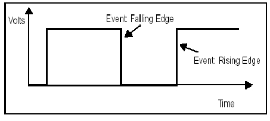

>[Torna all'indice generale](index.md) >[versione in C++](toggle.md)


## **PULSANTI CON LETTURA DI UN FRONTE**

###  **PULSANTE TOGGLE**

Si vuole realizzare un pulsante con una memoria dello stato che possa essere modificata ad ogni pressione. Pressioni successive in sequenza accendono e spengono un led. Quindi, a seconda da quando si comincia, pressioni in numero pari accendono mentre quelle in numero dispari spengono, oppure al contrario, pressioni in numero pari spengono mentre quelle in numero dispari accendono.

Inizialmente si potrebbe essere tentati di provare seguente soluzione, adattando la strategia del pulsante precedente introducendo una variabile che conservi lo stato del pulsante che chiameremo _closed_.
```C++
byte in;
byte pulsante =2;
boolean closed=false; // stato pulsante
void setup()
{
	pinMode(pulsante, INPUT);
}

void loop()
{
	in = digitalRead(pulsante);
	if(in==HIGH){ // selezione del livello alto (logica di comando)
		closed = !closed;
		digitalWrite(led,closed);  //scrittura uscita
	}
}
```
Purtroppo questa soluzione ha un paio di **problemi** che ne pregiudicano il **funzionamento corretto**.

**Il primo** è relativo alla **selezione del tipo di evento in ingresso**. In questa soluzione viene rilevata la pressione del pulsante **sul livello** dell’ingresso. Il problema è che il livello viene rilevato per tutto il tempo che il tasto è premuto mediante una lettura per ogni loop(). Il numero di queste letture è imprevedibile sia perché sono moltissime al secondo e sia perché la durata della pressione dipende dall’utente. In più, ad ogni lettura viene modificato lo stato del pulsante con l’istruzione closed=!closed, ne consegue che lo stato finale del pulsante è il risultato di una catena di commutazioni che termina dopo un tempo casuale: abbiamo realizzato una slot machine!.

###  **RILEVATORE DI TRANSITO**

Si vuole realizzare un rilevatore del transito di un oggetto su una fotocellula. Poichè la fotocellula legge l'assenza del fascio luminoso di ritorno, la sua uscita è ripetutamernte vera fino a che l'oggetto non ha completato il suo passaggio. Un passaggio temporalmente lungo genera letture ripetute del transito segnalando più oggetti in corrispondenza di uno solo.

## **SOLUZIONE**

La **soluzione** è **modificare il tipo di selezione** **dell’evento** in ingresso, che deve stavolta avvenire sui **fronti** piuttosto che sui livelli. I fronti sono due, **salita** o **discesa**. Se si rileva il fronte di **salita** si cattura l’evento di **pressione** del pulsante, se si rileva il fronte di **discesa** si cattura l’evento di **rilascio** del pulsante. Ma come facciamo a capire quando siamo in presenza di un **evento di fronte**? Di salita o di discesa?



In **entrambi i casi**, un evento di fronte si ha quando si è in presenza di una **transizione di livello** di un ingresso, quindi per **rilevare un fronte** è sufficiente **rilevare una transizione**.

Una **evento di interrupt** si può rilevare in due modi:

- **Polling degli ingressi.** Lo scopo è rilevare una **transizione di livello**. Si tratta di campionare periodicamente il livello di un ingresso avendo cura di memorizzare sempre l’ultimo campione misurato su una variabile globale. Al loop successivo questo valore verrà confrontato col nuovo alla ricerca di eventuali variazioni. Il polling, cioè il campionamento, può essere effettuato ad ogni loop, o può essere **decimato**, cioè eseguito periodicamente **ogni tot loop scartati** (decimati).

- **Interrupt.** Su alcune porte di un microcontrollore può essere abilitato il riconoscimento di un evento di interrupt, segnalabile, a scelta, su fronte di salita, fronte di discesa, entrambi i fronti. L’interrupt determina la chiamata asincrona di una funzione di servizio dell’interrupt detta ISR (Interrupt Service Routine) che esegue il codice con la logica di comando in risposta all’evento. La funzione è definita esternamente al loop() e la sua esecuzione è del tutto indipendente da questo.

In figura sono evidenziati i **campionamenti** eseguibili, ad esempio, ad ogni loop(), oppure ad intervalli di tempo preordinati stabiliti da uno schedulatore.


Si nota chiaramente che in corrispondenza di ogni fronte, prima e dopo, si misurano differenze di livello. In particolare si può avere:

- Un **fronte di salita** se la **transizione** avviene dal livello basso a quello alto

- Un **fronte di discesa** se la **transizione** avviene dal livello alto a quello basso

Se un rilevatore si limita a segnalare un **generico fronte**, allora per stabilire in quale ci troviamo, basta determinare, al momento della segnalazione, in **quale livello** si trova **l’ingresso**: se è al livello alto è un fronte di salita, se è a quello basso è un fronte di discesa.

Il **secondo problema** è costituito dal fenomeno dei **rimbalzi**. Si palesano come una sequenza di rapide oscillazioni che hanno sia fronti di salita che di discesa. Se l’accensione di un led è associata ad un fronte e il suo spegnimento a quello successivo, allora la pressione di un pulsante realizza, di fatto, la solita slot machine…è necessario un algoritmo di debouncing.

Gli esempi successivi sono stati esposti relativamente al problema del **pulsante toggle** premendo il quale, ad ogni lettura di un fornte, si genera la modifica di una opportuna **variabile di stato** (```stato``` negli esempi).

A ben vedere, le soluzioni proposte di seguito possono essere tutte facilmente adattate alla realizzazione di un **sensore di transito** sostituendo la pressione del pulsante con la lettura del sensore e interpretando la variabile ```stato``` con la **variabile di stato** che deve tenere traccia del passaggio rilevato.

Pulsante toggle con rilevazione del fronte di salita (pressione) e con antirimbalzo realizzato con una **schedulazione ad eventi (time tick)**  (per una spiegazione dettagliata dei time tick si rimanda a [schedulatore di compiti basato sui time tick](tasksched.md)):
Pulsante toggle con rilevazione del fronte di salita (pressione) e con antirimbalzo:
```Python
from gpio import *
from time import *

def main():
	pulsante = 0
	led = 1
	pinMode(led, OUT)
	pinMode(pulsante, IN)
	precm = 0
	precval = 0
	stato = 0
	tbase = 0.1

	while True:
		if (uptime() - precm) >= tbase:  	   # schedulatore (e anche antirimbalzo)
			precm = uptime()  			   # preparo il tic successivo	
			val = digitalRead(pulsante)    # lettura ingressi
			if precval == LOW and val == HIGH:      # rivelatore di fronte di salita
				stato = (stato + 1)%2        # impostazione dello stato del toggle
				digitalWrite(led,stato*1023)   # scrittura uscite
				print(stato)
			precval = val                   # memorizzazione livello loop precedente
			

if __name__ == "__main__":
	main()
```

### **Pulsante toggle + blink basato su eventi**

In questo caso, il **rilevatore dei fronti** è realizzato **campionando** il valore del livello al loop di CPU **attuale** e **confrontandolo** con il valore del livello campionato al **loop precedente** (o a uno dei loop precedenti). Se il valore attuale è HIGH e quello precedente è LOW si è rilevato un **fronte di salita**, mentre se il valore attuale è LOW e quello precedente è HIGH si è rilevato un **fronte di discesa**.  

Pulsante toggle che realizza blink e  antirimbalzo realizzato con una **schedulazione ad eventi senza ritardi (time tick)**:
```python
#Alla pressione del pulsante si attiva o disattiva il lampeggo di un led
import time
from machine import Pin

class Toggle(object):
    def __init__(self, btn, state = False):
        self.btn = btn
        self.state = state
        self.precval = 0
    def toggle(self):
        val = self.btn.value()
        if self.precval == 0 and val == 1: 
            self.state = not self.state
            print(self.state)
        self.precval = val 
    def getState(self):
        return self.state
    def setState(self,state):
        self.state = state

def blink(led):
    led.value(not led.value())

   
btn1 = Pin(12,Pin.IN)
led1 = Pin(13,Pin.OUT)
led2 = Pin(2,Pin.OUT)
pulsante = Toggle(btn1)
precm = 0
tbase = 50
step = 0
nstep = 100

while True:
    # il codice eseguito al tempo massimo della CPU va qui	
    # .........
    if (time.ticks_ms() - precm) >= tbase:  	   # schedulatore (e anche antirimbalzo)
        precm = time.ticks_ms()  			   # preparo il tic successivo	
        step = (step + 1) % nstep      # conteggio circolare arriva al massimo a nstep-1
        # il codice eseguito al tempo base va quì	
        # ..........
        pulsante.toggle()
        
        # task 1
        if not (step % 20):      # schedulo eventi al multiplo del tempo stabilito (2 sec)
            if pulsante.getState():
                blink(led1)
            else:
                led1.off()
                            
        # task 2
        if not (step % 10):      # schedulo eventi al multiplo del tempo stabilito (3 sec)
            if pulsante.getState():
                blink(led2)
            else:
                led2.off()
                            
        # il codice eseguito al tempo base va quì	
        # ..........
            
    # il codice eseguito al tempo massimo della CPU va qui	
    # ........

```
Simulazione online su Esp32 con Wowki del codice precedente: https://wokwi.com/projects/370407560534851585

### **Pulsante toggle + blink basato sui thread**

In questo caso, il **rilevatore dei fronti** è realizzato **campionando** il valore del livello al loop di CPU **attuale** e **confrontandolo** con il valore del livello campionato **nello stesso loop** ma in un momento diverso stabilito mediante un istruzione ```waitUntilInputLow()```. La funzione, di fatto, esegue un **blocco** del **thread** corrente in **"attesa"**  della soddisfazione di una certa **condizione**, senza bloccare l'esecuzione degli altri threads. L'**attesa** è spesa campionando continuamente un **ingresso** fino a che questo non **diventa LOW**. Quando ciò accade allora vuol dire che si è rilevato un **fronte di discesa** per cui, qualora **in futuro**, in un loop successivo, si determinasse sullo stesso ingresso un valore HIGH, allora si può essere certi di essere in presenza di un **fronte di salita**. 

La funzione 
```python
// attesa evento con tempo minimo di attesa
def waitUntilInLow(btn,t):
    while btn.value()):
	 time.sleep(t)
```
realizza una funzione di **wait su condizione** che ritarda il thread corrente di un delay() prefissato al  termine del quale ricalcola l'ingresso. L'operazione viene ripetuta fin tanto che la condizione attesa non è asserita. Si tratta di una funzione utile per due **scopi**:
- **debouncing** software dell'ingresso digitale
- determinazione del **fronte di discesa** di un ingresso digitale

Pulsante toggle che realizza blink e  antirimbalzo realizzato con una **schedulazione sequenziale con i ritardi** emulati all'interno di **thread** diversi  La libreria usata è quella nativa dello ESP32 _thread:

```python
#Alla pressione del pulsante si attiva o disattiva il lampeggo di un led
import time
import _thread as th
from machine import Pin

#attesa evento con tempo minimo di attesa
def waitUntilInLow(btn,t):
    while btn.value():
	    time.sleep_ms(t)

def toggle(index, btn, states):
    while True:
    	if btn.value():
            states[index] = not states[index]
            print(states[index])
            waitUntilInLow(btn,50)
        else:
            time.sleep_ms(10)

def blink(led, period_ms):
    while True:
        if stati[0]:
            #print("on")
            led.on()
            time.sleep_ms(period_ms)
            #print("off")
            led.off()
            time.sleep_ms(period_ms)
        else:
            led.off()
            time.sleep_ms(10)
   
btn1 = Pin(12,Pin.IN)
led1 = Pin(13,Pin.OUT)
stati = [False]  # variabile globale che memorizza lo stato del pulsante
th.start_new_thread(toggle, (0, btn1, stati))
th.start_new_thread(blink, (led1, 1000))

while True:
    time.sleep_ms(50)
```
Link simulazione online: https://wokwi.com/projects/370403155318077441

### **Pulsante toggle + blink basato su async/await**

In questo caso, il **rilevatore dei fronti** è realizzato **campionando** il valore del livello al loop di CPU **attuale** e **confrontandolo** con il valore del livello campionato **nello stesso loop** ma in un momento diverso stabilito mediante un istruzione ```waitUntilInputLow()```. La funzione, di fatto, esegue un **blocco** del **task** corrente in **"attesa"**  della soddisfazione di una certa **condizione**, senza bloccare l'esecuzione degli altri task. L'**attesa** è spesa campionando continuamente un **ingresso** fino a che questo non **diventa LOW**. Quando ciò accade allora vuol dire che si è rilevato un **fronte di discesa** per cui, qualora **in futuro**, in un loop successivo, si determinasse sullo stesso ingresso un valore HIGH, allora si può essere certi di essere in presenza di un **fronte di salita**. 

La funzione 
```python
// attesa evento con tempo minimo di attesa
async def waitUntilInLow(btn,t):
    while btn.value()):
	 await asyncio.sleep(t)
 
```
realizza una funzione di **wait su condizione** che ritarda il thread corrente di un delay() prefissato al  termine del quale ricalcola l'ingresso. L'operazione viene ripetuta fin tanto che la condizione attesa non è asserita. Si tratta di una funzione utile per due **scopi**:
- **debouncing** software dell'ingresso digitale
- determinazione del **fronte di discesa** di un ingresso digitale

Pulsante toggle che realizza blink e  antirimbalzo realizzato con una **schedulazione sequenziale con i ritardi** emulati all'interno di **task** diversi su **uno stesso thread**. La libreria usata è quella nativa dello ESP32 uasync.io:

```python
#Alla pressione del pulsante si attiva o disattiva il lampeggo di un led 
import uasyncio
from machine import Pin

#attesa evento con tempo minimo di attesa
async def waitUntilInLow(btn,t):
    while btn.value():
	    await uasyncio.sleep_ms(t)

async def toggle(index, btn, states):
    while True:
    	if btn.value():
            states[index] = not states[index]
            print(states[index])
            await waitUntilInLow(btn,50)
        else:
            await uasyncio.sleep_ms(10)

async def blink(led, period_ms):
    while True:
        if stati[0]:
            #print("on")
            led.on()
            await uasyncio.sleep_ms(period_ms)
            #print("off")
            led.off()
            await uasyncio.sleep_ms(period_ms)
        else:
            led.off()
            await uasyncio.sleep_ms(10)

async def main(btn, led, states):
    uasyncio.create_task(toggle(0, btn, states))
    uasyncio.create_task(blink(led, 1000))
    
    while True:       
        await uasyncio.sleep_ms(50)

btn1 = Pin(12,Pin.IN)
led1 = Pin(13,Pin.OUT)
stati = [False]  # variabile globale che memorizza lo stato del pulsante

uasyncio.run(main(btn1, led1, stati))
```
Link simulazione online: https://wokwi.com/projects/370370343319005185

>[Torna all'indice](indexpulsanti.md) >[versione in C++](toggle.md)
<!--stackedit_data:
eyJoaXN0b3J5IjpbLTE1NTkxOTA3OTIsLTk1MzQ1NDY2NV19
