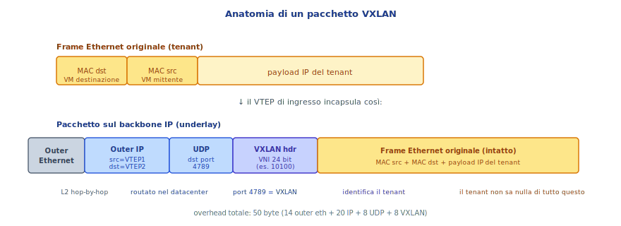
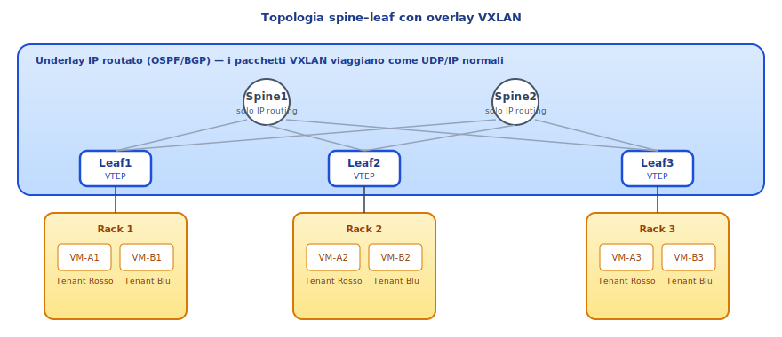
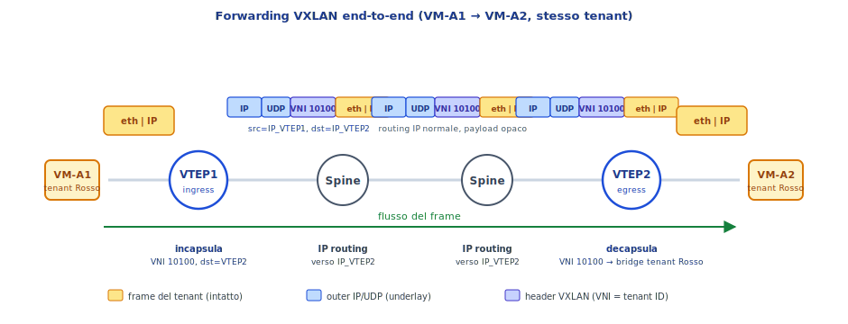
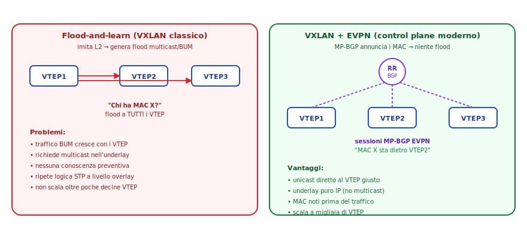

# VXLAN + EVPN: dispensa di approfondimento

> **Target**: 5ª ITI Informatico
> **Prerequisiti**: Ethernet, VLAN 802.1Q, switching L2 e MAC learning, routing IP, BGP/MP-BGP, dispensa MPLS L3VPN.

---

## 1. Da dove veniamo: la VLAN classica e i suoi limiti

Una **VLAN 802.1Q** segmenta un dominio di broadcast L2 su un'infrastruttura Ethernet condivisa. Il tag di 12 bit identifica fino a **4094 VLAN** distinte. È il meccanismo classico per dare a clienti/reparti diversi la propria "rete virtuale" sopra gli stessi switch fisici.

Funziona benissimo dentro un singolo edificio o un singolo datacenter cablato, ma nei **datacenter moderni e nei cloud multi-tenant** mostra tre limiti strutturali:

1. **4094 segmenti sono pochi**. Un cloud provider con migliaia di clienti li esaurisce subito.
2. **Le VLAN non si estendono su rete IP routata**. Funzionano solo dove c'è continuità Ethernet. In una topologia spine-leaf moderna i leaf parlano IP tra loro: una VLAN configurata su Leaf1 è invisibile a Leaf3.
3. **Il dominio di broadcast cresce con la VLAN**. Se due VM dello stesso tenant stanno su rack opposti, ogni ARP request si propaga in flooding su tutti gli switch attraversati. Cattivo per la sicurezza, pessimo per la scalabilità.

> 💡 **Il problema da risolvere**: dare a ogni tenant la sua "LAN virtuale" che si estende **liberamente attraverso una rete IP routata**, senza vincoli di continuità L2 e senza il limite dei 4094 segmenti.

La risposta è **VXLAN** per il data plane, **EVPN** per il control plane.

---

## 2. VXLAN: una "TAP distribuita" sopra IP

**VXLAN** (Virtual eXtensible LAN, RFC 7348) è una tecnica di **overlay**: prende il frame Ethernet originale del tenant e lo **incapsula dentro un pacchetto UDP/IP** che viaggia sulla rete del datacenter.

Concettualmente è esattamente un'**interfaccia TAP distribuita**: come OpenVPN in modalità bridge incapsula frame Ethernet in UDP per portarli da un capo all'altro di Internet, VXLAN incapsula frame Ethernet in UDP per portarli da un rack all'altro del datacenter, sopra un underlay IP qualsiasi.

### 2.1 Anatomia del pacchetto VXLAN



Le componenti chiave:

- **Outer Ethernet + Outer IP + UDP**: l'involucro di trasporto. Il pacchetto VXLAN viaggia come un normale pacchetto IP/UDP nel datacenter, su porta destinazione **4789** (IANA assignment per VXLAN).
- **VXLAN header**: contiene il **VNI (VXLAN Network Identifier)** a **24 bit** → fino a **~16 milioni di segmenti**, contro i 4094 delle VLAN. Il VNI è l'identificatore del tenant/VPN.
- **Frame Ethernet originale**: il frame del tenant viaggia **intatto** dentro il payload, comprensivo di MAC sorgente, MAC destinazione e payload IP.

L'overhead aggiuntivo è di circa 50 byte. È necessario tenerne conto per gli MTU: tipicamente nel datacenter si usa **jumbo frame** (MTU 9000) sull'underlay per evitare frammentazione.

### 2.2 I VTEP: i nodi che incapsulano

Gli **endpoint** della VXLAN si chiamano **VTEP** (VXLAN Tunnel Endpoint). Un VTEP:

- Ha un proprio **indirizzo IP routabile** nel datacenter (tipicamente un loopback).
- Riceve frame Ethernet "puri" dai server/VM connessi localmente (lato tenant).
- Li **incapsula** in pacchetti VXLAN e li spedisce al VTEP remoto giusto (lato underlay).
- In direzione opposta, riceve pacchetti VXLAN, li **decapsula** e consegna il frame al tenant locale.

Tipicamente i VTEP sono i **leaf switch** della topologia spine-leaf, oppure i **vSwitch software** sui server di virtualizzazione (Open vSwitch, VMware NSX, ecc.).

### 2.3 Topologia tipica: spine-leaf con overlay



Vediamo la separazione tra i due "piani":

- **Underlay**: i leaf e gli spine si parlano via IP, con un IGP (di solito **OSPF** o **eBGP unnumbered**). Ogni leaf annuncia il proprio loopback (l'IP del suo VTEP). Gli spine non sanno nulla di tenant, VNI o MAC: fanno solo IP routing.
- **Overlay**: sopra l'underlay si crea una "rete virtuale" per ogni tenant, identificata dal VNI. Le VM dello stesso tenant si vedono come se fossero sulla stessa LAN, anche se in realtà i loro frame attraversano hop IP routati.

> 🔑 **Idea centrale**: l'underlay è una semplice rete IP, robusta e scalabile (ECMP, niente STP, niente broadcast geografico). L'overlay è una collezione di "LAN virtuali" portate dall'incapsulamento. Cambia tutto rispetto a un datacenter L2 tradizionale dove l'intera fabric era un unico grande dominio di broadcast.

---

## 3. Forwarding VXLAN: come va un frame da VM a VM

Vediamo concretamente cosa succede quando VM-A1 (su Leaf1) manda un frame a VM-A2 (su Leaf2), entrambe del tenant Rosso (VNI 10100).



**Passo 1 — VM-A1 → VTEP1 (Leaf1)**
VM-A1 emette un frame Ethernet normale, destinato al MAC di VM-A2. Il frame arriva su una porta di Leaf1 mappata logicamente al VNI 10100.

**Passo 2 — VTEP1 incapsula**
Leaf1 (che è un VTEP) deve sapere **dietro quale VTEP remoto sta il MAC di VM-A2**. Assumiamo che lo sappia (vediamo nel §4 come l'ha imparato): è VTEP2, IP `10.0.0.2`. Costruisce il pacchetto:

```
[Outer eth] [Outer IP src=10.0.0.1 dst=10.0.0.2] [UDP dst=4789] [VXLAN VNI=10100] [frame originale]
```

**Passo 3 — Underlay routing (Spine)**
Il pacchetto attraversa la fabric come un pacchetto IP qualsiasi. Gli spine fanno **IP forwarding** standard guardando l'outer IP. Non sanno nemmeno che dentro c'è un frame VXLAN: per loro è UDP/IP. Eventuali link multipli vengono sfruttati con **ECMP** (Equal-Cost Multi-Path), basato su hash dell'header outer + porta UDP source (variata per flusso → ottima distribuzione).

**Passo 4 — VTEP2 decapsula**
Leaf2 riceve il pacchetto sul proprio loopback `10.0.0.2`. Vede UDP destinazione 4789 → riconosce VXLAN. Estrae il VNI 10100 → sa che il frame appartiene al tenant Rosso. Toglie tutto l'incapsulamento e passa il frame Ethernet al bridge interno del tenant Rosso.

**Passo 5 — VTEP2 → VM-A2**
Il bridge del tenant Rosso su Leaf2 fa il normale switching L2 e consegna il frame a VM-A2 sulla porta locale corretta.

> 💡 Dal punto di vista delle due VM, è come se fossero collegate allo stesso switch. Tutto l'incapsulamento è completamente trasparente: VM-A1 ha mandato un frame a un MAC, VM-A2 lo riceve. Il fatto che nel mezzo ci siano stati hop IP routati è invisibile al tenant.

---

## 4. Il problema del control plane: come fa VTEP1 a sapere?

Tutto il §3 si regge su un'assunzione: **VTEP1 sa che il MAC di VM-A2 sta dietro VTEP2**. Ma come l'ha imparato?

Storicamente VXLAN ha avuto due risposte molto diverse: prima il **flood-and-learn**, poi (dal 2015 circa) **EVPN**. La differenza è centrale per capire la VXLAN moderna.



### 4.1 Flood-and-learn (la modalità originale, oggi legacy)

L'idea di partenza era **imitare fedelmente il comportamento di una LAN classica**, dove gli switch imparano i MAC vedendo passare i frame. In VXLAN:

- I VTEP che condividono lo stesso VNI sono iscritti a un **gruppo multicast** nell'underlay (uno per VNI).
- Quando un VTEP riceve un frame **BUM** (Broadcast, Unknown unicast, Multicast) — ad esempio un'ARP request per un MAC sconosciuto — lo incapsula con destinazione l'indirizzo multicast del VNI e lo manda in **flood** a tutti i VTEP del gruppo.
- Ogni VTEP che riceve il pacchetto vede il MAC sorgente e impara: "questo MAC sta dietro l'IP del VTEP che ha mandato il pacchetto".

Funziona, ma ha problemi seri:

- **Richiede multicast nell'underlay**, che molti datacenter non vogliono gestire (PIM, RP, complicato).
- **Genera flood** ogni volta che un MAC è sconosciuto: ogni nuova VM, ogni ARP cache che scade, ogni evento di unknown unicast.
- **Non scala**: con centinaia di VTEP e tenant, il traffico BUM diventa significativo.
- **Reintroduce la fragilità del L2**: in pratica si è ricostruito un dominio di broadcast distribuito, con tutti i suoi mali.

Per anni è stata l'unica opzione e ha frenato l'adozione di VXLAN nei grandi datacenter. La svolta è arrivata col control plane EVPN.

### 4.2 EVPN: BGP che annuncia i MAC

**EVPN** (Ethernet VPN, RFC 7432) è una **estensione di MP-BGP** progettata per portare informazioni L2 (in particolare MAC address) tra i VTEP. L'idea è la stessa di MPLS L3VPN, ma applicata al livello 2:

- Quando un VTEP impara localmente un nuovo MAC (perché una VM ha mandato il primo frame), invece di aspettare che arrivino richieste in flood, **lo annuncia subito via BGP a tutti gli altri VTEP**: "il MAC `aa:bb:cc:11:22:33` del VNI 10100 è raggiungibile dietro di me, IP `10.0.0.1`".
- Gli altri VTEP popolano una tabella **MAC → VTEP remoto** prima ancora che il traffico inizi.
- Quando un frame deve essere inoltrato, il VTEP sorgente sa già dove mandarlo, in **unicast diretto**: niente flood, niente multicast, niente attesa.

Per scalare, le sessioni BGP non sono full-mesh tra i VTEP ma passano per uno o più **Route Reflector** (esattamente come iBGP nei provider): ogni VTEP ha una sessione col RR, il RR ridistribuisce gli annunci.

> 🔑 **Il salto concettuale**: si è passati da un modello "imito la LAN, imparo coi flood" a un modello **"distribuisco i MAC con un protocollo di routing"**. È la stessa filosofia di MPLS L3VPN, dove le rotte IP vengono distribuite con MP-BGP invece di essere "imparate" dai pacchetti.

### 4.3 Cosa annuncia EVPN: i tipi di route

EVPN definisce diversi "tipi" di annuncio. Ai fini di questa dispensa basta conoscerne due:

- **Type-2 (MAC/IP advertisement)**: il pane quotidiano. Un VTEP annuncia "ho imparato questo MAC (e opzionalmente questo IP) per questo VNI, dietro di me". Permette anche **ARP suppression**: il VTEP risponde localmente alle ARP request perché conosce la mappatura MAC↔IP, evitando di propagarle.
- **Type-3 (Inclusive Multicast)**: annuncio di "presenza" — un VTEP dice "anch'io faccio parte del VNI 10100". Serve per gestire il traffico BUM residuo (ad esempio broadcast veri) usando **ingress replication**: invece di multicast, il VTEP sorgente fa N copie unicast dirette ai VTEP che hanno annunciato Type-3 per quel VNI.

Con Type-2 + Type-3 si può fare a meno completamente del multicast nell'underlay: tutto viaggia in unicast IP, perfettamente compatibile con qualsiasi rete moderna.

---

## 5. Riepilogo dei piani: control plane + data plane

Per VXLAN+EVPN la separazione tra signalling e trasporto è netta, esattamente come in MPLS L3VPN:

| Piano | Componente | A cosa risponde |
|---|---|---|
| **Underlay (data plane)** | OSPF/eBGP nell'underlay | "come arrivo da un VTEP all'altro?" |
| **Overlay (data plane)** | VXLAN encapsulation (UDP/4789) | "come trasporto un frame del tenant?" |
| **Control plane** | MP-BGP EVPN | "quale MAC sta dietro quale VTEP?" |

> 💡 **Regola mnemonica**:
> - L'**IGP underlay** dice "**dove sta il VTEP X**".
> - **EVPN** dice "**dietro VTEP X stanno questi MAC**".
> - **VXLAN** dice "**come incapsulo il frame per arrivarci**".

---

## 6. Parallelo con MPLS L3VPN: la simmetria architetturale

Una delle cose più eleganti è notare che **VXLAN+EVPN e MPLS L3VPN sono lo stesso pattern architetturale, applicato a livelli diversi**. Vale la pena fare il confronto punto per punto, perché aiuta a fissare entrambi.

### 6.1 Tabella di corrispondenza

| Concetto | MPLS L3VPN | VXLAN + EVPN |
|---|---|---|
| **Livello del servizio** | L3 (routing IP tra sedi) | L2 (LAN virtuale tra rack) |
| **Cosa trasporta** | Pacchetti IP del cliente | Frame Ethernet del tenant |
| **Identificatore del cliente** | VRF + Route Distinguisher | VNI (24 bit) |
| **Endpoint che incapsula** | PE (Provider Edge) | VTEP (tipicamente leaf switch) |
| **Nodi di transito "ignoranti"** | P router (label switching) | Spine (IP routing puro) |
| **Data plane / incapsulamento** | Doppia label MPLS | Outer IP/UDP + header VXLAN |
| **Control plane / signalling** | MP-BGP VPNv4 | MP-BGP EVPN |
| **Cosa annuncia il control plane** | Rotte IP cliente + label VPN | MAC address + VNI |
| **IGP sottostante** | OSPF/IS-IS per loopback dei PE | OSPF/eBGP per loopback dei VTEP |
| **Scalabilità del signalling** | Route Reflector | Route Reflector |
| **Analogia con VPN classiche** | TUN distribuita gestita dall'ISP | TAP distribuita gestita dal datacenter |

### 6.2 Lo stesso schema, due livelli diversi

In entrambi i casi vediamo la stessa struttura a tre strati:

1. **Un underlay semplice e scalabile** che sa solo trasportare cose tra endpoint (P router con MPLS, spine con IP).
2. **Un meccanismo di incapsulamento** che permette a più "clienti virtuali" di condividere lo stesso underlay (label VPN, header VXLAN+VNI).
3. **Un control plane basato su MP-BGP** che dice agli endpoint "cosa c'è dietro chi" (rotte cliente in VPNv4, MAC in EVPN).

La separazione clienti/transito è identica concettualmente: i nodi nel mezzo (P router o spine) **non sanno nulla dei clienti**, vedono solo trasporto opaco. Questo è ciò che rende entrambe le tecnologie scalabili.

### 6.3 Quando si usa l'una, quando l'altra

- **MPLS L3VPN** è la tecnologia degli **ISP** per offrire connettività privata tra sedi geograficamente distribuite, su backbone WAN. Lavora a L3 perché i clienti vogliono una "rete privata virtuale" routata.
- **VXLAN+EVPN** è la tecnologia dei **datacenter moderni e dei cloud provider** per dare a ogni tenant la propria rete virtuale dentro il datacenter. Lavora a L2 perché molti workload (cluster, live migration di VM, alcuni middleware) richiedono adiacenza L2.
- Le due cose **possono coesistere** e spesso lo fanno: un'azienda multi-sede usa MPLS L3VPN per collegare le sedi, e dentro ciascun datacenter usa VXLAN+EVPN per organizzare i tenant interni. Esistono anche scenari di **DCI** (Data Center Interconnect) dove EVPN viene esteso geograficamente sopra MPLS o IP, per fornire L2 stretch tra datacenter remoti.

> 🎯 **Take-away**: una volta capito il pattern "underlay + incapsulamento + signalling con MP-BGP", lo riconosci ovunque. È uno dei design più di successo del networking moderno e si applica sia ai backbone degli ISP sia ai datacenter cloud.

---

## 7. Glossario rapido

- **VXLAN** — Virtual eXtensible LAN, RFC 7348. Incapsulamento di frame Ethernet in UDP/IP.
- **VNI** — VXLAN Network Identifier, 24 bit. Identifica il tenant/segmento.
- **VTEP** — VXLAN Tunnel Endpoint. Nodo che incapsula/decapsula (tipicamente leaf switch o vSwitch).
- **Underlay** — la rete IP fisica che trasporta i pacchetti VXLAN.
- **Overlay** — la "rete virtuale" del tenant, che esiste grazie all'incapsulamento.
- **EVPN** — Ethernet VPN, RFC 7432. Famiglia BGP per distribuire MAC e altre info L2.
- **Spine-leaf** — topologia datacenter con due livelli: spine (core) e leaf (accesso).
- **ECMP** — Equal-Cost Multi-Path. Distribuzione del traffico su link paralleli con hash.
- **BUM** — Broadcast, Unknown unicast, Multicast. Categoria di traffico che richiedeva flood nel modello flood-and-learn.
- **DCI** — Data Center Interconnect. Estensione di servizi L2/L3 tra datacenter remoti.

---

*Riferimenti: RFC 7348 (VXLAN), RFC 7432 (EVPN), RFC 8365 (EVPN-VXLAN integration).*
